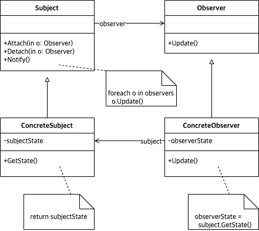

# Abstract

- A way of notifying change to a number of classes
- 이벤트가 발생하면 구경꾼들에게 알려준다.
- Listener pattern 이라고도 한다.
  
# Materials

* [Observer @ dofactory](https://www.dofactory.com/net/observer-design-pattern)

# UML Class Diagram

# Examples

* [Observer in kotlin](/kotlin/kotlin_design_pattern/observer.md)
* [Observer in go](/golang/go_design_pattern/observer.md)
