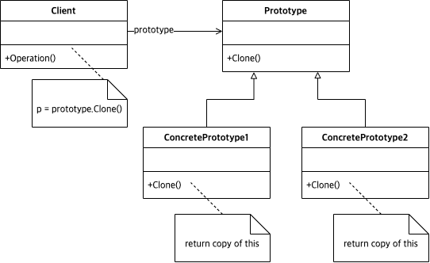

# Abstract

복제를 통해 타겟 오브젝트 인스턴스를 생성한다.

# Materials

* [Prototype @ dofactory](https://www.dofactory.com/net/prototype-design-pattern)

# UML Class Diagram

# Examples

* [Prototype in kotlin](/kotlin/kotlin_design_pattern/prototype.md)
* [Prototype in go](/golang/go_design_pattern/prototype.md)
