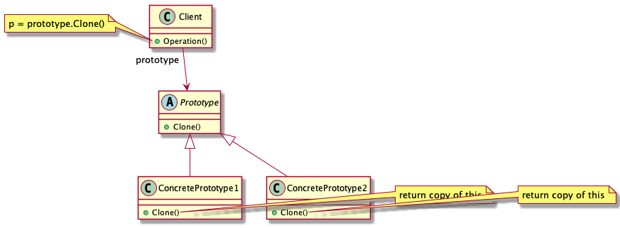

# Abstract

복제를 통해 타겟 오브젝트 인스턴스를 생성한다.

# Materials

* [Prototype](https://www.dofactory.com/net/prototype-design-pattern)

# Concept Class Diagram

> [src](prototype.puml)

# Examples

* [Prototype by go](/golang/designpattern/prototype.md)
