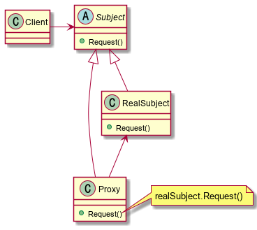

# Abstract

* 노출되지 않은 형제 클래스에 접근할 수 있도록 한다.
* 형제 클래스에 접근한다는 점이 Adapter 와 다르다.

# Materials

* [Proxy](https://www.dofactory.com/net/proxy-design-pattern)

# Concept Class Diagram

> [src](proxy.puml)

# Examples

* [Proxy by go](/golang/designpattern/proxy.md)
