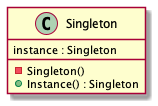

# Abstract

하나의 타겟 오브젝트 인스턴스만 생성한다.

# Materials

* [Singleton @ dofactory](https://www.dofactory.com/net/singleton-design-pattern)

# UML Class Diagram

# Examples

* [Singleton in kotlin](/kotlin/kotlin_design_pattern/singleton.md)
