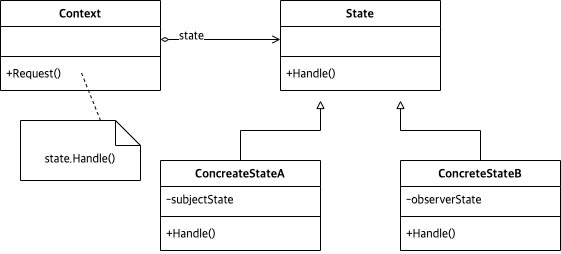

# Abstract

- Alter an object's behavior when its state changes
- 변화할 수 있는 상태를 추상화 한다.
  
# Materials

* [State @ dofactory](https://www.dofactory.com/net/state-design-pattern)

# UML Class Diagram

# Examples

* [State in kotlin](/kotlin/kotlin_design_pattern/state.md)
