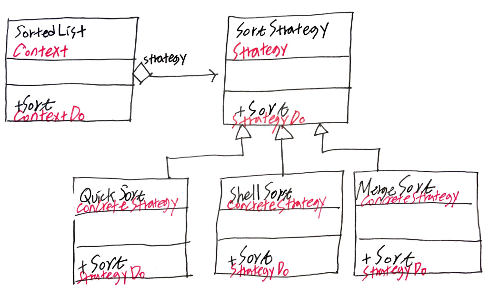

# Abstract

- Encapsulates an algorithm inside a class
- 인스턴스 교체를 통해 전략을 수정할 수 있다.
  
# Materials

* [Strategy](https://www.dofactory.com/net/strategy-design-pattern)

# Concept Class Diagram

> [src](strategy.puml)

# Examples

* [Strategy by go](/golang/designpattern/strategy.md)
