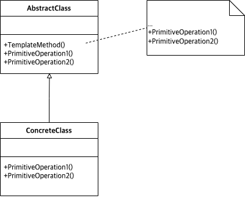

# Abstract

* Method defer the exact steps of an algorithm to a subclass
* 추상 클래스에서 절차를 정의하고 구현 클래스에서 단위 절차들을 구현한다. template method 가 실행되면 실제 실행은 자식 클래스들로 지연되어 있다.
  
# Materials

* [Template @ dofactory](https://www.dofactory.com/net/template-method-design-pattern)
  
# Concept Class Diagram

# Examples

* [Template in kotlin](/kotlin/kotlin_design_pattern/template.md)
* [Template in go](/golang/go_design_pattern/template.md)
