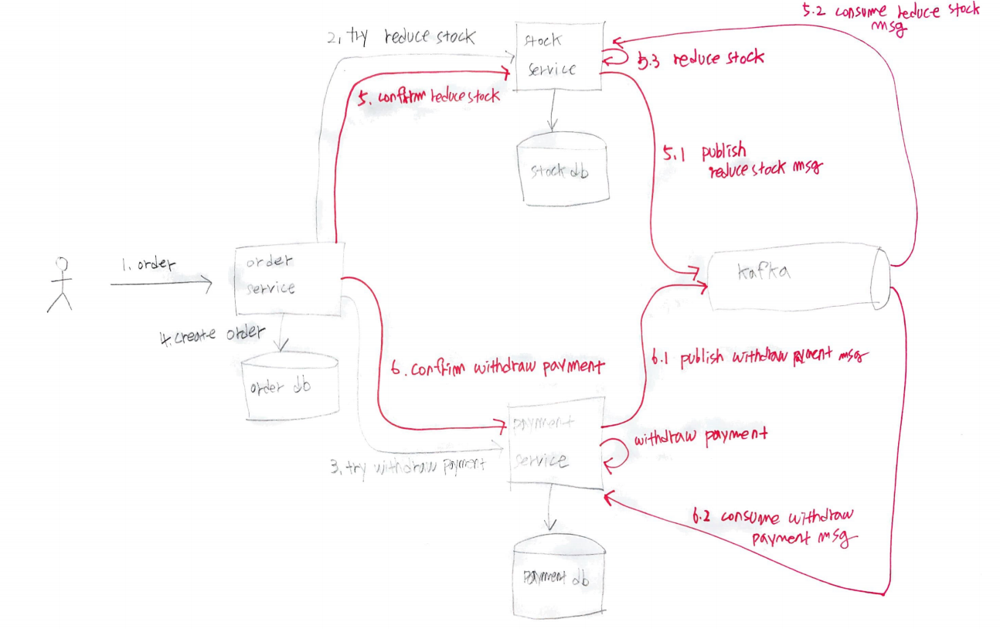

- [Abstract](#abstract)
- [Materials](#materials)
- [2 Phase Commit, TCC (Try-Confirm/Cancel)](#2-phase-commit-tcc-try-confirmcancel)
  - [Sequences](#sequences)
  - [Exceptions](#exceptions)
  - [Summary](#summary)
- [SAGA pattern, Event driven](#saga-pattern-event-driven)
  - [Choreography based SAGA](#choreography-based-saga)
  - [Orchestration based SAGA](#orchestration-based-saga)
- [Conclusion](#conclusion)

-----

# Abstract

It's about Distributed Transactions. There are 2 methods for Distributed Transactions including 2 Phase Commit, SAGA. 

And there are 2 types of SAGAs including Choreography based SAGA, Orchestration based SAGA. Choreography is distributed decision making and Orchestration is centralized decision making.

# Materials

* [Eventuate Tram Sagas](https://eventuate.io/docs/manual/eventuate-tram/latest/getting-started-eventuate-tram-sagas.html)
  * [Managing data consistency in a microservice architecture using Sagas](https://eventuate.io/presentations.html)
  * [Choreography-based sagas example @ github](https://github.com/eventuate-tram/eventuate-tram-examples-customers-and-orders)
  * [orchestration-based-sagas example @ github](https://github.com/eventuate-tram/eventuate-tram-sagas-examples-customers-and-orders)
* [REST 기반의 간단한 분산 트랜잭션 구현 – 1편 TCC 개관](https://www.popit.kr/rest-%EA%B8%B0%EB%B0%98%EC%9D%98-%EA%B0%84%EB%8B%A8%ED%95%9C-%EB%B6%84%EC%82%B0-%ED%8A%B8%EB%9E%9C%EC%9E%AD%EC%85%98-%EA%B5%AC%ED%98%84-1%ED%8E%B8/)
  * [src](https://github.com/YooYoungmo/article-tcc)
  * [REST 기반의 간단한 분산 트랜잭션 구현 - 2편 TCC Cancel, Timeout](https://www.popit.kr/rest-%EA%B8%B0%EB%B0%98%EC%9D%98-%EA%B0%84%EB%8B%A8%ED%95%9C-%EB%B6%84%EC%82%B0-%ED%8A%B8%EB%9E%9C%EC%9E%AD%EC%85%98-%EA%B5%AC%ED%98%84-2%ED%8E%B8-tcc-cancel-timeout/)
  * [REST 기반의 간단한 분산 트랜잭션 구현 - 3편 TCC Confirm(Eventual Consistency)](https://www.popit.kr/rest-%EA%B8%B0%EB%B0%98%EC%9D%98-%EA%B0%84%EB%8B%A8%ED%95%9C-%EB%B6%84%EC%82%B0-%ED%8A%B8%EB%9E%9C%EC%9E%AD%EC%85%98-%EA%B5%AC%ED%98%84-3%ED%8E%B8-tcc-confirmeventual-consistency/)
  * [REST 기반의 간단한 분산 트랜잭션 구현 - 4편 REST Retry](https://www.popit.kr/rest-%EA%B8%B0%EB%B0%98%EC%9D%98-%EA%B0%84%EB%8B%A8%ED%95%9C-%EB%B6%84%EC%82%B0-%ED%8A%B8%EB%9E%9C%EC%9E%AD%EC%85%98-%EA%B5%AC%ED%98%84-4%ED%8E%B8-rest-retry/)
* [대용량 환경에서 그럭저럭 돌아가는 서비스 만들기](https://www.popit.kr/%EB%8C%80%EC%9A%A9%EB%9F%89-%ED%99%98%EA%B2%BD%EC%97%90%EC%84%9C-%EA%B7%B8%EB%9F%AD%EC%A0%80%EB%9F%AD-%EB%8F%8C%EC%95%84%EA%B0%80%EB%8A%94-%EC%84%9C%EB%B9%84%EC%8A%A4-%EB%A7%8C%EB%93%A4%EA%B8%B0/)
* [내 멋대로 구현한 이벤트 드리븐](https://www.popit.kr/%EB%82%B4-%EB%A9%8B%EB%8C%80%EB%A1%9C-%EA%B5%AC%ED%98%84%ED%95%9C-%EC%9D%B4%EB%B2%A4%ED%8A%B8-%EB%93%9C%EB%A6%AC%EB%B8%90/)
* [마이크로 서비스에서 분산 트랜잭션](https://medium.com/@giljae/%EB%A7%88%EC%9D%B4%ED%81%AC%EB%A1%9C-%EC%84%9C%EB%B9%84%EC%8A%A4%EC%97%90%EC%84%9C-%EB%B6%84%EC%82%B0-%ED%8A%B8%EB%9E%9C%EC%9E%AD%EC%85%98-347af5136c87)

# 2 Phase Commit, TCC (Try-Confirm/Cancel)

* [REST 기반의 간단한 분산 트랜잭션 구현 – 1편 TCC 개관](https://www.popit.kr/rest-%EA%B8%B0%EB%B0%98%EC%9D%98-%EA%B0%84%EB%8B%A8%ED%95%9C-%EB%B6%84%EC%82%B0-%ED%8A%B8%EB%9E%9C%EC%9E%AD%EC%85%98-%EA%B5%AC%ED%98%84-1%ED%8E%B8/)
  * [src](https://github.com/YooYoungmo/article-tcc)

## Sequences



1. **order** : User request order. `Order Service` is Transaction Coordinator.

2. **try reduce stock** : `POST /api/v1/stocks HTTP/1.1`
  * reponse body 
    ```json
    {
      url: "http://localhost:8081/api/v1/stocks/1",
      expires: "2020-08-22T09:00:00.000"
    }
    ```
  * Create a record with `status = reserved` in `reserved_stock` table. 
  
    | id | created | resources | status |
    |--|--|--|--|
    | 1 | 2020-08-22 09:00:00.000 | {"productid": "0001", "adjustmentType": "REDUCE", "qty": 10} | "reserved" |

3. **try withdraw payment** : `POST /api/v1/payments HTTP/1.1`
  * reponse body 
    ```json
    {
      url: "http://localhost:8081/api/v1/payments/1",
      expires: "2020-08-22T09:00:00.000"
    }
    ```  * Create a record with `status = reserved` in `reserved_payment` table. 

4. create order 
   * Create a record in `order` table.

5. **confirm reduce stock** : `PUT /api/v1/stocks/{id} HTTP/1.1`
  1. publish reduce stock msg
  2. consume reduce stock msg
  3. **reduce stock** : Update a record in `reserved_stock, stock` table.

     | id | created | resources | status |
     |--|--|--|--|
     | 1 | 2020-08-22 09:00:00.000 | {"productid": "0001", "adjustmentType": "REDUCE", "qty": 10} | "confirmed" |

     | id | prodct_id | qty |
     |--|--|--|
     | 1 | "0001" | 0 |
     | 2 | "0002" | 20 |
     | 3 | "0003" | 30 |

6. **confirm withdraw payment** : `PUT /api/v1/payments/{id} HTTP/1.1`
  4. publish withdraw payment
  5. consume withdraw payment
  6. **withdraw payment** : Update a record in `payment` table.

## Exceptions

* When it fails on `2, 3` stage.
  * Retry is a good solution.
* When it fails on `4` stage
  * `Order Service` send Cancel request `DELETE /api/v1/sotkcs/{id} HTTP/1.1` to `Stock Service` and `DELETE /api/v1/payments/{id} HTTP/1.1` to `Payment Service`.
* When it fails on `4` stage and Cancel request also fails.
  * `Stock Service, Payment Service` can handle with timeout. Especially `Stock Service, Payment Service` should have a `expires` column in their reserved tables.
  
    | id | expires | created | resources | status |
    |--|--|--|--|--|
    | 1 | 2020-08-22 09:00:03.000 | 2020-08-22 09:00:00.000 | {"productid": "0001", "adjustmentType": "REDUCE", "qty": 10} | "confirmed" |
* `Stock Service, Payment Service` should delete records of reserved tables periodically.
* When it fails on `5, 6` stage.
  * Kafka can handle this. `Stock Service, Payment Service` publish, consume messages and try to do `reduce sotck, withdraw payment` until they succeed repeatedly. This means Eventual Consistency.

## Summary

Order Service is a `Transaction Coordinator`. Kafka can handle Eventual Consistency.

# SAGA pattern, Event driven

Choreography based SAGA, Orchestration based SAGA 와 같이 2 종류의 SAGA pattern 이 있다. Choreography based SAGA 는 transaction 성공여부 판단을 각 service 에서 나누어 한다. Orchestration based SAGA 는 transaction 성공여부 판단을 한 곳에서 한다.

## Choreography based SAGA


## Orchestration based SAGA


# Conclusion

Event Driven pattern is better than TCC pattern. It's not easy to extend the system for TCC pattern. In case of TCC, Transaction Coordinator is a bottleneck.
