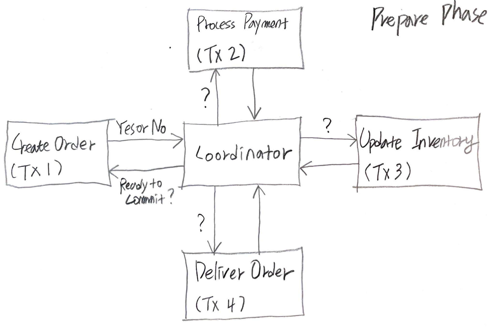
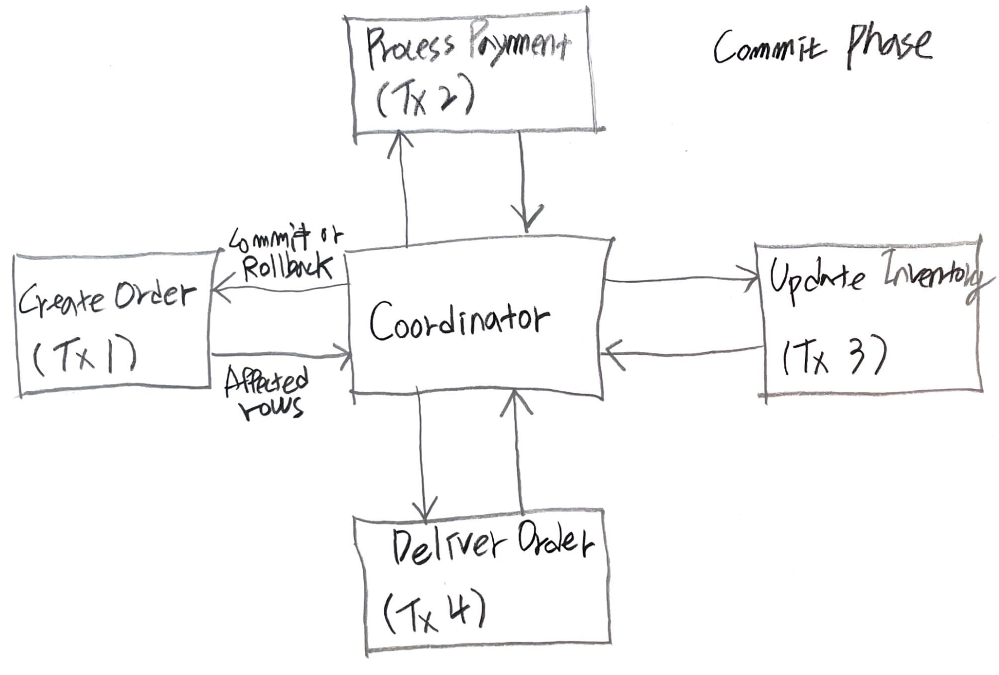
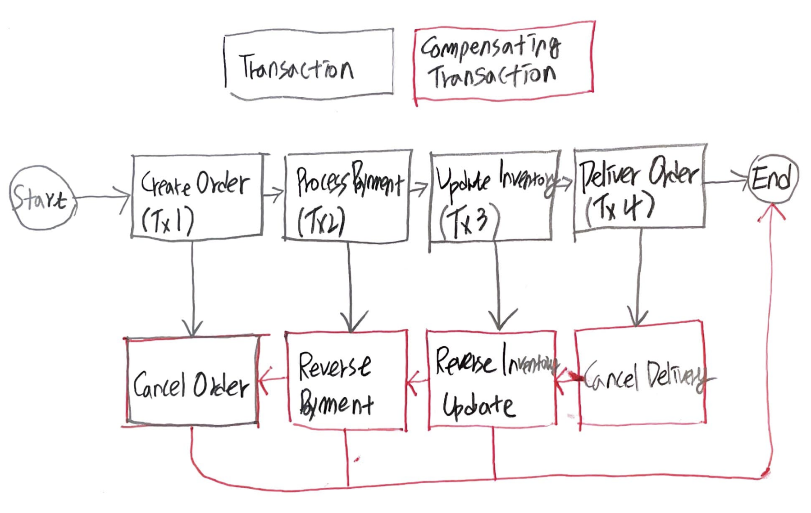
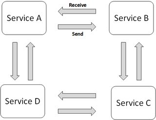
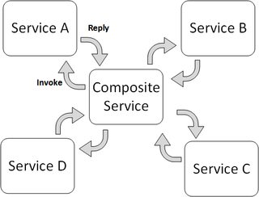

- [Abstract](#abstract)
- [Materials](#materials)
- [2 Phase Commit](#2-phase-commit)
- [TCC (Try-Confirm/Cancel)](#tcc-try-confirmcancel)
  - [Sequences](#sequences)
  - [Exceptions](#exceptions)
  - [Summary](#summary)
- [SAGA](#saga)
  - [SAGA Overview](#saga-overview)
  - [Choreography SAGA](#choreography-saga)
  - [Orchestration SAGA](#orchestration-saga)
- [Conclusion](#conclusion)

-----

# Abstract

Global transaction 은 local transaction 으로 나누어 진다. 이렇게 local transaction 으로 나누어진 transaction 들의 모음을 distributed transaction 이라고 한다. 

Distributed Transaction 은 다음과 같은 종류가 있다.

* low level
  * **2 Phase Commit**
* high level
  * **TC/C (Try Confirm / Cancel)**
  * SAGAS
    * **Choreography SAGAS**
    * **Orchestration SAGAS**

low level means the storage or the driver should support 2 Phase Commit. for
example [MySQL](/mysql/README.md) supports [XA](/mysql/README.md#xa).

high level means the application should support those.

**Choreography** is distributed decision making and **Orchestration** is centralized decision making. So **Orchestration** has a SPOF problem.

# Materials

* [Distributed Transactions in Microservices with Kafka Streams and Spring Boot](https://piotrminkowski.com/2022/01/24/distributed-transactions-in-microservices-with-kafka-streams-and-spring-boot/)
  * [src](https://github.com/piomin/sample-spring-kafka-microservices) 
* [SAGAS](https://www.cs.cornell.edu/andru/cs711/2002fa/reading/sagas.pdf)
* [Eventuate Tram Sagas](https://eventuate.io/docs/manual/eventuate-tram/latest/getting-started-eventuate-tram-sagas.html)
  * [Managing data consistency in a microservice architecture using Sagas](https://eventuate.io/presentations.html)
  * [Choreography-based sagas example @ github](https://github.com/eventuate-tram/eventuate-tram-examples-customers-and-orders)
  * [orchestration-based-sagas example @ github](https://github.com/eventuate-tram/eventuate-tram-sagas-examples-customers-and-orders)
* [REST 기반의 간단한 분산 트랜잭션 구현 – 1편 TCC 개관](https://www.popit.kr/rest-%EA%B8%B0%EB%B0%98%EC%9D%98-%EA%B0%84%EB%8B%A8%ED%95%9C-%EB%B6%84%EC%82%B0-%ED%8A%B8%EB%9E%9C%EC%9E%AD%EC%85%98-%EA%B5%AC%ED%98%84-1%ED%8E%B8/)
  * [src](https://github.com/YooYoungmo/article-tcc)
  * [REST 기반의 간단한 분산 트랜잭션 구현 - 2편 TCC Cancel, Timeout](https://www.popit.kr/rest-%EA%B8%B0%EB%B0%98%EC%9D%98-%EA%B0%84%EB%8B%A8%ED%95%9C-%EB%B6%84%EC%82%B0-%ED%8A%B8%EB%9E%9C%EC%9E%AD%EC%85%98-%EA%B5%AC%ED%98%84-2%ED%8E%B8-tcc-cancel-timeout/)
  * [REST 기반의 간단한 분산 트랜잭션 구현 - 3편 TCC Confirm(Eventual Consistency)](https://www.popit.kr/rest-%EA%B8%B0%EB%B0%98%EC%9D%98-%EA%B0%84%EB%8B%A8%ED%95%9C-%EB%B6%84%EC%82%B0-%ED%8A%B8%EB%9E%9C%EC%9E%AD%EC%85%98-%EA%B5%AC%ED%98%84-3%ED%8E%B8-tcc-confirmeventual-consistency/)
  * [REST 기반의 간단한 분산 트랜잭션 구현 - 4편 REST Retry](https://www.popit.kr/rest-%EA%B8%B0%EB%B0%98%EC%9D%98-%EA%B0%84%EB%8B%A8%ED%95%9C-%EB%B6%84%EC%82%B0-%ED%8A%B8%EB%9E%9C%EC%9E%AD%EC%85%98-%EA%B5%AC%ED%98%84-4%ED%8E%B8-rest-retry/)
* [대용량 환경에서 그럭저럭 돌아가는 서비스 만들기](https://www.popit.kr/%EB%8C%80%EC%9A%A9%EB%9F%89-%ED%99%98%EA%B2%BD%EC%97%90%EC%84%9C-%EA%B7%B8%EB%9F%AD%EC%A0%80%EB%9F%AD-%EB%8F%8C%EC%95%84%EA%B0%80%EB%8A%94-%EC%84%9C%EB%B9%84%EC%8A%A4-%EB%A7%8C%EB%93%A4%EA%B8%B0/)
* [내 멋대로 구현한 이벤트 드리븐](https://www.popit.kr/%EB%82%B4-%EB%A9%8B%EB%8C%80%EB%A1%9C-%EA%B5%AC%ED%98%84%ED%95%9C-%EC%9D%B4%EB%B2%A4%ED%8A%B8-%EB%93%9C%EB%A6%AC%EB%B8%90/)
* [마이크로 서비스에서 분산 트랜잭션](https://medium.com/@giljae/%EB%A7%88%EC%9D%B4%ED%81%AC%EB%A1%9C-%EC%84%9C%EB%B9%84%EC%8A%A4%EC%97%90%EC%84%9C-%EB%B6%84%EC%82%B0-%ED%8A%B8%EB%9E%9C%EC%9E%AD%EC%85%98-347af5136c87)

# 2 Phase Commit

* [Understanding Two-Phase Commit | baeldung](https://www.baeldung.com/cs/saga-pattern-microservices)
  * [A Guide to Transactions Across Microservices | baeldung](https://www.baeldung.com/transactions-across-microservices)

----

다음의 그림과 같이 coordinator 가 여러 microservice 들에게 모두 commit 해도
되는지 물어보고 결정하는 방법이다.





다음과 같이 local transaction 을 2 개의 단계로 구분하여 처리한다.

* Prepare Phase
  * commit 해도 되요?
* Commit Phase
  * commit 해 주세요.

Coordinator 가 global transaction, local transaction 의 상태를 저장해야 한다. 각 단계에서 문제가 없다면 모두 commit 한다. 각 단계에서 문제가 발생한다면 전체 transaction 을 rollback 한다.

2 Phase Commit 의 단점은 다음과 같다.

* Coordinator 가 SPOF (Single Point Of Failure) 이다.
* 가장 느린 microservice 에게 bottle neck 이 있다.
* coordinator 를 중심으로 통신이 많다. scalability, performance issue 가 있다.
* NoSQL 은 ACID compliant transaction 을 지원하지 않는다. NoSQL 은 사용이 어렵다. [MySQL](/mysql/README.md) 은 2 phase commit 을 위해 [XA](/mysql/README.md#xa) 를 지원한다.

# TCC (Try-Confirm/Cancel)

* [REST 기반의 간단한 분산 트랜잭션 구현 – 1편 TCC 개관](https://www.popit.kr/rest-%EA%B8%B0%EB%B0%98%EC%9D%98-%EA%B0%84%EB%8B%A8%ED%95%9C-%EB%B6%84%EC%82%B0-%ED%8A%B8%EB%9E%9C%EC%9E%AD%EC%85%98-%EA%B5%AC%ED%98%84-1%ED%8E%B8/)
  * [src](https://github.com/YooYoungmo/article-tcc)

## Sequences


1. **order** : User request order. `Order Service` is Transaction Coordinator.

2. **try reduce stock** : `POST /api/v1/stocks HTTP/1.1`
  * reponse body 
    ```json
    {
      url: "http://localhost:8081/api/v1/stocks/1",
      expires: "2020-08-22T09:00:00.000"
    }
    ```
  * Create a record with `status = reserved` in `reserved_stock` table. 
  
    | id | created | resources | status |
    |--|--|--|--|
    | 1 | 2020-08-22 09:00:00.000 | {"productid": "0001", "adjustmentType": "REDUCE", "qty": 10} | "reserved" |

3. **try withdraw payment** : `POST /api/v1/payments HTTP/1.1`
  * reponse body 
    ```json
    {
      url: "http://localhost:8081/api/v1/payments/1",
      expires: "2020-08-22T09:00:00.000"
    }
    ``` 
 * Create a record with `status = reserved` in `reserved_payment` table. 

4. create order 
   * Create a record in `order` table.

5. **confirm reduce stock** : `PUT /api/v1/stocks/{id} HTTP/1.1`
  1. publish reduce stock msg
  2. consume reduce stock msg
  3. **reduce stock** : Update a record in `reserved_stock, stock` table.

     | id | created | resources | status |
     |--|--|--|--|
     | 1 | 2020-08-22 09:00:00.000 | {"productid": "0001", "adjustmentType": "REDUCE", "qty": 10} | "confirmed" |

     | id | prodct_id | qty |
     |--|--|--|
     | 1 | "0001" | 0 |
     | 2 | "0002" | 20 |
     | 3 | "0003" | 30 |

6. **confirm withdraw payment** : `PUT /api/v1/payments/{id} HTTP/1.1`
  4. publish withdraw payment
  5. consume withdraw payment
  6. **withdraw payment** : Update a record in `payment` table.

## Exceptions

* When it fails on `2, 3` stage.
  * Retry is a good solution.
* When it fails on `4` stage
  * `Order Service` send Cancel request `DELETE /api/v1/sotkcs/{id} HTTP/1.1` to `Stock Service` and `DELETE /api/v1/payments/{id} HTTP/1.1` to `Payment Service`.
* When it fails on `4` stage and Cancel request also fails.
  * `Stock Service, Payment Service` can handle with timeout. Especially `Stock Service, Payment Service` should have a `expires` column in their reserved tables.
  
    | id | expires | created | resources | status |
    |--|--|--|--|--|
    | 1 | 2020-08-22 09:00:03.000 | 2020-08-22 09:00:00.000 | {"productid": "0001", "adjustmentType": "REDUCE", "qty": 10} | "confirmed" |
* `Stock Service, Payment Service` should delete records of reserved tables periodically.
* When it fails on `5, 6` stage.
  * Kafka can handle this. `Stock Service, Payment Service` publish, consume messages and try to do `reduce sotck, withdraw payment` until they succeed repeatedly. This means Eventual Consistency.

## Summary

Order Service is a `Transaction Coordinator`. Kafka can handle Eventual Consistency.

# SAGA

* [Orchestration vs. Choreography](https://stackoverflow.com/questions/4127241/orchestration-vs-choreography)
* [7. Introduction to Saga | baeldung](https://www.baeldung.com/cs/saga-pattern-microservices#introduction-to-saga)
  * [A Guide to Transactions Across Microservices | baeldung](https://www.baeldung.com/transactions-across-microservices)

----

## SAGA Overview

SAGA 는 global transaction 을 local transaction 으로 나누고 순서대로 처리하는 방법이다. `TC/C` 는 local transaction 이 순서대로 처리되지 않는다. 예외 사항이 더 많아서 구현이 어렵다. 



global transaction 은 `Create Order, Process Payment, Update Inventory, Deliver Order` 와 같은 local transaction 들로 나누어져 있다. 

만약 `Process Payment` transaction 이 실패한다면 `Reverse Payment, Cancel Order` 순서로 Compensating Transaction 을 실행한다.

Compensating Transaction 이 실패한다면 어딘가에 저장해 놓고 Eventual Consistent 하게 처리한다. 예를 들어 Kafka Topic 에 실패한 Compensating Transaction 을 저장해 놓고 성공할 때까지 재시도 한다. 따라서 재시도 해야할 task 는 idempotent, retryable 해야 한다.

SAGA 는 **Choreography SAGA, Orchestration SAGA** 와 같이 2 종류가 있다. **Choreography SAGA** 는 transaction 성공여부 판단을 각 service 에서 나누어 한다. **Orchestration SAGA** 는 transaction 성공여부 판단을 한 곳에서 한다.

## Choreography SAGA

* [Choreography-based sagas example @ github](https://github.com/eventuate-tram/eventuate-tram-examples-customers-and-orders)
  
----  

다음은 Baeldung 의 Choreography SAGA Architecture 이다.


Saga Execution Coordinator 는 Framewok 와 같다. 각 microservice 에 embed 되었다고 생각하자. micro service 들은 SEC (SAGA Execution Component) 와 message 들을 주고 받는다. 그리고 transaction 혹은 compensation transaction 을 수행한다.

다음은 Tx2 가 실패했을 때의 처리과정이다.


다음은 Chris Richardson 의 Choregography SAGA Architecture 이다.




## Orchestration SAGA

* [orchestration-based-sagas example @ github](https://github.com/eventuate-tram/eventuate-tram-sagas-examples-customers-and-orders)
  
----

다음은 Baeldung 의 Orchestration SAGA Architecture 이다.


SEC (SAGA Execution Component) 가 직접 Compensation Transaction 을 수행한다???

Chris Richardson 의 Orchestration SAGA Architecture.




# Conclusion

SAGA 가 제일 그럴듯하다. 

Choreography SAGA 는 greenfield project 에 적당하다. 처음부터 project 를 시작한다면 할 만하다는 의미이다. 많은 micro service 제작자들과 local transaction 의 상태등을 포함해서 협의를 해야하기 때문이다.

Orchestration SAGA 는 brownfield project 에 적당하다. 이미 진행된 project 에 적용할 만하다. 많은 micro service 제작자들과 협의해야할 내용이 Choreography SAGA 에 비해 적다. local transaction 의 상태는 orchestrator 만 알아도 된다. 
