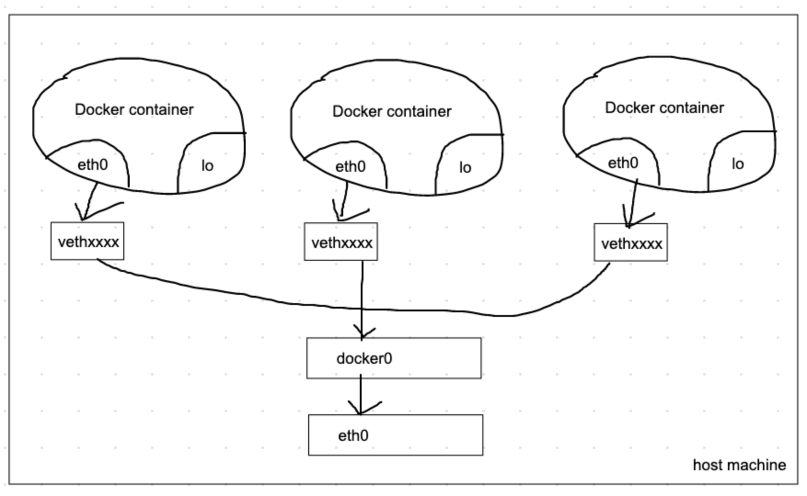
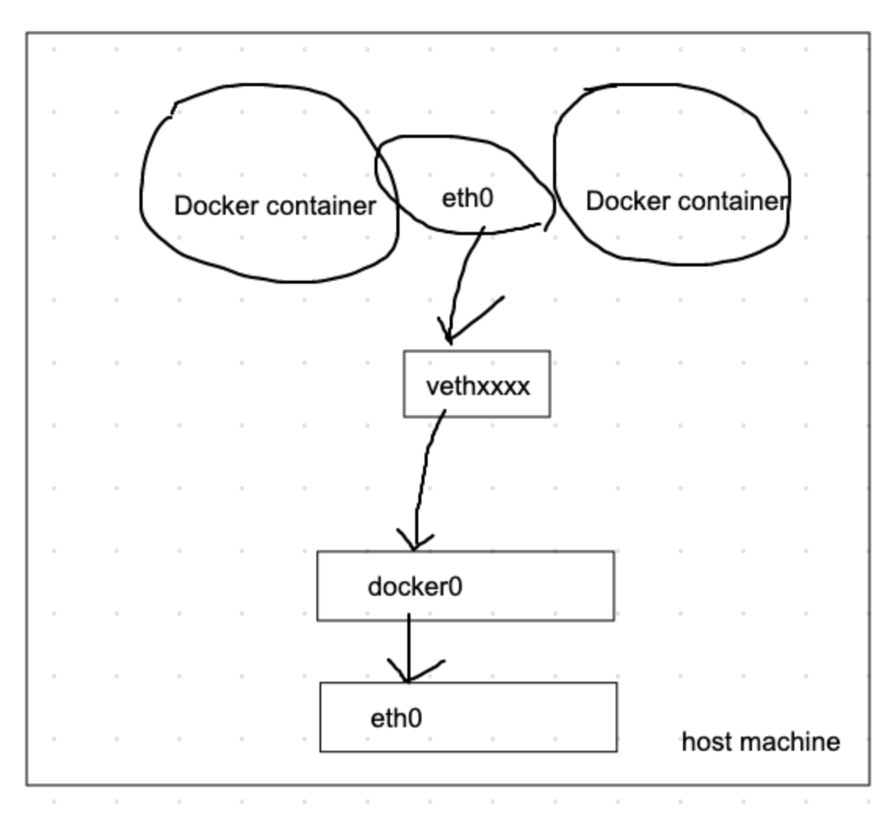

- [Abstract](#abstract)
- [Materials](#materials)
- [Basic](#basic)
  - [Permission](#permission)
  - [Install on Linux](#install-on-linux)
  - [Docker Toolbox vs Docker for Mac](#docker-toolbox-vs-docker-for-mac)
  - [Docker Containers](#docker-containers)
  - [Expose Docker Container](#expose-docker-container)
  - [Docker Container Application](#docker-container-application)
  - [Docker Volume](#docker-volume)
  - [Docker Network Overview](#docker-network-overview)
  - [Docker Bridge Network](#docker-bridge-network)
  - [Docker Host Network](#docker-host-network)
  - [Docker None Network](#docker-none-network)
  - [Docker Container Network](#docker-container-network)
  - [Docker Bridge Network and --net-alias](#docker-bridge-network-and---net-alias)
  - [MacVLAN Network](#macvlan-network)
  - [Docker Container logging with json-file](#docker-container-logging-with-json-file)
  - [Docker Container logging with syslog](#docker-container-logging-with-syslog)
  - [Docker Container logging with fluentd](#docker-container-logging-with-fluentd)
  - [Docker Container logging with AWS CloudWatch](#docker-container-logging-with-aws-cloudwatch)
  - [Container Resource Limits](#container-resource-limits)
    - [Memory](#memory)
    - [CPU](#cpu)
  - [Block I/O](#block-io)
  - [Docker Image](#docker-image)
  - [Docker private registry](#docker-private-registry)
  - [Docker private registry authentication with nginx](#docker-private-registry-authentication-with-nginx)
  - [Docker private registry REST API](#docker-private-registry-rest-api)
  - [Dockerfile](#dockerfile)
  - [Dockerfile Commands](#dockerfile-commands)
    - [ENV, VOLUME, ARG, USER](#env-volume-arg-user)
    - [Onbuild, Stopsignal, Healthcheck, Shell](#onbuild-stopsignal-healthcheck-shell)
    - [ADD, COPY](#add-copy)
    - [ENTRYPOINT, CMD](#entrypoint-cmd)
  - [Docker Daemon](#docker-daemon)
  - [Docker Daemon --tlsverify](#docker-daemon---tlsverify)
  - [Docker Daemon Storage Driver](#docker-daemon-storage-driver)
  - [Docker Daemon Monitoring](#docker-daemon-monitoring)
- [Advanced](#advanced)
  - [Versioning](#versioning)
  - [Making a image](#making-a-image)
  - [Dockerizing moniwiki](#dockerizing-moniwiki)
  - [Upload to Docker Hub](#upload-to-docker-hub)
  - [Hello Docker](#hello-docker)
  - [Private docker registry](#private-docker-registry)
  - [Dockerizing again](#dockerizing-again)
  - [How to build a image](#how-to-build-a-image)
  - [Basic Docker Commands](#basic-docker-commands)
  - [Dockerfile Instruction](#dockerfile-instruction)
  - [Advanced Docker Commands](#advanced-docker-commands)
  - [Process ID of Docker container is 1](#process-id-of-docker-container-is-1)
  - [Useful commands](#useful-commands)
  - [Network](#network)
  - [User of docker container](#user-of-docker-container)
  - [Multiprocess in a docker container](#multiprocess-in-a-docker-container)

----

# Abstract

vmware, virtualbox 보다 훨씬 성능이 좋은 가상화 기술이다. 

# Materials

- [Docker Tutorial for Beginners - A Full DevOps Course on How to Run Applications in Containers](https://www.youtube.com/watch?v=fqMOX6JJhGo)
  - The best video for docker
- [시작하세요! 도커/쿠버네티스 - YES24](http://www.yes24.com/Product/Goods/84927385)
  - [src](https://github.com/alicek106/start-docker-kubernetes)
  - 최고의 Docker/Kubernetes 입문서
- [도커(Docker) 입문편 컨테이너 기초부터 서버 배포까지 @ 44bits](https://www.44bits.io/ko/post/easy-deploy-with-docker#%EC%8B%A4%EC%A0%84-%EB%8F%84%EC%BB%A4-%EC%9D%B4%EB%AF%B8%EC%A7%80%EB%A1%9C-%EC%84%9C%EB%B2%84-%EC%95%A0%ED%94%8C%EB%A6%AC%EC%BC%80%EC%9D%B4%EC%85%98-%EB%B0%B0%ED%8F%AC%ED%95%98%EA%B8%B0)
  - [도커 컨테이너는 가상머신인가요? 프로세스인가요?](https://www.44bits.io/ko/post/is-docker-container-a-virtual-machine-or-a-process)
  - [컨테이너 기초 - chroot를 사용한 프로세스의 루트 디렉터리 격리](https://www.44bits.io/ko/post/change-root-directory-by-using-chroot)
  - [정적 링크 프로그램을 chroot와 도커(Docker) scratch 이미지로 실행하기](https://www.44bits.io/ko/post/static-compile-program-on-chroot-and-docker-scratch-image)
  - [만들면서 이해하는 도커(Docker) 이미지의 구조,도커 이미지 빌드 원리와 Overayfs](https://www.44bits.io/ko/post/how-docker-image-work)
  - [도커 컴포즈를 활용하여 완벽한 개발 환경 구성하기, 컨테이너 시대의 Django 개발환경 구축하기](https://www.44bits.io/ko/post/almost-perfect-development-environment-with-docker-and-docker-compose)
  - [아마존 엘라스틱 컨테이너 서비스(ECS) 입문, 도커(Docker) 컨테이너 오케스트레이션](https://www.44bits.io/ko/post/container-orchestration-101-with-docker-and-aws-elastic-container-service)
- [초보를 위한 도커 안내서 - 이미지 만들고 배포하기](https://subicura.com/2017/02/10/docker-guide-for-beginners-create-image-and-deploy.html)
  - building image, docker registry, deployment
- [도커 Docker 기초 확실히 다지기](https://futurecreator.github.io/2018/11/16/docker-container-basics/index.html)
  - 명쾌한 한장 요약
- [가장 빨리 만나는 Docker](http://pyrasis.com/docker.html)
  - 쉬운 한글 책
  - [src](https://github.com/pyrasis/dockerbook)

# Basic

## Permission

* [초보를 위한 도커 안내서 - 설치하고 컨테이너 실행하기](https://subicura.com/2017/01/19/docker-guide-for-beginners-2.html)

----

docker 는 root 권한이 필요하다. root 가 아닌 사용자가 sudo 없이 사용하려면 해당 사용자를 docker 그룹에 추가한다.

```bash
sudo usermod -aG docker $USER
sudo usermod -aG docker iamslash
```

## Install on Linux

* [도커(Docker) 입문편 컨테이너 기초부터 서버 배포까지](https://www.44bits.io/ko/post/easy-deploy-with-docker#%EC%8B%A4%EC%A0%84-%EB%8F%84%EC%BB%A4-%EC%9D%B4%EB%AF%B8%EC%A7%80%EB%A1%9C-%EC%84%9C%EB%B2%84-%EC%95%A0%ED%94%8C%EB%A6%AC%EC%BC%80%EC%9D%B4%EC%85%98-%EB%B0%B0%ED%8F%AC%ED%95%98%EA%B8%B0)

----

리눅스에서 도커를 설치하기 위해 다음과 같은 사항을 유의하자.

* 최신 버전의 커널인가? 최소 3.10 버전 이상이 되어야 함

  ```console
  $ uname -r
  ```
* 지원 기간 내에 있는 배포인가?
* 64 비트 OS 인가? Docker 는 64 비트에 최적화 되어 있음.
* sudo 혹은 root 권한을 소유한 계정에서 설치해야 함.

```bash
$ curl -s https://get.docker.com | sudo sh
$ docker -v
$ cat /etc/apt/sources.list.d/docker.list
$ dpkg --get-selections | grep docker
```

docker 는 docker-ce, docker-ce-cli 로 구성된다. ce 는 community edition 을 의미한다. docker-ce 는 server 이고 REST api 도 제공한다. command line 은 docker-ce-cli 가 실행한다. docker-ce-cli 는 docker-ce server 와 통신한다.

```bash
$ docker ps
Got permission denied while trying to connect to the Docker daemon socket at unix:///var/run/docker.sock: Get http://%2Fvar%2Frun%2Fdocker.sock/v1.40/containers/json: dial unix /var/run/docker.sock: connect: permission denied

# use sudo to prevent error. 
# If you want to use docker without sudo, Add $USER to docker group.
$ sudo docker ps
$ sudo usermod -aG docker $USER
$ sudo su - $USER
$ docker ps

# show info
$ docker info

# Find out registry
$ docker info | grep Registry
 Registry: https://index.docker.io/v1/
```

한가지 명심할 것은  이미지는 파일들의 집합이고, 컨테이너는 이 파일들의 집합 위에서 실행된 특별한 프로세스이다. 즉, Docker container 는 process 이다.

## Docker Toolbox vs Docker for Mac

Docker Toolbox 는 Linux virtual machine 을 하나 생성하고 Docker 를 설치한다. Virtual Network 가 2 개이다. 따라서 외부에서 container 에 접근하기 위해 호스트와 container 사이에 포트 포워딩이 2 분 필요하다.

Docker for Mac 은 자체 가상화 기술로 리눅스 환경을 만들고 컨테이너를 생성한다. 외부에서 container 에 접근하기 위해 호스트와 가상 머신 사이에 포트 포워딩이 한번만 필요하다.

## Docker Containers

```bash
# Show version
$ docker -v
Docker version 19.03.4, build 9013bf5

# Run container
$ docker run -it ubuntu:14.04

# Pull image
$ docker pull centos:7

# Show images
$ docker images

# Just create a image. 
$ docker create -it --name my-centos centos:7
$ docker start my-centos
$ docker attach my-centos
```

* run vs create
  * run: docker pull, docker create, docker start, docker attach (with `-it` option)
  * create: docker pull, docker create

```bash
# Show running containers
$ docker ps

# Show all containers
$ docker ps -a

# Show running containers with specific columns
$ docker ps --format "table {{.ID}}\t{{.Status}}\t{{.Image}}"
$ docker ps --format "table {{.ID}}\t{{.Status}}\t{{.Image}}\t{{.Names}}"

# Remove container
$ docker rm my-centos

# Stop container
$ docker stop my-centos

# Remove container with foroce option
$ docker rm -f my-centos 

# Remove all stopped containers
$ docker container prune

# Show all container ids
$ docker ps -a -q

# Stop containers and remove containers
$ docker stop $(docker ps -a -q)
$ docker rm $(docker ps -a -q)
```

## Expose Docker Container

```bash
# expose 80 of container to 80 of host
$ docker run -it --name my-webserver -p 80:80 ubuntu:14.04

# expose 3306 of container to 3306 of host, 80 of container to 192.168.0.100:7777 of host
$ docker run -it -p 3306:3306 -p 192.168.0.100:7777:80 ubuntu:14.04
> apt-get update
> apt-get install apache2 -y
> service apache2 start
```

## Docker Container Application

```bash
# Run mysql container
$ docker run -d --name my-wordpress-db \
  -e MYSQL_ROOT_PASSWORD=password \
  -e MYSQL_DATABASE=wordpress \
  mysql:5.7

# Run wordpress container
$ docker run -d --name my-wordpress \
  --link my-wordpress-db:mysql \
  -p 80 wordpress

# Check ports
$ docker ps
$ docker port my-wordpress
80/tcp -> 0.0.0.0:32769

# Execute command using mysql alias of (--link my-wordpress-db:mysqls)
$ docker exec my-wordpress curl mysql:3306 --silent

$ docker stop my-wordpress my-wordpress-db
```

## Docker Volume

```bash
# Run mysql conatiner with volume
$ docker run -d --name my-wordpress-db-hostvolume \
  -e MYSQL_ROOT_PASSWORD=password \
  -e MYSQL_DATABASE=wordpress \
  -v /home/wordpress_db:/var/lib/mysql \
  mysql:5.7

# Run wordpress container with volume
$ docker run -d --name my-wordpress-hostvolume \
  -e WORDPRESS_DB_PASSWORD=password \
  --link my-wordpress-hostvolume:mysql \
  -p 80 \
  wordpress

# Show host volume
$ ls /home/wordpress_db

# Stop containers
$ docker stop my-wordpress-hostvolume my-wordpress-db-hostvolume

# Remove containers
$ docker rm my-wordpress-hostvolume my-wordpress-db-hostvolume

# They remains same after removing containers
$ ls /home/wordpress_db

# Run volume_dummy container
$ docker run -it --name volume_dummy alicek106/volume_test
> ls /home/testdir_2/
test

# Run volume_override and mount host's /home/wordpress_db to guest's /home/testdir_2
$ docker run -it --name volume_override \
  -v /home/wordpress_db:/home/testdir_2 \
  alicek106/volume_test
> ls /home/testdir_2
...

# Run volumes_from_container with volumes of volume_override container
$ docker run -it --name volumes_from_container \
  --volumes-from volume_override \
  ubuntu:14.04
> ls /home/testdir_2
...

# Create docker volume in host
$ docker volume create --name my-volume 

# Show host's docker volumes
$ docker volume ls

# Run my-volume_1 with docker volume
$ docker run -it --name my-volume_1 \
  -v my-volume:/root/ \
  ubuntu:14.04

# Show my-volume in detail
$ docker inspect --type volume my-volume
[
  {
    "Driver": "local",
    "Labels": {},
    "Mountpoint": "/var/lib/docker/volumes/my-volume/_data",
    "Name" : "my-volume",
    "Options" : {},
    "Scope": "local"
  }
]

# Create docker volume with automation
$ docker run -it --name my-volume-auto \
  -v /root \
  ubuntu:14.04

# Check created docker volume with automation
$ docker volume ls
DRIVER        VOLUME NAME
local         dae1b3f3io3i
local         my-volume

# Show my-volume-auto in detail
$ docker container inspect my-volume-auto

# Remove unused volumes
$ docker volume prune

# Run container with mount option, docker volume
$ docker run -it --name mount_option_1 \
  --mount type=volume,source=my-volume,target=/root \
  ubuntu:14.04

# Run container with mount option, host volume
$ docker run -it --name mount_option_2 \
  --mount type=bind,source=/home/wordpress_db,target=/home/testdir \
  ubuntu:14.04
```

## Docker Network Overview

```bash
# Check network interfaces eth0, lo, veth0xxx, docker0
$ ifconfig

# Check which is linked with docker0 bridge
$ brctl show docker0
```

`vethxxxx` is virtual ethernet which is linked with `docker0` bridge.



```bash
# Show docker networks
$ docker network ls

# Show docker network bridge in detail
$ docker network inspect bridge

$ 
```

## Docker Bridge Network

```bash
# Create new docker bridge network as mybridge
$ docker network create --driver bridge mybridge

# Run container with mybridge network
$ docker run -it --name mynetwork_container \
  --net mybridge \
  ubuntu:14.04
# Check eth0 ip
> ifconfig

# Disconnect bridge network
$ docker network disconnect mybridge mynetwork_container

# Connect bridge network
$ docker network connect mybridge mynetwork_container

# Create bridge network with subnet, ip-range, gateway
# subnet and ip-range should be same bandwith.
$ docker network create --driver=bridge \
  --subnet=172.72.0.0/16 \
  --ip-range=172.72.0.0/24 \
  --gateway=172.72.0.1 \
  my_custom_network
```

## Docker Host Network

```bash
# Run container with host network
# Container uses same network with host.
$ docker run -it --name network_host \
  --net host \
  ubuntu:14.04
> ifconfig
```

## Docker None Network

```bash
# Run container with none network
$ docker run -it --name network_none \
  --net none \
  ubuntu:14.04
> ifconfig
```

## Docker Container Network

```bash
# Run container
$ docker run -it -d --name network_container_1 ubuntu:14.04

# Run container with container network of network_container_1
$ docker run -it -d --name network_container_2 \
  --net container:network_container_1 \
  ubuntu:14.04

# Execute ifconfig
$ docker exec network_container_1 ifconfig
```



## Docker Bridge Network and --net-alias

You can proxy multiple containers with one alias.

```bash
# Run multiple containers with same --net-alias
$ docker run -it -d --name network_alias_container_1 \
  --net mybridge \
  --net-alias iamslash ubuntu:14.04
$ docker run -it -d --name network_alias_container_2 \
  --net mybridge \
  --net-alias iamslash ubuntu:14.04
$ docker run -it -d --name network_alias_container_3 \
  --net mybridge \
  --net-alias iamslash ubuntu:14.04

$ docker inspect network_alias_container1 | grep IPAddress

# You can find out multiple ips whenever you ping with same alias.
# There is a docker DNS inside which use round-robin algorithm.
$ docker run -it --name network_alias_ping \
  --net mybridge ubuntu:14.04
> ping -c 1 iamslash
> ping -c 1 iamslash
> ping -c 1 iamslash
```

## MacVLAN Network

WIP...

## Docker Container logging with json-file

```bash
# Run container
$ docker run -d --name mysql \
  -e MYSQL_ROOT_PASSWORD=1234 \
  mysql:5.7

# Show logs
$ docker logs mysql
$ docker logs --tail 2 mysql
$ docker logs --since 1474765979 mysql
$ docker logs -f -t mysql

# Docker container logs are saved in host's directory with json format
$ cat /var/lib/docker/containers/${container-id}/${container-id}-json.log

# Run container with log options
$ docker run -it \
  --log-opt max-size=10k --log-opt max-file=3 \
  --name log-test ubuntu:14.04

# Chane logging driver
$ export DOCKER_OPTS="--log-driver=syslog"
$ export DOCKER_OPTS="--log-opt max-size=10k --log-opt max-file=3"
```

## Docker Container logging with syslog

```bash
# Run container with log-driver syslog 
$ docker run -d --name syslog_container \
  --log-driver=syslog \
  ubuntu:14.04 \
  echo syslogtest
> tail /var/log/syslog

# Run server container with syslog, Update rsyslog.conf, restart rsyslog
$ docker run -it -h rsyslog \
  --name rsyslog_server \
  -p 514:514 -p 514:514/udp \
  ubuntu:14.04
> vi /etc/rsyslog.conf
# provides UDP syslog reception
$ModLoad imudp
$UDPServerRun 514

# provides TCP syslog reception
$ModLoad imtcp
$InputTCPServerRun 514
> service rsyslog restart

# Run client container with tcp
$ docker run -it \
  --log-driver=syslog \
  --log-opt syslog-address=tcp://192.168.0.100:514 \
  --log-opt tag="mylog" \
  ubuntu:14.04

# Run client container with udp
$ docker run -it \
  --log-driver=syslog \
  --log-opt syslog-address=udp://192.168.0.100:514 \
  --log-opt tag="mylog" \
  ubuntu:14.04

# Execute tail on server container
> tail /var/log/syslog

# You can change syslog logging file
$ docker run -it \
  --log-driver=syslog \
  --log-opt syslog-address=tcp://192.168.0.100:514 \
  --log-opt tag="maillog" \
  --log-opt syslog-facility="mail" \
  ubuntu:14.04

# You can find out mail.log files on server container
> ls /var/log/
```

## Docker Container logging with fluentd

WIP

## Docker Container logging with AWS CloudWatch

1. Create IAM role for CloudWatch
2. Create Log Group on CloudWatch as mylogs
3. Create Log Stream on CloudWatch as mylogstream
4. Create EC2 instance with IAM role for CloudWatch
5. Run container like this

```bash
$ docker run -it \
  --log-driver=awslogs \
  --log-opt awslogs-region=ap-northeast-2 \
  --log-opt awslogs-group=mylogs \
  --log-opt awslogs-stream=mylogstream \
  ubuntu:14.04
```

## Container Resource Limits

### Memory

```bash
# Update resource limits
$ docker update --cpuset-cpus=1 centos ubuntu

# Limit memory
$ docker run -d --memory="1g" --name memory_1g nginx
$ docker inspect memory_1g | grep \"Memory\"

# Limit swap
$ docker run -it --name swap_500m \
  --memory=200m \
  --memory-swap=500m \
  ubuntu:14.04
```

### CPU

```bash
# Run container with --cpu-shares
# --cpu-shares is relative value for sharing cpu, default is 1024.
$ docker run -it --name cpu_share \
  --cpu-shares=1024 \
  ubuntu:14.04

# Run multiple containers with --cpu-shares
# --cpu-shares is relative value for sharing cpu, default is 1024.
$ docker run -it --name cpu_1024 \
  --cpu-shares=1024 \
  alicek106/stress \
  stress --cpu 1
$ docker run -it --name cpu-512 \ 
  --cpu-shares=512 \
  alicek106/stress \
  stress --cpu 1
$ ps aux | grep stress

# Run container with using specific cpu
$ docker run -d --name cpuset_2 \
  --cpuset-cpu=2 \
  alicek106/stress \
  stress --cpu 1
$ apt-get install htop
$ htop

# Allocate cpu allocation time
# 100000 means 100ms
# 25000/100000 = 1/4
# Docker will allocate 1/4 cpu time 
$ docker run -d --name quota_1_4 \
  --cpu-period=100000 \
  --cpu-quota=25000 \
  alicek106/stress \
  stress --cpu 1
$ ps aux | grep stress

# 0.5 is same with --cpu-period=100000 --cpu-quota=50000.
$ docker run -d --name cpu_container \
  --cpus=0.5 \
  alicek106/stress \
  stress --cpu 1
```

## Block I/O

```bash
# Limit write blocks per second
# --device-write-bps, --device-read-bps
$ docker run -it \
  --device-write-bps /dev/xvda:1mb \
  ubuntu:14.04
# Write 10MB file with Direct I/O
> dd if=/dev/zero of=test.out bs=1M count=10 oflag=direct

# Limit write io per second
# 5 is relative value
# --device-write-iops, --device-read-iops
$ docker run -it \
  --device-write-iops /dev/xvda:5 \
  ubuntu:14.04
> dd if=/dev/zero of=test.out bs=1M count=10 oflag=direct
.. 5.2 MB/s

$ docker run -it \
  --device-write-iops /dev/xvda:10 \
  ubuntu:14.04
> dd if=/dev/zero of=test.out bs=1M count=10 oflag=direct
.. 10.3 MB/s
```

## Docker Image

```bash
# Check registry
$ docker info | grep Registry
 Registry: https://index.docker.io/v1/

# Search ubuntu images from index.docker.io/ubuntu
$ docker search ubuntu

# Add text to first file, Commit
$ docker run -it --name commit_test ubuntu:14.04
> echo test_first !!! >> first
$ docker commit -a "iamslash" -m "kick off" \
  commit_test commit_test:first
$ docker images
REPOSITORY    TAG     IMAGE_ID      CREATED         SIZE
commit_test   first   sde23e23e     3 minutes aogo  188 MB
ubuntu        14.04   kji3io3ie     12 days ago     188 MB

# Add text to second file, Commit
$ docker run -it --name commit_test2 ubuntu:14.04
> echo test_second !!! >> second
$ docker commit -a "iamslash" -m "second commit" \
  commit_test2 commit_test:second
$ docker images
REPOSITORY    TAG     IMAGE_ID      CREATED         SIZE
commit_test   second  ssf33f23f     1 minutes aogo  188 MB
commit_test   first   sde23e23e     3 minutes aogo  188 MB
ubuntu        14.04   kji3io3ie     12 days ago     188 MB

# Show images in detail
$ docker inspect ubuntu:14.04
$ docker inspect commit_test:first
$ docker inspect commit_test:second

# Remove commit_test:first, Error will happen, 
# because commit_test2 is referencing it.
$ docker rmi commit_test:first

# Stop, remove commit_test2 and remove commit_test:first image
# It will work
$ docker stop commit_test2 && docker rm commit_test2
# This doesn't remove image but just name of layer, 
# Because commit_test:second image is referencing it.
$ docker rmi commit_test:first
Untagged: commit_test:first

# Show danglinged images
$ docker images -f dangling=true

# Remove danglined images
$ docker image prune

# Remove commit_test:second image
$ docker rmi commit_test:second
Untagged: commit_test:second
Deleted: sha256:ijo4ijo4ij4ij4ijo4ijoi4jij4ji4
Deleted: sha256:didi3oijji3ij3io3ioj3ij3j3j3ji
Deleted: sha256:ij4jio4ioj4ijo4ji4jioio4jij44j
Deleted: sha256:nhdhui3g2iug34gui2iu34ugigu234

# Save image to tar file
$ docker save -o ubuntu_14_04.tar ubuntu:14.04

# Load tar file to image
$ docker load -i ubuntu_14_04.tar

# Export mycontainer to tar file
$ docker export -o rootFS.tar mycontainer

# Import tar file to image
$ docker import rootFS.tar myimage:0.0

# Run container and commit, change tag
$ docker run -it --name commit_container1 ubuntu:14.04
$ docker commit commit_container1 my-image-name:0.0
$ docker tag my-image-name:0.0 iamslash/my-image-name:0.0
$ docker images
# Login to hub.docker.com, This will be saved to ~/.docker/config.json
$ docker login
$ docker push iamslash/my-image-name:0.0
$ docker pull iamslash/my-image-name:0.0
```

## Docker private registry

```bash
# Run private registry container
#   --restart=always: If the container stopped, Docker engine will restart it always
#   --restart=on-failure: If the container stopped with not 0 exit code, Docker engine will restart it
#   --restart=unless-stopped: If the container stopped with not docker stop command, Docker engine will restart it
$ docker run -d --name my-registry -p 5000:5000 --restart=always registry:2.6
$ curl localhost:5000/v2/
{}

# Change tag
$ docker tag my-image-name:0.0 ${DOCKER_HOST_IP}:5000/my-image-name:0.0

# Push image, Error will happen
# Basically private registry container need HTTPS not HTTP
$ docker push 192.168.99.101:5000/my-image-name:0.0
The push refers to a repository [192.168.99.101:5000/my-image-name]
Get https://192.168.99.101/v2/: http: server gave HTTP response to HTTPS client

# Set --insecure-registry option
$ export DOCKER_OPTS="--insecure-registry=192.168.99.101:5000"

# Push image, This will work
$ docker push 192.168.99.101:5000/my-image-name:0.0

# Pull image
$ docker pull 192.168.99.101:5000/my-image-name:0.0

# Private regsitry container will make docker volume
# When you need to remove private registry container
# You need to remove docker volume like this
$ docker rm --volumes my-registry
```

## Docker private registry authentication with nginx

If you have CA, private key, you can implement authentication to docker private registry.
But you can do it for free with self-signed root certificate authority, private key.

```bash
$ cd ~/tmp
$ mkdir certs
# Create root's private key
$ openssl genrsa -out ./certs/ca.key 2048
# Create root's self signed root certificates
$ openssl req -x509 -new -key ./certs/ca.key -days 10000 -out ./certs/ca.crt
# Create domain's private key
$ openssl genrsa -out ./certs/domain.key 2048
# Create domain's certificate signing request
$ openssl req -name -key ./certs/domain.key -subj /CN=${DOCKER_HOST_IP} -out ./certs/domain.csr
# Create domain's certificates
$ openssl x509 -req -in ./certs/domain.csr -CA ./certs/ca.crt -CAkey ./certs/ca.key \
  -CAcreateserial -out ./certs/domain.crt -days 10000 -extfile extfile.cnf

# Create login password for iamslash when login to private registry container
$ htpasswd -c htpasswd iamslash
# You might install htpasswd with 'apt-get install apache2-utils'
$ mv htpasswd certs/

# Create nginx.conf file
$ vim certs/nginx.conf
upstream docker-registry {
  server registry:5000
}

server {
  listen 443;
  server_name ${DOCKER_HOST_IP};
  ssl on;
  ssl_certificate /etc/nginx/conf.d/domain.crt;
  ssl_certificate_key /etc/nginx/conf.d/domain.key;
  client_max_body_size 0;
  chunked_transfer_encoding on;

  location /v2/ {
    if ($http_user_agent ~ "^(docker\/1\.(3|4|5(?|\.[0-9]-dev))|Go ).*$") {
      return 404;
    }
    auth_basic "registry.localhost";
    auth_basic_user_file /etc/nginx/conf.d/htpasswd;
    add_header 'Docker-Distribution-Api-Version' 'registry/2.0' always;

    proxy_pass                            http://docker-registry;
    proxy_set_header  Host                $http_host;
    proxy_set_header  X-Real-IP           $remote_addr;
    proxy_set_header  X-Forwarded-For     $proxy_add_x_forwarded_for;
    proxy_set_header  X-Forwarded-Proto   $scheme;
    proxy_read_timeout                    900;
  }
}

$ docker stop my-registry
$ docker rm my-registry
$ docker run -d --name nginx_frontend \
  -p 443:443 \
  --link my-registry:registry \
  -v $(pwd)/certs/:/etc/nginx/conf.d \
  nginx:1.9
$ docker ps --format "table {{.ID}}\t{{.Image}}\t{{Ports}}"
# Error will happen, you need to register self-singed CA to trusted one.
$ docker login https://192.168.99.100
# Copy ca.cert file to trusted CA list
$ cp certs/ca.cert /usr/local/share/ca-certificates/
# Restart nginx container
$ service docker restart
$ docker start nginx_frontend
# This will work
$ docker login https://192.168.99.100
$ docker tag my-image-name:0.0 192.168.99.100/my-image-name:0.0
$ docker push 192.168.99.100/my-image-name:0.0
```

## Docker private registry REST API

```bash
# Show images
$ curl -u iamslash:mypassword https://192.168.99.100/v2/_catalog
$ curl 192.168.99.100:5000/v2/_catalog

# Show specific image's tags
$ curl 192.168.99.100:5000/v2/my-image-name/tags/list

# Show specific image's detail
$ curl -i \
  --header "Accept: application/vnd.docker.distribution.manifest.v2+json" \
  192.168.99.100:5000/v2/my-image-name/manifests/0.0

# If you want to delete a image,
# You need to delete manifest and image file
# But Error will happend
# You need to set delete images possible
$ curl --header "Accept: application/vnd.docker.distribution.manifest.v2+json" \
  -X DELETE \ 
  192.168.99.100:5000/v2/my-image-name/manifests/sha256:cski3i32o3ih4...
$ docker run -d --name registry_delete_enabled \
  -p 5001:5000 \
  --restart=always \
  -e REGISTRY_STORAGE_DELETE_ENABLED=true \
  regsitry:2.6
$ docker tag my-image-name:0.0 localhost:5001/my-image-name:0.0
$ docker push localhost:5001/my-image/name:0.0
# Delete manifest
$ curl --header "Accept: application/vnd.docker.distribution.manifest.v2+json" \
  -X DELETE \ 
  192.168.99.100:5001/v2/my-image-name/manifests/sha256:cski3i32o3ih4...
# Delete digest
$ curl \
  -X DELETE \ 
  192.168.99.100:5001/v2/my-image-name/blobs/sha256:hoihio3ih3ih4i4hih...

# You can set configs with environment variables
$ docker run -d -p 5000:5000 --name registry_delete_enabled --restart=always \
  -e REGISTRY_STORAGE_DELETE_ENABLED=true \
  -e REGISTRY_STORAGE_FILESYSTEM_ROOTDIRECTORY=/var/lib/mydocker \
  ...
  registry:2.6

# You can set configs with config.yml file
$ docker exec registry_delete_enabled cat /etc/docker/registry/config.yml
version: 0.1
log:
  level: info
storage:
  filesystem:
    rootdirectory: /registry_data
  delete:
    enabled: true
http:
  addr: 0.0.0.0:5000

$ docker run -d --name yml_registry \
  -p 5002:5000 \
  --restart=always \
  -v $(PWD)/config.yml:/etc/docker/registry/config.yml \
  registry:2.6
```

## Dockerfile

```bash
$ mkdir dockerfile && cd dockerfile
$ echo test >> test.html
$ vi Dockerfile
FROM ubuntu:14.04
MAINTAINER iamslash
LABEL "purpose=practice"
RUN apt-get update
RUN apt-get install apache -y
ADD test.html /var/www/html
WORKDIR /var/www/html
RUN ["/bin/bash", "-c", "echo hello >> test2.html"]
EXPOSE 80
CMD apachectl -DFOREGROUND

$ docker build -t mybuild:0.0 ./

# Run container
# -P option means map host's available port to congtainer's exposed port  
$ docker run -d -P --name myserver mybuild:0.0

# Check host port
$ docker port myserver
80/tcp -> 0.0.0.0:32769

# Show images with --filter option
$ docker images --filter "label=purpose=practice"

# You can ignore files when you build Dockerfile
$ vi .dockerignore
test2.html
*.html
*/*.html

# Build golang image
$ vi Dockerfile
FROM golang
ADD main.go /root
WORKDIR /root
RUN go build -o /root/mainApp /root/main.go
CMD ["./mainApp"]

$ docker build . -t go_helloworld
$ docker images

# Optimize using multistages
$ vi Dockerfile
FROM golang
ADD main.go /root
WORKDIR /root
RUN go build -o /root/mainApp /root/main.go

FROM alpine:latest
WORKDIR /root
COPY --from=0 /root/mainApp .
CMD ["./mainApp"]

$ docker build . -t go_helloworld:multi-stage
$ docker images
```

These are multi-staged Dockerfile examples

```Dockerfile
FROM golang
ADD main.go /root
WORKDIR /root
RUN go build -o /root/mainApp /root/main.go

FROM golang
ADD main2.go /root
WORKDIR /root
RUN go build -o /root/mainApp2 /root/main2.go

FROM alpine:latest
WORKDIR /root
COPY --from=0 /root/mainApp .
COPY --from=1 /root/mainApp2 .
```

```Dockerfile
FROM golang as builder
ADD main.go /root
WORKDIR /root
RUN go build -o /root/mainApp /root/main.go

FROM alpine:latest
WORKDIR /root
COPY --from=builder /root/mainApp .
CMD ["./mainApp"]
```

## Dockerfile Commands

### ENV, VOLUME, ARG, USER

```bash
$ vi Dockerfile
FROM ubuntu:14.04
ENV test /home
WORKDIR $test
RUN touch $test/mytouchfile

$ docker build -t myenv:0.0 ./
$ docker run -it --name env_test_override \
  -e test=myvalue \
  myenv:0.0 /bin/bash
> echo $test
myvalue
```

```console
$ vi Dockerfile
FROM ubuntu:14.04
RUN mkdir /home/volume
RUN echo test >> /home/volume/testfile
VOLUME /home/volume

$ docker build -t myvolume:0.0 .
$ docker run -it -d --name volume_test myvolume:0.0
$ docker volume ls
```

```console
$ vi Dockerfile
FROM ubuntu:14.04
ARG my_arg
ARG my_arg_2=value2
RUN touch ${my_arg}/mytouch

$ docker build --build-arg my_arg=/home -t myarg:0.0 ./
$ docker run -it --name arg_test myarg:0.0
> ls /home/mytouch
/home/mytouch
```

### Onbuild, Stopsignal, Healthcheck, Shell

```console
$ vi Dockerfile
FROM ubuntu:14.04
RUN echo "This is onbuild test"
ONBUILD RUN echo "onbuild!" >> /onbuild_file

$ docker build ./ -t onbuild_test:0/0
...
Step 3/3 : ONBUILD run echo "onbuild!" >> /onbuild_file
...

$ docker run -it --rm onbuild_test:0.0 ls /

$ vi Dockerfile2
FROM onbuild_test:0.0
RUN echo "This is child image"

$ docker build -f ./Dockerfile2 ./ -t onbuild_test:0.1
...
# Excecuting 1 build trigger...
Step 1/1 : RUN echo "onbuild!" >> /onbuild_file
...

$ docker run -it --rm onbuild_test:0.1 ls /
```

This is a maven image with using ONBUILD

```Dockerfile
FROM maven:3-jdk-8-alpine
RUN mkdir -p /usr/src/app
WORKDIR /usr/src/app
ONBUILD ADD . /usr/src/app
ONBUILD RUN mvn install
```

```bash
# Basically SIGTERM will stop docker container
# But you can stop with specific SIGNAL using STOPSIGNAL command.
$ vi Dockerfile
FROM ubuntu:14.04
STOPSIGNAL SIGKILL

$ docker build . -t stopsignal:0.0
$ docker -itd --name stopsignal_container stopsignal:0.0
$ docker inspect stopsignal_container | grep Stop
      "StopSignal": "SIGKILL"
```

```bash
# You can healthcheck with HEALTHCHECK command.
$ vi Dockerfile
FROM nginx
RUN apt-get update -y && apt-get install curl -y
HEALTHCHECK --interval=1m --timeout=3s --retries=3 CMD curl -f http://localhost || exit 1

# Run container and find out STATUS column
$ docker build ./ -t nginx:healthcheck
$ docker run -dP nginx:healthcheck
$ docker ps
```

```bash
# SHELL will execute command with "/bin/sh -c" on linux
#                                 "cmd /S /C" on windows
$ vi Dockerfile
FROM node
RUN echo "hello, node!"
SHELL ["/usr/local/bin/node"]
RUN -v

$ docker build ./ -t nodetest
```

### ADD, COPY

`COPY` can copy just local files, But `ADD` can copy URL, tar file. It's better to use `COPY` instead of `ADD`.

```bash
$ vi Dockerfile
ADD https://raw.githubusercontent.com/iamslahs/mydockerrepo/master/test.html /home
ADD test.tar /home
```

### ENTRYPOINT, CMD

When you use ENTRYPOINT and CMD, CMD will be arguments of ENTRYPOINT.

```bash
$ vi Dockerfile
FROM ubuntu:14.04
RUN apt-get update
RUN apt-get install apache2 -y
ADD entrypoint.sh /entrypoint.sh
RUN chmod +x /entrypoint.sh
ENTRYPOINT ["/bin/bash", "/entrypoint.sh"]

$ vi entrypoint.sh
echo $1 $2
apachectl -DFOREGROUND

$ docker build -t entrypoint_image:0.0 ./
$ docker run -d --name entrypoint_apache_server entrypoint_image:0.0 first second
$ docker logs entrypoint_apache_server
```

## Docker Daemon

```bash
$ service docker start
$ service docker stop
$ systemctl enable docker

# Run dockerd by command
$ service docker stop
$ dockerd

# Run dockerd with --insecure-registry option
$ dockerd --insecure-registry=192.168.99.100:5000

# Run dockerd with options
# -H option means provide REST API
$ dockerd -H tcp://0.0.0.0:2375 --insecure-registry=192.168.100.99:5000 --tls=false

# You can configure with config file
$ vi /etc/default/docker

# Run dockerd with -H option
$ dockerd -H tcp://0.0.0.0:2375 
$ dockerd -H unix:///var/run/docker.sock -H tcp://0.0.0.0:2375
$ curl 192.168.99.100:2375/version --silent | python -m json.tool

# Run docker version command with DOCKER_HOST env
$ export DOCKER_HOST="tcp://192.168.99.100:2375"
$ docker version
# Run docker -H option to request REST API
$ docker -H tcp://192.168.99.100:2375 version
```


## Docker Daemon --tlsverify

This is a architecture for authentication docker daemon and docker client.

| Docker Daemon   | Docker Client | description      |
| --------------- | ------------- | ---------------- |
| ca.pem          | ca.pem        | public key file  |
| server-cert.pem | cert.pem      | certificate file |
| server-key.pem  | key.pem       | private key file |

```bash
$ mkdir keys && cd keys

# Create private key file for server certificate file
$ openssl genrsa -aes256 -out ca-key.pem 4096
# Create public key file for server certificate file
$ openssl req -new -x509 -days 10000 -key ca-key.pem -sha256 -out ca.pem
# Create private key file for server
$ openssl genrsa -out server-key.pem 4096
# Create csr (certificate signing request) for server
$ openssl req -subj "/CN=$HOST" -sha256 -new -key server-key.pem -out server.csr
# Create extfile.cnf with ips for connecting
$ echo subjectAltName = IP:$HOST,IP:127.0.0.1 > extfile.cnf
# Create certificate file for server
$ openssl x509 -req -days 365 -sha256 -in server.csr -CA ca.pem -CAKey ca-key.pem \
  -CAcreateserial -out server-cert.pem -extfile extfile.cnf

# Create private key file for client
$ openssl genrsa -out key.pem 4096
# Create csr (certificate signing request) for client
$ openssl req -subj "/CN=client" -new -key key.pem -out client.csr
# Create extfile.cnf with ips for connecting
$ echo extendedKeyUsage = clientAuth > extfile.cnf
# Create certificate file for client
$ openssl x509 -req -days 30000 -sha256 -in client.csr -CA ca.pem -CAKey ca-key.pem \
  -CAcreateserial -out cert.pem -extfile extfile.cnf
$ chmod -v 0400 ca-key.pem key.pem server-key.pem ca.pem server-cert.pem cert.pem
$ cp {ca,server-cert,server-key,sert,key}.pem ~/.docker

$ dockerd --tlsverify \
  --tlscacert=/root/.docker/ca.pem \
  --tlscert=/root/.docker/server-cert.pem \
  --tlskey=/root/.docker/server-key.pem \
  -H=0.0.0.0:2376 \
  -H unix:///var/run/docker.sock
# Error will happend need to set arguments for tls
$ docker -H 192.168.99.100:2376 version
# This will work 
$ docker -H 192.168.99.100:2376 \
  --tlscacert=/root/.docker/ca.pem \
  --tlscert=/root/.docker/cert.pem \
  --tlskey=/root/.docker/key.pem \
  --tlsverify version

# Or using envs
$ export DOCKER_CERT_PATH="/root/.docker"
$ export DOCKER_TLS_VERIFY=1
$ docker -H 192.168.99.100:2376 version
```

## Docker Daemon Storage Driver

WIP...

## Docker Daemon Monitoring

WIP...

# Advanced

## Versioning

Docker container 의 변경사항을 image 에 반영할 수 있다.

```bash
$ docker pull ubuntu:bionic
$ docker run -it --rm ubuntu:bionic bash
> git --version
```

Host OS 의 shell 에서 docker 의 변경사항을 확인해 보자.

```bash
$ docker ps
$ docker diff 3bc6d0c2d284
...
```

Guest OS 의 shell 에서 git 을 설치해보자.

```bash
> apt update
> apt install -y git
> git --version
```

다시 Host OS 의 shell 에서 docker 의 변경사항을 확인해 보자.

```bash
$ docker diff 3bc6d0c2d284 | head
...
# Let's commit modification
$ docker commit 65d60d3dd306 ubuntu:git

$ docker run -it --rm ubuntu:git bash
> git --version
> exit
$ docker rmi ubuntu:git
```

## Making a image

먼저 Dockerfile 을 만들어 보자.

```bash
$ mkdir A
$ cd A
$ vim Dockerfile
FROM ubuntu:bionic
RUN apt-get update
RUN apt-get install -y git

$ docker build -t ubuntu:git-from-dockerfile .
$ docker run -it ubuntu:git-from-dockerfile bash
> git --version
```

## Dockerizing moniwiki

```bash
$ git clone https://github.com/nacyot/docker-moniwiki.git
$ cd docker-moniwiki/moniwiki
$ cat Dockerfile
FROM ubuntu:14.04

RUN apt-get update && \
  apt-get -qq -y install git curl build-essential apache2 php5 libapache2-mod-php5 rcs

WORKDIR /tmp
RUN \
  curl -L -O https://github.com/wkpark/moniwiki/archive/v1.2.5p1.tar.gz &&\
  tar xf /tmp/v1.2.5p1.tar.gz &&\
  mv moniwiki-1.2.5p1 /var/www/html/moniwiki &&\
  chown -R www-data:www-data /var/www/html/moniwiki &&\
  chmod 777 /var/www/html/moniwiki/data/ /var/www/html/moniwiki/ &&\
  chmod +x /var/www/html/moniwiki/secure.sh &&\
  /var/www/html/moniwiki/secure.sh

RUN a2enmod rewrite

ENV APACHE_RUN_USER www-data
ENV APACHE_RUN_GROUP www-data
ENV APACHE_LOG_DIR /var/log/apache2

EXPOSE 80

CMD bash -c "source /etc/apache2/envvars && /usr/sbin/apache2 -D FOREGROUND"

$ docker build -t iamslash/moniwiki:latest .
$ docker run -d -p 9999:80 iamslash/moniwiki:latest
# http://127.0.0.1:9999/moniwiki/monisetup.php

# docker 를 build 하는 과정에서 생성된 중간 image 들을 확인할 수 있다.
$ docker hisotry moniwiki:latest
IMAGE               CREATED             CREATED BY                                      SIZE                COMMENT
408c35f3d162        7 hours ago         /bin/sh -c #(nop)  CMD ["/bin/sh" "-c" "bash...   0B
f68911b22856        7 hours ago         /bin/sh -c #(nop)  EXPOSE 80                    0B
df4bd9e4dd7e        7 hours ago         /bin/sh -c #(nop)  ENV APACHE_LOG_DIR=/var/l...   0B
dee2cb60f1cc        7 hours ago         /bin/sh -c #(nop)  ENV APACHE_RUN_GROUP=www-...   0B
a1f1247b98cb        7 hours ago         /bin/sh -c #(nop)  ENV APACHE_RUN_USER=www-d...   0B
98a0ed3df283        7 hours ago         /bin/sh -c a2enmod rewrite                      30B
48926b3b3da0        7 hours ago         /bin/sh -c curl -L -O https://github.com/wkp...   7.32MB
dbdc86a08299        7 hours ago         /bin/sh -c #(nop) WORKDIR /tmp                  0B
becdcac5d788        7 hours ago         /bin/sh -c apt-get update &&  apt-get -qq -y...   184MB
6e4f1fe62ff1        3 months ago        /bin/sh -c #(nop)  CMD ["/bin/bash"]            0B
<missing>           3 months ago        /bin/sh -c mkdir -p /run/systemd && echo 'do...   7B
<missing>           3 months ago        /bin/sh -c set -xe   && echo '#!/bin/sh' > /...   195kB
<missing>           3 months ago        /bin/sh -c [ -z "$(apt-get indextargets)" ]     0B
<missing>           3 months ago        /bin/sh -c #(nop) ADD file:276b5d943a4d284f8...   196MB
```

images 가 `<missing>` 인 것은 base image 의 내용이다. 중간 image 는 local machine 에서 build 한 것만 확인할 수 있다.

## Upload to Docker Hub

먼저 docker registry 를 확인해 본다.

```bash
$ docker info | grep Registry
 Registry: https://index.docker.io/v1/
```

`https://index.docker.io/v1/` 가 docker-hub 의 API server 주소이다. image 의 full-name 에는 docker registry 의 주소가 포함되어 있따. 예를들어 `ubuntu:bionic` image 의 full-name 은 `docker.io/library/ubuntu:bionic` 이다. 

```bash
$ docker pull docker.io.library/ubuntu:bionic
```

image 의 full-name 은 다음과 같이 4 부분으로 구성된다.

* docker-hub api server address `docker.io`
* name-space `library`
* image name `ubuntu`
* tag `bionic`

docker push 를 하려면 docker registry 에 login 해야 한다.

```bash
$ docker login
# change image name including namespace
$ docker tag likechad/moniwiki:latest iamslash/miniwiki:latest

# push it
$ docker push iamslash/moniwiki:latest
```

## Hello Docker

다음은 간단한 command line 으로 centos 에서 bash 를 실행하는 방법이다.

```bash
$ docker run -it --rm centos:latest bash
Unable to find image 'centos:latest' locally
latest: Pulling from library/centos
8d30e94188e7: Pull complete
Digest: sha256:2ae0d2c881c7123870114fb9cc7afabd1e31f9888dac8286884f6cf59373ed9b
Status: Downloaded newer image for centos:latest

# show centos version
$ cat /etc/redhat-release
CentOS Linux release 8.1.1911 (Core)
```

## Private docker registry

dockerhub 는 private repository 가 유료이다. 무료 private docker registry 를 운영해보자.

```bash
$ docker run -d \
-v c:\my\dockerregistry:/var/lib/registry \
-p 5000:5000 \
distribution/registry:2.6.0

$ docker tag app localhost:5000/iamslash/iamslash-app:1
$ docker push localhost:5000/iamslash/iamslash-app:1
$ tree c:\my\docker\registry
```

## Dockerizing again

Sinatra 를 사용한 ruby web app 을 docker 로 실행해보자. 먼저 `~/my/ruby/a` 에 `Gemfile, app.rb` 를 제작한다.

* Gemfile

```
source 'https://rubygems.org'
gem 'sinatra'
```

* app.rb

```ruby
require 'sinatra'
require 'socket'

get '/' do
  Socket.gethostname
end
```

그리고 실행한다.

```bash
cd ~/my/ruby/a
bundle install
bundle exec ruby app.rb
```

ruby 및 개발환경이 갖추어져 있지 않다면 실행이 불가능하다. 그러나 docker 를 사용하면 ruby 개발환경이 갖추어진 image 를 container 로 간단히 실행할 수 있다. `--rm` 옵션때문에 실행이 종료되면 container 가 자동으로 삭제된다.

```bash
docker run --rm \
-p 4567:4567 \
-v $PWD:/usr/src/app \
-w /usr/src/app \
ruby \
bash -c "bundle install && bundle exec ruby app.rb -o 0.0.0.0"
```

이제 브라우저로 `http://localhost:4567` 를 접속해본다.

## How to build a image

이제 앞에서 실행한 image 를 build 해보자. 먼저 다음과 같이 `my/docker/a/Dockerfile` 을 제작한다. [이곳](https://docs.docker.com/engine/reference/builder/) 은 Dockerfile reference 이다.

```Dockerfile
# install ubuntu
FROM       ubuntu:16.04
MAINTAINER iamslash@gmail.com
RUN        apt-get -y update

# install ruby
RUN apt-get -y install ruby
RUN gem install bundler

# copy sources
COPY . /usr/src/app

# install Gemfile
WORKDIR /usr/src/app
RUN     bundle install

# export port, run Sinatra
EXPOSE 4567
CMD    bundle exec ruby app.rb -o 0.0.0.0
```

그리고 다음과 같이 image 를 build 한다.

```bash
> cd ~/my/docker/a/
> docker build -t app .
> docker images
```

위의 Dockerfile 을 더욱 최적화 해보자. `ruby:2.3` image 를 pull 할 수 있기 때문에 `ubuntu` 부터 설치할 필요는 없다. docker 가 Dockerfile 의 instruction 을 실행할 때 결과가 이전과 같으면 cache hit 되어 빠르다. 따라서 이전과 같은 결과가 발생하도록 instruction 의 위치를 조절하거나 standard out 을 제거하도록 한다.

```Dockerfile
# install ubuntu, ruby
FROM ruby:2.3
MAINTAINER iamslash@gmail.com

# copy Gemfile, install packages
# optimized with cache
COPY Gemfile* /usr/src/app/
WORKDIR /usr/src/app
RUN bundle install --no-rdoc --no-ri

# copy sources
COPY . /usr/src/app

# export port, run Sinatra
EXPOSE 4567
CMD bundle exec ruby app.rb -o 0.0.0.0
```

```bash
docker run --rm \
-p 4567:4567 \
--name my-app
app 
```

## Basic Docker Commands

```bash
# print version 
> docker version
# pull hello-world image, run container from hello-world image
> docker run hello-world
# help
> docker help
# search image
> docker search <image-name>
# pull image
> docker pull <image-name>:<tag>
# list image
> docker images
# docker run <option> <execution-filename>
> docker run -it --name ubuntu ubuntu:latest /bin/bash
# list containers
> docker ps -a
# list containers with format
> docker ps -a --format "table {{.ID}}\t{{.Status}}\t{{.Names}}"
> docker ps -a --no-trunc --format "table {{.Names}}\t{{.Command}}"
# start container
> docker start <container-name>
# restart container
> docker restart <container-name>

# attach to container
# > docker attach <container-name>
# attach to container with command, argument
# > docker attach <container-name> <command> <argument>
# run echo command on ubuntu container
> docker attach ubuntu echo "hello world"

# stop container
#   sends a SIGTERM signal
> docker stop <container-name>
# remove container
> docker rm <container-name>
# remove image
# > docker rmi <image-name>:<tag>
> docker rmi ubuntu:latest

# build image
> docker build <option> <build-path>
  > mkdir A
  > cd A
  > emacs Dockerfile
  > docker build tag A:0.1 .
  > docker run --name A -d -p 80:80 -v /root/data:data A:0.1
# commit container  
> docker commit
  > docker commit -a "iamslash <iamslash@gmail.com>" -m "vim installed" ubuntu ubuntu:latest

# run /bin/bash on container and get a terminal
# > docker exec
> docker exec -it myubuntu /bin/bash
# get a terminal as root user
> docker exec -it -u root jenkins /bin/bash
```

## Dockerfile Instruction

```Dockerfile
## FROM
# 어떤 이미지를 기반으로 이미지를 생성할지 설정
FROM ubuntu:14.04

## MAINTAINER
# 이미지를 생성한 사람의 정보
MAINTAINER    David, Sun <iamslash@gmail.com>

## RUN
# 이미지를 빌드할때 스크립트 혹은 명령을 실행
# /bin/sh 로 실행
RUN apt-get install -y nginx
RUN echo "Hello Docker" > /tmp/hello
RUN curl -sSL https://golang.org/dl/go1.3.1.src.tar.gz | tar -v -C /usr/local -xz
RUN git clone https://github.com/docker/docker.git
# shell 없이 실행
RUN ["apt-get", "install", "-y", "nginx"]
RUN ["/user/local/bin/hello", "--help"]

## CMD
# 컨테이너를 시작할때 스크립트 혹은 명령을 실행한다. 딱 한번만 사용 가능하다.
# /bin/sh 로 실행
CMD touch /home/hello/hello.txt
# shell 없이 실행
CMD ["redis-server"]
CMD ["mysqld", "--datadir=/var/lib/mysql", "--user=mysql"]

## ENTRYPOINT
# 컨테이너를 시작할때 스크립트 혹은 명령을 실행한다. 딱 한번만 사용 가능하다.
# ENTRYPOINT 에 설정한 명령에 매개 변수를 전달하여 실행
# ENTRYPOINT 와 CMD 를 동시에 사용하면 CMD 는 agument 역할만 한다
ENTRYPOINT ["echo"]
CMD ["hello"]

## EXPOSE
# 호스트에 노출할 포트
EXPOSE 80
EXPOSE 443
EXPOSE 80 443

## ENV
# 환경 변수를 설정
ENV GOPATH /go
ENV PATH /go/bin:$PATH
ENV HELLO 1234
CMD echo $HELLO
# docker run 에서도 설정할 수 있다.
# > docker run -e HELLO=1234 app

## ADD
# 파일을 이미지에 추가
# 압축파일 해제, 파일 URL 도 사용가능하다
ADD hello-entrypoint.sh /entrypoint.sh
ADD hello-dir /hello-dir
ADD zlib-1.2.8.tar.gz /
ADD hello.zip /
ADD http://example.com/hello.txt /hello.txt
ADD *.txt /root/

## COPY
# 파일을 이미지에 추가
# ADD 와는 달리 COPY 는 압축 파일을 추가할 때 압축을 해제하지 않고 파일 URL 도 사용할 수 없다.
COPY hello-entrypoint.sh /entrypoint.sh
COPY hello-dir /hello-dir
COPY zlib-1.2.8.tar.gz /zlib-1.2.8.tar.gz
COPY *.txt /root/

## VOLUME
# 디렉터리의 내용을 컨테이너에 저장하지 않고 호스트에 저장하도록 설정
VOLUME /data
VOLUME ["/data", "/var/log/hello"]

# docker run 에서도 사용가능
# > docker run -v /prj/data:/data app

## USER
# 명령을 실행할 사용자 계정을 설정. RUN, CMD, ENTRYPOINT 가 USER 로 실행된다.
USER nobody
RUN touch /tmp/hello.txt

USER root
RUN touch /hello.txt
ENTRYPOINT /hello-entrypoint.sh

## WORKDIR
# RUN, CMD, ENTRYPOINT의 명령이 실행될 디렉터리를 설정
WORKDIR /root
RUN touch hello.txt

WORKDIR /tmp
RUN touch hello.txt

## ONBUILD
# 생성한 이미지를 기반으로 다른 이미지가 생성될 때 명령을 실행
# build event handler 이다.
ONBUILD RUN touch /hello.txt
ONBUILD ADD world.txt /world.txt
```

## Advanced Docker Commands

```bash
## attach
# 실행되고 있는 컨테이너에 표준 입력(stdin)과 표준 출력(stdout)을 연결
# docker attach <옵션> <컨테이너 이름, ID>
> docker run -it -d --name hello ubuntu:14.01 /bin/bash
> docker attach hello

## build
#  Dockerfile로 이미지를 생성
# docker build <옵션> <Dockerfile 경로>
$ docker build -t hello .
$ docker build -t hello /opt/hello
$ docker build -t hello ../../
$ docker build -t hello https://raw.githubusercontent.com/kstaken/dockerfile-examples/master/apache/Dockerfile
$ echo -e "FROM ubuntu:14.04\nRUN apt-get update" | sudo docker build -t hello -
$ cat Dockerfile | sudo docker build -t hello -
$ docker build -t hello - < Dockerfile

## commit
# 컨테이너의 변경 사항을 이미지로 생성
# docker commit <옵션> <컨테이너 이름, ID> <저장소 이름>/<이미지 이름>:<태그>
$ docker commit -a "iamslash <iamslash@gmail.com>" -m "add hello.txt" hello hello:0.2

## cp
# 컨테이너의 디렉터리나 파일을 호스트로 복사
# docker cp <컨테이너 이름>:<경로> <호스트 경로>
$ docker cp hello:/hello.txt .

## create
# 이미지로 컨테이너를 생성
# docker create <옵션> <이미지 이름, ID> <명령> <매개 변수>
$ docker create -it --name hello ubuntu:14.04 /bin/bash
$ docker start hello
$ docker attach hello

## diff
# 컨테이너에서 변경된 파일을 확인
# docker diff <컨테이너 이름, ID>
$ docker diff hello

## events
# Docker 서버에서 일어난 이벤트를 실시간으로 출력
# docker events
$ docker events

## exec
# 외부에서 컨테이너 안의 명령을 실행
# docker export <옵션> <컨테이너 이름, ID> <명령> <매개 변수>
$ docker exec -it hello /bin/bash
$ docker exec hello apt-get update
$ docker exec hello apt-get install -y redis-server
$ docker exec -d hello redis-server
$ sudo docker top hello ax

## export
# 컨테이너의 파일시스템을 tar 파일로 저장
# docker export <컨테이너 이름, ID>
$ docker export hello > hello.tar

## history
# 이미지의 히스토리를 출력
# docker history <옵션> <이미지 이름, ID>
$ docker history hello

## images
# 이미지 목록을 출력
# docker images <옵션> <이미지 이름>
docker images ubuntu
echo -e "FROM ubuntu:14.04\nRUN apt-get update" | sudo docker build -
# 이름이 없는 이미지 출력
docker images -f "dangling=true"
# 이름 없는 이미지를 모두 삭제
sudo docker rmi $(sudo docker images -f "dangling=true" -q)

## import
# tar 파일(.tar, .tar.gz, .tgz, .bzip, .tar.xz, .txz)로 압축된 파일시스템으로부터 이미지를 생성
# docker import <tar 파일의 URL 또는 -> <저장소 이름>/<이미지 이름>:<태그>
$ docker import http://example.com/hello.tar.gz hello
$ cat hello.tar | docker import - hello
# 현재 디렉토리의 내용을 바로 이미지로 생성
$ sudo tar -c . | sudo docker import - hello

## info
# 현재 시스템 정보와 Docker 컨테이너, 이미지 개수, 설정 등을 출력
# docker info
$ docker info

## inspect
# 컨테이너와 이미지의 세부 정보를 JSON 형태로 출력
# docker inspect <옵션> <컨테이너 또는 이미지 이름, ID>
# 이미지의 세부 정보에서 아키텍처와 OS를 출력
$ docker inspect -f "{{ .Architecture }} {{ .Os }}" ubuntu:14.04
# 컨테이너의 IP 주소를 출력
$ docker inspect -f "{{ .NetworkSettings.IPAddress }}" hello
# 세부 정보의 일부 내용을 JSON 형태로 출력
$ docker inspect -f "{{json .NetworkSettings}}" hello
# 컨테이너의 세부 정보에서 특정 부분만 추출하여 원하는 포맷으로 출력
$ docker inspect -f '{{range $p, $conf := .NetworkSettings.Ports}} {{$p}} -> {{(index $conf 0).HostPort}} {{end}}' hello
80/tcp -> 80  8080/tcp -> 8080
# .NetworkSettings.Ports
# "Ports": {
#     "80/tcp": [
#         {
#             "HostIp": "0.0.0.0",
#             "HostPort": "80"
#         }
#     ],
#     "8080/tcp": [
#         {
#             "HostIp": "0.0.0.0",
#             "HostPort": "8080"
#         }
#     ]
# }
# {{range $p, $conf := .NetworkSettings.Ports}} 으로 .NetworkSettings.Ports 의 내용을 순회하면서 $p, $conf 에 저장. 그리고 $p는 그대로 출력하고, $conf 배열에서 첫 번째 항목(index $conf 0) 의 .HostPort 를 출력

## kill
# sends a SIGKILL signal.
# docker kill <옵션> <컨테이너 이름, ID>
$ docker kill hello

## load
# tar 파일로 이미지를 생성
# docker load <옵션>
$ sudo docker load < ubuntu.tar

## login
# Docker 레지스트리에 로그인
# docker login <옵션> <Docker 레지스트리 URL>
$ docker login

## logout
# Docker 레지스트리에서 로그아웃
# docker logout <Docker 레지스트리 서버 URL>
$ docker logout

## logs
# 컨테이너의 로그를 출력
# docker logs <컨테이너 이름, ID>
$ docker logs hello
$ docker logs hello -f

## port
# 컨테이너에서 포트가 열려 있는지 확인
# docker port <컨테이너 이름, ID> <포트>
$ docker port hello 80

## pause
# 컨테이너에서 실행되고 있는 모든 프로세스를 일시 정지
# docker pause <컨테이너 이름, ID>
$ docker pause hello

## ps
# 컨테이너 목록을 출력
# docker ps <옵션>
$ docker ps -a
# --no-trunc: 정보가 끊기지 않고 모두 출력
$ docker ps -a --no-trunc

## pull
#  Docker 레지스트리에서 이미지를 다운로드
# docker pull <옵션> <저장소 이름>/<이미지 이름>:<태그>
$ docker pull centos
$ docker pull ubuntu:14.04
$ docker pull registry.hub.docker.com/ubuntu:14.04
$ docker pull exampleuser/hello:0.1
$ docker pull 192.168.0.39:5000/hello:0.1
$ docker pull exampleregistry.com:5000/hello:0.1

## push
# Docker 레지스트리에 이미지를 업로드
# docker push <저장소 이름>/<이미지 이름>:<태그>
$ docker tag hello:0.1 exampleuser/hello:0.1
$ docker pull exampleuser/hello:0.1
$ docker tag hello:0.1 192.168.0.39:5000/hello:0.1
$ docker pull 192.168.0.39:5000/hello:0.1
$ docker tag hello:0.1 exampleregistry.com:5000/hello:0.1
$ docker pull exampleregistry.com:5000/hello:0.1

## restart
# 컨테이너를 재시작
# docker restart <옵션> <컨테이너 이름, ID>
$ docker restart hello

## rm
# 컨테이너를 삭제
# docker rm <옵션> <컨테이너 이름, ID>
$ docker rm -l hello/db

## rmi
# 이미지를 삭제
# docker rmi <저장소 이름>/<이미지 이름, ID>:<태그>
$ sudo docker rmi hello
$ sudo docker rmi hello:0.1
$ sudo docker rmi exampleuser/hello:0.1
$ sudo docker rmi 192.168.0.39:5000/hello:0.1
$ sudo docker rmi exampleregistry.com:5000/hello:0.1
# 실행되고 있는 이미지를 강제로 삭제
$ docker run -i -t -d --name hello ubuntu:14.04 /bin/bash
$ docker rmi -f hello
# 한번에 삭제
$ docker rmi `sudo docker images -aq`
$ docker rmi $(sudo docker images -aq)

## run
# 이미지로 컨테이너를 생성
# docker run <옵션> <이미지 이름, ID> <명령> <매개 변수>
$ docker run -i -t ubuntu:14.04 /bin/bash
# --cap-add 옵션을 사용하여 컨테이너에서 SYS_ADMIN Capability 를 사용
$ docker run -it --rm --name hello --cap-add SYS_ADMIN ubuntu:14.04 bash
$ docker -p 192.168.0.10:80:8080 ubuntu:14.04 bash
# --expose 옵션을 사용하여 80 포트를 호스트에만 연결하고 외부에 노출하지 않는다. 호스트와 --link 옵션으로 연결한 컨테이너에서만 접속가능.
$ docker run --expose 80 ubuntu:14.04 bash
# 환경변수 설정
$ docker run -it -e HELLO_VAR="Hello World" ubuntu:14.04 bash
# 환경변수 파일 설정, -e 옵션이 파일보다 우선순위가 높다
$ docker run -it --env-file ./example-env.sh -e HELLO="Hello World" ubuntu:14.04 bash
# bash 환경변수 설정
$ EXAMPLE=10 docker run -it --env-file ./example-env.sh ubuntu:14.04 bash
# --link 를 사용하여 Redis 컨테이너와 연결
$ docker run -d --name cache redis:latest
$ docker run -it --link cache:cache ubuntu:14.04 bash

## save
# 이미지를 tar 파일로 저장
# docker save <옵션> <이미지 이름>:<태그>
$ docker save -o nginx.tar nginx:latest
$ docker save -o redis.tar redis:latest
$ docker save ubuntu:14.04 > ubuntu14.04.tar
$ docker save ubuntu > ubuntu.tar

## search
# Docker Hub에서 이미지를 검색
# docker search <옵션> <검색어>
$ docker search -s 10 ubuntu

## start
# 컨테이너를 시작
# docker start <옵션> <컨테이너 이름, ID>
$ docker run -d --name hello ubuntu:14.04 /bin/bash -c "while true; do echo Hello World; sleep 1; done"

## stop
# 컨테이너를 정지
# docker stop <옵션> <컨테이너 이름, ID>
$ docker run -d --name hello ubuntu:14.04 /bin/bash -c "while true; do echo Hello World; sleep 1; done"
$ docker stop -t 0 hello

## tag
# 이미지에 태그를 설정
# docker tag <옵션> <이미지 이름>:<태그> <저장소 주소, 사용자명>/<이미지 이름>:<태그>
$ echo "FROM ubuntu:14.04" | docker build -t hello:latest -
$ docker tag hello:latest hello:0.1
$ docker tag hello:latest exampleuser/hello:0.1
$ docker tag hello:latest 192.168.0.39/hello:0.1
$ docker images

## top
# 컨테이너에서 실행되고 있는 프로세스 목록을 출력
# docker top <컨테이너 이름, ID> <ps 옵션>
$ docker top hello aux

## unpause
# 일시 정지된 컨테이너를 다시 시작
# docker unpause <컨테이너 이름, ID>
$ docker run -i -t -d --name hello ubuntu:14.04 /bin/bash
$ docker pause hello
$ docker unpause hello

## version
# Docker 버전을 출력
# docker version
$ docker version

## wait
# 컨테이너가 정지될 때까지 기다린 뒤 Exit Code를 출력
# docker wait <컨테이너 이름, ID>
$ docker run -d --name hello redis:latest
$ docker wait hello
```

## Process ID of Docker container is 1

```bash
$ echo $$
5673

$ docker run -it --rm ubuntu:latest bash
> echo $$
> 1
# Can't kill process 1 in container
> kill -9 1
>
```

## Useful commands

```bash
# remove containers which stopped
> sudo docker ps -a | grep Exit | cut -d ' ' -f 1 | xargs sudo docker rm

# 정지한 컨테이너, 연결이 끊긴 볼륨, 연결이 끊긴 네트워크, dangling 이미지가 삭제.
> docker system prune
# docker disk free
> docker system df

# get dangling image id
> docker images -f "dangling=true" -q
# remove image
> docker rmi $(docker images -f "dangling=true" -q)

# save image
> docker save img_name > img_name.tar
> docker save -o img_name.tar img_name
# load image
> docker load < img_name.tar
> docker load -i img_name.tar

# export container
> docker export container_name > container_name.tar
# import container
> docker import container_name.tar

# restart policy (no | on-failure | always | )
#   https://rampart81.github.io/post/docker_commands/
#   docker container 가 멈추었을때 다시시작하는 옵션
#   --restart=on-failure:5
#     optional restart count
#   --restart unless-stopped
#     restart the container unless it is explicitly stopped or Docker itself is stopped or restarted.
#   --restart always
#     always restart the container if it stops.
sudo docker run --detach \
  --hostname gitlab.example.com \
  --publish 443:443 --publish 80:80 --publish 22:22 \
  --name gitlab \
  --restart always \
  --volume /srv/gitlab/config:/etc/gitlab \
  --volume /srv/gitlab/logs:/var/log/gitlab \
  --volume /srv/gitlab/data:/var/opt/gitlab \
  gitlab/gitlab-ce:latest
```

## Network

* [Docker Network 구조(1) - docker0와 container network 구조](https://bluese05.tistory.com/15)

----

There are 4 kinds of network options in docker. (host, bridge, container, null)

* bridge (default)
  * docker daemon create a network bridge "docker0" and docker containers make a network interface binded the bridge "docker0"

```bash
$ docker network inspect bridge
[
    {
        "Name": "bridge",
        "Id": "988a07e544f2202a05fe010539d909f26e60f0c0013af07ae2a5c44f157fc9f5",
        "Created": "2019-12-27T23:10:10.381976258Z",
        "Scope": "local",
        "Driver": "bridge",
        "EnableIPv6": false,
        "IPAM": {
            "Driver": "default",
            "Options": null,
            "Config": [
                {
                    "Subnet": "172.17.0.0/16",
                    "Gateway": "172.17.0.1"
                }
            ]
        },
        "Internal": false,
        "Attachable": false,
        "Ingress": false,
        "ConfigFrom": {
            "Network": ""
        },
        "ConfigOnly": false,
        "Containers": {},
        "Options": {
            "com.docker.network.bridge.default_bridge": "true",
            "com.docker.network.bridge.enable_icc": "true",
            "com.docker.network.bridge.enable_ip_masquerade": "true",
            "com.docker.network.bridge.host_binding_ipv4": "0.0.0.0",
            "com.docker.network.bridge.name": "docker0",
            "com.docker.network.driver.mtu": "1500"
        },
        "Labels": {}
    }
]
```

* host
  * use same network with host OS.

```bash
$ docker run --net=host httpd web01
# show network interfaces same with host OS
$ docker exec web01 ip addr show
# there is no binding with the bridge "docker0"
$ brctl show
# There is no IP address for web01 because it does not have network environments. 
$ docker network inspect host
```

* container
  * can communicate with other containers.

```bash
$ docker run --name web02 -d httpd
$ docker ps -a
# web03 can communicate with web02 with net option
$ docker run --name web03 --net=container:e1b4a085348e -d httpd
$ docker ps -a
# web03 has same IP, MAC with web02 
$ docker exec web02 ip addr show
$ docker exec web03 ip addr show
# There is no inteface for web03 because it uses the interface of web02
$ brctl show
$ docker network inspect bridge
```

* null
  * make isolated network environments but no network interface.

```bash
$ docker run --name web04 --net=none -d httpd
# There is just loopback no eth0 interface. So web04 cannot communicate with it's outside
$ docker exec web04 ip addr show
```

* connect to host from the container
  * [Access MacOS host from a docker container](https://medium.com/@balint_sera/access-macos-host-from-a-docker-container-e0c2d0273d7f)
  * use `host.docker.internal` as ip addr in a container


## User of docker container

* [How to set user of Docker container](https://codeyarns.com/2017/07/21/how-to-set-user-of-docker-container/)

## Multiprocess in a docker container

* [Choosing an init process for multi-process containers](https://ahmet.im/blog/minimal-init-process-for-containers/)
* [tini](https://github.com/krallin/tini)

----

보통 docker container 하나에 하나의 process 를 실행한다. 그러나 하나의 container 에 여러 process 를 손쉽게 실행할 수도 있다. 여러 process 중 하나라도 오류가 발생하여 실행이 중지되면 docker container 가 실행 중지하도록 한다. 그렇다면 docker daemon 이 다시 실행할 것이다.

제일 맘에 드는 것은 `tini + bash4` 이다.

다음과 같이 `entrypoint.sh` 를 작성한다.

```bash
#!/usr/bin/env bash
set -e

program1 &
program2 &
wait -n
```

그리고 다음과 같이 `Dockerfile` 의 `ENTRYPOINT` 를 수정한다.

```Dockerfile
ENTRYPOINT ["/bin/tini", "--", "entrypoint.sh"]
```
