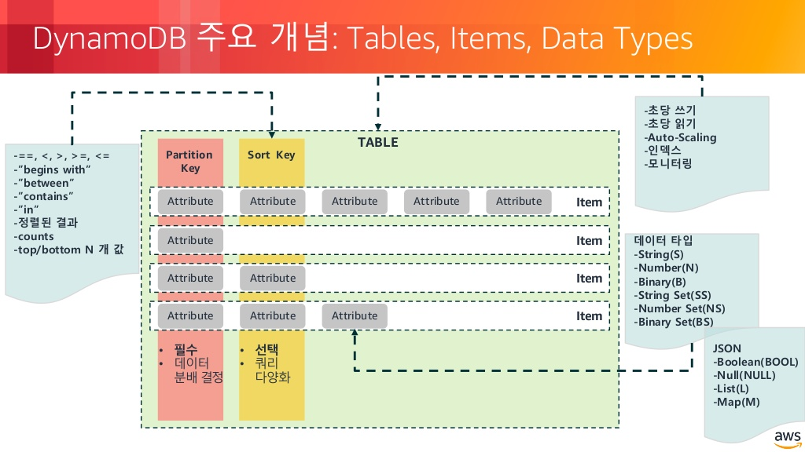

- [Abstract](#abstract)
- [References](#references)
- [Materials](#materials)
- [Install with docker](#install-with-docker)
- [Background Concepts - SQL, NoSQL](#background-concepts---sql-nosql)
  - [Basics of NoSQL Databases](#basics-of-nosql-databases)
  - [Types of NoSQL DataBases](#types-of-nosql-databases)
- [Basics](#basics)
  - [Features](#features)
    - [Table Structure](#table-structure)
    - [Data Types](#data-types)
    - [Table Index](#table-index)
    - [Secondary Index](#secondary-index)
    - [Consistency](#consistency)
    - [Capacity Units](#capacity-units)
    - [Read Data](#read-data)
    - [Partitions](#partitions)
  - [AWS CLI commands](#aws-cli-commands)
  - [Examples of Schema Design](#examples-of-schema-design)
    - [Fruits](#fruits)
      - [Fruits](#fruits-1)
      - [Query](#query)
    - [Weekly Rank](#weekly-rank)
      - [UsersLeaderboard](#usersleaderboard)
      - [FriendsLeaderboard](#friendsleaderboard)
      - [Query](#query-1)
- [DynamoDB Data Modeling & Best Practices](#dynamodb-data-modeling--best-practices)
  - [Architecture](#architecture)
  - [Partition in Depth](#partition-in-depth)
  - [Efficient Key Design](#efficient-key-design)
  - [Hot Partitions](#hot-partitions)
  - [Design Patterns](#design-patterns)
    - [One-to-one](#one-to-one)
    - [One-to-Many](#one-to-many)
    - [Many-to-Many](#many-to-many)
    - [Hierarchical Data Structures](#hierarchical-data-structures)
      - [Table items](#table-items)
      - [JSON Documents](#json-documents)
  - [Multi-value Sorts and Filters](#multi-value-sorts-and-filters)
  - [DynamoDB Limits](#dynamodb-limits)
    - [Capacity and Throught Limits](#capacity-and-throught-limits)
    - [Index and Attribute Limits](#index-and-attribute-limits)
    - [API Limits](#api-limits)
  - [Error Handling in DynamoDB](#error-handling-in-dynamodb)
  - [DynamoDB best practices](#dynamodb-best-practices)
    - [Uniform Data Access](#uniform-data-access)
    - [Write Sharding](#write-sharding)
    - [Time Series Data](#time-series-data)
    - [Burst Capacity](#burst-capacity)
    - [DynamoDB Adaptive Capacity](#dynamodb-adaptive-capacity)
    - [Temporary Substantial Capacity Scaling](#temporary-substantial-capacity-scaling)
    - [Use Shorter yest Intuitive Attribute Names](#use-shorter-yest-intuitive-attribute-names)
    - [One-to-Many Relationships](#one-to-many-relationships)
    - [Handling Large Item Attributes](#handling-large-item-attributes)
    - [Split Large Attributes Across Items](#split-large-attributes-across-items)
    - [Best Practices for Read Operations](#best-practices-for-read-operations)
    - [Best practices for LSIs](#best-practices-for-lsis)
    - [Best Practices for GSIs](#best-practices-for-gsis)
  - [Ways to Lower DynamoDB Costs](#ways-to-lower-dynamodb-costs)
- [Advanced DynamoDB](#advanced-dynamodb)
  - [Auto Scaling in DynamoDB](#auto-scaling-in-dynamodb)
  - [DynamoDB Accelerator (DAX)](#dynamodb-accelerator-dax)
  - [DynamoDB Streams and DynamoDB Triggers with AWS Lambda](#dynamodb-streams-and-dynamodb-triggers-with-aws-lambda)
  - [Time to Live (TTL) in DynamoDB](#time-to-live-ttl-in-dynamodb)
  - [Global Tables in DynamoDB](#global-tables-in-dynamodb)
- [Demo - Cross Region Replication in DynamoDB using Global Tables](#demo---cross-region-replication-in-dynamodb-using-global-tables)
- [Demo - Auto Scaling in DynamoDB](#demo---auto-scaling-in-dynamodb)
- [Demo - Auto-Archiving using TTL and Lambda](#demo---auto-archiving-using-ttl-and-lambda)
- [Demo - Handling Large Items in DynamoDB](#demo---handling-large-items-in-dynamodb)
- [Demo - Caching with DAX (DynamoDB Accelerator)](#demo---caching-with-dax-dynamodb-accelerator)
- [Demo - Backup and Restore with DynamoDB](#demo---backup-and-restore-with-dynamodb)
- [Demo - Server-Side Encryption in DynamoDB](#demo---server-side-encryption-in-dynamodb)
- [Demo - Logging DynamoDB API Calls With AWS CloudTrail](#demo---logging-dynamodb-api-calls-with-aws-cloudtrail)
- [Demo - Importing and Exporting DynamoDB Data using Data Pipeline](#demo---importing-and-exporting-dynamodb-data-using-data-pipeline)
- [Demo - Querying DynamoDB with Redshift](#demo---querying-dynamodb-with-redshift)
- [Demo - Querying DynamoDB with Apache Hive on EMR](#demo---querying-dynamodb-with-apache-hive-on-emr)
- [Demo - Full Text Search with CloudSearch](#demo---full-text-search-with-cloudsearch)
- [Demo - Monitoring DynamoDB with CloudWatch](#demo---monitoring-dynamodb-with-cloudwatch)
- [Demo - Fine Grained Access Control in DynamoDB using IAM](#demo---fine-grained-access-control-in-dynamodb-using-iam)
- [Course Project - Part 1 - Build REST API to interact with DynamoDB](#course-project---part-1---build-rest-api-to-interact-with-dynamodb)
- [Course Project - Part 2 - Integrate Web App (SPA) with DynamoDB Backend](#course-project---part-2---integrate-web-app-spa-with-dynamodb-backend)
- [Course Project - Part 3 - Integrate Mobile Apps with DynamoDB Backend](#course-project---part-3---integrate-mobile-apps-with-dynamodb-backend)

-------

# Abstract

dynamoDB 는 10 밀리초 미만의 성능을 제공하는 key-value document DB 이다. 하루에 10 조개 이상의 요청을 처리할 수 있고, 초당 2,000 만개 이상의 피크 요청을 지원한다.

Transaction 을 지원한다???

# References

* [AWS DynamoDB - The Complete Guide (Build 18+ Hands On Demos) @ udemy](https://www.udemy.com/course/dynamodb/)
  * 최고의 유료 강좌

# Materials

* [What is DynamoDB?](https://www.dynamodbguide.com/what-is-dynamo-db/)
* [How to Build a Reactive Microservice API with Spring Boot, Spring Webflux and DynamoDB Using Kotlin](https://medium.com/swlh/how-to-build-a-reactive-microservice-api-with-spring-boot-spring-webflux-and-dynamodb-using-kotlin-e1be3e99b15e)
  * [src](https://github.com/billydh/dynamodemo)
* [DynamoDB의 데이터 모델 @ pyrasis](http://pyrasis.com/book/TheArtOfAmazonWebServices/Chapter14/01)
  * [DynamoDB에 맞는 데이터 구조 설계하기 @ pyrasis](http://pyrasis.com/book/TheArtOfAmazonWebServices/Chapter14/02)
  * [DynamoDB 테이블 생성하기 @ pyrasis](http://pyrasis.com/book/TheArtOfAmazonWebServices/Chapter14/03)
* [dynamoDB CLI @ AWS](https://docs.aws.amazon.com/cli/latest/reference/dynamodb/index.html)

# Install with docker

* [amazon/dynamodb-local](https://hub.docker.com/r/amazon/dynamodb-local/)

```console
$ docker pull amazon/dynamodb-local
$ docker run -d -p 8000:8000 --rm --name my-dynamodb amazon/dynamodb-local
```

# Background Concepts - SQL, NoSQL

## Basics of NoSQL Databases

* [SQL vs NoSQL @ TIL](/systemdesign/practices/SQLvsNoSQL.md)

----

* NoSQL Databases
  * Not-Only-SQL
  * Non-relational in nature
  * Support unstructured data
  * Well suited for big data applications

* Big Data has 3 Vs.
  * Volume: Large volumes of data
  * Veocity: a huge number of concurrent read/write operations in real time.
  * Variety: largely unstructured or semi structured data.

* Data Model comparison
  * SQL
    * Strict Schema
    * Predefined Set of Columns
    * Each record has some number of columns
  * NoSQL
    * Flexible Schema
    * Unstructured data
    * Different records can have different number of columns

* ACID Behavior [ACID Behavior @ TIL](/database/README.md#acid-behavior)
  * Atomicity
  * Consistency
  * Isolation
  * Durability

* ACID Behavior comparison
  * SQL
    * Enforces strict ACID properties
    * Loss of flexibility
  * NoSQL
    * Trades some ACID properties
    * Flexible data model

* Scaling comparison
  * SQL
    * Vertical Scaling
    * Scale by adding more power. ex) faster hardward, CPU, RAM, etc...
  * NoSQL 
    * Horizontal Scaling
    * Scale by adding more machines. ex) partitions, low cost hardware.

* Interaction APIs
  * SQL 
    * Uses SQL (Structured Query Language).
  * NoSQL
    * Uses Object-bases APIs.

## Types of NoSQL DataBases

* Wide-Column Databases : Cassandra, HBase
* Key-Value Stores : Redis, Voldemort, **DynamoDB**
* Graph Databases : Neo4J, InfiniteGraph
* Document Databases : CouchDB, MongoDB, **DynamoDB**

# Basics

## Features

### Table Structure

* [효과적인 NoSQL (Elasticahe / DynamoDB) 디자인 및 활용 방안 (최유정 & 최홍식, AWS 솔루션즈 아키텍트) :: AWS DevDay2018](https://www.slideshare.net/awskorea/nosql-elasticahe-dynamodb-aws-aws-devday2018)

-----



### Data Types

* [Supported Data Types @ AWS](https://docs.aws.amazon.com/amazondynamodb/latest/developerguide/DynamoDBMapper.DataTypes.html)

----

* **Scala Data Types** : Number, String, Binary.
* **Multi Valued Types** : Number Set, String Set, Binary Set.

### Table Index

* Manadatory Primary Key - Either simple or composite
* Simple Primary Key -> Only Partition or Hash Key
* Composite Primary Key -> Partition Key + Sort or Range Key
* Partition or Hash Key decides the target partition
* **Hash Key** : Attribute 하나를 Key 로 사용한다. Scala Data Type 만 가능하다. Multi Valued Type 은 불가능하다.
* **Hash-Range Key** : Attribute 두개를 Key 로 사용한다. 첫번째 속성은 Hash Key 로 사용하고 두번째 속성은 Range Key 로 사용한다. Hash Key 와 Range Key 를 합한 것이다.

### Secondary Index

Primary Key 이외의 Index 를 Secondary Index 라고 한다. Primary Key 만으로는 검색기능이 부족하다. **Local Secondary Index** 와 **Global Secondary Index** 가 있다.

* **Local Secondary Index** : 하나의 Partition 에서만 유효한 Index 이다.   
  * Hash key 는 Table Index 의 Hash Key 와 같다. Range key 는 다르게 설정한다. 
  * Table 당 5 개 까지 가능하다. 
  * Table 이 생성될 때 생성해야 한다. Table 이 생성된 후 추가, 수정, 삭제가 불가능하다. 
  * Eventual Consistent Read, Strong Consistent Read 를 지원한다. 
  * Table 의 Index 설정화면에서 Hash and Range Key 를 선택할 때만 생성할 수 있다.
  * RCUs, WCUs 는 Table 과 공유한다.
* **Global Secondary Index** : 여러개의 Partition 에 걸쳐서 유효한 Index 이다.
  * Hash Key, Range Key 모두 Table Index 와 다르게 설정한 것이다. Range Key 는 생략가능하다. 
  * Table 당 5 개 까지 가능하다. 
  * Table 이 생성된 후 추가, 수정, 삭제가 가능하다??? 
  * Eventual Consistent Read 만 지원한다. 
  * RCUs, WCUs 는 Table 과 달리 별도로 지정할 수 있다.
  * Table 에 item 이 추가되면 Asynchronously 하게 Global Secondary Index 가 만들어진다. 즉, Background 에서 Indexing 한다.
  * Global Secondary Partition Key 는 중복될 수 있다.

### Consistency

DynamoDB provides 2 kinds of consistency.

* **Strongly Consistent Read** : 최근 완료된 쓰기결과가 모두 반영된 데이터를 읽는다.
* **Eventually Consistent Read** : 최근 완료된 쓰기결과가 반영되지 못했을 수 있다. 쓰기가 데이터의 모든 복사본에 반영되는 것은 1 초 내에 이루어진다. 최신 데이터를 읽으려면 짧은 시간 내에 읽기를 반복해야 한다.

### Capacity Units

* [Read/Write Capacity Mode @ DynamoDB](https://docs.aws.amazon.com/amazondynamodb/latest/developerguide/HowItWorks.ReadWriteCapacityMode.html)

----

DynamoDB 는 RCU, WCU 를 이용하여 비용을 정한다. 

* Read Capacity Units: 초당 4KB 단위로 읽을 수 있는 능력 (Eventually Consistent Read 는 Stronly Consistent Read 보다 2 배이다.)
* Write Capacity Units: 초당 1KB 단위로 쓸 수 있는 능력

billing option 은 On-Demand Mode, Provisioned Mode 두가지가 있다. 24 시간에 딱 한번 billing option 을 바꿀 수 있다.

* On-Demand Mode: 사용한 만큼만 지불한다.
* Provisioned mode: RCUs, WCUs 를 미리 정한다. 이 수치는 Auto Scaling 으로 조절할 수 있다.

다음은 RCUs, WCUs 의 예이다.

* Example 1
  * Average Item Size: 10KB
  * Provisioned Capacity: 10 RCUs and 10 WCUs
  * Read throughput with strong consistency = `4KB * 10 = 40KB/sec`
  * Read throughput = `2(4KB * 10) = 80KB/sec`
  * Write throughput = `1KB * 10 = 10KB/sec`

* Example 2
  * RCUs to read 10KB of data per second with strong consistency = `10KB/4KB = 2.5 => rounded up => 3 RCUs`
  * RCUs to read 10KB of data per second = `3 RCUs * 0.5 = 1.5 RCUs`
  * WCUs to write 10KB of data per second = `10KB / 1KB = 10 WCUs`
  * WCUs to write 1.5KB of data per second = `1.5KB / 1KB = 1.5 => rounded up => 2 WCUs`

DynamoDB 는 Traffic Spike 가 발생하면 Burst Capacity 를 적용한다.

* Burst Capacity
  * To provide for occasional bursts or spikes
  * 5 minutes of 300 seconds of unused read and write capacity
  * Can get consumed quickly
  * Must not be relied upon

Capacity Units 는 Scaling 될 수 있다. Table 이 아닌 Partition 에 적용된다.

* Scaling
  * Scaling Up: As and when needed
  * Scaling Down: Up to 4 times in a day
  * **Affects partition behavior**
  * 1 partition supports up to **3000 RCUs and 1000 WCUs**.

### Read Data

dynamoDB provides 2 ways to read data and they limit the result as 1 MB.

* Scan: Gather all data without condition.
* Query: Gather data with Hash Key, Range Key conditions. Range Key can be removed.

### Partitions

* Overview
  * Store DynamoDB table data
  * A table can have multiple partitions
  * Number of table partitions depend on its size and provisioned capacity
  * Managed internally by DynamoDB
  * 1 partition = **10 GB** of data
  * 1 partition = **3000 RCUs or 1000 WCUs**

* Example 1
  * Provisioned Capacity: 500 RCUs and 500 WCus
  * Number of Paritions  
    ```  
    P_T = (500 RCUs / 3000 + 500 WCUs)
        = 0.67 => rounded up => 1 partition
    ```    
* Example 2
  * Provisioned Capacity: 1000 RCUs and 1000 WCUs
  * Number of Partitions
    ```  
    P_T = (1000 RCUs / 3000 + 1000 WCUs)
        = 1.33 => rounded up => 2 partition
    ```

## AWS CLI commands

* [Amazon DynamoDB 로컬 환경에서 사용하기 (feat. Docker)](https://medium.com/@byeonggukgong/using-amazon-dynamodb-in-local-environment-feat-docker-fafbb420e161)

```bash
// List tables
$ aws dynamodb list-tables --endpoint-url http://localhost:8000
{
    "TableNames": [
        "Forum",
        "ProductCatalog",
        "Reply",
        "Thread"
    ]
}

// Create table
$ aws dynamodb create-table \
    --table-name <table-name> \
    --attribute-definitions \
        AttributeName=<attr-name>,AttributeType=<attr-type> \
        ... \
    --key-schema \
        AttributeName=<attr-name>,KeyType=<key-type> \
        ... \
    --provisioned-throughput \
        ReadCapacityUnits=1,WriteCapacityUnits=1 \
    --endpoint-url http://localhost:8000
$ aws dynamodb create-table \
    --table-name MusicCollection \
    --attribute-definitions AttributeName=Artist,AttributeType=S AttributeName=SongTitle,AttributeType=S \
    --key-schema AttributeName=Artist,KeyType=HASH AttributeName=SongTitle,KeyType=RANGE \
    --provisioned-throughput ReadCapacityUnits=5,WriteCapacityUnits=5 \
    --tags Key=Owner,Value=blueTeam \
    --endpoint-url http://localhost:8000
{
    "TableDescription": {
        "AttributeDefinitions": [
            {
                "AttributeName": "Artist",
                "AttributeType": "S"
            },
            {
                "AttributeName": "SongTitle",
                "AttributeType": "S"
            }
        ],
        "ProvisionedThroughput": {
            "NumberOfDecreasesToday": 0,
            "WriteCapacityUnits": 5,
            "ReadCapacityUnits": 5
        },
        "TableSizeBytes": 0,
        "TableName": "MusicCollection",
        "TableStatus": "CREATING",
        "KeySchema": [
            {
                "KeyType": "HASH",
                "AttributeName": "Artist"
            },
            {
                "KeyType": "RANGE",
                "AttributeName": "SongTitle"
            }
        ],
        "ItemCount": 0,
        "CreationDateTime": "2020-05-26T16:04:41.627000-07:00",
        "TableArn": "arn:aws:dynamodb:us-west-2:123456789012:table/MusicCollection",
        "TableId": "a1b2c3d4-5678-90ab-cdef-EXAMPLE11111"
    }
}    

// Describe table
$ aws dynamodb describe-table \
    --table-name <table-name> \
    --endpoint-url http://localhost:8000   
$ aws dynamodb describe-table \
    --table-name MusicCollection \
    --endpoint-url http://localhost:8000        
{
    "Table": {
        "AttributeDefinitions": [
            {
                "AttributeName": "Artist",
                "AttributeType": "S"
            },
            {
                "AttributeName": "SongTitle",
                "AttributeType": "S"
            }
        ],
        "ProvisionedThroughput": {
            "NumberOfDecreasesToday": 0,
            "WriteCapacityUnits": 5,
            "ReadCapacityUnits": 5
        },
        "TableSizeBytes": 0,
        "TableName": "MusicCollection",
        "TableStatus": "ACTIVE",
        "KeySchema": [
            {
                "KeyType": "HASH",
                "AttributeName": "Artist"
            },
            {
                "KeyType": "RANGE",
                "AttributeName": "SongTitle"
            }
        ],
        "ItemCount": 0,
        "CreationDateTime": 1421866952.062
    }
}

// Put item
// Put item will delete and add item
$ aws dynamodb put-item
    --table-name <table-name> \
    --item \
       '{ \
            "<attr-name>": {"<attr-type>": <content>}, \
            ... \
        }' \
    --endpoint-url http://localhost:8000     
// item.json
{
    "Artist": {"S": "No One You Know"},
    "SongTitle": {"S": "Call Me Today"},
    "AlbumTitle": {"S": "Greatest Hits"}
}    
$ aws dynamodb put-item \
    --table-name MusicCollection \
    --item file://item.json \
    --return-consumed-capacity TOTAL \
    --return-item-collection-metrics SIZE \
    --endpoint-url http://localhost:8000           
{
    "ConsumedCapacity": {
        "TableName": "MusicCollection",
        "CapacityUnits": 1.0
    },
    "ItemCollectionMetrics": {
        "ItemCollectionKey": {
            "Artist": {
                "S": "No One You Know"
            }
        },
        "SizeEstimateRangeGB": [
            0.0,
            1.0
        ]
    }
}

// Get item
$ aws dynamodb get-item \
    --table-name <table-name> \
    --key \
        '{ \
            "<attr-name>": {"<attr-type>": <content>}, \
            ... \
        }' \
    --endpoint-url http://localhost:8000   
// key.json
{
    "Artist": {"S": "Acme Band"},
    "SongTitle": {"S": "Happy Day"}
}    
$ aws dynamodb get-item \
    --table-name MusicCollection \
    --key file://key.json \
    --return-consumed-capacity TOTAL \
    --endpoint-url http://localhost:8000   
{
    "Item": {
        "AlbumTitle": {
            "S": "Songs About Life"
        },
        "SongTitle": {
            "S": "Happy Day"
        },
        "Artist": {
            "S": "Acme Band"
        }
    },
    "ConsumedCapacity": {
        "TableName": "MusicCollection",
        "CapacityUnits": 0.5
    }
}

// Delete item
$ aws dynamodb delete-item \
    --table-name <table-name> \
    --key \
       '{ \
            "<attr-name>": {"<attr-type>": "content"}, \
            ... \
        }'
    --endpoint-url http://localhost:8000    
// key.json
{
    "Artist": {"S": "No One You Know"},
    "SongTitle": {"S": "Scared of My Shadow"}
}    
$ aws dynamodb delete-item \
    --table-name MusicCollection \
    --key file://key.json \
    --return-values ALL_OLD \
    --return-consumed-capacity TOTAL \
    --return-item-collection-metrics SIZE \
    --endpoint-url http://localhost:8000           
{
    "Attributes": {
        "AlbumTitle": {
            "S": "Blue Sky Blues"
        },
        "Artist": {
            "S": "No One You Know"
        },
        "SongTitle": {
            "S": "Scared of My Shadow"
        }
    },
    "ConsumedCapacity": {
        "TableName": "MusicCollection",
        "CapacityUnits": 2.0
    },
    "ItemCollectionMetrics": {
        "ItemCollectionKey": {
            "Artist": {
                "S": "No One You Know"
            }
        },
        "SizeEstimateRangeGB": [
            0.0,
            1.0
        ]
    }
}

// Scan table
// expression-attribute-names.json
{
    "#ST": "SongTitle",
    "#AT":"AlbumTitle"
}
// expression-attribute-values.json
{
    ":a": {"S": "No One You Know"}
}
$ aws dynamodb scan \
    --table-name MusicCollection \
    --filter-expression "Artist = :a" \
    --projection-expression "#ST, #AT" \
    --expression-attribute-names file://expression-attribute-names.json \
    --expression-attribute-values file://expression-attribute-values.json
{
    "Items": [
        {
            "SongTitle": {
                "S": "Call Me Today"
            },
            "AlbumTitle": {
                "S": "Greatest Hits"
            }
        }
    ],
    "Count": 1,
    "ScannedCount": 1,
    "ConsumedCapacity": null
}

// Query table
// expression-attributes.json
{
    ":v1": {"S": "No One You Know"}
}
$ aws dynamodb query \
    --table-name MusicCollection \
    --projection-expression "SongTitle" \
    --key-condition-expression "Artist = :v1" \
    --expression-attribute-values file://expression-attributes.json \
    --return-consumed-capacity TOTAL \
    --endpoint-url http://localhost:8000    
{
    "Items": [
        {
            "SongTitle": {
                "S": "Call Me Today"
            }
        }
    ],
    "Count": 1,
    "ScannedCount": 1,
    "ConsumedCapacity": {
        "TableName": "MusicCollection",
        "CapacityUnits": 0.5
    }
}

// Update item
// Update item will update some of attributes
// key.json
{
    "Artist": {"S": "Acme Band"},
    "SongTitle": {"S": "Happy Day"}
}
// expression-attribute-names.json
{
    "#Y":"Year", "#AT":"AlbumTitle"
}
// expression-attribute-values.json
{
    ":y":{"N": "2015"},
    ":t":{"S": "Louder Than Ever"}
}
$ aws dynamodb update-item \
    --table-name MusicCollection \
    --key file://key.json \
    --update-expression "SET #Y = :y, #AT = :t" \
    --expression-attribute-names file://expression-attribute-names.json \
    --expression-attribute-values file://expression-attribute-values.json  \
    --return-values ALL_NEW \
    --return-consumed-capacity TOTAL \
    --return-item-collection-metrics SIZE \
    --endpoint-url http://localhost:8000    
{
    "Attributes": {
        "AlbumTitle": {
            "S": "Louder Than Ever"
        },
        "Awards": {
            "N": "10"
        },
        "Artist": {
            "S": "Acme Band"
        },
        "Year": {
            "N": "2015"
        },
        "SongTitle": {
            "S": "Happy Day"
        }
    },
    "ConsumedCapacity": {
        "TableName": "MusicCollection",
        "CapacityUnits": 3.0
    },
    "ItemCollectionMetrics": {
        "ItemCollectionKey": {
            "Artist": {
                "S": "Acme Band"
            }
        },
        "SizeEstimateRangeGB": [
            0.0,
            1.0
        ]
    }
}

// Delete table
$ aws dynamodb delete-table \
    --table-name <table-name> \
    --endpoint-url http://localhost:8000    
$ aws dynamodb delete-table \
    --table-name MusicCollection \
    --endpoint-url http://localhost:8000    
{
    "TableDescription": {
        "TableStatus": "DELETING",
        "TableSizeBytes": 0,
        "ItemCount": 0,
        "TableName": "MusicCollection",
        "ProvisionedThroughput": {
            "NumberOfDecreasesToday": 0,
            "WriteCapacityUnits": 5,
            "ReadCapacityUnits": 5
        }
    }
}        
```

## Examples of Schema Design

### Fruits

* [AWS CLI로 DynamoDB 다루기](https://www.daleseo.com/aws-cli-dynamodb/)

----

#### Fruits

| Name  | Data-type | Table Index | Local Secondary Index | Global Secondary Index |
| ----- | --------- | ----------- | --------------------- | ---------------------- |
| Id    | Number    | Hash Key    |                       |                        |
| Name  | String    |             |                       |                        |
| Price | Number    |             |                       |                        |

#### Query

```bash
# Create table
$ aws dynamodb create-table --table-name Fruits --attribute-definitions AttributeName=Id,AttributeType=S --key-schema AttributeName=Id,KeyType=HASH --provisioned-throughput ReadCapacityUnits=1,WriteCapacityUnits=1 --endpoint-url http://localhost:8000
{
    "TableDescription": {
        "AttributeDefinitions": [
            {
                "AttributeName": "Id",
                "AttributeType": "S"
            }
        ],
        "TableName": "Fruits",
        "KeySchema": [
            {
                "AttributeName": "Id",
                "KeyType": "HASH"
            }
        ],
        "TableStatus": "ACTIVE",
        "CreationDateTime": 1595252039.257,
        "ProvisionedThroughput": {
            "LastIncreaseDateTime": 0.0,
            "LastDecreaseDateTime": 0.0,
            "NumberOfDecreasesToday": 0,
            "ReadCapacityUnits": 1,
            "WriteCapacityUnits": 1
        },
        "TableSizeBytes": 0,
        "ItemCount": 0,
        "TableArn": "arn:aws:dynamodb:ddblocal:000000000000:table/Fruits"
    }
}

# Describe table
$ aws dynamodb describe-table --table-name Fruits --endpoint-url http://localhost:8000   
{
    "Table": {
        "AttributeDefinitions": [
            {
                "AttributeName": "Id",
                "AttributeType": "S"
            }
        ],
        "TableName": "Fruits",
        "KeySchema": [
            {
                "AttributeName": "Id",
                "KeyType": "HASH"
            }
        ],
        "TableStatus": "ACTIVE",
        "CreationDateTime": 1595252039.257,
        "ProvisionedThroughput": {
            "LastIncreaseDateTime": 0.0,
            "LastDecreaseDateTime": 0.0,
            "NumberOfDecreasesToday": 0,
            "ReadCapacityUnits": 1,
            "WriteCapacityUnits": 1
        },
        "TableSizeBytes": 0,
        "ItemCount": 0,
        "TableArn": "arn:aws:dynamodb:ddblocal:000000000000:table/Fruits"
    }
}

# Put data
$ aws dynamodb put-item --table-name Fruits --item file://fruits.json --endpoint-url http://localhost:8000 
$ aws dynamodb put-item --table-name Fruits --item '{"Id": {"S": "A1"}, "Name": {"S": "Apple"}, "Price": {"N": "1000"}}' --endpoint-url http://localhost:8000   

# Get data
$ aws dynamodb get-item --table-name Fruits --key '{"Id": {"S": "A1"}}'  --endpoint-url http://localhost:8000   

# Update data
$ aws dynamodb update-item --table-name Fruits \
  --key '{"Id": {"S": "A1"}}' \
  --update-expression 'SET Price=:Price' \
  --expression-attribute-values '{":Price": {"N": "2000"}}' \
  --endpoint-url http://localhost:8000    

# Delete data
$ aws dynamodb delete-item --table-name Fruits \
  --key '{"Id": {"S": "A1"}}' \
  --endpoint-url http://localhost:8000      

# WRite batch data
$ aws dynamodb batch-write-item --request-items file://fruits.json \
  --endpoint-url http://localhost:8000      

# Search data
$ aws dynamodb query --table-name Fruits \
  --key-condition-expression 'Id = :Id' \
  --expression-attribute-values '{":Id": {"S": "B1"}}' \
  --endpoint-url http://localhost:8000          

# Scan data
$ aws dynamodb scan --table-name Fruits \
  --filter-expression 'Price < :Price' \
  --expression-attribute-values '{":Price": {"N": "3000"}}' \
  --return-consumed-capacity TOTAL   \
  --endpoint-url http://localhost:8000          

# Delete table
$ aws dynamodb delete-table --table-name Fruits   \
  --endpoint-url http://localhost:8000          
```

### Weekly Rank

#### UsersLeaderboard

| Name     | Data-type | Table Index | Local Secondary Index | Global Secondary Index |
| -------- | --------- | ----------- | --------------------- | ---------------------- |
| Id       | Number    | Hash Key    | Hash Key              |                        |
| Name     | String    |             |                       |                        |
| TopScore | Number    |             |                       | Range Key              |
| Week     | String    | Range Key   | Range Key             | Hash Key               |
	 	 	 	 
#### FriendsLeaderboard	 

| Name            | Data-type | Table Index | Local Secondary Index | Global Secondary Index |
| --------------- | --------- | ----------- | --------------------- | ---------------------- |
| Id              | Number    | Hash Key    |                       |                        |
| Name            | String    |             |                       |                        |
| Score           | Number    |             |                       | Range Key              |
| FriendIdAndWeek | String    | Range Key   |                       | Hash Key               |
	 	 	 	 
#### Query

```bash
$ aws dynamodb create-table \
    --table-name UsersLeaderboard \
    --attribute-definitions \
        AttributeName=Id,AttributeType=N \
        AttributeName=Name,AttributeType=S \
        AttributeName=TopScore,AttributeType=N \
        AttributeName=Week,AttributeType=S \
    --key-schema \
        AttributeName=Id,KeyType=HASH \
        AttributeName=Id,KeyType=RANGE \
    --provisioned-throughput \
        ReadCapacityUnits=1,WriteCapacityUnits=1 \
    --endpoint-url http://localhost:8000

$ aws dynamodb describe-table
    --table-name UsersLeaderboard \
    --endpoint-url http://localhost:8000   
```

# DynamoDB Data Modeling & Best Practices

## Architecture

* DynamoDB Partitions
  * 1 partition : 10 GB SSD, 3000 RCUs, 1000 WCUs
* Automatic Synchronous Replication
  * 3 copies of data within a region
  * Act as independent Failure Domains
  * Near Real-time Replication
* [Consistent Hashing](/consistenthasing/README.md)
  * `hash = f(Partition Key, Size)`

## Partition in Depth

* DynamoDB Partitions
  * 1 partition : 10 GB SSD, 3000 RCUs, 1000 WCUs
  * `P_T = Round up [(RCUs/3000) + (WCUs/1000)]`
  * `P_S = Round up [(Storage Required in GB / 10 GB)]`
  * `P = max(P_T, P_S)`
* Example 1
  * `1000 RCUs, 500 WCUs, 5 GB`
  * `P_T = Round up [(1000/3000) + (500/1000)]`
  * `P_T = 1`
  * `P_S = Round up [(5GB/10GB)]`
  * `P_S = Round up [0.5]`
  * `P_S = 1`
  * `P = max(1, 1)`
  * `P = 1`
* Example 2
  * `1000 RCUs, 500 WCUs, 50 GB`
  * `P_T = Round up [(1000/3000) + (500/1000)]`
  * `P_T = 1`
  * `P_S = Round up [(50 GB/10 GB)]`
  * `P_S = Round up [5]`
  * `P_S = 5`
  * `P = max(1, 5)`
  * `P = 5`
* Example 3
  * `1000 RCUs, 500 WCUs, 500 GB`
  * `P_T = Round up [(1000/3000) + (500/1000)]`
  * `P_T = 1`
  * `P_S = Round up [(500 GB/10 GB)]`
  * `P_S = Round up [50]`
  * `P_S = 50`
  * `P = max(1, 50)`
  * `P = 50`
  * The cost is very high. We need to seperate tables for cost effectiveness.

## Efficient Key Design

* DynamoDB Keys
  * Simple Keys: Partition Key
  * Composite Keys: Partition Key + Sort Key
  * They are should be scala types (String, Number, Binary)
* Efficient Key Design
  * Data Distribution
    * Ensure uniform distribution of data across partitions
    * Use as many unique values for partition key as possible
  * Read/Write patterns
    * RCUs and WCUs get equally distributed between the partitions
    * Prevent hot partitions
    * Ensure uniform utilization of RCUs and WCUs
  * Time Series Data
    * Segragate hot and cold data in to separate tables
  * Scan Operations and Filters
    * Always prefer query operations
    * Choose keys and indexes so as to avoid scan operations and filters
* Secondary Indexes
  * Local Secondary Indexes
    * Same Partition Key as the Table Index
    * Use Table Throughput (Capacity Units)
    * Max Limit = 5
  * Global Secondary Indexes
    * Different Partition Key than the Table Indexes
    * Uses its own Throughput (Capacity Units)
    * Max Limit = 5
* When to choose?
  * Local Secondary Indexes
    * When application needs **same partition key** as the table
    * When you need to **avoid additional costs**
    * When appliation needs **strongly consistent index reads**
  * Global Secondary Indexes
    * When appliation needs **different or same partition key** as the table
    * When application needs **finer throughput control**
    * When application only needs **eventually consistent index reads**
* Item Size
  * Max size per Item = 400 KB
  * Prefer Shorter (yet intuitive) attribute names over long and descriptive ones
* Index Attribute Size for string and binary data types
  * Max size of simple partition key = 2 KB
  * Max size of composite partition key = 1 KB
  * Max size of sort key = 1 KB
* Summary
  * Partition key should have many unique values
  * Uniform distribution of Read/Write operations across partitions
  * Store hot and cold data in separate tables
  * Consider all possible query patterns to eliminate use of scan operations and filters
  * Choose sort key depending on your application's needs
  * Use indexes based on when your application's query patterns
  * Use primary key or local secondary indexes when strong consistency is desired
  * Use global secondary index for finer control over throughput or when your application needs to query using a different partition key
  * Use shorter attribute names

## Hot Partitions

특정 Partition 으로 data 가 집중될 때 그 partition 을 hot partition 이라고 한다.

예를 들어 timestamp 를 partition key 로 설정한 경우를 살펴보자. 최근 timestamp 를 더욱 많이 접근할 테니 hot partition 이 발생한다. 이때 한달 단위로 table 을 나눈다면 hot partition 을 해결할 수 있다. 혹은 DAX 를 이용한 cache 가 해결책이 될 수 있다.

* Write Sharding??

## Design Patterns

One-to-One, One-to-Many, Many-to-Many, Hierarchical Data Structures 의 경우에 대해 생각해 보자.

| Relationship | description |
|---|---|
| One-to-One | Simple keys on both entities |
| One-to-Many | Simple Keys on one entity and composite key on the other |
| Many-to-Many | Composite keys or indexes on both entities |

### One-to-one

예를 들어 다음과 같은 Users 테이블이 있다.

| user_id | name | email | SSN |
|---|---|---|---|
| A | John | john@abc.com | 123 |
| B | Mary | mary@abc.com | 124 |
| C | Bill | bill@abc.com | 125 |

예를 들어 다음과 같이 Students, Grades Table 이 있다. Students.student_id, Grades.student_id 는 Primary Key 이다. 

| student_id | name | email | SSN |
|---|---|---|---|
| 1001 | John | john@abc.com | 123 |
| 1002 | Mary | mary@abc.com | 124 |
| 1003 | Bill | bill@abc.com | 125 |

| student_id | grade |
|---|---|
| 1001 | A |
| 1002 | A+ |
| 1003 | A |

예를 들어 다음과 같이 Students, Grades Table 이 있다. Students.student_id, Grades.dept_id 는 Primary Key 이다. Grades.student_id 는 GSI (global Secondary Index) 이다.

| student_id | name | email | SSN |
|---|---|---|---|
| 1001 | John | john@abc.com | 123 |
| 1002 | Mary | mary@abc.com | 124 |
| 1003 | Bill | bill@abc.com | 125 |

| dept_id | student_id | grade |
|---|---|---|
| D1 | 1001 | A |
| D2 | 1002 | A+ |
| D3 | 1003 | A |

### One-to-Many

예를 들어 다음과 같이 Students, Subjects Table 이 있다. Students.student_id 는 Primary key 이다. Subjets.student_id, Subjets.subject 는 composite Primary Key 이다.

| student_id | name | email | SSN |
|---|---|---|---|
| 1001 | John | john@abc.com | 123 |
| 1002 | Mary | mary@abc.com | 124 |
| 1003 | Bill | bill@abc.com | 125 |

| student_id | subject |
|---|---|
| 1001 | Math |
| 1002 | Physics |
| 1003 | Economics |

다음과 같이 Subjects table 를 refactoring 한다. Subjects.subject 는 Primary Partition Key 이다. Subjects.student_id 는 Primary Sort Key 이다. Subjects.student_id 는 GSI Partition Key 이다.

| subject_id | student_id | subject |
|---|---|---|
| S001 | 1001 | Math |
| S002 | 1001 | Physics |
| S003 | 1003 | Economics |

또한 다음과 같이 Subjects table 를 Set 을 사용하여 refactoring 할 수 있다.

| student_id | name | email | SSN | subjects |
|---|---|---|---|---|
| 1001 | John | john@abc.com | 123 | {Math, Physics} |
| 1002 | Mary | mary@abc.com | 124 | {Economics, Civics} |
| 1003 | Bill | bill@abc.com | 125 | {Computer Science, Math} |

다음과 같이 Sort Keys/Composite Keys 혹은 Set Types 를 언제 사용하면 좋은지 정리해 보자.

| Sort Keys/Composite Keys | Set Types |
|---|---|
| Larget item sizes | Small item sizes |
| If querying multiple items whthin a partition key is required | If querying individual item attributes in Sets is NOT needed |

### Many-to-Many

예를 들어 다음과 같이 Students Table 을 살펴보자. student_id 와 subject_id 는 many-to-many 이다. Students.student_id 는 Primary Partition Key 로 한다. Students.subject_id 는 Primary Sort Key 로 한다. Students.student_id 는 GSI Sort Key 로 한다. Students.subject_id 는 GSI Partition Key 로 한다.

| student_id | subject_id | subject |
|---|---|---|
| 1001 | S001 | Math | 
| 1001 | S002 | Physics | 
| 1003 | S003 | Economics | 
| 1003 | S001 | Math | 

### Hierarchical Data Structures

Table items 과 JSON Documents 를 이용하여 표현할 수 있다.

#### Table items

예를 들어 다음과 같이 Curriculum table 이 있다. Curriculum.curriculum_id 는 Partition Key 이다. Curriculum.type 은 Sort Key 이다.

| curriculum_id | type | attributes_1 | ... | attributes_n |
|----|---|---|---|---|
| Medical | Radiology | ... | ... | ... |
| Medical | Dentistry | ... | ... | ... |
| Medical | ... | ... | ... | ... |
| Engineering | Computer Science | ... | ... | ... |
| Engineering | Electronics | ... | ... | ... |
| Engineering | Mechanical Engineering | ... | ... | ... |
| Engineering | ... | ... | ... | ... |
| Journalism | Newspaper Journalism | ... | ... | ... |
| Journalism | Investigative Journalism | ... | ... | ... |
| Journalism | Sports Journalism | ... | ... | ... |
| Journalism | ... | ... | ... | ... |

#### JSON Documents

예를 들어 다음과 같이 Products table 이 있다. Products.product_id 는 Partition Key 이다. metadata 는 key value 의 모음을 JSON 으로 저장하고 있다.

| product_id | metadata |
|--|--|
| P001 | `{type: "Electronics", model: "PQR", weith: "1.05"}` |
| P002 | `{publisher: "ABC", type: "Electronics", model: "PQR", weith: "1.05"}` |

## Multi-value Sorts and Filters

Sort Key 를 이용하면 하나의 Partition 안에서 Sort Key 로 rows 를 정렬할 수 있다. 

만약 여러 column 을 기준으로 정렬해야 하는 경우를 살펴보자. 다음과 같은 Address table 이 있다. country, state, city 를 기준으로 정렬을 해보자.

| customer | addr_id | country | state | city | zip |street | 
|--|--|--|--|--|--|--|
| John | 1 | US | CA | San Francisco | ... | ... | ... |
| Tom | 1 | US | CA | San Diego | ... | ... | ... |
| John | 2 | US | CA | San Diego | ... | ... | ... |
| Sara | 1 | US | FL | Miami | ... | ... | ... |

첫번 째 방법은 다음과 같이 GSI 3 개를 설정하는 것이다.

* GSI 1
  * Address.customer: GSI 1 Partition Key
  * Address.country: GSI 1 Sort Key
* GSI 2
  * Address.customer: GSI 2 Partition Key
  * Address.state: GSI 2 Sort Key
* GSI 3
  * Address.customer: GSI 3 Partition Key
  * Address.city: GSI 3 Sort Key

다음과 같이 Query 한다. 이렇게 여러개의 Sort Key 를 사용하려 filtering 하는 것을 Multi-value Filters 라고 한다.

```
Filter On:
state = "CA" and city = "San Diego"
```

한편 다음과 같이 sort key 를 design 하면 성능을 개선할 수 있다.

| customer | addr_id | country_state_city | zip |street | 
|--|--|--|--|--|--|
| John | 1 | US `|` CA `|` San Francisco | ... | ... |
| Tom | 1 | US `|` CA `|` San Diego | ... | ... | 
| John | 2 | US `|` CA `|` San Diego | ... | ... |
| Sara | 1 | US `|` FL `|` Miami | ... | ... | 

다음과 같이 Query 한다. 이렇게 하나의 column 에 multi-value 를 사용하고 Sort key 로 설정한 것을 Multi-value Sorts 라고 한다.

```
Query On:
customer = "John" and country_state_city BEGINS_WITH "US | CA |"
```

## DynamoDB Limits

* [Service, Account, and Table Quotas in Amazon DynamoDB @ aws](https://docs.aws.amazon.com/amazondynamodb/latest/developerguide/Limits.html)

###  Capacity and Throught Limits

* 4KB per RCU
* 1KB per WCU
* 10GB per partition
* 3000 RCUs or 1000 WCUs per partition
* Minimum 1 RCU and 1 WCU per table or index

* Max 40,000 RCUs and WCUs each per table (US East region)
* Max 10,000 RCUs and WCUs each per table (Other regions)
* Max 80,000 RCUs and WCUs each per account (US East region)
* Max 20,000 RCUs and WCUs each per account (Other regions)
* Max limits are soft limits and can be increase on request

* No limit on scaling up table capacity
* Max scale downs limited to 4 times per calendar day (UTC timezone)
* Additional 1 scale down if no scale downs in last 4 hours
* Effectively 9 scale downs per day
* Max 256 tables per region (soft limit)

### Index and Attribute Limits

* 5 local secondary indexes per table
* 5 global secondary indexes per table
* Max 20 user-specified projected attributes across all secondary indexes of the table
* Max size of partition key = 2 KB
* Max size of sort key = 1 KB
* Max size of all items per partition key = 10 GB (including all LSIs)
* Max size of a table item = 400 KB
* For nested attributes, max possible nesting is 32 levels deep

### API Limits

* Max 10 simultaneous requests for table-level operations (CreateTable, UpdateTable and DeleteTable)
* Max 100 items (up to 16 MB in size) returned per **BatchGetItem** request
* Max 25 PutItem or DeleteItem requests (up to 16 MB in size) per **BatchWriteItem** request
* Max 1 MB data returned per query or scan request

## Error Handling in DynamoDB

* HTTP 400
  * Error in our request
  * Error Authentication failure
  * Missing required parameters
* HTTP 500
  * 500 Server Side Error
  * 503 Service not available
* Exceptions
  * Access Denied Exception
  * Conditional Check Failed Exception
  * Item Collection Size Limit Exceeded Exception
  * Limit Exceeded Exception
  * Resource In use Exception
  * Validation Exception
  * Provisioned Throughput Exceeded Exception
    * Error Retries
    * Exponential Backoff

## DynamoDB best practices

* [Best Practices for Designing and Architecting with DynamoDB @ aws](https://docs.aws.amazon.com/amazondynamodb/latest/developerguide/best-practices.html)

### Uniform Data Access

### Write Sharding

### Time Series Data

### Burst Capacity

* 300 seconds
* For Occasional Spike
* Not to be relied upon

### DynamoDB Adaptive Capacity

* For Non-uniform Workloads
* Works Automatically
* No Guarantees
* 5 to 30 minutes of delay

### Temporary Substantial Capacity Scaling

### Use Shorter yest Intuitive Attribute Names

### One-to-Many Relationships

### Handling Large Item Attributes

### Split Large Attributes Across Items

### Best Practices for Read Operations

* Avoid Scans
* Avoid Filters
* Use Eventual Consistency

### Best practices for LSIs

* Use LSIs Sparingly
* Project Fewer Attributes
* Use Sparse Indexes
* Watch for Expanding Item Collections

### Best Practices for GSIs

* Design for Uniform Workloads
* Use Sparse Indexes
* Project Fewer Attributes
* Eventually Consistent Read Replicas

## Ways to Lower DynamoDB Costs

* DynamoDB Pricing
  * Provisioned Throughput (RCU, WCU)
  * Data Storage
  * Data Transfer
  * Global Tables
  * Backups
  * DAX
  * Streams

* Optimizing DynamoDB Costs
  * Use Sparse Indexes
  * Project Fewer Attributes
  * Design for Uniform Workloads
  * Use Compression
  * Avoid Scans and Filters
  * Archive Old Data
  * Use Eventual Consistency
  * Choose Low-Cost Region
  * Use Auto-Scaling
  * Leverage Reserved Capacity

# Advanced DynamoDB

## Auto Scaling in DynamoDB

## DynamoDB Accelerator (DAX)

* DaynamoDB Accelerator (DAX)
  * In-Memory Caching
  * Microsecond Latency

* Benefits of DAX
  * Cost Savings
  * Microsecond Latency
  * Helps Prevent Hot Partitions
  * Minimum Code Changes

* Limitations of DAX
  * Only Eventual Consistency
  * Not for Write-Heavy Applications

* DAX Cluster

* DAX Caches
  * Item Cache
    * Index Reads: GetItem, BatchGetItem
    * Default TTL: 5 Min
  * Query Cache
    * Reads: Query, Scan
    * Default TTL: 5 Min

* "Write-through" Approach
* "Write-around" Approach

## DynamoDB Streams and DynamoDB Triggers with AWS Lambda

* DynamoDB Streams
  * Item 에 변화가 생기면 그 item 의 event 를 처리할 수 있다. 예를 들어 AWS Lambda 에서 event 를 처리할 수 있다.
  * 24 Hours Time-ordered Log
  * Replication
  * Archival
  * Notifications
  * Logging

* DynamoDB Streams Integration
  * Kinesis Adapter + KCL
  * DynamoDB Streams SDK
  * AWs Lambda Triggers

## Time to Live (TTL) in DynamoDB

* Time to Live (TTL)
  * Defines expiry timestamp of the table item (EPOCH or UNIX  timestamp)
  * Items marked for deletion on expiry
  * Expired items are removed from the table and indexes within about 48 hrs
  * Application should use filter operations to exclude items marked for deletion

* Time Series Data
  * TTL 을 유용하게 사용할 수 있다.
  * 지워진 data 는 AWs Lambda 를 이용하여 다른 table 로 backup 할 수 있다.

## Global Tables in DynamoDB

* Global Tables provide an automatic multi master cross region replication to aid diverse regions the world.
  * Tables must be empty across regions
  * Only one replica per region
  * Same table name and keys across regions
  * Streams enabled with new and old images
  * Internal use attribute prefix `aws:rep:`
  * Near real-time replication
  * Eventual consistency for cross-region reads
  * Strong consistency for same region reads
  * "Last writer wins" approach for conflict resolution
  * identical settings for Table and indexes across regions

# Demo - Cross Region Replication in DynamoDB using Global Tables

* Cross Region Replicationw with Global Tables

This is an example to put, get of global tables.
  
```js
// global-tables.js
const AWS = require("aws-sdk");
AWS.config.update({ region: 'us-west-2' });

const docClient = new AWS.DynamoDB.DocumentClient();
const newRegion = 'eu-central-1';
const docClient_2 = new AWS.DynamoDB.DocumentClient({region: newRegion});

docClient.put({
    TableName: 'global_td_notes',
    Item: {
        user_id: 'ABC',
        timestamp: 5,
        title: 'ABC title',
        content: 'ABC content'
    }
}, (err, data)=>{
    if(err) {
        console.log(err);
    } else {
        console.log(data);
        console.log('Put operation successful in', AWS.config.region);

        setTimeout(()=>{
            // AWS.config.update({ region: 'eu-central-1' });

            docClient_2.get({
                TableName: "global_td_notes",
                Key: {
                    user_id: 'ABC',
                    timestamp: 5
                }
            }, (err, data)=>{
                if(err) {
                    console.log(err);
                } else {
                    console.log('Getting the item from', newRegion);
                    console.log(data);
                }
            });
        }, 3000);
    }
});
```

# Demo - Auto Scaling in DynamoDB

This is an example of bulk-write for wcu auto-scaling. "faker" is for random contents. "moment" is for time.

```js
// bulk-writes.js
const AWS = require("aws-sdk");
AWS.config.update({ region: 'us-west-2' });

const docClient = new AWS.DynamoDB.DocumentClient();

const faker = require('faker');
const moment = require('moment');

setInterval(()=>{
    let params = {
        TableName: "global_td_notes"
    };

    generateNotesItem((item)=>{
        params.Item = item;
        docClient.put(params, (err, data)=>{
            if(err) {
                console.log(err);
            } else {
                console.log(data);
            }
        });
    });
}, 300);

function generateNotesItem(callback) {
    callback({
        user_id: faker.random.uuid(),
        timestamp: moment().unix(),
        cat: faker.random.word(),
        title: faker.company.catchPhrase(),
        content: faker.hacker.phrase(),
        note_id: faker.random.uuid(),
        user_name: faker.internet.userName(),
        expires: moment().unix() + 600
    });
}
```

This is an example of rcu auto-scaling.

```js
// bulk-reads.js
const async = require("async");
const _ = require("underscore");
const AWS = require("aws-sdk");
AWS.config.update({ region: 'us-west-2' });

const docClient = new AWS.DynamoDB.DocumentClient();

var startKey = [];
// var results = [];
var pages = 0;
async.doWhilst(
    //iteratee
    (callback)=>{
        let params = {
            TableName: 'global_td_notes',
            ConsistentRead: true,
            Limit: 3
        };

        if(!_.isEmpty(startKey)) {
            params.ExclusiveStartKey = startKey;
        }

        docClient.scan(params, (err, data)=>{
            if(err) {
                console.log(err);
                callback(null, {});
            } else {
                if(typeof data.LastEvaluatedKey !== 'undefined') {
                    startKey = data.LastEvaluatedKey;
                } else {
                    startKey = [];
                }

                pages++;
                console.log(data.Items, "====> Page ", pages);

                callback(null);
            }
        });
    },

    //truth test
    ()=>{
        return true;
    },

    //callback
    (err, data) => {
        if(err) {
            console.log(err);
        } else {
            console.log("Pages", pages);
        }
    }
);
```

# Demo - Auto-Archiving using TTL and Lambda

This is an example of auto-archiving Lambda.

```js
'use strict';

const AWS = require("aws-sdk");
AWS.config.update({ region: 'us-west-2' });

const dynamodb = new AWS.DynamoDB();

exports.handler = (event, context, callback) => {
    //console.log('Received event:', JSON.stringify(event, null, 2));
    event.Records.forEach((record) => {
        console.log('Stream record: ', JSON.stringify(record, null, 2));
        
        if(record.eventName == 'REMOVE') {
            let params = {
                TableName: "td_notes_archive",
                Item: record.dynamodb.OldImage
            };
            
            dynamodb.putItem(params, (err, data)=>{
               if(err) {
                   console.log(err);
               } else {
                   console.log(data);
               }
            });
        }
    });
    callback(null, `Successfully processed ${event.Records.length} records.`);
};
```

# Demo - Handling Large Items in DynamoDB

This is an example of data-comperssion.

```js
// data-compression.js
const AWS = require("aws-sdk");
AWS.config.update({ region: 'us-west-2' });

const docClient = new AWS.DynamoDB.DocumentClient();

const faker = require('faker');
const moment = require('moment');
const zlib = require('zlib');

generateNotesItem((item)=>{
    console.log("Uncompressed Item", item);
    putNotesItem(item, (err, data)=>{
        if(err) {
            console.log(err);
        } else {
            // console.log(data);
            console.log("Compressed Item", item);
            getNotesItem({
                user_id: item.user_id,
                timestamp: item.timestamp
            }, (err, data)=>{
                if(err) {
                    console.log(err);
                } else {
                    console.log("Uncompressed Read", data.Item);
                }
            });
        }
    });
});

function generateNotesItem(callback) {
    callback({
        user_id: faker.random.uuid(),
        timestamp: moment().unix(),
        cat: faker.random.word(),
        title: faker.company.catchPhrase(),
        content: faker.hacker.phrase(),
        note_id: faker.random.uuid(),
        user_name: faker.internet.userName(),
        expires: moment().unix() + 600
    });
}

function putNotesItem(item, callback) {
    if(item.content.length > 35) {
        zlib.gzip(item.content, (e, content_b)=>{
            item.content_b = content_b;
            item.content = undefined;
            docClient.put({
                TableName: "global_td_notes",
                Item: item
            }, callback);
        });
    } else {
        docClient.put({
            TableName: "global_td_notes",
            Item: item
        }, callback);
    }
}

function getNotesItem(key, callback) {
    docClient.get({
        TableName: "global_td_notes",
        Key: key
    }, (err, data)=>{
        if(err) {
            callback(err);
        } else {
            if(data.Item.content) {
                callback(null, data);
            } else {
                zlib.gunzip(data.Item.content_b, (err, content)=> {
                    if(err) {
                        callback(err);
                    } else {
                        data.Item.content = content.toString();
                        data.Item.content_b = undefined;
                        callback(null, data);
                    }
                });
            }
        }
    });
}
```

This is an example of uploading s3 for larger data.

```js
// larger-items-s3.js
const AWS = require("aws-sdk");
AWS.config.update({ region: 'us-west-2' });

const docClient = new AWS.DynamoDB.DocumentClient();
const s3 = new AWS.S3();

const faker = require('faker');
const moment = require('moment');
const zlib = require('zlib');

generateNotesItem((item)=>{
    console.log("Original Item", item);
    putNotesItemS3(item, (err, data)=>{
        if(err) {
            console.log(err);
        } else {
            // console.log(data);
            console.log("Stored Item", item);
            getNotesItemS3({
                user_id: item.user_id,
                timestamp: item.timestamp
            }, (err, data)=>{
                if(err) {
                    console.log(err);
                } else {
                    console.log("Retrieved Item", data.Item);
                }
            });
        }
    });
});

function generateNotesItem(callback) {
    callback({
        user_id: faker.random.uuid(),
        timestamp: moment().unix(),
        cat: faker.random.word(),
        title: faker.company.catchPhrase(),
        content: faker.hacker.phrase(),
        note_id: faker.random.uuid(),
        user_name: faker.internet.userName(),
        expires: moment().unix() + 600
    });
}

function putNotesItemS3(item, callback) {
    if(item.content.length > 35) {
        var params = {
            Bucket: 'td-notes-content',
            Key: item.user_id + '|' + item.timestamp,
            Body: item.content
        };

        s3.upload(params, (err, data)=>{
            if(err) {
                callback(err);
            } else {
                item.content_s3 = data.Location;
                item.content = undefined;
                docClient.put({
                    TableName: "global_td_notes",
                    Item: item
                }, callback);
            }
        });
    } else {
        docClient.put({
            TableName: "global_td_notes",
            Item: item
        }, callback);
    }
}

function getNotesItemS3(key, callback) {
    docClient.get({
        TableName: "global_td_notes",
        Key: key
    }, (err, data)=>{
        if(err) {
            callback(err);
        } else {
            if(data.Item.content) {
                callback(null, data);
            } else {
                var params = {
                    Bucket: 'td-notes-content',
                    Key: key.user_id + '|' + key.timestamp
                };

                s3.getObject(params, (err, content_s3)=>{
                    if(err) {
                        callback(err);
                    } else {
                        data.Item.content = content_s3.Body.toString();
                        data.Item.content_s3 = undefined;
                        callback(null, data);
                    }
                });
            }
        }
    });
}
```

# Demo - Caching with DAX (DynamoDB Accelerator)

This is an example of dax.

```js
// read-ops-dax.js
const AWS = require("aws-sdk");
AWS.config.update({ region: 'us-west-2' });

const AmazonDaxClient = require("amazon-dax-client");
const dynamodb = new AmazonDaxClient({
    endpoints: ['dax-notes-app.hllvre.clustercfg.dax.usw2.cache.amazonaws.com:8111'],
    region: 'us-west-2'
});

// const dynamodb = new AWS.DynamoDB();
dynamodb.getItem({
    TableName: "td_notes_test",
    Key: {
        user_id: {
            S: "A"
        },
        timestamp: {
            N: "1"
        }
    }
}, (err, data)=>{
    if(err) {
        console.log(err);
    } else {
        console.log(data);
    }
});

// const docClient = new AWS.DynamoDB.DocumentClient();

// docClient.get({
//     TableName: 'td_notes_test',
//     Key: {
//         user_id: 'A',
//         timestamp: 1
//     }
// }, (err, data)=>{
//     if(err) {
//         console.log(err);
//     } else {
//         console.log(data);
//     }
// });

// docClient.query({
//     TableName: 'td_notes_test',
//     KeyConditionExpression: "user_id = :uid",
//     ExpressionAttributeValues: {
//         ":uid": "A"
//     }
// }, (err, data)=>{
//     if(err) {
//         console.log(err);
//     } else {
//         console.log(data);
//     }
// });

// docClient.scan({
//     TableName: 'td_notes_test',
//     FilterExpression: "cat = :cat",
//     ExpressionAttributeValues: {
//         ":cat": "general"
//     }
// }, (err, data)=>{
//     if(err) {
//         console.log(err);
//     } else {
//         console.log(data);
//     }
// });


// docClient.batchGet({
//     RequestItems: {
//         'td_notes_test': {
//           Keys: [
//             {
//                user_id: 'A',
//                timestamp: 1
//             },
//             {
//                 user_id: 'B',
//                 timestamp: 2
//             }
//           ]
//         },
//         'td_notes_sdk': {
//           Keys: [
//             { 
//                 user_id: '11',
//                 timestamp: 1
//             }
//           ]
//         }
//     }
// }, (err, data)=>{
//     if(err) {
//         console.log(err);
//     } else {
//         console.log(JSON.stringify(data, null, 2));
//     }
// });
```

This is an example of AWS LAmbda

```js
// docclient.js
const AWS = require("aws-sdk");
AWS.config.update({ region: 'us-west-2' });

const AmazonDaxClient = require("amazon-dax-client");
const dax = new AmazonDaxClient({
    endpoints: ['dax-notes-app.hllvre.clustercfg.dax.usw2.cache.amazonaws.com:8111'],
    region: 'us-west-2'
});

const docClient = new AWS.DynamoDB.DocumentClient({
    service: dax
});

exports.handler = (event, context, callback) => {
    docClient.get({
        TableName: 'td_notes_test',
        Key: {
            user_id: event.user_id,
            timestamp: parseInt(event.timestamp)
        }
    }, (err, data)=>{
        if(err) {
            callback(err);
        } else {
            callback(null, data);
        }
    });
};

// dynamodb.js
const AWS = require("aws-sdk");
AWS.config.update({ region: 'us-west-2' });

const AmazonDaxClient = require("amazon-dax-client");
const dax = new AmazonDaxClient({
    endpoints: ['dax-notes-app.hllvre.clustercfg.dax.usw2.cache.amazonaws.com:8111'],
    region: 'us-west-2'
});

exports.handler = (event, context, callback) => {
    dax.getItem({
        TableName: "td_notes_test",
        Key: {
            user_id: {
                S: event.user_id.toString()
            },
            timestamp: {
                N: event.timestamp.toString()
            }
        }
    }, (err, data)=>{
        if(err) {
            callback(err);
        } else {
            callback(null, data);
        }
    });
};
```

# Demo - Backup and Restore with DynamoDB

* DynamoDB On-Demand Backup and Restore
  * Encrypted
  * Cataloged
  * Discoverable
  * Highly Scalable
  * No Capacity Consumption

* Scheduled Periodic Backups in DynamoDB
  * CloudWatch Triggers -> AWS Lambda

This is an example of AWS Lambda for periodic backup.

```js
// index.js
const AWS = require("aws-sdk");
AWS.config.update({ region: 'us-west-2' });

const _ = require("underscore");
const moment = require("moment");

const dynamodb = new AWS.DynamoDB();

exports.handler = (event, context, callback) => {
    event.Records.forEach((record)=>{
        dynamodb.listBackups({
            TableName: record.TableName
        }, (err, data)=>{
            if(err) {
                console.log(err);
            } else {
                let backups = _.sortBy(data.BackupSummaries, 'BackupCreationDateTime');
                let backupsToRemove = record.RetentionCount - 1;
                backups.splice(-backupsToRemove, backupsToRemove);

                backups.forEach((backup)=>{
                    dynamodb.deleteBackup({
                        BackupArn: backup.BackupArn
                    }, (err, data)=>{
                        if(err) {
                            console.log(err);
                        } else {
                            console.log(data);
                        }
                    });
                });

                dynamodb.createBackup({
                    TableName: record.TableName,
                    BackupName: record.TableName + '_' + moment().unix()
                }, (err, data)=>{
                    if(err) {
                        console.log(err);
                    } else {
                        console.log(data);
                    }
                });
            }
        });
    });
    callback(null, "Execution Successful");
}
```

* Continuous Backups with Point-in-Time Recovery

# Demo - Server-Side Encryption in DynamoDB

* Server-Side Encryption at Rest
  * dynamoDB uses 256-encryption key provided by AWs KMS.
  * If you once enabled encryption, you can not rollback it.

# Demo - Logging DynamoDB API Calls With AWS CloudTrail

* Logging DynamoDB API Calls with AWS CloudTrail

You can check decryption with AWS KMS after making a CloudTrail.

# Demo - Importing and Exporting DynamoDB Data using Data Pipeline

* Exporting DynamoDB Data using Data Pipeline
  * AWS Data Pipeline -> Amazon S3
  * AWS Data Pipeline internally use EMR

* Importing DynamoDB Data using Data Pipeline
  * AWS Data Pipeline <- Amazon S3
  * AWS Data Pipeline internally use EMR
 
# Demo - Querying DynamoDB with Redshift

* Querying DynamoDB with Redshift
  * dynamoDB - Amazon Redshift - SQL WORKBENCH
  * This is not a way for realtime query.
  * You can use Apache HIVE on EMR for realtime query.

This is an SQL example from Redshift.

```sql
select * from information_schema.tables;

create table td_notes_test_rs (
  user_id varchar(50),
  timestamp int,
  cat varchar(20),
  title varchar(50),
  content varchar(300),
  note_id varchar(50),
  username varchar(50)
);

select * from td_notes_test_rs;

copy td_notes_test_rs from 'dynamodb://td_notes_test'
readratio 100
iam_role 'PUT_REDSHIFT_DYNAMODB_ROLE_ARN_HERE'
;

select * from td_notes_test_rs;

select user_id, count(note_id) from td_notes_test_rs 
group by user_id;

create table td_notes_test_rs_2 (
  user_id varchar(50),
  timestamp int,
  cat varchar(20),
  title varchar(50),
  content varchar(300),
  note_id varchar(50),
  user_name varchar(50)
);

copy td_notes_test_rs_2 from 'dynamodb://td_notes_test'
readratio 100
iam_role 'PUT_REDSHIFT_DYNAMODB_ROLE_ARN_HERE'
;

select n1.user_id as n1_user_id, n2.*
from td_notes_test_rs as n1 
inner join td_notes_test_rs_2 as n2
on n1.user_id=n2.user_id and n1.timestamp = n2.timestamp
;
```

# Demo - Querying DynamoDB with Apache Hive on EMR

* Querying DynamoDB with Apache Hive 
  * EMR => Elastic MapReduce / Managed Hadoop Cluster

This is an sql example from Apache Hive.

```sql
create external table td_notes_test_hive
(
  user_id string,
  tstamp bigint,
  cat string,
  title string,
  content string,
  note_id string,
  username string
)
stored by 'org.apache.hadoop.hive.dynamodb.DynamoDBStorageHandler'
tblproperties (
  "dynamodb.table.name" = "td_notes_test",
  "dynamodb.column.mapping" = "user_id:user_id,tstamp:timestamp,cat:cat,title:title,content:content,note_id:note_id,username:username" 
);

create external table td_notes_test_hive_2
(
  user_id string,
  tstamp bigint,
  cat string,
  title string,
  content string,
  note_id string,
  username string
)
stored by 'org.apache.hadoop.hive.dynamodb.DynamoDBStorageHandler'
tblproperties (
  "dynamodb.table.name" = "td_notes_test",
  "dynamodb.column.mapping" = "user_id:user_id,tstamp:timestamp,cat:cat,title:title,content:content,note_id:note_id,username:username" 
);

select * from td_notes_test_hive;

select user_id, count(note_id) from td_notes_test_hive 
group by user_id;

select n1.user_id as n1_user_id, n2.*
from td_notes_test_hive n1 
inner join td_notes_test_hive_2 n2
on n1.user_id=n2.user_id and n1.tstamp = n2.tstamp
;
```

# Demo - Full Text Search with CloudSearch

* Full Text Search with CloudSearch
  * DynamoDB - Amazon CloudSearch
  * You should load DynamoDB data in Amazon CloudSearch

* Performing Searches using CloudSearch API

This is an example of using CloudSearch API.

```js
const AWS = require("aws-sdk");
AWS.config.update({ region: 'us-west-2' });

const csd = new AWS.CloudSearchDomain({
    endpoint: 'search-td-notes-search-fl6g4mlngcdmbjejvkzocu5qbq.us-west-2.cloudsearch.amazonaws.com'
});

csd.search({
    query: "mobile usb"
}, (err, data)=>{
    if(err) {
        console.log(err);
    } else {
        console.log(JSON.stringify(data, null, 2));
    }
});
```

* Updating CloudSearch Index on the fly
  * DynamoDB -> DynamoDB streams -> AWs Lambda Trigger -> AWS CloudSearch 

This is an example of AWS Lambda for uploading documents to AWs CloudSearch on the fly.

```js
const AWS = require("aws-sdk");
AWS.config.update({ region: 'us-west-2' });

const async = require("async");

const csd = new AWS.CloudSearchDomain({
    endpoint: 'doc-td-notes-search-fl6g4mlngcdmbjejvkzocu5qbq.us-west-2.cloudsearch.amazonaws.com'
});

exports.handler = (event, context, callback) => {
    async.map(event.Records, (record, callbackMap)=>{
        let user_id = record.dynamodb.Keys.user_id.S;
        let timestamp = record.dynamodb.Keys.timestamp.N;
        let id = user_id + '_' + timestamp;
        if(record.eventName == 'REMOVE') {
            callbackMap(null, {
                type: 'delete',
                id: id
            });
        } else {
            let newImage = record.dynamodb.NewImage;
            callbackMap(null, {
                type: 'add',
                id: id,
                fields: {
                    user_id: newImage.user_id.S,
                    timestamp: newImage.timestamp.N,
                    cat: newImage.cat.S,
                    title: newImage.title.S,
                    content: newImage.content.S,
                    note_id: newImage.note_id.S,
                    user_name: newImage.user_name.S,
                    expires: newImage.expires.N
                }
            });
        }
    }, (err, results)=>{
        csd.uploadDocuments({
            contentType: 'application/json',
            documents: JSON.stringify(results)
        }, (err, data)=>{
            if(err) {
                console.log(err);
            } else {
                console.log(data);
            }
        });
        callback(null, "Execution Completed");
    });
}
```

# Demo - Monitoring DynamoDB with CloudWatch

Use AWS CloudWatch for monitoring DynamoDB.

# Demo - Fine Grained Access Control in DynamoDB using IAM

Use AWS IAM for handling access control.

# Course Project - Part 1 - Build REST API to interact with DynamoDB

Implement back-end api server with node.js.

# Course Project - Part 2 - Integrate Web App (SPA) with DynamoDB Backend

* Implement front-end SPA with angular.js.
* Implement Authentication with Google API Server, AWS Cognito. 
  * AWs Cognito will manage user, credentials.
* Implement Authorization with AWS Cognito, AWS IAM roles.
  * Make an AWs IAM role with custom policies which prevent to access other user's contents.
* Deploy node.js back-end, front-end on AWs Elastic BeansTalk.

# Course Project - Part 3 - Integrate Mobile Apps with DynamoDB Backend

* Implement fron-end mobile app with ionic.
* Implement Authentication with FireBase, AWS Cognito.
  * Register IDC Provider in AWS IAM.
  * Register IDC Provider in AWS Cognito.
  * Now you can authenticate with one id thanks to AWS Cognito.
