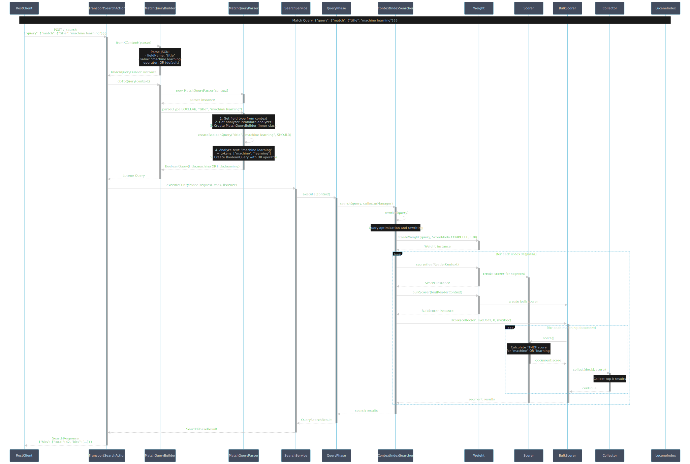

- [Match Query 검색 결과 생성 과정](#match-query-검색-결과-생성-과정)
  - [Sequence Diagram](#sequence-diagram)
  - [Class Diagram](#class-diagram)
  - [주요 단계별 코드 분석](#주요-단계별-코드-분석)
    - [1. Query Parsing 단계](#1-query-parsing-단계)
    - [2. Query Building 단계](#2-query-building-단계)
    - [3. Text Analysis 단계](#3-text-analysis-단계)
    - [4. Lucene Query Creation](#4-lucene-query-creation)
    - [5. Search Execution 단계](#5-search-execution-단계)
    - [6. Query Phase Execution](#6-query-phase-execution)
    - [7. Lucene Search Execution](#7-lucene-search-execution)
    - [8. Document Scoring](#8-document-scoring)
  - [주요 클래스 역할 요약](#주요-클래스-역할-요약)

-----

# Match Query 검색 결과 생성 과정

다음의 match query가 어떻게 검색 결과를 생성하는지 코드 중심으로 단계별로 완전한 흐름을 설명하겠습니다:

```json
{
  "query": {
    "match": {
      "title": "Elasticsearch"
    }
  }
}
```

## Sequence Diagram



[Sequence Diagram src](img/seq-dgm.puml)

## Class Diagram



[Class Diagram src](img/class-dgm.puml)

## 주요 단계별 코드 분석

### 1. Query Parsing 단계
```java
// MatchQueryBuilder.java - fromXContent()
public static MatchQueryBuilder fromXContent(XContentParser parser) throws IOException {
    // JSON parsing: {"match": {"title": "machine learning"}}
    String fieldName = null;
    Object value = null;
    // ... parsing logic
    return new MatchQueryBuilder(fieldName, value);
}
```

### 2. Query Building 단계
```java
// MatchQueryBuilder.java - doToQuery()
protected Query doToQuery(SearchExecutionContext context) throws IOException {
    MatchQueryParser queryParser = new MatchQueryParser(context);
    queryParser.setOccur(operator.toBooleanClauseOccur()); // OR
    Query query = queryParser.parse(MatchQueryParser.Type.BOOLEAN, fieldName, value);
    return query;
}
```

### 3. Text Analysis 단계
```java
// MatchQueryParser.java - parse()
public Query parse(Type type, String fieldName, Object value) throws IOException {
    // 1. Get field type and analyzer
    MappedFieldType fieldType = context.getFieldType(fieldName);
    Analyzer analyzer = getAnalyzer(fieldType, false);
    
    // 2. Create query builder
    MatchQueryBuilder builder = new MatchQueryBuilder(analyzer, fieldType, ...);
    
    // 3. Analyze text and create Boolean query
    return builder.createBooleanQuery(fieldName, value.toString(), occur);
}
```

### 4. Lucene Query Creation
```java
// MatchQueryParser.MatchQueryBuilder - createBooleanQuery()
private Query createQuery(String field, String queryText, Type type, 
                         BooleanClause.Occur operator, int phraseSlop) {
    // Analyze "machine learning" → ["machine", "learning"]
    TokenStream source = analyzer.tokenStream(field, queryText);
    
    // Create BooleanQuery: title:machine OR title:learning
    BooleanQuery.Builder builder = new BooleanQuery.Builder();
    // Add terms with OR operator
    return builder.build();
}
```

### 5. Search Execution 단계
```java
// SearchService.java - executeQueryPhase()
private SearchPhaseResult executeQueryPhase(ShardSearchRequest request, 
                                           CancellableTask task) throws Exception {
    // Create search context
    SearchContext context = createContext(readerContext, request, task, ...);
    
    // Execute query phase
    QueryPhase.execute(context);
    
    return context.queryResult();
}
```

### 6. Query Phase Execution
```java
// QueryPhase.java - execute()
public static void execute(SearchContext searchContext) throws QueryPhaseExecutionException {
    // Pre-process aggregations
    AggregationPhase.preProcess(searchContext);
    
    // Execute search
    addCollectorsAndSearch(searchContext);
    
    // Post-process (rescoring, suggestions)
    RescorePhase.execute(searchContext);
    SuggestPhase.execute(searchContext);
}
```

### 7. Lucene Search Execution
```java
// ContextIndexSearcher.java - search()
public <C extends Collector, T> T search(Query query, CollectorManager<C, T> collectorManager) {
    // Rewrite query for optimization
    query = rewrite(query);
    
    // Create weight for scoring
    Weight weight = createWeight(query, firstCollector.scoreMode(), 1);
    
    // Execute search across all segments
    return search(weight, collectorManager, firstCollector);
}
```

### 8. Document Scoring
```java
// Weight/Scorer interaction (Lucene internals)
// For each segment:
// 1. Weight.scorer(LeafReaderContext) - creates Scorer
// 2. Scorer.score() - calculates TF-IDF score
// 3. BulkScorer.score() - bulk scoring for efficiency
// 4. Collector.collect() - collects top-k results
```

## 주요 클래스 역할 요약

1. **MatchQueryBuilder**: JSON 파싱 및 Lucene Query 생성
2. **MatchQueryParser**: 텍스트 분석 및 Boolean Query 구축
3. **SearchService**: 검색 실행 오케스트레이션
4. **QueryPhase**: 쿼리 단계 실행 (scoring, collection)
5. **ContextIndexSearcher**: Lucene 검색 실행
6. **Weight/Scorer**: 문서 스코어링 (TF-IDF 계산)
7. **Collector**: 검색 결과 수집

이 과정을 통해 `"machine learning"`이라는 텍스트가 `["machine", "learning"]`으로 분석되고, `title:machine OR title:learning`의 Boolean Query로 변환되어 Lucene에서 실행됩니다.
