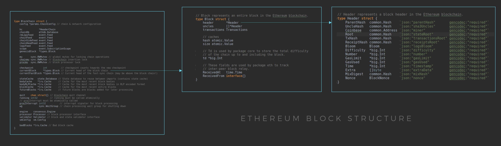

# Abstract

ethereum 을 정리한다. 

# References

* [ethereum yellowpaper](https://github.com/ethereum/yellowpaper)
  * [Ethereum Yellow Paper](https://ethereum.github.io/yellowpaper/paper.pdf)

# Materials

* [이더리움 스마트 컨트랙트 동작방식의 이해](https://opentutorials.org/course/2869/19273)
* [이론부터 배포까지, 단계별로 익히는 이더리움 DAPP 개발 @ Tacademy](https://tacademy.skplanet.com/live/player/onlineLectureDetail.action?seq=144)

# bitcoin vs ethereum

bitcoin 의 script 는 turing complete 하지 못하다. ethereum 의 script 는
turing complete 하다. turing complete 하다는 것은 turing machine 을 흉내내는
machine 을 program 할 수 있다는 의미이다. control flow 가 없다면 turing complete 하다고 할 수 없다.

bitcoin 은 UTXO (Unspect transaction output) 으로 유저의 balance 를 계산한다. transaction 의 history 를 탐색해서 balance 를 얻어온다. ethereum 은 transaction 이 발생할 때 마다 유저의 State 를 변경한다. 즉, 마지막 balance 를 계산없이 바로 가져올 수 있다. 

# Block Structure

> * [Ethereum block architecture @ stackexchange](https://ethereum.stackexchange.com/questions/268/ethereum-block-architecture)
> * [Merkling in Ethereum](https://blog.ethereum.org/2015/11/15/merkling-in-ethereum/)
>   * merkle tree structure

# Accounts

> * [What is Ethereum?](https://aws.amazon.com/ko/blockchain/what-is-ethereum/)

Ethereum 은 다음과 같이 2 종류의 Account 를 갖는다. 

* Externally Owned Accounts (EOA) 
* Contract Accounts 

EOA 는 private key 로 제어된다. code 를 소유하지 않는다. transaction 을 보낼 수 있다.

Contract Account 는 code 를 소유한다. transaction 을 EOA 로 부터 받으면 소유하고 있는 code 를 실행한다. Contract Account 는 transaction 을 생성할 수 없다. transaction 은 EOA 로 부터 받을 수만 있다.

# Smart Contract

* [solidity @ TIL](/solidity/README.md)

-----

Smart Contract 는 script 로 작성한 code 를 말한다. code 는 Transaction 에 byte code 형태로 포함된다. Transaction 은 다시 Block 에 포함된다. Smart Contract 는 Block Chain 에서 고유한 Address 를 갖는다.

code 를 포함하는 Block 이 confirm 되면 다른 Transaction 에서 그 code 를 실행할 수 있다. code 가 실행되면 state 를 바꾸거나 또 다른 trasaction 을 생성할 수 있다. 
