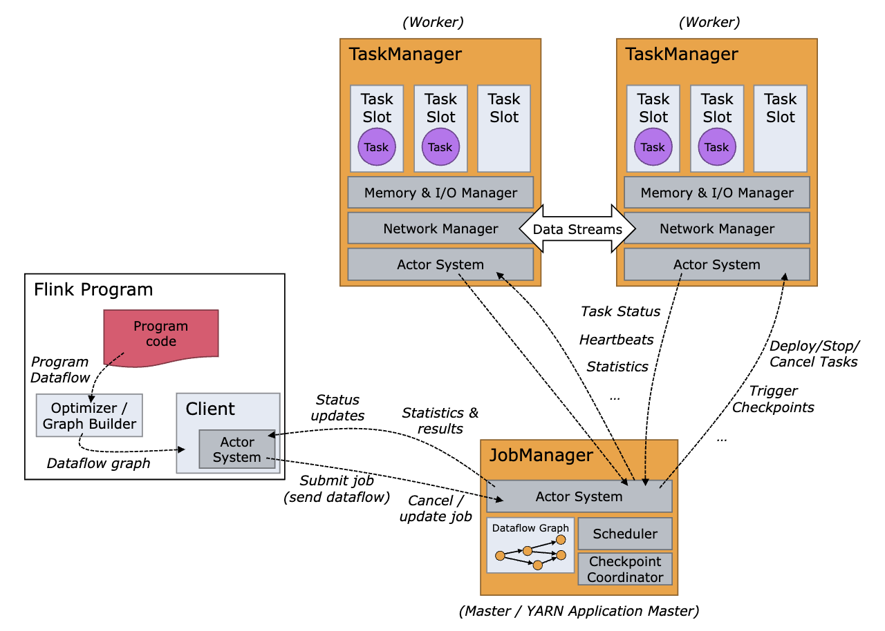
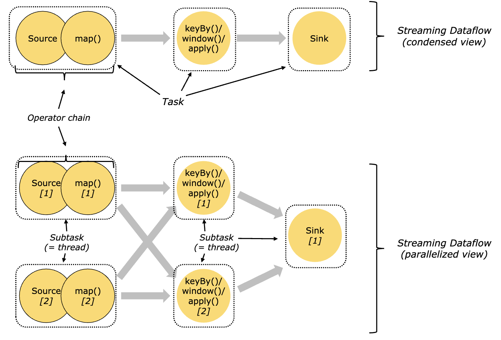
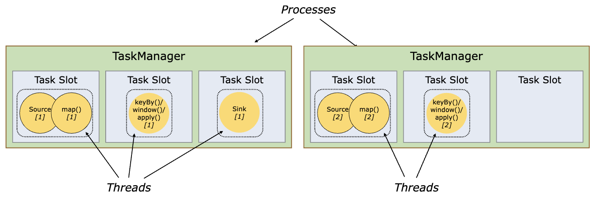
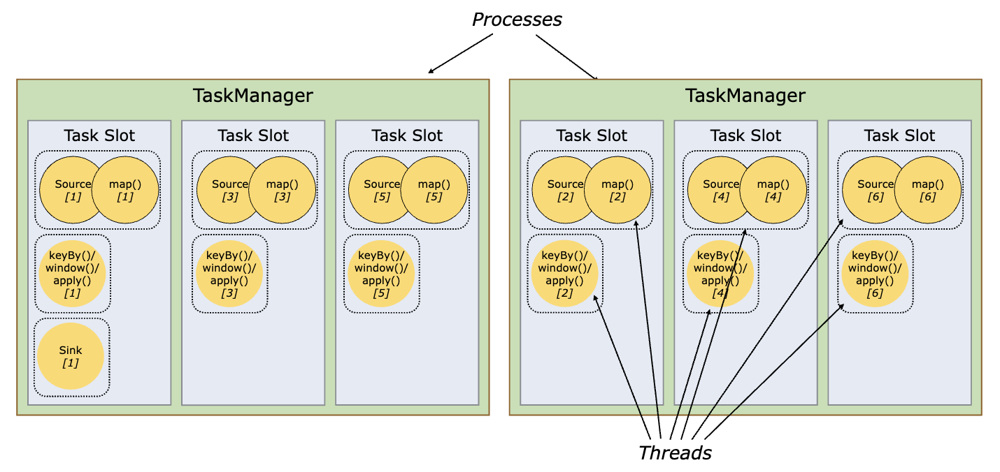
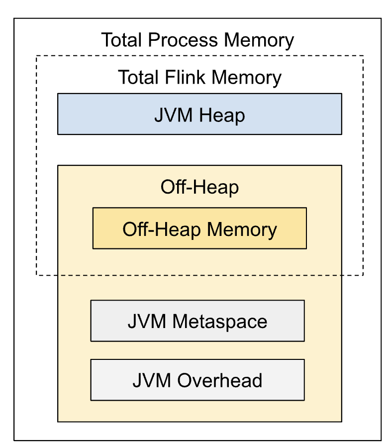
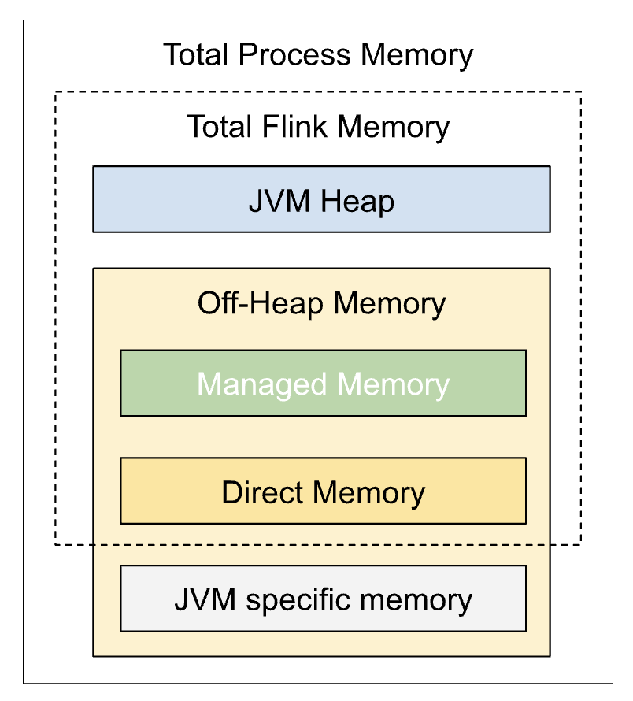
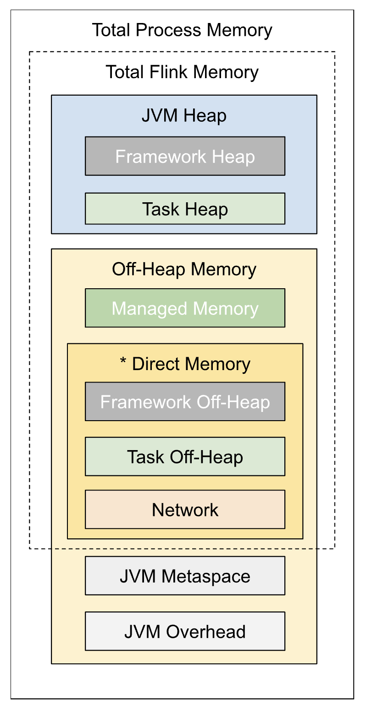
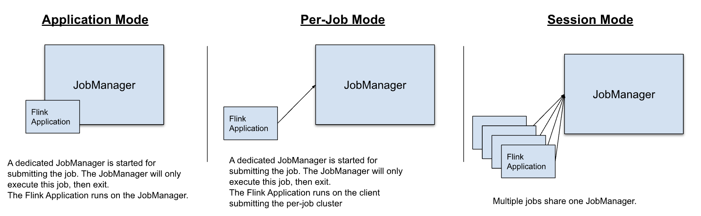
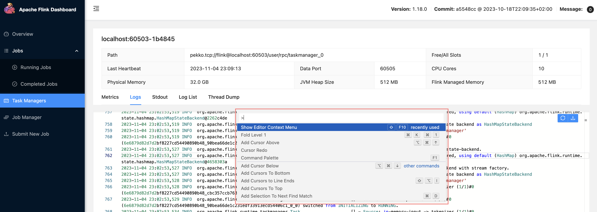

# Apache Flink 한글 가이드

- [개요](#개요)
- [학습 자료](#학습-자료)
- [기초](#기초)
  - [설치](#설치)
  - [Flink 아키텍처](#flink-아키텍처)
    - [Task Slot 의 실체](#task-slot-의-실체)
    - [왜 Slot 으로 나누는가](#왜-slot-으로-나누는가)
    - [Task Slot 공유 (Slot Sharing)](#task-slot-공유-slot-sharing)
    - [클러스터 병렬도 계산](#클러스터-병렬도-계산)
    - [Kafka 파티션과 Slot 의 관계](#kafka-파티션과-slot-의-관계)
    - [실무 설계 전략](#실무-설계-전략)
  - [메모리 구성](#메모리-구성)
    - [Job Manager 메모리](#job-manager-메모리)
    - [Task Manager 메모리](#task-manager-메모리)
  - [배포 모드](#배포-모드)
  - [Application Mode 로 배포하기](#application-mode-로-배포하기)
  - [로깅](#로깅)
  - [Watermark](#watermark)
  - [메시지 전파 방식](#메시지-전파-방식)
  - [파일 시스템](#파일-시스템)
  - [AWS S3](#aws-s3)
  - [체크포인트](#체크포인트)
    - [체크포인트 저장 과정](#체크포인트-저장-과정)
    - [체크포인트 복원 과정](#체크포인트-복원-과정)
  - [세이브포인트](#세이브포인트)
  - [체크포인트 vs 세이브포인트](#체크포인트-vs-세이브포인트)
  - [State Backend](#state-backend)
  - [RocksDB](#rocksdb)
    - [RocksDB 란?](#rocksdb-란)
    - [Flink 아키텍처에서의 위치](#flink-아키텍처에서의-위치)
    - [왜 프로덕션에서 RocksDB 를 권장하는가](#왜-프로덕션에서-rocksdb-를-권장하는가)
    - [State Backend 선택 기준](#state-backend-선택-기준)
    - [RocksDB 주의사항](#rocksdb-주의사항)
  - [Task Manager 간 데이터 공유](#task-manager-간-데이터-공유)
    - [핵심 원리: 상태를 공유하지 않는다](#핵심-원리-상태를-공유하지-않는다)
    - [Go Consumer + Redis 와의 비교](#go-consumer--redis-와의-비교)
    - [Task 간 데이터 전달 과정](#task-간-데이터-전달-과정)
    - [예외: 전체 Task 에 공유해야 하는 데이터](#예외-설정규칙-등-전체-task-에-공유해야-하는-데이터)
  - [Graceful Shutdown](#graceful-shutdown)
- [관련 문서](#관련-문서)

---

# 개요

Apache Flink는 **끝이 없는 데이터 스트림(unbounded stream)** 과 **끝이 있는 데이터(bounded data)** 를 모두 처리할 수 있는 분산 스트림 처리 프레임워크이다.

쉽게 말해, Kafka 같은 메시지 큐에서 이벤트가 끊임없이 들어오는 상황에서 실시간으로 집계·변환·분석을 수행하는 엔진이라고 생각하면 된다. 배치 처리(한꺼번에 모아서 처리)도 가능하지만, 주 용도는 실시간 스트림 처리이다.

# 학습 자료

* [글로벌 기업이 더 주목하는 스트림 프로세싱 프레임워크- (플링크Flink) 이해하기 | samsungsds](https://www.samsungsds.com/kr/insights/flink.html)
* [스트림 프로세싱의 긴 여정을 위한 이정표 (w. Apache Flink) | medium](https://medium.com/rate-labs/%EC%8A%A4%ED%8A%B8%EB%A6%BC-%ED%94%84%EB%A1%9C%EC%84%B8%EC%8B%B1%EC%9D%98-%EA%B8%B4-%EC%97%AC%EC%A0%95%EC%9D%84-%EC%9C%84%ED%95%9C-%EC%9D%B4%EC%A0%95%ED%91%9C-with-flink-8e3953f97986)
  * Stream 프레임워크의 용어 설명 포함
* [Apache Flink Training Exercises | github](https://github.com/apache/flink-training)
* [Stream Processing with Apache Flink | amazon](https://www.amazon.com/Stream-Processing-Apache-Flink-Implementation-ebook/dp/B07QM3DSB7)
  * [예제 코드 - Java](https://github.com/streaming-with-flink/examples-java) · [Scala](https://github.com/streaming-with-flink/examples-scala) · [Kotlin](https://github.com/rockmkd/flink-examples-kotlin)
* [Demystifying Flink Memory Allocation and tuning | youtube](https://www.youtube.com/watch?v=aq1Whga-RJ4)
  * [Flink Memory Tuning Calculator | googledoc](https://docs.google.com/spreadsheets/d/1DMUnHXNdoK1BR9TpTTpqeZvbNqvXGO7PlNmTojtaStU/edit#gid=0)

# 기초

## 설치

[Flink 다운로드 페이지](https://flink.apache.org/downloads.html) 에서 바이너리를 받아 압축을 풀면 된다.

## Flink 아키텍처

- [Flink Architecture 공식 문서](https://nightlies.apache.org/flink/flink-docs-master/docs/concepts/flink-architecture/)



Flink 런타임은 크게 두 종류의 프로세스로 구성된다.

### JobManager

클러스터의 "관제탑" 역할을 한다. 작업을 스케줄링하고, 체크포인트를 조율하며, 장애 복구를 관리한다. 내부적으로 세 가지 컴포넌트가 있다.

| 컴포넌트 | 역할 |
|---------|------|
| **ResourceManager** | 리소스(TaskManager 슬롯) 할당 및 관리 |
| **Dispatcher** | REST 인터페이스를 제공하여 Flink 어플리케이션을 제출받음 |
| **JobMaster** | 개별 Job의 실행을 관리 (Job 하나당 JobMaster 하나) |

### TaskManager (= Worker)

실제 데이터를 처리하는 워커 프로세스이다. 최소 1개 이상 필요하다.

TaskManager 안에는 **Task Slot** 이라는 단위가 있다. Task Slot 은 TaskManager 가 동시에 처리할 수 있는 작업의 단위라고 생각하면 된다.

**핵심 개념 — Operator Chaining**

Flink는 여러 연산자(operator)를 하나의 **Task** 로 묶는 최적화를 한다. 이것을 **Chaining** 이라고 부른다. 체이닝된 연산자들은 같은 스레드에서 실행되므로, 스레드 간 데이터 전달 비용이 사라지고 처리량이 올라간다.

> 정리: **하나의 Task = 하나의 스레드**. Task 안에는 체이닝된 여러 Operator Subtask 가 포함된다.



### Task Slot 의 실체

Task Slot 은 "스레드의 모음"이 아니라 **TaskManager 메모리의 고정 분할 단위(리소스 파티션)** 이다.

| 개념 | 실체 | 비유 |
|------|------|------|
| **TaskManager** | 하나의 JVM 프로세스 | 사무실 건물 |
| **Task Slot** | TaskManager 메모리의 고정 분할 | 사무실 방 (정해진 면적) |
| **Task** | 하나의 스레드 | 방 안에서 일하는 직원 |

핵심 특성:

- **메모리는 격리, CPU 는 공유**: TaskManager 에 3개의 Slot 이 있으면 관리 메모리를 1/3씩 나누지만, CPU 스레드는 모든 Slot 이 공유한다.
- **하나의 Slot 에 여러 Task(스레드)가 들어간다**: Slot Sharing 이 기본 활성화이므로 같은 Job 의 서로 다른 연산자(source → map → sink)가 하나의 Slot 에 들어간다.
- **필요한 Slot 수 = Job 의 최대 병렬도**: 병렬도가 4이면 Slot 이 최소 4개 필요하다. Slot Sharing 덕분에 파이프라인의 전체 연산자 수와 무관하다.

예시 — TaskManager 2개, 각각 Slot 3개, 병렬도 6인 Job:

```
TaskManager-1 (JVM 프로세스)
├── Slot 0: [Source 스레드] [Map 스레드] [Sink 스레드]  ← 메모리 1/3
├── Slot 1: [Source 스레드] [Map 스레드] [Sink 스레드]  ← 메모리 1/3
└── Slot 2: [Source 스레드] [Map 스레드] [Sink 스레드]  ← 메모리 1/3

TaskManager-2 (JVM 프로세스)
├── Slot 3: [Source 스레드] [Map 스레드] [Sink 스레드]
├── Slot 4: [Source 스레드] [Map 스레드] [Sink 스레드]
└── Slot 5: [Source 스레드] [Map 스레드] [Sink 스레드]
```

위 예시에서 TaskManager-1 은 Task 실행 스레드 **9개**(3 Slot × 3 Task)를 갖고, 메모리 칸막이는 **3개**(Slot 수)이다. 이 외에도 체크포인트, 네트워크 I/O(Netty), 하트비트, GC 등 프레임워크 스레드가 별도로 존재한다.

> 결론: Task Slot 은 **"여러 스레드가 함께 사용할 수 있는 메모리 칸막이"** 라고 이해하면 정확하다.

### 왜 Slot 으로 나누는가

Slot 이 없으면 TaskManager 안의 모든 Task 가 메모리를 제한 없이 사용하게 된다. 특정 Task 가 상태(state)를 대량으로 쌓으면 다른 Task 의 메모리까지 잡아먹고, OOM 이 나면 TaskManager 전체가 죽어 모든 Task 가 함께 사망한다.

| 효과 | 설명 |
|------|------|
| **메모리 격리** | Slot 마다 사용 가능한 메모리 상한이 정해져 있어, 한 파이프라인이 다른 파이프라인의 메모리를 침범하지 않는다 |
| **병렬도 예측** | Slot 3개 = 최대 병렬도 3. 클러스터 용량 계획이 단순해진다 |
| **장애 격리** | Slot 하나가 OOM 나도 이론적으로 해당 Slot 의 Task 만 영향받는다 |

그렇다면 왜 별도 프로세스가 아니라 Slot 인가? 프로세스를 완전히 분리하면 격리는 더 강하지만 오버헤드가 크다. Slot 은 **같은 JVM 안에서 메모리만 나누는 절충안**이다.

```
별도 프로세스:  격리 강함 / TCP 연결·하트비트·JVM 오버헤드 각각 발생
Slot:          메모리 격리 / TCP 연결·하트비트·네트워크 버퍼 공유 → 가벼움
```

> Slot 은 **"프로세스 격리의 안전성"과 "스레드 공유의 효율성" 사이의 균형점**이다.

### Task Slot 공유 (Slot Sharing)

하나의 Task Slot 에 여러 Task 가 들어갈 수 있다. 같은 슬롯에 있는 Task 들은 관리 메모리, TCP 연결, 하트비트 메시지 등을 공유한다.



Task Slot 공유의 장점:

- **리소스 효율**: 메모리·네트워크 자원을 여러 Task 가 함께 사용
- **성능 최적화**: 스레드 간 핸드오버·버퍼링 오버헤드 감소
- **클러스터 관리 간소화**: 클러스터에 필요한 슬롯 수 = Job 의 최대 병렬도(parallelism)
- **유연성**: 슬롯 수와 Task 분배를 조정하여 작업 격리 수준을 제어 가능
- **확장성**: 복잡한 파이프라인도 리소스 병목 없이 병렬 처리 가능



### 클러스터 병렬도 계산

**클러스터의 최대 병렬도 = TaskManager 수 × TaskManager 당 Slot 수**이다.

```
TaskManager-1 (프로세스 1): Slot 0, Slot 1, Slot 2
TaskManager-2 (프로세스 2): Slot 3, Slot 4, Slot 5
TaskManager-3 (프로세스 3): Slot 6, Slot 7, Slot 8

프로세스: 3개
총 Slot: 9개
최대 병렬도: 9
```

병렬 처리를 더 하고 싶다면 TaskManager 를 추가하면 된다. 단, **Slot 을 확보하는 것과 Job 의 parallelism 설정을 올리는 것 두 가지를 모두 맞춰야** 한다.

```java
// 방법 1: 코드에서 지정
env.setParallelism(12);

// 방법 2: 제출 시 CLI 로 지정
// ./bin/flink run -p 12 my-job.jar
```

Slot 을 12개 확보해도 Job 의 parallelism 이 9이면 3개의 Slot 은 비어 있게 된다. 반대로 parallelism 을 12로 설정했는데 Slot 이 9개뿐이면 Job 이 실행되지 않는다.

### Kafka 파티션과 Slot 의 관계

Kafka 소스를 사용하면 **하나의 Kafka 파티션은 하나의 Source Task(= 하나의 Slot)에만 할당된다.** 이것은 Kafka Consumer Group 의 규칙과 같다 — 하나의 파티션은 동시에 하나의 Consumer 만 읽을 수 있다.

```
Kafka 파티션 3개, 병렬도 3:  이상적 (1:1 매핑)
  Partition 0 → Slot 0 (Source Task)
  Partition 1 → Slot 1 (Source Task)
  Partition 2 → Slot 2 (Source Task)

Kafka 파티션 3개, 병렬도 6:  비효율 (3개의 Source Task 가 놀고 있음)
  Partition 0 → Slot 0 (Source Task)
  Partition 1 → Slot 1 (Source Task)
  Partition 2 → Slot 2 (Source Task)
  (없음)     → Slot 3 (놀고 있음)
  (없음)     → Slot 4 (놀고 있음)
  (없음)     → Slot 5 (놀고 있음)

Kafka 파티션 6개, 병렬도 3:  하나의 Source Task 가 2개씩 담당
  Partition 0, 1 → Slot 0 (Source Task)
  Partition 2, 3 → Slot 1 (Source Task)
  Partition 4, 5 → Slot 2 (Source Task)
```

가장 균등한 처리량을 얻으려면 **Kafka 파티션 수 = Flink 병렬도**로 맞추는 것이 좋다.

### 실무 설계 전략

Kafka 파티션은 한번 늘리면 줄이기 어렵지만, Flink Slot 은 동적으로 조절하기 쉽다.

| 항목 | Kafka 파티션 | Flink Slot |
|------|-------------|------------|
| **늘리기** | 가능하지만 리밸런싱 부담 | TaskManager 추가하면 끝 |
| **줄이기** | 사실상 불가 (토픽 재생성 필요) | TaskManager 제거하면 끝 |
| **변경 비용** | 높음 (데이터 재분배, Consumer 재할당) | 낮음 (세이브포인트 + Job 재시작) |

Kubernetes 위에서 TaskManager Pod 수를 늘리거나 줄이면 Slot 수가 자동으로 변한다. 세이브포인트를 찍고 새 병렬도로 재시작하면 상태도 자동 재분배된다.

```bash
# 세이브포인트 생성 후 병렬도 변경하여 재시작
./bin/flink stop <JobID>
./bin/flink run -s <savepoint-path> -p 12 my-job.jar
```

따라서 실무에서의 설계 원칙:

- **Kafka 파티션 수**: 변경이 어려우므로 **여유 있게 크게** 잡는다 (예: 처음부터 12~24개)
- **Flink 병렬도**: 현재 트래픽에 맞춰 설정하고, 트래픽이 늘면 **나중에 올린다**

```
초기:  Kafka 파티션 12개, Flink 병렬도 6  → Slot 6개만 사용, Source Task 가 파티션을 2개씩 담당
확장:  Kafka 파티션 12개, Flink 병렬도 12 → 1:1 매핑으로 최대 처리량
```

> Kafka 파티션은 미래를 고려해서 넉넉히 잡아두고, Flink Slot 은 트래픽에 따라 탄력적으로 운영하는 것이 실무 패턴이다.

## 메모리 구성

- [Set up Flink's Process Memory | 공식 문서](https://nightlies.apache.org/flink/flink-docs-release-1.18/docs/deployment/memory/mem_setup/)

### Job Manager 메모리



| 영역 | 설명 |
|------|------|
| **JVM Heap** | Java 객체가 저장되는 일반적인 힙 메모리 |
| **Off-heap** | JVM 힙 바깥에 Flink 가 직접 관리하는 네이티브 메모리. GC 의 영향을 받지 않아 지연 시간이 더 예측 가능하다 |
| **Metaspace** | Java 8 부터 도입된 클래스 메타데이터 저장 영역. 이전의 PermGen 을 대체한다 |
| **JVM Overhead** | JIT 컴파일러, 코드 캐시 등 JVM 자체가 필요로 하는 부가 메모리 |

### Task Manager 메모리



Task Manager 는 실제 데이터를 처리하므로 메모리 구조가 좀 더 복잡하다.

| 영역 | 설정 키 | 설명 |
|------|---------|------|
| **Framework Heap** | `taskmanager.memory.framework.heap.size` | Flink 프레임워크 내부 자료구조용. 보통 기본값 사용 |
| **Task Heap** | `taskmanager.memory.task.heap.size` | 사용자 코드(연산자, UDF 등)가 사용하는 힙 |
| **Managed Memory** | `taskmanager.memory.managed.size` | Flink 가 직접 관리하는 off-heap 메모리. RocksDB 상태, 정렬, 캐시 등에 사용 |
| **Framework Off-heap** | `taskmanager.memory.framework.off-heap.size` | 프레임워크 내부용 off-heap (고급 설정) |
| **Task Off-heap** | `taskmanager.memory.task.off-heap.size` | 사용자 연산자용 off-heap |
| **Network Memory** | `taskmanager.memory.network.*` | Task 간 데이터 교환(네트워크 버퍼)용. 전체 Flink 메모리의 일정 비율로 설정 |



> **Direct Memory** 란? JVM 힙 바깥에 할당되는 메모리로, GC 를 거치지 않아 성능이 좋지만 관리를 잘못하면 메모리 누수나 OOM 이 발생할 수 있다. Network Memory, Framework Off-heap, Task Off-heap 이 모두 Direct Memory 에 해당한다.

## 배포 모드

Flink 어플리케이션을 실행하는 세 가지 방식이 있다.

| 모드 | 설명 |
|------|------|
| **Application Mode** | Job 마다 전용 클러스터를 생성. 프로덕션에서 권장 |
| **Session Mode** | 하나의 클러스터에 여러 Job 을 제출. 개발·테스트에 유용 |
| **Per-Job Mode** | Flink 1.15 부터 deprecated. Application Mode 사용을 권장 |



## Application Mode 로 배포하기

- [Application Mode Deployment | 공식 문서](https://nightlies.apache.org/flink/flink-docs-master/docs/deployment/resource-providers/standalone/overview/#application-mode)

```bash
# 어플리케이션 jar 를 lib 디렉토리에 복사
$ cp ./examples/streaming/TopSpeedWindowing.jar lib/

# JobManager 시작
$ ./bin/standalone-job.sh start --job-classname org.apache.flink.streaming.examples.windowing.TopSpeedWindowing

# TaskManager 시작
$ ./bin/taskmanager.sh start
# 브라우저에서 localhost:8081 접속

# 종료
$ ./bin/taskmanager.sh stop
$ ./bin/standalone-job.sh stop
```

## 로깅

- [Flink Logging 공식 문서](https://nightlies.apache.org/flink/flink-docs-master/docs/deployment/advanced/logging/)

```bash
$ cd ~/flink-1.18.0/log/
```

Flink Web UI 의 Logs 탭에서 `F1` 키를 누르면 커맨드 팔레트가 열린다.



## Watermark

- [이벤트 시간 처리와 워터마크 | tistory](https://seamless.tistory.com/99)

**Watermark** 는 "이 시각까지의 이벤트는 모두 도착했다" 라고 Flink 에게 알려주는 타임스탬프 신호이다.

실시간 스트림에서는 이벤트가 순서대로 도착하지 않을 수 있다. 예를 들어, 네트워크 지연으로 3초 전 이벤트가 뒤늦게 도착할 수 있다. Watermark 는 이런 상황에서 "언제 윈도우 계산을 실행해도 안전한가" 를 판단하는 기준이 된다.

```java
// 예시: 500ms 까지의 늦은 이벤트를 허용하는 Watermark 설정
DataStream<Tuple2<Long, Integer>> timestampedStream = inputStream
    .assignTimestampsAndWatermarks(
        new BoundedOutOfOrdernessTimestampExtractor<Tuple2<Long, Integer>>(Time.milliseconds(500)) {
            @Override
            public long extractTimestamp(Tuple2<Long, Integer> element) {
                return element.f0; // 이벤트의 타임스탬프 필드
            }
        });

// 2초 단위 Tumbling Window 로 합산
DataStream<Tuple2<Long, Integer>> result = timestampedStream
    .keyBy(e -> 1)
    .window(TumblingEventTimeWindows.of(Time.seconds(2)))
    .sum(1);
```

위 예시에서:
1. `BoundedOutOfOrdernessTimestampExtractor` — 최대 500ms 늦게 도착하는 이벤트까지 허용
2. `TumblingEventTimeWindows.of(Time.seconds(2))` — 2초 단위로 윈도우를 나눠 합산
3. Watermark 가 윈도우 끝 시각을 넘으면 해당 윈도우의 계산이 실행됨

## 메시지 전파 방식

- [Data Exchange inside Apache Flink](https://flink.apache.org/2020/03/24/advanced-flink-application-patterns-vol.2-dynamic-updates-of-application-logic/#data-exchange-inside-apache-flink)

Flink 내부에서 연산자 간 데이터를 전달하는 네 가지 방식이 있다.

| 방식 | 설명 | 사용 예 |
|------|------|---------|
| **FORWARD** | 동일 파티션 내에서 다음 연산자에게 직접 전달 | `map()` 같은 1:1 변환 |
| **HASH** | 키의 해시값으로 파티셔닝하여 전달 | `keyBy()` 로 키 기반 그룹핑 |
| **REBALANCE** | 라운드 로빈으로 균등 분배 | `rebalance()` 로 데이터 쏠림 해소 |
| **BROADCAST** | 모든 파티션에 동일 데이터를 복제 전달 | 설정값, 규칙 등 공유 데이터 |

```java
// FORWARD: map 은 기본적으로 forward
DataStream<Integer> forwardStream = integerStream.map(value -> value * 2);

// HASH: keyBy 로 키 기반 파티셔닝
DataStream<Tuple2<Integer, Integer>> keyedStream = integerStream
    .map(i -> Tuple2.of(i, i % 2))
    .keyBy(1);

// REBALANCE: 라운드 로빈 분배 후 처리
DataStream<Integer> rebalanceStream = integerStream
    .rebalance()
    .map(value -> value * 3);

// BROADCAST: 모든 Task 에 동일 데이터 전달
BroadcastStream<String> broadcastStream = broadcastStringStream.broadcast(descriptor);
DataStream<String> result = integerStream
    .connect(broadcastStream)
    .process(new MyBroadcastProcessFunction());
```

## 파일 시스템

Flink 가 파일 시스템을 필요로 하는 이유:

- **데이터 입출력**: 텍스트 파일, Parquet, Avro 등 다양한 포맷을 소스/싱크로 사용
- **체크포인트/세이브포인트 저장소**: 장애 복구를 위한 상태 스냅샷을 HDFS, S3 등에 저장
- **중간 데이터 저장**: 정렬, 조인, 윈도우 등 대량 데이터 연산 시 디스크에 임시 저장
- **커넥터 지원**: HDFS, S3, GCS, 로컬 디스크 등 다양한 저장소와 연동
- **연산자 간 데이터 교환**: 네트워크 자원이 부족할 때 파일을 통해 데이터 교환

## AWS S3

Flink 는 AWS S3 를 파일 시스템으로 지원한다.

단, 미디어 파일 업로드 같은 일반 파일 작업에는 **Flink S3 커넥터** 보다 **AWS S3 SDK** 를 직접 사용하는 것이 적합하다. Flink 의 S3 커넥터는 대규모 데이터 처리나 체크포인트 저장 등 Flink 전용 용도에 최적화되어 있기 때문이다.

## 체크포인트

체크포인트(Checkpoint)는 실행 중인 Flink Job 의 **상태를 주기적으로 스냅샷** 하여 분산 저장소(HDFS, S3 등)에 저장하는 메커니즘이다.

왜 필요한가?

| 목적 | 설명 |
|------|------|
| **장애 복구** | 노드 장애, 네트워크 이슈 시 마지막 체크포인트부터 재시작 가능 |
| **상태 일관성** | 윈도우 집계, ML 모델 등 상태가 있는 연산에서 일관된 상태 보장 |
| **Exactly-Once 처리** | 각 레코드가 정확히 한 번만 처리됨을 보장 (Kafka 등 로그 기반 소스 필요) |
| **확장성** | 병렬도(parallelism) 변경 시 상태를 새 연산자에게 재분배 가능 |

### 체크포인트 저장 과정

```java
StreamExecutionEnvironment env = StreamExecutionEnvironment.getExecutionEnvironment();
env.enableCheckpointing(60000); // 60초 간격
env.getCheckpointConfig().setCheckpointStorage("hdfs:///flink/checkpoints");
env.getCheckpointConfig().setCheckpointingMode(CheckpointingMode.EXACTLY_ONCE);
```

저장 순서:

1. **Checkpoint Coordinator** (JobManager 내부)가 주기적으로 체크포인트를 트리거
2. 각 Task 가 자신의 연산자 상태를 스냅샷. **Barrier Alignment** 을 사용하여 체크포인트 전/후 레코드를 구분
3. 스냅샷을 지정된 분산 저장소에 저장 (RocksDB 사용 시 증분 체크포인팅으로 변경분만 저장)
4. 모든 Task 가 완료 확인(ACK)을 보내면 체크포인트 성공. 하나라도 실패하면 해당 체크포인트 폐기

### 체크포인트 복원 과정

1. 장애 감지 → 해당 Task 취소 및 리소스 정리
2. 마지막 성공 체크포인트의 메타데이터 조회
3. Task 재시작 시 체크포인트에서 상태 복원
4. Kafka 등 로그 기반 소스의 미커밋 레코드를 재생하여 exactly-once 보장

세이브포인트에서 수동 복원하려면:

```bash
./bin/flink run -s <savepoint-path> -j <path-to-job-jar> -c <job-class> [<job arguments>...]
```

## 세이브포인트

세이브포인트(Savepoint)는 체크포인트와 유사하지만, **사용자가 수동으로 생성** 하는 스냅샷이다.

주요 용도:
- Job 코드나 설정 변경 후 상태를 유지한 채 재시작
- Job 버전 관리 및 롤백
- 다른 클러스터로 Job 마이그레이션

## 체크포인트 vs 세이브포인트

| 항목 | 체크포인트 | 세이브포인트 |
|------|-----------|-------------|
| **생성 방식** | 자동, 주기적 | 수동 (CLI 또는 REST API) |
| **주 목적** | 장애 복구 (fault-tolerance) | Job 라이프사이클 관리 (업그레이드, 롤백) |
| **보존 정책** | 자동 삭제됨 (오래된 것부터) | 사용자가 명시적으로 삭제할 때까지 유지 |
| **호환성** | 동일 버전·설정에서만 보장 | 버전 간 마이그레이션 도구 제공 |

## State Backend

State Backend 는 Flink 가 상태를 어디에, 어떻게 저장할지 결정하는 컴포넌트이다.

| State Backend | 저장 위치 | 용도 |
|---------------|----------|------|
| **MemoryStateBackend** | JobManager JVM 힙 | 개발·테스트 전용. 큰 상태에는 부적합 |
| **FileSystemStateBackend** | 분산 파일 시스템 (HDFS, S3) | 프로덕션 가능. 큰 상태 처리 가능 |
| **RocksDBStateBackend** | 임베디드 RocksDB + 분산 파일 시스템 | **프로덕션 권장**. 매우 큰 상태, 증분 체크포인팅 지원 |

## RocksDB

### RocksDB 란?

RocksDB 는 Facebook 이 개발한 고성능 임베디드 키-값 저장소 **라이브러리**이다. Redis 나 MySQL 처럼 별도 서버로 실행되는 것이 아니라, Flink 프로세스 안에 라이브러리로 포함되어 동작한다.

내부적으로 **LSM-Tree (Log-Structured Merge-Tree)** 구조를 사용한다. 쓰기 작업을 메모리(MemTable)에 먼저 모아두었다가, 일정 크기가 되면 디스크에 SST (Sorted String Table) 파일로 플러시한다. 읽기보다 쓰기가 빠른 구조이므로, 상태를 지속적으로 업데이트하는 스트림 처리에 적합하다.

### Flink 아키텍처에서의 위치

RocksDB 는 각 TaskManager 의 **로컬 디스크**에서 동작한다. 상태가 JVM 힙이 아닌 디스크에 저장되므로 GC(가비지 컬렉션) 의 영향을 받지 않는다.

```
TaskManager (JVM 프로세스)
├── Slot 0
│   └── RocksDB 인스턴스 (로컬 디스크) ← 이 Slot 의 상태 저장
├── Slot 1
│   └── RocksDB 인스턴스 (로컬 디스크) ← 이 Slot 의 상태 저장
└── Slot 2
    └── RocksDB 인스턴스 (로컬 디스크) ← 이 Slot 의 상태 저장
```

각 Slot 은 자신만의 RocksDB 인스턴스를 가진다. 앞서 설명한 메모리 칸막이와 마찬가지로, 상태 저장도 Slot 단위로 격리된다.

### 왜 프로덕션에서 RocksDB 를 권장하는가

| 특성 | 설명 |
|------|------|
| **JVM 힙 독립** | 상태가 디스크에 저장되므로 GC 압력이 없다. 상태가 아무리 커도 GC pause 가 늘어나지 않는다 |
| **디스크 스필** | 메모리에 담을 수 없는 큰 상태도 디스크로 자동 확장. TB 급 상태도 처리 가능 |
| **증분 체크포인팅** | 전체 상태가 아닌 마지막 체크포인트 이후 변경된 SST 파일만 저장. 체크포인트가 빠르고 I/O 부담이 적다 |
| **비동기 스냅샷** | 체크포인팅 중에도 상태 읽기/쓰기가 차단되지 않아 처리 지연이 발생하지 않는다 |
| **SSD 최적화** | LSM-Tree 구조가 SSD 의 순차 쓰기에 최적화되어 있다 |
| **배포 간편** | 별도 서비스 설치 불필요. Flink 에 이미 포함되어 있다 |

### State Backend 선택 기준

| 상황 | 권장 Backend |
|------|-------------|
| 개발·테스트, 상태가 작음 | MemoryStateBackend |
| 프로덕션, 상태가 중간 규모 | FileSystemStateBackend |
| 프로덕션, 상태가 크거나 예측 불가 | **RocksDBStateBackend** |

> 잘 모르겠으면 **RocksDBStateBackend 를 기본으로 쓰면 된다.** 상태가 작아도 성능 손해가 거의 없고, 상태가 커질 때 별도 대응이 필요 없다.

### RocksDB 주의사항

- **로컬 디스크 I/O 에 의존**: 네트워크 스토리지(EBS 등) 보다 로컬 SSD 가 성능이 좋다. Kubernetes 환경에서는 로컬 볼륨 마운트를 고려해야 한다.
- **메모리 튜닝**: RocksDB 는 Flink 의 Managed Memory 영역을 캐시(Block Cache, Write Buffer)로 사용한다. `taskmanager.memory.managed.size` 를 적절히 설정해야 읽기 성능이 좋아진다.
- **상태 접근 비용**: JVM 힙에 있는 것보다 직렬화/역직렬화 비용이 추가된다. 상태 접근이 매우 빈번한 경우 이 오버헤드를 인지해야 한다.

## Task Manager 간 데이터 공유

### 핵심 원리: 상태를 공유하지 않는다

TaskManager 는 별도의 JVM 프로세스이다. 그런데 Redis 같은 공유 저장소 없이 어떻게 동작하는 걸까?

답은 간단하다. **TaskManager 간에 상태(state)를 공유하지 않는다.** `keyBy()` 가 동일한 키의 이벤트를 **항상 같은 Slot** 으로 라우팅하기 때문이다.

```
"user-001" 의 로그인 실패 이벤트 → 항상 Slot 2 로 간다
"user-001" 의 로그인 성공 이벤트 → 항상 Slot 2 로 간다
"user-001" 의 모든 이벤트       → 항상 Slot 2 로 간다

→ "user-001" 의 상태는 Slot 2 의 RocksDB 에만 존재하면 된다
→ 다른 Slot, 다른 TaskManager 는 "user-001" 에 대해 알 필요가 없다
```

### Go Consumer + Redis 와의 비교

```
Go Consumer 구조:
  Consumer 1 ──→ "user-001" 이벤트 처리 ──→ Redis ← 공유 저장소
  Consumer 2 ──→ "user-001" 이벤트 처리 ──→ Redis ← 같은 키를 여러 Consumer 가 처리할 수 있음
  → 누가 이 유저를 처리할지 보장이 없으므로 외부 공유 저장소가 필요

Flink 구조:
  Slot 0 ──→ "user-001" 은 여기로만 온다 ──→ 로컬 RocksDB
  Slot 1 ──→ "user-002" 는 여기로만 온다 ──→ 로컬 RocksDB
  → 키 단위로 데이터가 분리되므로 공유 저장소가 불필요
```

| 질문 | 답변 |
|------|------|
| TaskManager 간 상태를 공유하는가? | **아니다.** 각 키의 상태는 하나의 Slot 에만 존재한다 |
| 데이터는 어떻게 이동하는가? | `keyBy()` 해시 → 네트워크(TCP/Netty)로 해당 Slot 에 전송 |
| Redis 가 필요 없는 이유? | 같은 키는 항상 같은 곳으로 가므로 공유 저장소가 불필요 |
| Go 에서 Redis 가 필요한 이유? | 같은 키를 어떤 Consumer 가 처리할지 보장이 없으므로 |

### Task 간 데이터 전달 과정

데이터가 한 연산자에서 다음 연산자로 이동할 때는 **네트워크를 통해 전달**된다. 이것은 상태 공유가 아니라 **데이터 흐름(stream)** 이다.

```
TaskManager-1                          TaskManager-2
┌─────────────┐    네트워크 전송     ┌─────────────┐
│ Source Task  │ ──── 레코드 ────→  │ Window Task │
│ (Kafka 읽기)│    (TCP/Netty)     │ (집계 처리) │
└─────────────┘                     └─────────────┘
                                    └── RocksDB (상태는 여기에만 존재)
```

1. Source Task 가 Kafka 에서 이벤트를 읽는다
2. `keyBy()` 의 해시값에 따라 해당 키를 담당하는 Slot 으로 네트워크 전송한다
3. Window Task 가 자신의 로컬 RocksDB 에서 상태를 읽고/쓰고, 결과를 다음 연산자로 보낸다

이 과정에서 두 TaskManager 가 같은 상태에 동시에 접근하는 일은 없다.

> **`keyBy()` 가 "같은 키는 같은 곳으로" 를 보장하기 때문에 프로세스 간 상태 공유가 필요 없다.** 이것이 Flink 가 외부 저장소 없이 동작하는 핵심 원리이다.

### 예외: 설정/규칙 등 전체 Task 에 공유해야 하는 데이터

위 원리는 **키 기반 상태**에 대한 이야기다. 하지만 "제재 규칙", "설정값" 처럼 **모든 Task 가 동일한 데이터를 참조**해야 하는 경우가 있다. 이때는 Flink 의 **Broadcast State 패턴** 을 사용한다.

```java
// 1. Broadcast State 디스크립터 정의
MapStateDescriptor<String, BroadcastData> descriptor = new MapStateDescriptor<>(
    "broadcastState",
    TypeInformation.of(String.class),
    TypeInformation.of(BroadcastData.class));

// 2. 브로드캐스트 스트림과 메인 스트림 연결
BroadcastConnectedStream<MainData, BroadcastData> connected = mainDataStream
    .connect(broadcastDataStream.broadcast(descriptor));

// 3. BroadcastProcessFunction 으로 처리
DataStream<Result> result = connected.process(new BroadcastProcessFunction<>() {
    @Override
    public void processElement(MainData value, ReadOnlyContext ctx, Collector<Result> out) {
        // 브로드캐스트 상태를 읽기 전용으로 접근
        ReadOnlyBroadcastState<String, BroadcastData> state = ctx.getBroadcastState(descriptor);
        BroadcastData shared = state.get("some_key");
        // 공유 데이터를 활용한 처리 로직
    }

    @Override
    public void processBroadcastElement(BroadcastData value, Context ctx, Collector<Result> out) {
        // 브로드캐스트 상태 업데이트
        ctx.getBroadcastState(descriptor).put("some_key", value);
    }
});
```

Broadcast State 는 모든 Slot 에 동일한 데이터를 복제한다. 각 Slot 이 로컬에 사본을 갖고 있으므로 여전히 외부 저장소는 불필요하다.

정리:

| 데이터 유형 | 공유 방식 | 외부 저장소 필요? |
|------------|----------|-----------------|
| **키 기반 상태** (유저별 집계 등) | `keyBy()` 로 분리 → 공유 불필요 | 불필요 |
| **전체 공유 데이터** (설정, 규칙 등) | Broadcast State 로 전체 복제 | 불필요 |
| **외부에서 결과 조회** (API 서버 등) | Sink → Redis/DB 에 저장 | **필요** |

## Graceful Shutdown

Flink Job 을 안전하게 종료하는 방법이다. 새 데이터 수신을 중단하고, 파이프라인에 남아 있는 데이터를 모두 처리한 뒤, 최종 세이브포인트를 만들고 종료한다.

```bash
# CLI 로 종료
./bin/flink stop <JobID>

# REST API 로 종료
curl -X PATCH http://<JobManagerAddress>:<Port>/jobs/<JobID>/stop
```

Graceful Shutdown 순서:
1. 소스에서 새 데이터 수신 중단
2. 파이프라인에 남아 있는 데이터 처리 완료
3. 최종 세이브포인트 생성 및 저장
4. Job 을 "stopped" 상태로 표시

나중에 이 세이브포인트에서 재시작할 수 있으므로, exactly-once 처리와 상태 일관성이 유지된다.

---

# 관련 문서

| 문서 | 설명 |
|------|------|
| [go-vs-flink-patterns-kr.md](./go-vs-flink-patterns-kr.md) | 10가지 실시간 처리 패턴별 Go vs Flink 코드 비교 |
| [flink-operations-kr.md](./flink-operations-kr.md) | Flink 운영 가이드 (Kubernetes, 체크포인트, 모니터링, 장애 복구) |
| [when-to-adopt-flink-kr.md](./when-to-adopt-flink-kr.md) | Flink 도입 시점 판단 가이드 및 단계적 전환 전략 |
| [flink-troubleshooting-kr.md](./flink-troubleshooting-kr.md) | Flink 주요 장애 상황과 대처 방안 (체크포인트, OOM, Back Pressure 등) |
