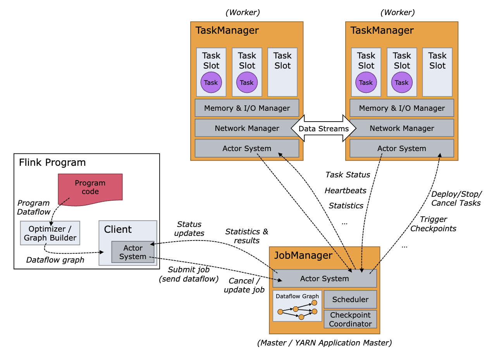
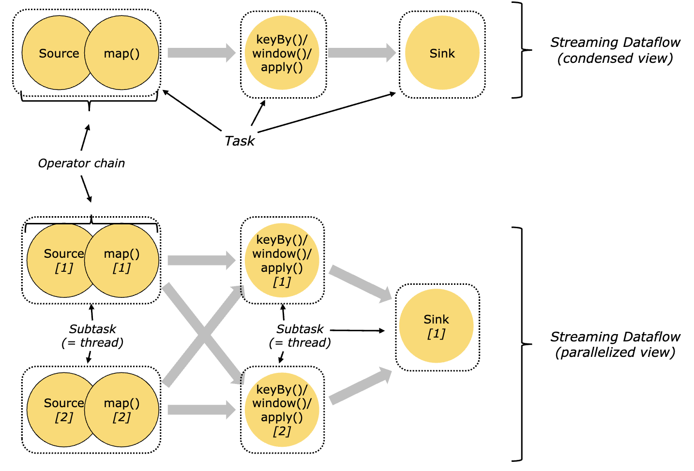
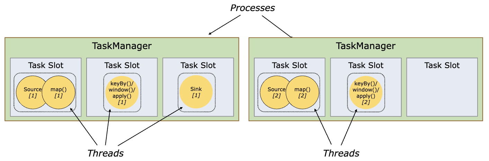
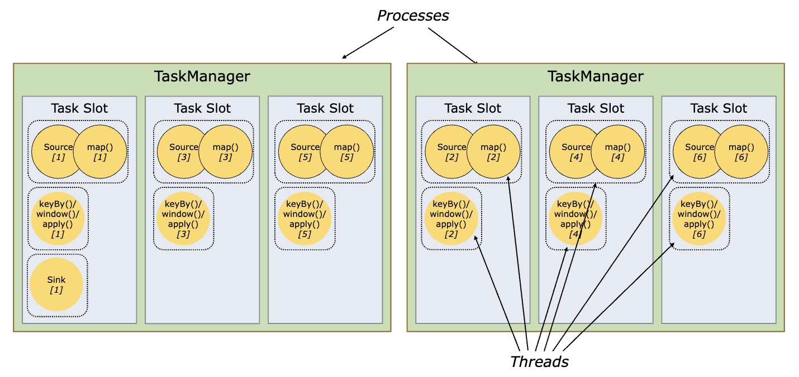
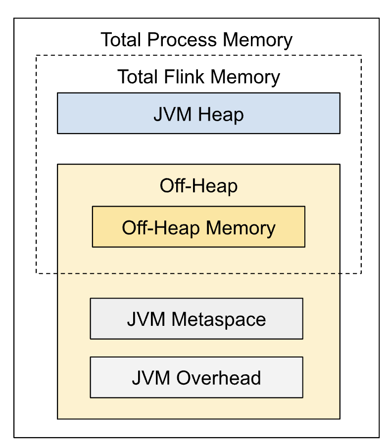
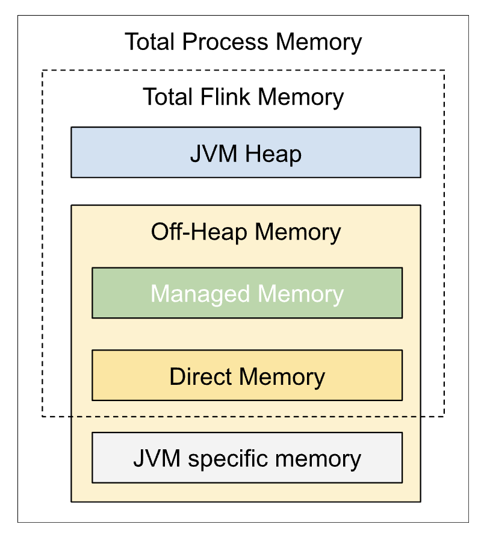
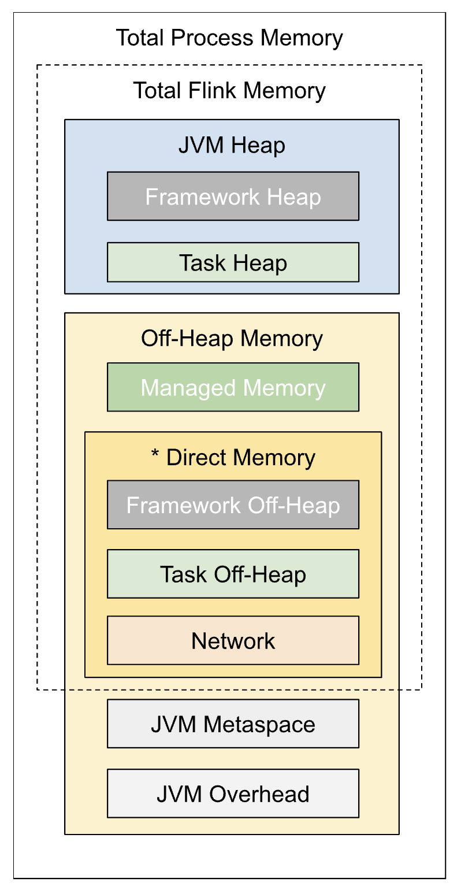
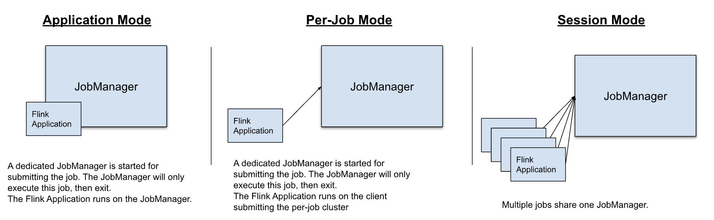
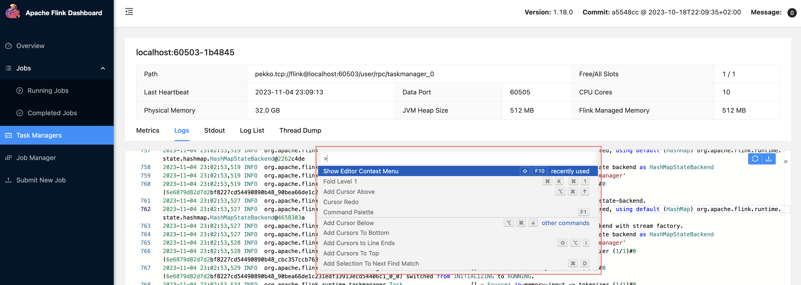

- [Abstract](#abstract)
- [Materials](#materials)
- [Basic](#basic)
  - [Install](#install)
  - [Flink Architecture](#flink-architecture)
  - [Memory Configurations](#memory-configurations)
    - [Job Manager](#job-manager)
  - [Task Manager](#task-manager)
  - [Deployment Modes](#deployment-modes)
- [Deploy Flink App In Application Mode](#deploy-flink-app-in-application-mode)
  - [Logging](#logging)
  - [Watermars](#watermars)
  - [Message Propagation Methods](#message-propagation-methods)

----

# Abstract

Apache Flink is a framework and distributed processing engine for stateful computations over unbounded and bounded data streams

# Materials

* [스트림 프로세싱의 긴 여정을 위한 이정표 (w. Apache Flink) | medium](https://medium.com/rate-labs/%EC%8A%A4%ED%8A%B8%EB%A6%BC-%ED%94%84%EB%A1%9C%EC%84%B8%EC%8B%B1%EC%9D%98-%EA%B8%B4-%EC%97%AC%EC%A0%95%EC%9D%84-%EC%9C%84%ED%95%9C-%EC%9D%B4%EC%A0%95%ED%91%9C-with-flink-8e3953f97986)
  * Stream framework 의 jardon 을 포함하여 설명
* [Apache Flink Training Excercises | github](https://github.com/apache/flink-training)
* [Stream Processing with Apache Flink: Fundamentals, Implementation, and Operation of Streaming Applications | amazon](https://www.amazon.com/Stream-Processing-Apache-Flink-Implementation-ebook/dp/B07QM3DSB7)
  * [src-java](https://github.com/streaming-with-flink/examples-java)
  * [src-scala](https://github.com/streaming-with-flink/examples-scala)
  * [src-kotlin](https://github.com/rockmkd/flink-examples-kotlin)
* [Demystifying Flink Memory Allocation and tuning - Roshan Naik | youtube](https://www.youtube.com/watch?v=aq1Whga-RJ4)
  * [Flink Memory Tuning Calculator | googledoc](https://docs.google.com/spreadsheets/d/1DMUnHXNdoK1BR9TpTTpqeZvbNqvXGO7PlNmTojtaStU/edit#gid=0)

# Basic

## Install

Download and decompress files

* [flink downloads](https://flink.apache.org/downloads.html)

## Flink Architecture

- [Flink Architecture | flink](https://nightlies.apache.org/flink/flink-docs-master/docs/concepts/flink-architecture/)



The Flink runtime has two main types of processes: **JobManager** and **TaskManager**.

**JobManager** is responsible for coordinating the distributed execution of
Flink applications. Its main tasks include scheduling tasks, reacting to
finished tasks or execution failures, coordinating checkpoints, and coordinating
recovery on failures. The JobManager contains three components:
**ResourceManager** (responsible for resource allocation and provisioning),
**Dispatcher** (providing a REST interface to submit Flink applications and
starting a new JobMaster for each submitted job), and **JobMaster** (responsible
for managing the execution of a single JobGraph).

**TaskManager**, also known as workers, is responsible for executing the tasks
of a dataflow and buffering and exchanging data streams. There must be at least
one TaskManager, and it consists of task slots, which are the smallest unit of
scheduling for a TaskManager. Task slots indicate the number of concurrent
processing tasks that can be executed, and multiple operators may be executed
within a single task slot.

In Flink, tasks are formed by **chaining** together operator subtasks for
distributed execution. This chaining process is an optimization technique aimed
at reducing the overhead caused by thread-to-thread handover and buffering,
resulting in increased overall throughput and decreased latency. 
**Each task is executed by a single thread.**

one **task** is executed by one thread. Each **task** comprises one or more
**chained operator subtasks**, and these **subtasks** are executed within the
same thread to improve efficiency and reduce overheads associated with
thread-to-thread handover and buffering.

**Chaining operators** into tasks makes the execution process more efficient, but it
can be configured based on specific needs, as described in the 
[chaining documentation](https://nightlies.apache.org/flink/flink-docs-release-1.18/docs/dev/datastream/operators/overview/#task-chaining-and-resource-groups).



a **task slot** in Flink can hold **multiple tasks**, which means it can
effectively manage **multiple threads**. Each TaskManager has a defined number
of task slots, and each slot represents a fixed subset of the TaskManager's
resources. By allocating different tasks to the same task slot, these tasks (and
their corresponding threads) can share resources, such as managed memory, TCP
connections (via multiplexing), and heartbeat messages. As a result, a single
task slot can support the execution of multiple tasks with multiple threads.



Including many tasks in one task slot offers several advantages:

- **Resource Utilization**: Combining multiple tasks within a single task slot
  allows for better resource utilization. Shared resources, such as 
  **managed memory**, **TCP connections** (via multiplexing), and 
  **heartbeat messages**, are used more efficiently, leading to overall 
  increased productivity and reduced overhead.
- **Optimization**: By chaining multiple tasks together into a single task slot,
  Flink reduces the overhead associated with thread-to-thread handovers and
  buffering, which in turn increases overall throughput and decreases latency.
- **Simplified Cluster Management**: Allowing slot sharing means that a Flink
  cluster needs exactly as many task slots as the highest parallelism used in
  the job. This simplifies cluster management, eliminating the need to calculate
  the total number of tasks (with varying parallelism) in a program.
- **Flexibility**: By adjusting the number of task slots and the distribution of
  tasks within them, users can control the degree of isolation between subtasks,
  maximizing efficiency based on specific workload requirements.
- **Scalability**: Including many tasks in a single task slot enables greater
  parallelism, making it easier to handle complex pipelines without compromising
  resource distribution or creating bottlenecks in computation.

In summary, including multiple tasks in a single task slot enables more
efficient resource utilization, improved performance, easier management of Flink
clusters, flexibility in workload distribution, and better scalability.



## Memory Configurations

- [Set up Flink’s Process Memory | flink](https://nightlies.apache.org/flink/flink-docs-release-1.18/docs/deployment/memory/mem_setup/)

### Job Manager



**Off-heap memory** refers to the memory that is allocated outside the JVM heap
space and is managed directly by Flink using native memory management libraries.
It is used for various purposes such as managing buffers for network
communication, managing memory for state backends, and other internal data
structures. Off-heap memory is not subject to Java's garbage collection, which
means it can provide more predictable latency and performance behavior compared
to on-heap memory. In the context of Apache Flink, the total Flink memory
consumption includes usage of both JVM heap and off-heap memory.

**Metaspace** is a non-heap memory pool introduced in Java 8 for class metadata
storage. It replaced the "Permanent Generation" (PermGen) space that was used in
earlier Java versions. **Metaspace** is allocated outside the Java heap and can
resize dynamically. It stores metadata like class definitions, method data, and
other constant pool information. When the metaspace runs out of memory, the JVM
triggers a Full GC, or garbage collection, to free up space by removing unused
classes and classloader data.

**JVM Overhead** is the additional memory that the JVM needs to operate but is
not directly attributable to Flink's application data or Flink components. This
overhead includes the JVM code cache, the memory used by the Just-In-Time (JIT)
compiler, and other miscellaneous JVM overheads. It is important to allocate
enough JVM overhead memory to ensure the smooth operation of the JVM and Flink
application. By default, the JVM overhead is a fraction of the total memory of
the Flink process, with a minimum and maximum value.

## Task Manager



**Direct memory** refers to the memory in the Java Virtual Machine (JVM) that is
allocated outside the Java heap, also known as off-heap memory. In Flink's
memory model, direct memory plays a significant role in managing components such
as network memory, framework off-heap memory, and task off-heap memory.

The advantage of using **direct memory** is that it can be accessed without going through the Java garbage collector, which can lead to improved performance as data in direct memory isn't subject to garbage collection pauses. However, developers should be cautious when using direct memory since it could lead to memory leaks or OutOfMemoryError situations if not managed properly. In Flink, the direct memory limit of the JVM is typically configured using the JVM parameters provided during the setup.



The **framework heap memory** is a component of Flink's memory model that is
dedicated to the Flink framework's internal data structures and operations. It
is a part of the JVM Heap memory and is configured using the option
`taskmanager.memory.framework.heap.size`. Generally, you should not change the
**framework heap memory** without a good reason, as it should only be adjusted
if you are sure that Flink needs more memory for certain internal processes or
in specific deployment scenarios with high parallelism.

**Task Heap Memory** is a part of the JVM Heap memory dedicated to running
Flink's application, including operators and user code. It is configured using
the option `taskmanager.memory.task.heap.size`.

**Managed Memory** is native memory (off-heap) managed by Flink and used for
workloads such as RocksDB state backend in streaming jobs, sorting, hash tables,
and caching of intermediate results in both streaming and batch jobs. It is
configured using the options `taskmanager.memory.managed.size` and
`taskmanager.memory.managed.fraction`.

**Framework Off-heap Memory** is off-heap direct (or native) memory dedicated to
the Flink framework for internal data structures or operations. It is an
advanced option and configured using the option
`taskmanager.memory.framework.off-heap.size`.

**Task Off-heap Memory** is off-heap direct (or native) memory dedicated to
running Flink's application, including operators. It is configured using the
option `taskmanager.memory.task.off-heap.size`.

**Network Memory** is direct memory reserved for data record exchange between
tasks, such as buffering data for transfer over the network. It is a capped
fractionated component of the total Flink memory and is used for allocating
network buffers. It is configured using the options
`taskmanager.memory.network.min`, `taskmanager.memory.network.max`, and
`taskmanager.memory.network.fraction`.

## Deployment Modes

Flink execute applications in one of three ways.

- in Application Mode,
- in Session Mode,
- in a Per-Job Mode (deprecated wince flink 1.15).



# Deploy Flink App In Application Mode

- [Application Mode Deployment | flink](https://nightlies.apache.org/flink/flink-docs-master/docs/deployment/resource-providers/standalone/overview/#application-mode)
----

- Download flink binary from [download page](https://flink.apache.org/downloads/)

```bash
# Copy application jar
$ cp ./examples/streaming/TopSpeedWindowing.jar lib/

# Run Job Manager
$ ./bin/standalone-job.sh start --job-classname org.apache.flink.streaming.examples.windowing.TopSpeedWindowing

# Run Task Manager
$ ./bin/taskmanager.sh start
# Open browser localhost:8081

# Stop all
$ ./bin/taskmanager.sh stop
$ ./bin/standalone-job.sh stop
```

## Logging

- [Deployment - Advanced - Logging | flink](https://nightlies.apache.org/flink/flink-docs-master/docs/deployment/advanced/logging/)

```bash
$ cd ~/flink-1.18.0/log/
```

`F1` shows command palette in Flink Web UI Logs.



## Watermars

- [이벤트 시간 처리(Event Time Processing)와 워터마크(Watermark) | tistory](https://seamless.tistory.com/99)

**Watermarks** in Flink are used for determining event time progression and handling
out-of-order events in a data stream. They are essentially a timestamp that
moves monotonically in the event time dimension, allowing Flink to determine
when it has received all events up to a certain point in time. This helps Flink
decide when to trigger time-based window computations or when to discard late
events.

```java
import org.apache.flink.api.common.eventtime.*;
import org.apache.flink.api.java.tuple.Tuple2;
import org.apache.flink.streaming.api.TimeCharacteristic;
import org.apache.flink.streaming.api.datastream.DataStream;
import org.apache.flink.streaming.api.environment.StreamExecutionEnvironment;
import org.apache.flink.streaming.api.functions.timestamps.BoundedOutOfOrdernessTimestampExtractor;
import org.apache.flink.streaming.api.windowing.assigners.TumblingEventTimeWindows;
import org.apache.flink.streaming.api.windowing.time.Time;

public class FlinkWatermarkExample {

    public static void main(String[] args) throws Exception {
        StreamExecutionEnvironment env = StreamExecutionEnvironment.getExecutionEnvironment();

        // Set the time characteristic to event time
        env.setStreamTimeCharacteristic(TimeCharacteristic.EventTime);

        // Create a simple data stream of Tuple2<Long, Integer> to emulate (timestamp, value)
        DataStream<Tuple2<Long, Integer>> inputStream = env.fromElements(
                Tuple2.of(1000L, 1),
                Tuple2.of(1500L, 2),
                Tuple2.of(2900L, 3),
                Tuple2.of(3500L, 4),
                Tuple2.of(7500L, 5)
        );

        // Assign timestamps and generate watermarks
        DataStream<Tuple2<Long, Integer>> timestampedStream = inputStream.assignTimestampsAndWatermarks(
                new BoundedOutOfOrdernessTimestampExtractor<Tuple2<Long, Integer>>(Time.milliseconds(500)) {
                    @Override
                    public long extractTimestamp(Tuple2<Long, Integer> element) {
                        return element.f0;
                    }
                });

        // Define a tumbling event time window of length 2 seconds
        DataStream<Tuple2<Long, Integer>> windowedStream = timestampedStream
                .keyBy(e -> 1)
                .window(TumblingEventTimeWindows.of(Time.seconds(2)))
                .sum(1);

        // Print the windowed stream results
        windowedStream.print();

        // Start execution of the data processing
        env.execute("Flink Watermark Example");
    }
}
```

In this example, we have a simple data stream of `Tuple2 (timestamp, value)` to
emulate a stream with timestamps. We set the time characteristic to event time
using `env.setStreamTimeCharacteristic()`.

We then assign timestamps and generate watermarks using a
`BoundedOutOfOrdernessTimestampExtractor`. This extractor allows events to be
out of order up to a certain bound (in this case, 500 milliseconds). The
`extractTimestamp()` method returns the timestamp component of our input
`Tuple2`.

Next, we define a tumbling event time window of length 2 seconds using
`TumblingEventTimeWindows.of(Time.seconds(2))`. The window will sum the values of
input events received within each 2-second window.

Finally, we print the results of the windowed stream and start the execution
using `env.execute()`. This example demonstrates how to use watermarks in Flink
to handle out-of-order events in an event-time based streaming scenario using
Java APIs.

## Message Propagation Methods

- [Data Exchange inside Apache Flink](https://flink.apache.org/2020/03/24/advanced-flink-application-patterns-vol.2-dynamic-updates-of-application-logic/#data-exchange-inside-apache-flink)

Inside Apache Flink, message propagation methods include `FORWARD`, `HASH`, `REBALANCE`, `BROADCAST`.

```java
import org.apache.flink.api.common.functions.MapFunction;
import org.apache.flink.api.common.state.BroadcastState;
import org.apache.flink.api.common.state.MapStateDescriptor;
import org.apache.flink.api.common.typeinfo.BasicTypeInfo;
import org.apache.flink.api.common.typeinfo.TypeInformation;
import org.apache.flink.api.java.tuple.Tuple2;
import org.apache.flink.streaming.api.datastream.BroadcastStream;
import org.apache.flink.streaming.api.datastream.DataStream;
import org.apache.flink.streaming.api.environment.StreamExecutionEnvironment;
import org.apache.flink.streaming.api.functions.co.BroadcastProcessFunction;

public class FlinkDataExchangePatternsExample {

    public static void main(String[] args) throws Exception {
        StreamExecutionEnvironment env = StreamExecutionEnvironment.getExecutionEnvironment();

        // Create a simple data stream of Integer values
        DataStream<Integer> integerStream = env.fromElements(1, 2, 3, 4, 5, 6);

        // FORWARD data exchange
        DataStream<Integer> forwardStream = integerStream.map(new MapFunction<Integer, Integer>() {
            @Override
            public Integer map(Integer value) throws Exception {
                return value * 2;
            }
        });

        // HASH data exchange
        DataStream<Tuple2<Integer, Integer>> keyedStream = integerStream
                .map(i -> Tuple2.of(i, i % 2)).keyBy(1).name("hash-data-exchange");

        // REBALANCE data exchange
        DataStream<Integer> rebalanceStream = integerStream.rebalance().map(new MapFunction<Integer, Integer>() {
            @Override
            public Integer map(Integer value) throws Exception {
                return value * 3;
            }
        }).name("rebalance-data-exchange");

        // Create a simple data stream of String values for broadcasting
        DataStream<String> broadcastStringStream = env.fromElements("A", "B", "C");

        // Create a descriptor for the broadcast state
        MapStateDescriptor<Void, String> descriptor = new MapStateDescriptor<>(
                "BroadcastState",
                TypeInformation.of(Void.class),
                BasicTypeInfo.STRING_TYPE_INFO);

        // Create a broadcast stream with the string values and descriptor
        BroadcastStream<String> broadcastStream = broadcastStringStream.broadcast(descriptor);

        // BROADCAST data exchange
        DataStream<String> broadcastResultStream = integerStream.connect(broadcastStream)
                .process(new BroadcastProcessFunction<Integer, String, String>() {

                    // Main data processing logic for unicast elements (integer stream)
                    @Override
                    public void processElement(Integer value, ReadOnlyContext ctx, Collector<String> out) throws Exception {
                        // Just emit the original integer as a string
                        out.collect(String.valueOf(value));
                    }

                    // Broadcast data processing logic for broadcast elements (string stream)
                    @Override
                    public void processBroadcastElement(String value, Context ctx, Collector<String> out) throws Exception {
                        // Retrieve the broadcast state handle
                        BroadcastState<Void, String> broadcastState = ctx.getBroadcastState(descriptor);

                        // Update the broadcast state with the new string value
                        broadcastState.put(null, value);

                        // Emit the updated broadcast value
                        out.collect("Broadcasted: " + value);
                    }
                }).name("broadcast-data-exchange");

        forwardStream.print("Forward:");
        keyedStream.print("Keyed (Hash):");
        rebalanceStream.print("Rebalance:");
        broadcastResultStream.print("Broadcast:");

        // Start execution of the data processing
        env.execute("Flink Data Exchange Patterns Example");
    }
}
```

In this example, we first create a simple data stream of integer values and
apply different data exchange patterns:

- **FORWARD**: The `map()` function doubles the input value, and the output is
  directly sent to the next operator.
- **HASH**: We create a `keyBy()` function that assigns a key based on the integer
  value's remainder when divided by 2. This distributes the data based on the
  hash of the key.
- **REBALANCE**: We call the `rebalance()` function before the `map()` function,
  which ensures a round-robin data distribution to the next operator that
  triples the input value.
- **BROADCAST**: We create an additional `broadcastStringStream`, create a
  `MapStateDescriptor` for the broadcast state, and create a `BroadcastStream`
  using the `broadcast()` function. We connect the `integerStream` with the
  `broadcastStream` and process their elements using a
  `BroadcastProcessFunction`.

Finally, we start the execution by calling `env.execute()`. This code demonstrates
how different data exchange patterns are achieved in Apache Flink using Java
APIs.
