- [Materials](#materials)
- [Build on IntelliJ](#build-on-intellij)
- [Remote JVM Debugging](#remote-jvm-debugging)
- [Job Manager REST API Handlers](#job-manager-rest-api-handlers)
- [Task Manager Task Handlers](#task-manager-task-handlers)

---

# Materials

- [flink | github](https://github.com/apache/flink)

# Build on IntelliJ

- JDK 8
- scala 2.12.17

**Install Scala Plugin**

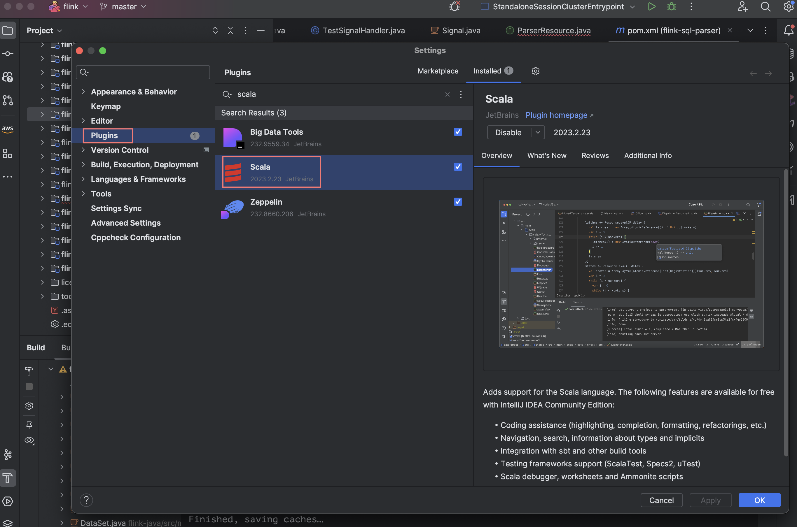

**Setup JDK 8**

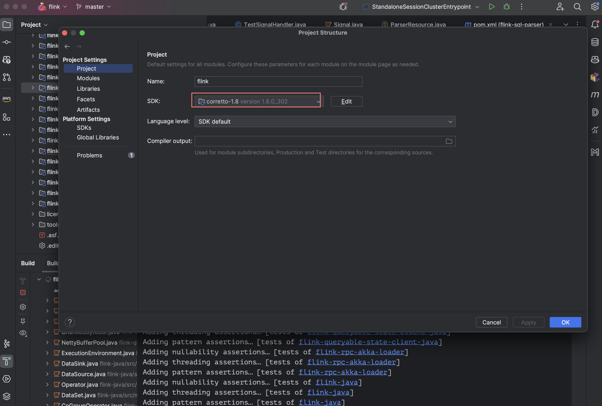

**Setup Scala SDK**

Open Module Settings...

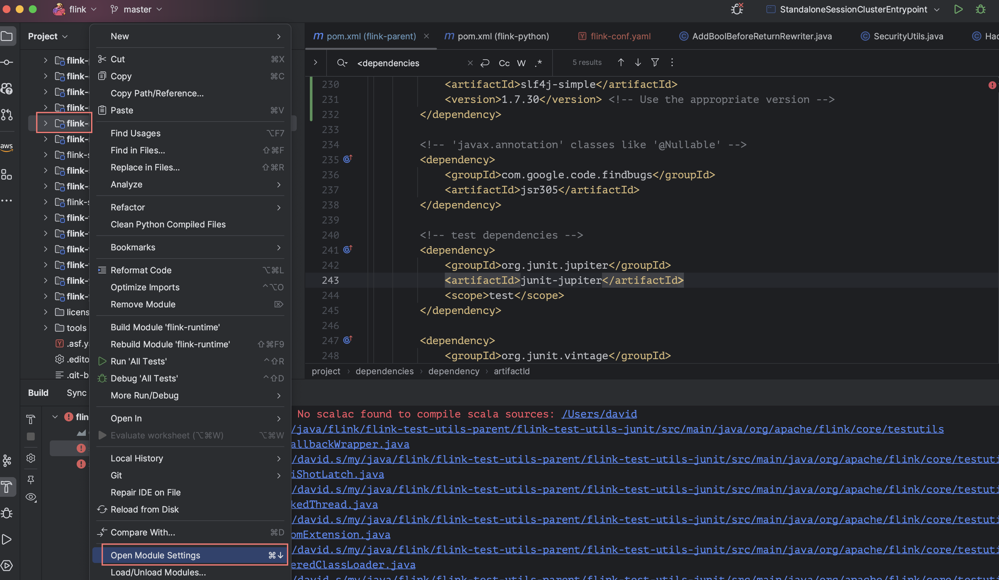

Platform Settings / Global Libraries

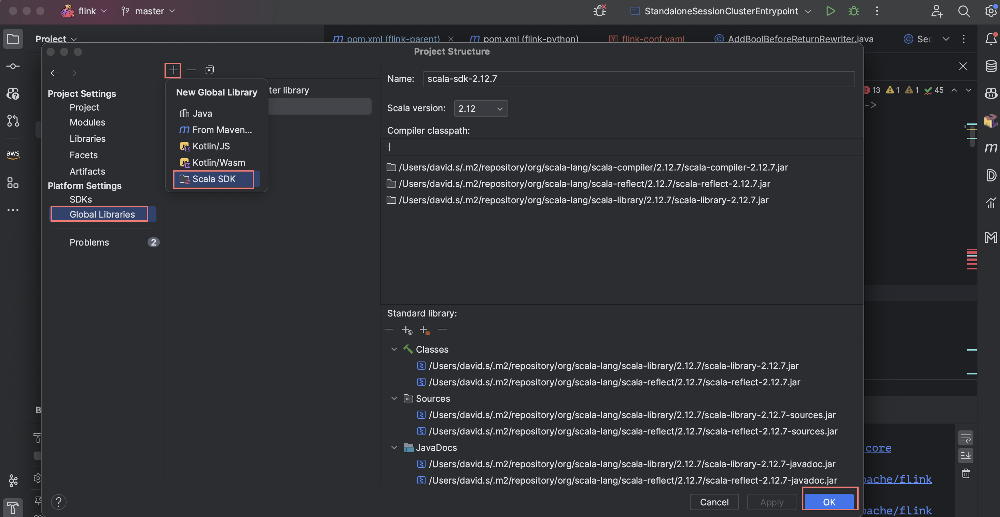

Project Settings / Libraries

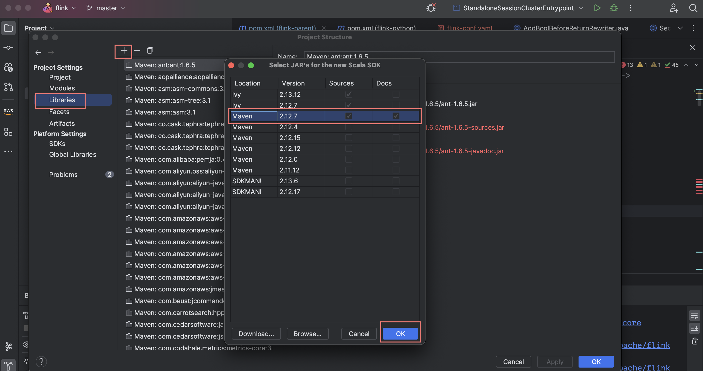

Select All Modules

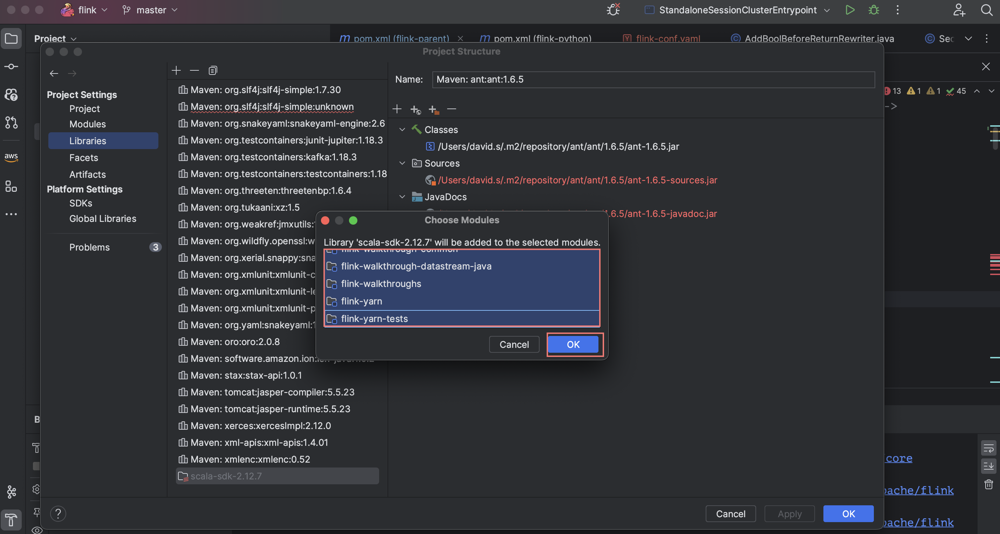

**Build flink-runtime**

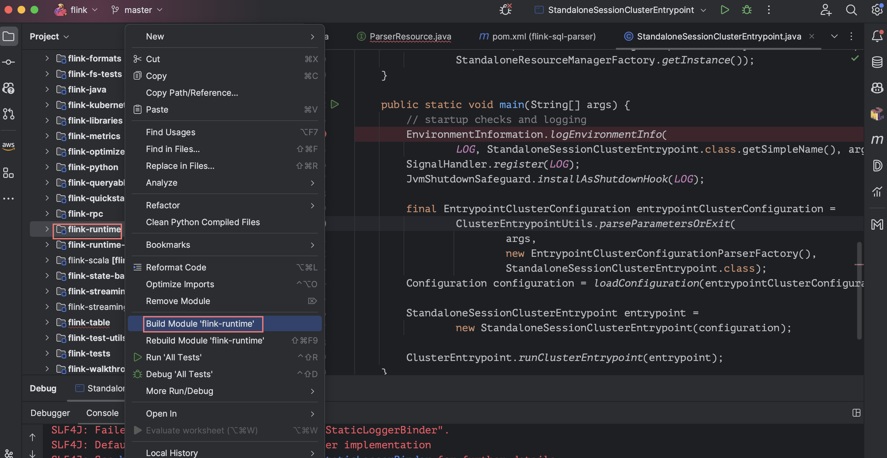

**Run JobManager**

- [Application Mode Deployment | flink](https://nightlies.apache.org/flink/flink-docs-master/docs/deployment/resource-providers/standalone/overview/#application-mode)

- To run the Flink JobManager, you need to create a run configuration in IntelliJ:
- Go to Run > Edit Configurations.
- Click the + button to add a new configuration.
- Select Application.
- Set a name for the run configuration.
- In the Main class field, enter the following:
- `org.apache.flink.runtime.entrypoint.StandaloneSessionClusterEntrypoint`
  - 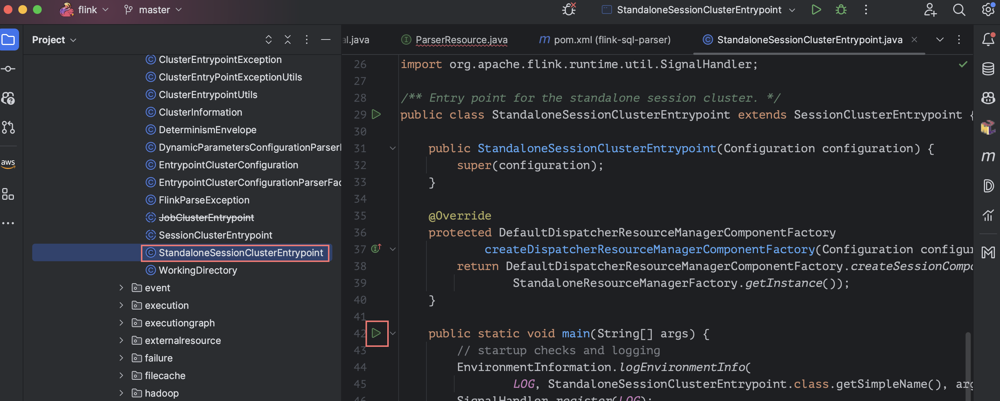
  - 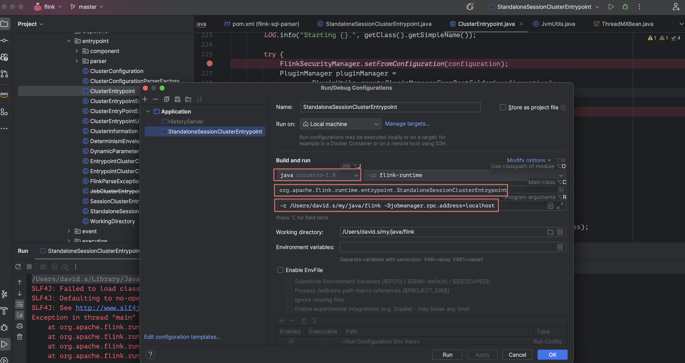

- In the Program arguments field, provide the required arguments, for example:

```
-c /path/to/your/flink/conf/directory -Djobmanager.rpc.address=localhost
```

Make sure to replace `/path/to/your/flink/conf/`directory with the actual path to the Flink configuration directory you want to use.

Set the appropriate module in the Use classpath of module field.

Click OK to save the run configuration.

Now you can run the Flink JobManager by selecting the new configuration and clicking the Run button.

**Trouble Shooting**

- slf4j issue
  - 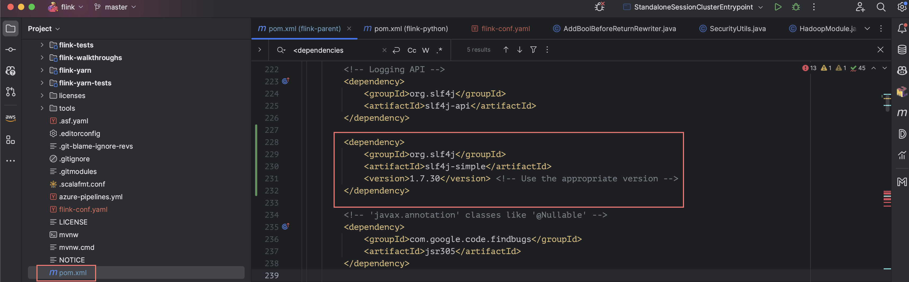

# Remote JVM Debugging

It's difficult to debug Flink JobManager on IntelliJ. but It's easy to debug
remotely Flink JobManager on IntelliJ using downloaded Flink 1.18.

**Download Flink-1.18 and decompress it**

Download flink binary from [download page](https://flink.apache.org/downloads/)

**Clone Flink repo and reset flink-1.18 tag**

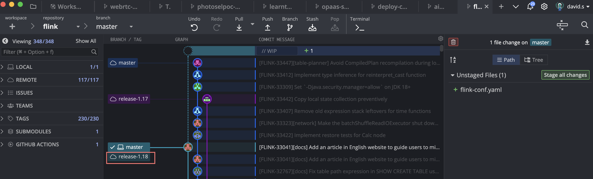

**Add to Edit Configurations**

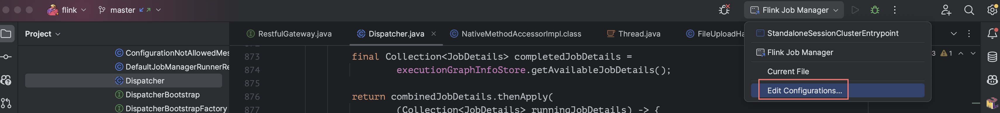

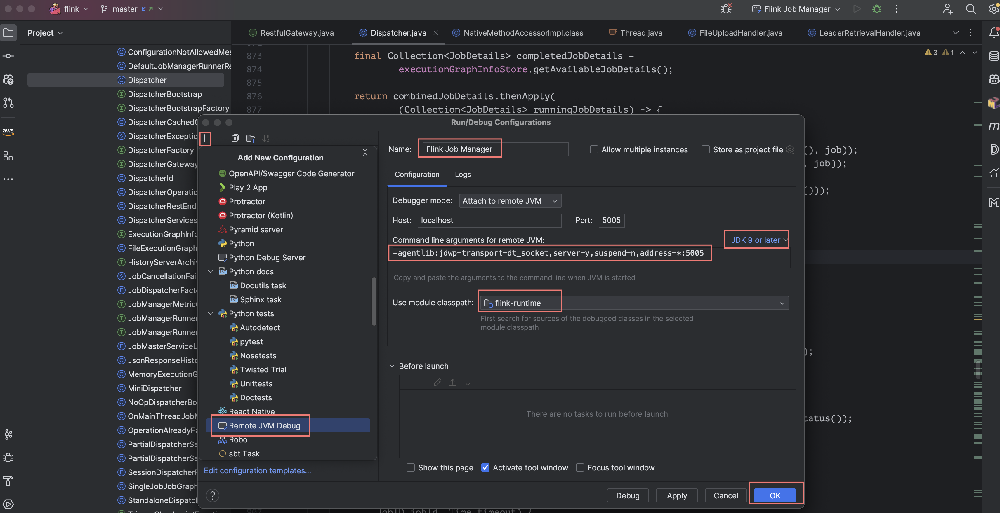

**Fix JVM Pamaters of Flink**

Add JVM Parameter
`-agentlib:jdwp=transport=dt_socket,server=y,suspend=n,address=*:5005"` on
`~/flink-1.18/bin/jobmanager.sh`.

```bash
# AsIs
ENTRYPOINT=standalonesession

if [[ $STARTSTOP == "start" ]] || [[ $STARTSTOP == "start-foreground" ]]; then
    # Add JobManager-specific JVM options
    export FLINK_ENV_JAVA_OPTS="${FLINK_ENV_JAVA_OPTS} ${FLINK_ENV_JAVA_OPTS_JM}"
    parseJmArgsAndExportLogs "${args[@]}"


# ToBe
ENTRYPOINT=standalonesession

if [[ $STARTSTOP == "start" ]] || [[ $STARTSTOP == "start-foreground" ]]; then
    # Add JobManager-specific JVM options
    export FLINK_ENV_JAVA_OPTS="${FLINK_ENV_JAVA_OPTS} ${FLINK_ENV_JAVA_OPTS_JM} -agentlib:jdwp=transport=dt_socket,server=y,suspend=n,address=*:5005"
    parseJmArgsAndExportLogs "${args[@]}"
```

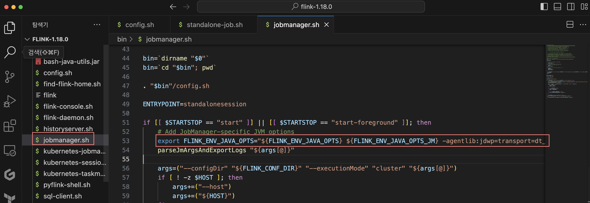

**Run Flink-1.18 JobManager**

```bash
# Run Job Manager
$ ./bin/standalone-job.sh start --job-classname org.apache.flink.streaming.examples.windowing.TopSpeedWindowing
```

**Set BreakPoints**

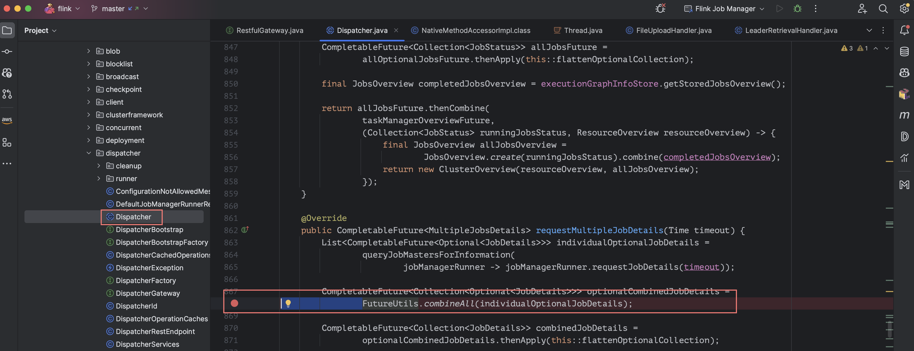

**Attach IntelliJ Debugger to Flink-1.18 JobManager**

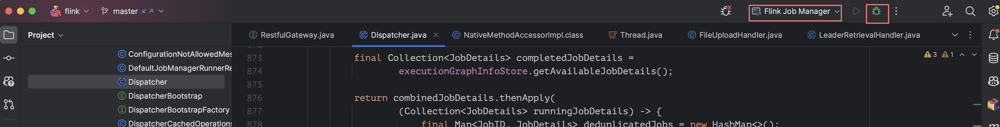

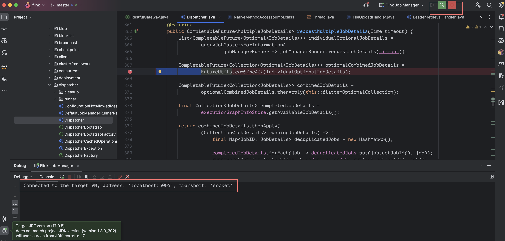

**Open the browser**

Open http://localhost:8081/#/job/running

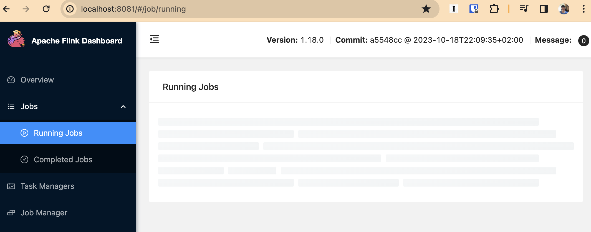

**Have some fun**

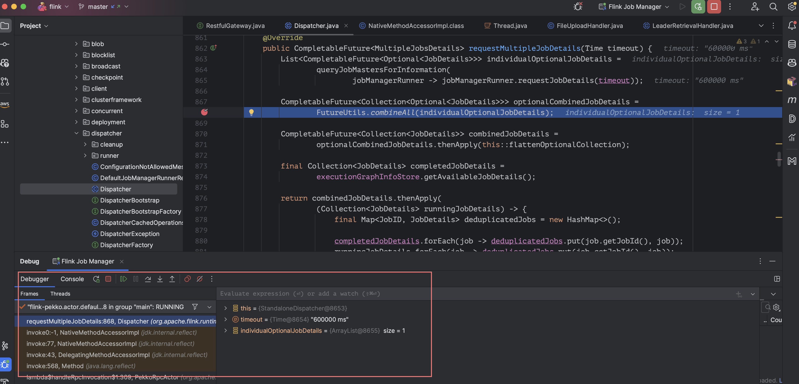

# Job Manager REST API Handlers

- [REST API | flink](https://nightlies.apache.org/flink/flink-docs-master/docs/ops/rest_api/)

The core class is `org.apache.flink.runtime.webmonitor.WebMonitorEndpoint`.

# Task Manager Task Handlers

WIP...
