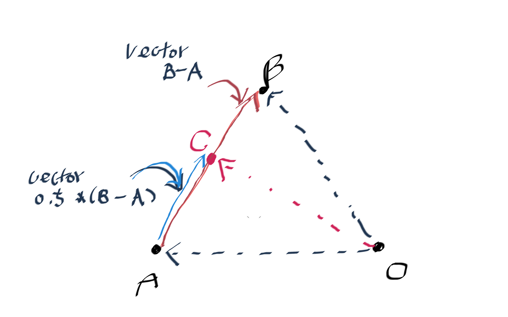

# Abstract

- game graphics 에 대해 이론 위주로 정리한다. learning material에 기재된 순서대로 공부한다.

# Contents

* [Math Prerequisites](#math-prerequisites)
* [Rendering Pipeline](#rendering-pipeline)

# Learning material

- [Ke-Sen Huang's Home Page](http://kesen.realtimerendering.com/)
  - 컴퓨터그래픽스 컨퍼런스 자료 및 논문 모음
- [awesome graphics @ github](https://github.com/ericjang/awesome-graphics)
  - 컴퓨터그래픽스 논문등등 모음
- [3차원 그래픽스(게임 프로그래밍을위한)](http://www.hongpub.co.kr/sub.php?goPage=view_product&Code=20110808092547)
  - 그래픽스 API 및 쉐이더 프로그래밍 경험을 가지고 있지만 3차원
    그래픽스에 대한 이론적인 기초가 부족한 게임 개발자 역시 이 책의
    주요 독자층이 될 것이다.
- [digital lighting & rendering: third edition](http://www.3drender.com/light/)
  - 3D 라이팅과 렌더링 기법의 표준을 제시한 바이블을 만난다! 
- [opengl at songho](http://www.songho.ca/opengl/)
  - computer graphics의 이론들이 잘 정리되어 있다.
  - 특히 [OpenGL Normal Vector Transformation](http://www.songho.ca/opengl/gl_normaltransform.html)의 설명이 너무 좋았다.
- [Mathematics for 3D Game Programming and Computer Graphics, Third Edition](http://www.mathfor3dgameprogramming.com/)
  - 3D computer graphics를 위한 수학
- [interactive 3D Graphics](https://classroom.udacity.com/courses/cs291)
  - computer graphics의 기반이론을 three.js와 함께 설명한 동영상 강좌. 자세한 설명은 [Real-Time Rendering](https://www.amazon.com/Real-Time-Rendering-Third-Edition-Akenine-Moller/dp/1568814240)으로 만족하자.
  - [syllabus](https://www.udacity.com/wiki/cs291/syllabus)
  - [comments](https://www.udacity.com/wiki/cs291/instructor-comments)
  - [wiki](https://www.udacity.com/wiki/cs291)
  - [three.js tutorial](http://stemkoski.github.io/Three.js/)
- [nvidia cg tutorial](http://http.developer.nvidia.com/CgTutorial/cg_tutorial_chapter01.html)
  - 예전에 공짜였지만 지금은 아니다. 기반 설명이 충실히 기술되어 있다.
- [Introduction to 3D Game Programming with Direct3D](http://www.d3dcoder.net/d3d12.htm)
  - frank luna의 명저
  - [src](https://github.com/d3dcoder/d3d12book)
- [OpenGL Programming Guide: The Official Guide to Learning OpenGL, Version 4.3 ]()
  - opengl red book
  - [src](https://github.com/openglredbook/examples)
- [OpenGL Superbible: Comprehensive Tutorial and Reference]()
  - opengl blue book
  - [src](https://github.com/openglsuperbible/sb7code)
- [Real-Time Rendering](https://www.amazon.com/Real-Time-Rendering-Third-Edition-Akenine-Moller/dp/1568814240)
  - 기반이론이 1000페이지 넘게 잘 정리된 책이다.
- [unity3d manual](https://docs.unity3d.com/Manual/index.html) [unity3d tutorial](https://unity3d.com/kr/learn/tutorials)
  - unity3d manual과 tutorial이야 말로 잘 만들어진 엔진을 이용하여 computer graphcis로 입문
    할 수 있는 좋은 교재이다. unity3d에서 제공하는 기능들을 위주로 학습한다.
- [unrealengine manual](https://docs.unrealengine.com/latest/KOR/index.html)
  - unrealengine manual역시 잘 만들어진 엔진을 이용하여 computer graphcis로 입문 할 수 있는
    좋은 교재이다.
- [GPG gems](http://www.satori.org/game-programming-gems/)
  - Game Programming Gems, 줄여서 GPG는 Nintendo of America의 수석 소프트웨어 엔지니어인 
    Mark Deloura가 시작한 게임 프로그래밍 서적 시리즈이다. 업계와 학계의 여러 저자들이 쓴 글들을 
    모은 일종의 앤솔로지 형태이다.
- [GPU gems](https://developer.nvidia.com/gpugems/GPUGems/gpugems_pref01.html)
  - nvidia 에서 발간하는 graphics 책
- [GPU pro](https://www.amazon.com/gp/product/149874253X?tag=realtimerenderin&pldnSite=1)
  - advand rendering technique
  - [src](https://github.com/wolfgangfengel/GPU-Pro-7)
- [GPU Zen](https://www.amazon.com/gp/product/B0711SD1DW?tag=realtimerenderin&pldnSite=1)
  - GPU pro의 후속작이다.
  - [src](https://github.com/wolfgangfengel/GPUZen)
- [ShaderX7](https://www.amazon.com/ShaderX7-Rendering-Techniques-Wolfgang-Engel/dp/1584505982)
- [Physically Based Rendering](https://www.amazon.com/Physically-Based-Rendering-Second-Implementation/dp/0123750792)
- [realtimerendering graphics books page](http://www.realtimerendering.com/books.html)
  - 아주 많은 책들이 정리되어 있다. 언제 다 보지?
- [modern opengl tutorial](http://ogldev.atspace.co.uk/)
  - 40여개의 튜토리얼이 단계별로 잘 설명되어 있다.
  - [src](http://ogldev.atspace.co.uk/ogldev-source.zip)
- [learn opengl](https://learnopengl.com/)
  - [src](https://github.com/JoeyDeVries/LearnOpenGL)
  - opengl 튜토리얼중 최고
- [banshee engine](https://github.com/BearishSun/BansheeEngine)
  - c++14로 제작되고 있는 game engine
  - 이제 시작된 것 같아서 참고해 본다.
- [game engine development at youtube](https://www.youtube.com/playlist?list=PLRwVmtr-pp04XomGtm-abzb-2M1xszjFx)
  - visual studio를 이용한 게임 엔진 개발
- [unrealengine 4 src](https://github.com/EpicGames/UnrealEngine)
  - opensource engine중 최고
- [scratchapixel 2.0](http://www.scratchapixel.com/)
  - computer graphics를 알기쉽게 설명한다.
- [intel developer zone game dev code samples](https://software.intel.com/en-us/gamedev/code-samples)
- [amd developer central tools & sdks](http://developer.amd.com/tools-and-sdks/graphics-development/)
- [nvidia gameworks](https://developer.nvidia.com/what-is-gameworks)
  - vulkan, opengl, directx sample
- [microsoft directx graphics samples](https://github.com/Microsoft/DirectX-Graphics-Samples)
  - 뭐지 이건

# math prerequisites

- affine transform

world transform, view transform은 scaling, rotation, translation등과
같이 기본적인 변환들을 조합하여 만들어진다. 한편 scaling, rotation은
linear transform(선형변환) 의 범주에 속한다. translation(이동)은
linear transform에 속하지 않는다. 대신 linear transform과 함께 affine
transform의 범주를 형성한다.

- affine space

vector space에서는 vector가 어디에 위치해 있던지 크기와 방향만 같다면
같은 vector로 생각한다. vector space에서 크기와 방향은 같지만 위치가
다른 vector를 구분할 필요가 있다. 그래서 affine space를 만들어냈다.
affine space에서는 position을 추가하여 vector의 위치를 표현한다.

- affince space operation

vector와 vector의 +, - 는 vector이다. scala와 vector의 *, /는
vector이다. vector와 point의 +, -는 point이다. point와 point의
-는 vector이다. point와 point의 +는 허용되지 않는다. (단 계수의 합이
1인 경우는 허용된다.)



affine space에서 point A는 point O에서 point A로 가는 vector로 
생각 할 수 있다. 따라서 C = A + 0.5 * (B - A) 이다.
point A와 vector B - A의 합은 point임을 알 수 있다.

이때 0.5대신 k를 도입하여 다음과 같이 표기할 수 있다.
C = A + k(B - A) (0 <= k <= 1)
C = (1 - k)A + kB

k가 1이면 C = B이고 k 가 0이면 C = A이다. 이처럼 계수의 합이 1인 경우는
point와 point의 덧셈 연산이 가능하고 이런 경우를 affine sum이라고 한다.

- homogeneous coordinates (동차좌표)

vector와 point를 구분하기 위해 n-tuple에 하나의 차원을 증가시킨
좌표체계이다.  예를 들어서 v = (v1, v2)가 있다고 하자. v의 homogeneous
coordinates v' = (v1, v2, p)이고 p가 0이면 vector를 p가 0이 아니면
point를 의미한다.  따라서 다음과 같은 position들은 모두 같다.  (5, 1,
1) = (10, 2, 2) = (15, 3, 3) = (20, 4, 4)

- tangent space

특정한 point의 normal, tangent, binormal
vector를 축으로 하는 공간이다. normal mapping을 위해
vertex의 normal값을 기준으로 tangent space를 표현하는 TBN
행렬을 구할 수 있고 normal map에 저장된 단위 tangent space normal
vector와 연산하여 최종 normal vector를 구할 수 있다.

# [Rendering Pipeline](../renderingpipeline/README.md)

# Transformation

model point는 다음을 통해 window coordinate까지 진행된다. 

```
world-space point = model matrix * model point
view-space point = view matrix * world point
w-divide for NDC <= clip coords = projection matrix * view point
window coords = windows(screen) matrix * NDC
```

[이것](http://www.realtimerendering.com/udacity/transforms.html)은 object space
cartesian coordinate 이 (4,5,3)인 큐브를 예로 three.js와 함께 설명 했다.
src는 [이곳](https://github.com/erich666/cs291/blob/master/demo/unit7-view-pipeline.js)을 참고하자.

# depth sorting / Z-sorting

# blending

# texture mapping

# displacement mapping

# normal mapping

# basic lighting model

# diffuse reflection

# specular reflection

# ambient reflection

# hemispherical lighting model

# image based lighting

# irradiance environment map

# image based reflection

# image based refaction

- snell's law

# image based fresnel

# shadow mapping

# BRDF

# Collision Detection

# [PBR (physically based rendering)](../pbr/README.md)

# Animation
