<!-- markdown-toc start - Don't edit this section. Run M-x markdown-toc-refresh-toc -->
**Table of Contents**

- [Comments](#comments)
- [Materials](#materials)
- [References](#references)
- [Snippets](#snippets)
- [Opensource Engines](#opensource-engines)
- [Math Prerequisites](#math-prerequisites)
- [[Rendering Pipeline](../renderingpipeline/README.md)](#rendering-pipelinerenderingpipelinereadmemd)
- [Polygon Mesh](#polygon-mesh)
- [Vertex Processing](#vertex-processing)
- [Rasterization](#rasterization)
- [Fragment Processing](#fragment-processing)
- [Output Merging](#output-merging)
- [[Lighting](../lighting/README.md)](#lightinglightingreadmemd)
- [Shader Models](#shader-models)
- [Curve](#curve)
- [[Bump Mapping](../bumpmapping/README.md)](#bump-mappingbumpmappingreadmemd)
- [Environment Mapping](#environment-mapping)
- [Light Mapping](#light-mapping)
- [Shadow Mapping](#shadow-mapping)
- [Ambient Occlusion Mapping](#ambient-occlusion-mapping)
- [Deferred Shading](#deferred-shading)
- [Animation](#animation)
- [Collision Detection](#collision-detection)

<!-- markdown-toc end -->

-------------------------------------------------------------------------------

# Comments

radiosity, curve, Environment Mapping, Light Mapping, Shadow Mapping,
Ambient Occlusion Mapping, Deferred Shading, animation, collision
detection

# Materials

- [awesome gamedev](https://github.com/ellisonleao/magictools)
- [awesome graphics resources](https://github.com/mattdesl/graphics-resources)
- [awesome computer vision](https://github.com/jbhuang0604/awesome-computer-vision)
- [awesome opengl](https://github.com/eug/awesome-opengl)
- [directx11 tutorials](http://www.rastertek.com/tutdx11.html)
  - 약 50여 개의 directx11 튜토리얼 
- [game engine development by Jamie King @ youtube](https://www.youtube.com/playlist?list=PLRwVmtr-pp04XomGtm-abzb-2M1xszjFx)
  - visual studio를 이용한 게임 엔진 개발
  - [src](https://github.com/1kingja/game-engine)
- [game engine development by Bennybox](https://www.youtube.com/watch?v=ss3AnSxJ2X8&list=PLEETnX-uPtBXP_B2yupUKlflXBznWIlL5)
  - java를 이용한 게임 엔진 개발
  - [src](https://github.com/BennyQBD/3DGameEngine)
- [GPU how to work](http://pixeljetstream.blogspot.kr/2015/02/life-of-triangle-nvidias-logical.html)
  - GPU가 어떻게 작동하는 가를 렌더링 파이플 라인과 함께 설명함
- [Shadow algorithms for computer graphics](https://dl.acm.org/citation.cfm?id=563901)
  - shadow volume
- [casting curved shadows on curved surfaces](http://citeseerx.ist.psu.edu/viewdoc/download?doi=10.1.1.162.196&rep=rep1&type=pdf)
  - shadow mapping
- [Advanced Global Illumination, Second Edition](https://www.amazon.com/Advanced-Global-Illumination-Second-Philip/dp/1568813074)
- [Physically Based Rendering](http://www.pbrt.org/)
- [Ke-Sen Huang's Home Page](http://kesen.realtimerendering.com/)
  - 컴퓨터그래픽스 컨퍼런스 자료 및 논문 모음
- [awesome graphics @ github](https://github.com/ericjang/awesome-graphics)
  - 컴퓨터그래픽스 논문등등 모음
- [digital lighting & rendering: third edition](http://www.3drender.com/light/)
  - 3D 라이팅과 렌더링 기법의 표준을 제시한 바이블을 만난다! 
- [opengl at songho](http://www.songho.ca/opengl/)
  - computer graphics의 이론들이 잘 정리되어 있다.
  - 특히 [OpenGL Normal Vector Transformation](http://www.songho.ca/opengl/gl_normaltransform.html)의 설명이 너무 좋았다.
- [Mathematics for 3D Game Programming and Computer Graphics, Third Edition](http://www.mathfor3dgameprogramming.com/)
  - 3D computer graphics를 위한 수학
- [nvidia cg tutorial](http://http.developer.nvidia.com/CgTutorial/cg_tutorial_chapter01.html)
  - 예전에 공짜였지만 지금은 아니다. 기반 설명이 충실히 기술되어 있다.
- [OpenGL Programming Guide: The Official Guide to Learning OpenGL, Version 4.3 ]()
  - opengl red book
  - [src](https://github.com/openglredbook/examples)
- [OpenGL Superbible: Comprehensive Tutorial and Reference]()
  - opengl blue book
  - [src](https://github.com/openglsuperbible/sb7code)
- [unity3d manual](https://docs.unity3d.com/Manual/index.html) [unity3d tutorial](https://unity3d.com/kr/learn/tutorials)
  - unity3d manual과 tutorial이야 말로 잘 만들어진 엔진을 이용하여 computer graphcis로 입문
    할 수 있는 좋은 교재이다. unity3d에서 제공하는 기능들을 위주로 학습한다.
- [unrealengine manual](https://docs.unrealengine.com/latest/KOR/index.html)
  - unrealengine manual역시 잘 만들어진 엔진을 이용하여 computer graphcis로 입문 할 수 있는
    좋은 교재이다.
- [GPG gems](http://www.satori.org/game-programming-gems/)
  - Game Programming Gems, 줄여서 GPG는 Nintendo of America의 수석 소프트웨어 엔지니어인 
    Mark Deloura가 시작한 게임 프로그래밍 서적 시리즈이다. 업계와 학계의 여러 저자들이 쓴 글들을 
    모은 일종의 앤솔로지 형태이다.
- [GPU gems](https://developer.nvidia.com/gpugems/GPUGems/gpugems_pref01.html)
  - nvidia 에서 발간하는 graphics 책
- [GPU pro](https://www.amazon.com/gp/product/149874253X?tag=realtimerenderin&pldnSite=1)
  - advand rendering technique
  - [src](https://github.com/wolfgangfengel/GPU-Pro-7)
- [GPU Zen](https://www.amazon.com/gp/product/B0711SD1DW?tag=realtimerenderin&pldnSite=1)
  - GPU pro의 후속작이다.
  - [src](https://github.com/wolfgangfengel/GPUZen)
- [ShaderX7](https://www.amazon.com/ShaderX7-Rendering-Techniques-Wolfgang-Engel/dp/1584505982)
- [Physically Based Rendering](https://www.amazon.com/Physically-Based-Rendering-Second-Implementation/dp/0123750792)
- [realtimerendering graphics books page](http://www.realtimerendering.com/books.html)
  - 아주 많은 책들이 정리되어 있다. 언제 다 보지?
- [modern opengl tutorial](http://ogldev.atspace.co.uk/)
  - 40여개의 튜토리얼이 단계별로 잘 설명되어 있다.
  - [src](http://ogldev.atspace.co.uk/ogldev-source.zip)
- [learn opengl](https://learnopengl.com/)
  - [src](https://github.com/JoeyDeVries/LearnOpenGL)
  - opengl 튜토리얼중 최고
- [scratchapixel 2.0](http://www.scratchapixel.com/)
  - computer graphics를 알기쉽게 설명한다.
- [intel developer zone game dev code samples](https://software.intel.com/en-us/gamedev/code-samples)
- [amd developer central tools & sdks](http://developer.amd.com/tools-and-sdks/graphics-development/)
- [nvidia gameworks](https://developer.nvidia.com/what-is-gameworks)
  - vulkan, opengl, directx sample
- [microsoft directx graphics samples](https://github.com/Microsoft/DirectX-Graphics-Samples)
  - 뭐지 이건

# References

- [3차원 그래픽스(게임 프로그래밍을위한)](http://media.korea.ac.kr/book/)
  - 3차원 그래픽스 기반이론을 매우 자세히 풀어썼다. 저자의
    홈페이지에서 제공하는 슬라이드는 각종 그림과 수식을 가득 포함하고 있다.
  - [3D Graphics for Game Programming lecture notes](3dgraphics_for_game_programming_lecture_notes/)
- [Real-Time Rendering](https://www.amazon.com/Real-Time-Rendering-Third-Edition-Akenine-Moller/dp/1568814240)
  - 기반이론이 1000페이지 넘게 잘 정리된 책이다.
- [interactive 3D Graphics](https://classroom.udacity.com/courses/cs291)
  - [Real-Time Rendering](https://www.amazon.com/Real-Time-Rendering-Third-Edition-Akenine-Moller/dp/1568814240)의 동영상 강좌
  - [syllabus](https://www.udacity.com/wiki/cs291/syllabus)
  - [comments](https://www.udacity.com/wiki/cs291/instructor-comments)
  - [wiki](https://www.udacity.com/wiki/cs291)
  - [three.js tutorial](http://stemkoski.github.io/Three.js/)
- [Introduction to 3D Game Programming with Direct3D](http://www.d3dcoder.net/d3d12.htm)
  - frank luna의 명저
  - [src](https://github.com/d3dcoder/d3d12book)
- [유니티로 배우는 게임 수학](http://www.yes24.com/24/goods/30119802?scode=032&OzSrank=1)
  - 요약 설명이 많아서 초보자 보기에는 불편한 설명이다. 하지만 기반
    내용을 정리하는 용도로 좋다. 짐벌락, PBR에 대한 간략한 설명은 특히
    괜찮았다.
  - [src](https://github.com/ryukbk/mobile_game_math_unity)

# Snippets

- [Introduction to 3D Game Programming with Direct3D src](https://github.com/d3dcoder/d3d12book)
- [OpenGL Programming Guide: The Official Guide to Learning OpenGL, Version 4.3 src](https://github.com/openglredbook/examples)
- [OpenGL Superbible: Comprehensive Tutorial and Reference src](https://github.com/openglsuperbible/sb7code)

# Opensource Engines

- [unrealengine 4 src](https://github.com/EpicGames/UnrealEngine)
  - opensource engine중 최고

# Math Prerequisites

- Law Of Cosines

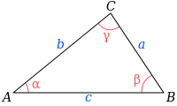

```latex
c^{2} = a^{2} + b^{2} - 2ab\cos(\gamma)
```

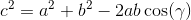

- Trigonometric Addtion formulas

[참고](http://mathworld.wolfram.com/TrigonometricAdditionFormulas.html)

- Half-Angle Formulas

[참고](http://mathworld.wolfram.com/Half-AngleFormulas.html)


- Dot Product

[참고](http://mathworld.wolfram.com/DotProduct.html)

- Cross Product

[참고](http://mathworld.wolfram.com/CrossProduct.html)

- affine transform

world transform, view transform은 scaling, rotation, translation등과
같이 기본적인 변환들을 조합하여 만들어진다. 한편 scaling, rotation은
linear transform(선형변환) 의 범주에 속한다. translation(이동)은
linear transform에 속하지 않는다. 대신 linear transform과 함께 affine
transform의 범주를 형성한다.

- affine space

vector space에서는 vector가 어디에 위치해 있던지 크기와 방향만 같다면
같은 vector로 생각한다. vector space에서 크기와 방향은 같지만 위치가
다른 vector를 구분할 필요가 있다. 그래서 affine space를 만들어냈다.
affine space에서는 position을 추가하여 vector의 위치를 표현한다.

vector space는 affine space에 포함되고 affine space는 projection
space에 포함된다.

- affince space operation

vector와 vector의 +, - 는 vector이다. scala와 vector의 *, /는
vector이다. vector와 point의 +, -는 point이다. point와 point의
-는 vector이다. point와 point의 +는 허용되지 않는다. (단 계수의 합이
1인 경우는 허용된다.)

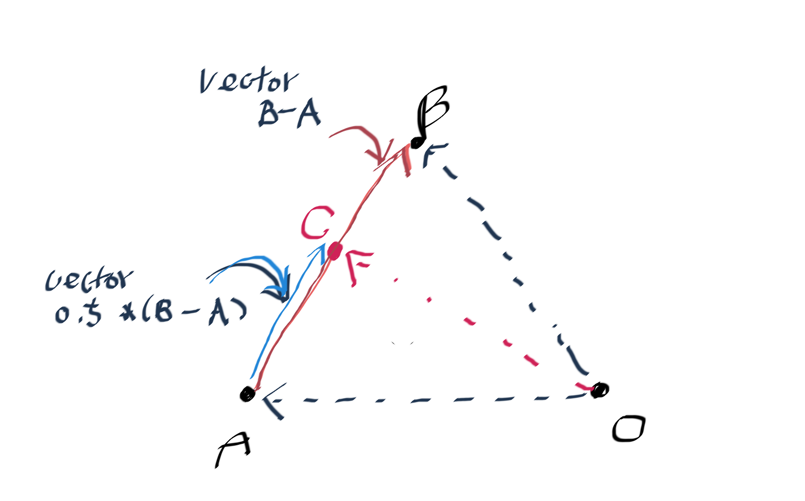

affine space에서 point A는 point O에서 point A로 가는 vector로 
생각 할 수 있다. 따라서 C = A + 0.5 * (B - A) 이다.
point A와 vector B - A의 합은 point임을 알 수 있다.

이때 0.5대신 k를 도입하여 다음과 같이 표기할 수 있다.
C = A + k(B - A) (0 <= k <= 1)
C = (1 - k)A + kB

k가 1이면 C = B이고 k 가 0이면 C = A이다. 이처럼 계수의 합이 1인 경우는
point와 point의 덧셈 연산이 가능하고 이런 경우를 affine sum이라고 한다.

- homogeneous coordinates (동차좌표)

vector와 point를 구분하기 위해 n-tuple에 하나의 차원을 증가시킨
좌표체계이다.  예를 들어서 v = (v1, v2)가 있다고 하자. v의 homogeneous
coordinates v' = (v1, v2, p)이고 p가 0이면 vector를 p가 0이 아니면
point를 의미한다.  따라서 다음과 같은 position들은 모두 같다.  (5, 1,
1) = (10, 2, 2) = (15, 3, 3) = (20, 4, 4)

3차원 좌표의 경우 normalized device coordiates를 window space
coordiates로 변환할때 사용하기 위해 한가지 성분을 추가한다. 이것을
w라고 하면 viewport transform후에 w는 필요 없게 된다. 그 전까지 변환의
행렬 연산을 위해 w는 필요하다.

- tangent space

특정한 point의 normal, tangent, binormal
vector를 축으로 하는 공간이다. normal mapping을 위해
vertex의 normal값을 기준으로 tangent space를 표현하는 TBN
행렬을 구할 수 있고 normal map에 저장된 단위 tangent space normal
vector와 연산하여 최종 normal vector를 구할 수 있다.

# [Rendering Pipeline](../renderingpipeline/README.md)

# Polygon Mesh

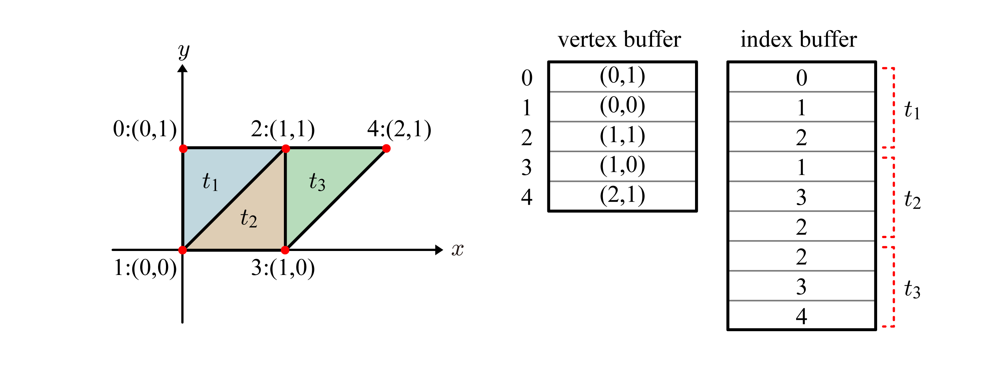

위의 그림은 vertex buffer와 index buffer를 표현한 것이다.  polygon
t1을 주목하자. index buffer에 vertex buffer의 index가 CCW(counter
clock wise, 반시계방향)으로 3개 저장되어 있다.

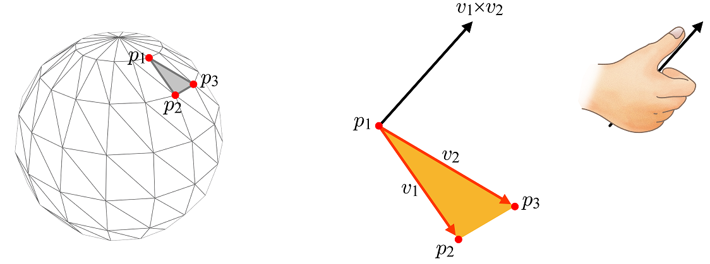

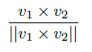

surface normal은 중요하다. 위의 그림처럼 polygon을 구성하는 vertex p1, p2, p3에 
대해서 vector v1, v2를 외적하고 정규화해서 surface normal을 구한다.
반드시 p1, p2, p3는 CCW로 index buffer에 저장되어 있어야 한다.


만약 p1, p2, p3가 CW로 index buffer에 저장되어 있다면 surface normal은
반대 방향으로 만들어 진다.

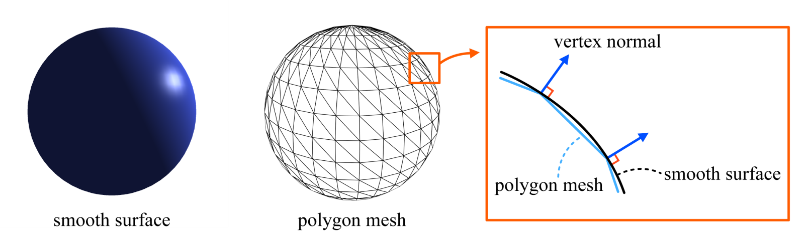

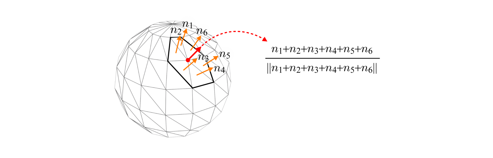

vertex normal은 surface normal보다 더 중요하다.
vertex normal과 인접한 polygon들의 surface normal을 이용하여
구할 수 있다.

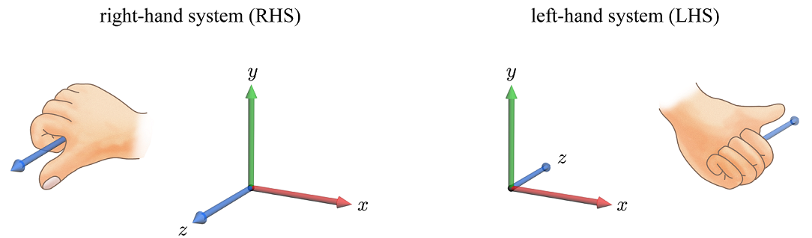


좌표계는 오른손 좌표계와 왼손 좌표계가 있다. opengl은 RHS를
directx3D는 LHS를 사용한다. surface normal이 구의 바깥쪽으로
만들어질려면 RHS의 경우 index buffer에 polygon을 구성하는 vertex 들의
index가 CCW로 저장되어야 하고 LHS의 경우 CW로 저장되어야 한다.


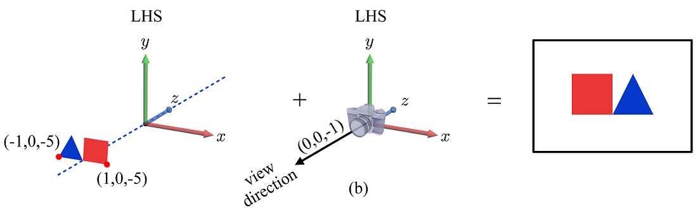

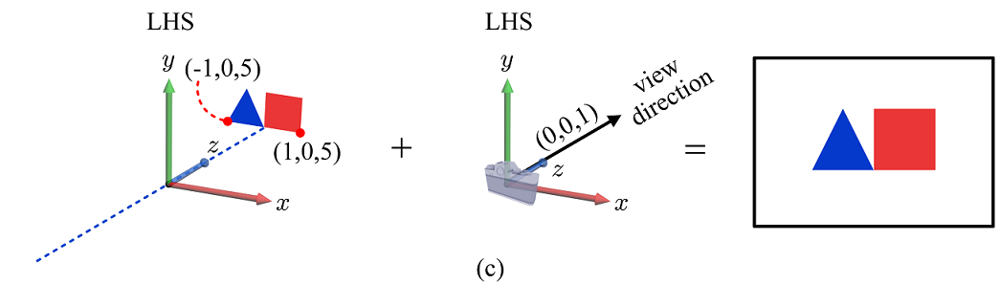

RHS에서 LHS로 좌표계를 포팅하는 것은 두가지 주요 작업을 포함한다.
첫째는 polygon을 구성하는 index buffer의 내용이 CCW에서 CW로
재정렬되어야 한다. 둘째는 오브젝트 pos의 z값과 camera z axis방향이
반전되어야 한다. 위의 첫번째 그림은 RHS의 상황이고 두번째 그림은
별다른 작업없이 좌표계를 LHS로 전환했을때 벌어지는 현상이다. 거울에 비처진 것처럼
반대로 화면에 그려졌다. 세번째 그림은 포팅작업을 통해 RHS에서의 화면과
LHS에서의 화면이 같다.

앞서 언급한 포팅 작업중 첫째 작업은 필요 없을 수 있다.
DirectX의 경우 기본 컬링 모드는 D3DCULL_CCW이다. 이것을
D3DCULL_CW로 바꾸면 재정렬 작업은 필요 없게된다.

# Vertex Processing

확대축소(scaling), 회전(rotation)은 선형변환(linear transformation)이다.
선형변환(linear transformation)에 이동(translation)까지 포함되면
affine transformation이다.

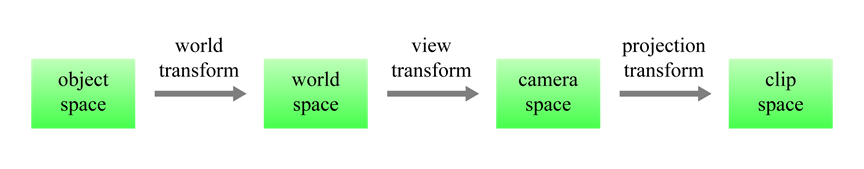

object(local) space coordinates를 world space coordinates
로 변환하는 것을 world transform이라고 한다.
world space coordinates를 camera space coordinates로 변환하는 것을
view transform이라고 한다.
view space coordinates를 clip space coordinates로 변환하는 것을
투영변환(projection transform)이라고 한다. 
clip space coordinates는 normalized device coordinates로 변환된다.
normalized device coordinates를 window space coordinates로 변환하는
것을 viewport transform이라고 한다. clip space coordinates부터 시작되는
변환은 rasterization 단계에서 이루어지는 것일까? viewport transform은
rasterization 단계에서 실행되는 것은 확실하다.

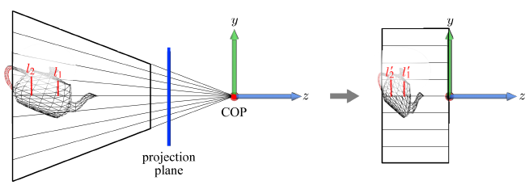

projection transform은 좌측의 view fustumn을 우측의 canonical view
volume으로 찌그러트리는 것이다. canonical view volume은 directx의 경우
직육면체 형태(2, 2, 1)이기 때문에 near plane의 object들은 상대적으로
크기가 커질 것이고 far plane의 object들은 상대적으로 크기가 작아질
것이다. opengl의 경우 정육면체 형태(2, 2, 2)이다.

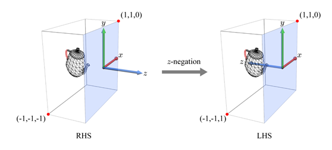

rasterization 단계는 LHS를 사용한다. 이전 단계에서 오른손좌표계(RHS)를
사용했다면 z좌표를 반전시켜야 한다.

```
world-space point = model matrix * model point
view-space point = view matrix * world point
w-divide for NDC <= clip coords = projection matrix * view point
window coords = windows(screen) matrix * NDC
```

[이것](http://www.realtimerendering.com/udacity/transforms.html)은 object space
cartesian coordinate 가 (4,5,3)인 큐브를 예로 three.js와 함께 설명 했다.
src는 [이곳](https://github.com/erich666/cs291/blob/master/demo/unit7-view-pipeline.js)을 참고하자.

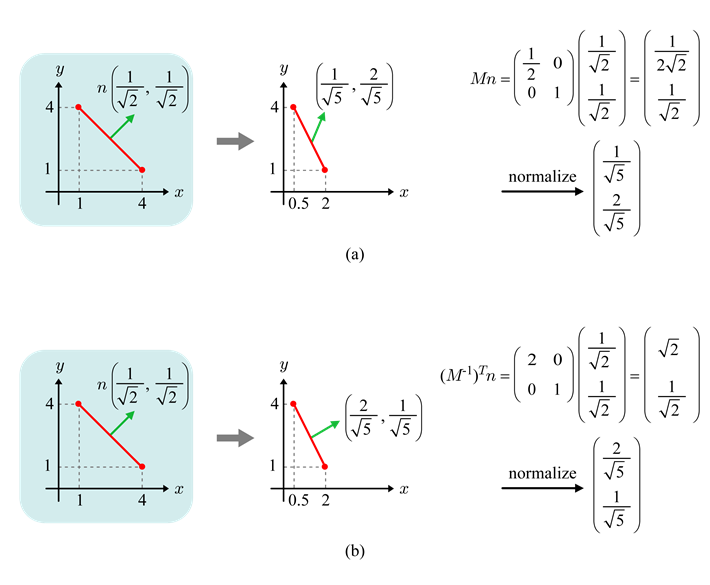

normal vector를 변환하는 것은 vertex를 변환하는 것과 다르게 처리되어야
한다. vertex를 변환 할 때와 똑같은 방법으로 변환행렬 M과 surface
normal vector를 곱하면 변환후 표면에 수직이 되지 못한다.  `M`대신
`(M^{-1})^{T}`를 곱해야 한다. 다음은 surface normal n과 변환행렬
`(M^{-1})^{T}`을 곱한 것과 `(r^{'}-p^{'})`이 수직임을 보여준다.
`((r^{'}-p^{'})^{T}`는 행렬 곱셉을 위해 transpose한 것이다.

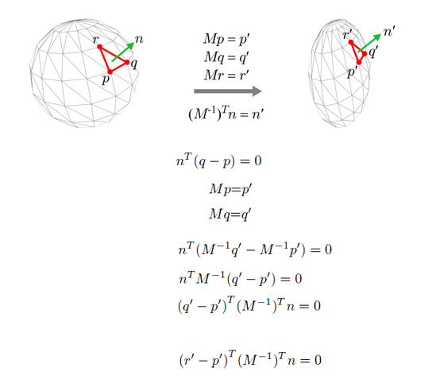

# Rasterization

Rasterization은 hard wired하다. 클리핑(clipping), 원근
나눗셈(perspective division), 뒷면 제거(back-face culling), 뷰포트
변환(view-port transform), 스캔 변환(scan conversion), z-culling등의
요소로 구성된다.

클리핑(clipping)은 canonical view volume의 바깥쪽에 포함된 폴리곤을
잘라내는 과정이다.

원근 나눗셈(perspective division)은 지금까지 사용했던
동차좌표계(homogenious coordinates system)를 데카르트좌표계(cartesian
coordinate system)으로 변환하는 과정이다. 예를 들어 동차좌표가 (x, y,
z, w)라면 데카르트좌표는 (x/w, y/w, z/w)가 된다.

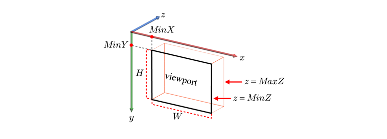

normalized device coordinates를 screen space coordinates로 변환하는
것을 viewport transform이라고 한다. screen space는 RHS를 이용한다.
canonical view volume의 z값은 추후 z-buffering을 위해 사용된다.

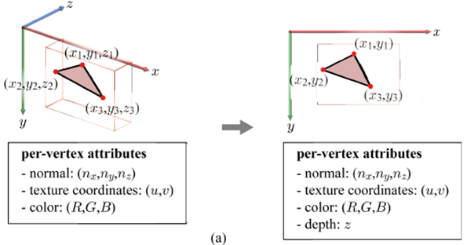
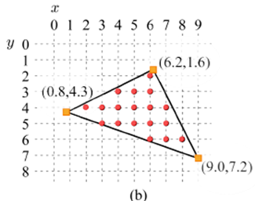

viewport transform후에 각각의 polygon은 screen space에서 내부가 특정한
색깔로 채워져 보이게 된다. 이때 채워지는 색깔은 fragment라는 것의
color속성을 읽어온 것이다. polygon의 내부를 채우는 pixel수 만큼
fragment들이 존재한다.  이와 같은 fragment들을 생성하는 것을
스캔변환(scan conversion)이라고 한다.  polygon을 구성하는 vertex 3개를
보간(interpolation)해서 fragment들을 생성한다.  fragment는 pixel에
해당하는 normal, texture coordinates, color, depth등을 가지고 있다.

output merging단계에서 z-buffering을 이용해서 깊이검사를 하는 것보다 
rasterization단계에서 z-culling을 한다면 훨 씬 효율적이다.
z-culling을 최대한 활용하고자 하는 목적으로 이른바 pre-z pass algorithm이
제안되었다.

# Fragment Processing

lighting 및 texturing 을 수행한다.

# Output Merging

z-buffering, alpha blending을 수행한다.

# [Lighting](../lighting/README.md)

# Shader Models

opengl과 direct3D는 shader 용어들이 다르다.

| opengl | directx |
|:------:|:-------:|
|Vertex Shader|Vertex Shader|
|Tessellation Control Shader|Hull Shader|
|Tessellation Evaluation Shader|Domain Shader|
|Geometry Shader|Geometry Shader|
|Fragment Shader|Pixel Shader|
|Compute Shader|Compute Shader|

shader model은 directX에서 사용하는 shader 버저닝 방법이다.
opengl은 어떻게 하지???

다음은 shader model 4의 특징이다. 
geometry shader, stream output이 추가되었다.


다음은 shader model 5의 특징이다.
hull shader, tessellator, domain shader가 추가되었다.


# Curve

Bezier Curve

Hermite Curve

Catmull-Rom Spline

# [Bump Mapping](../bumpmapping/README.md)

# Environment Mapping

# Light Mapping

# Shadow Mapping

# Ambient Occlusion Mapping

# Deferred Shading

# Animation

# Collision Detection
