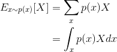
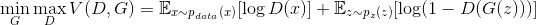
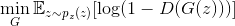
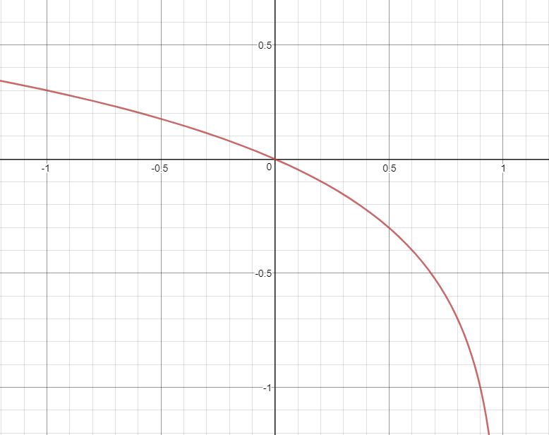
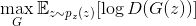
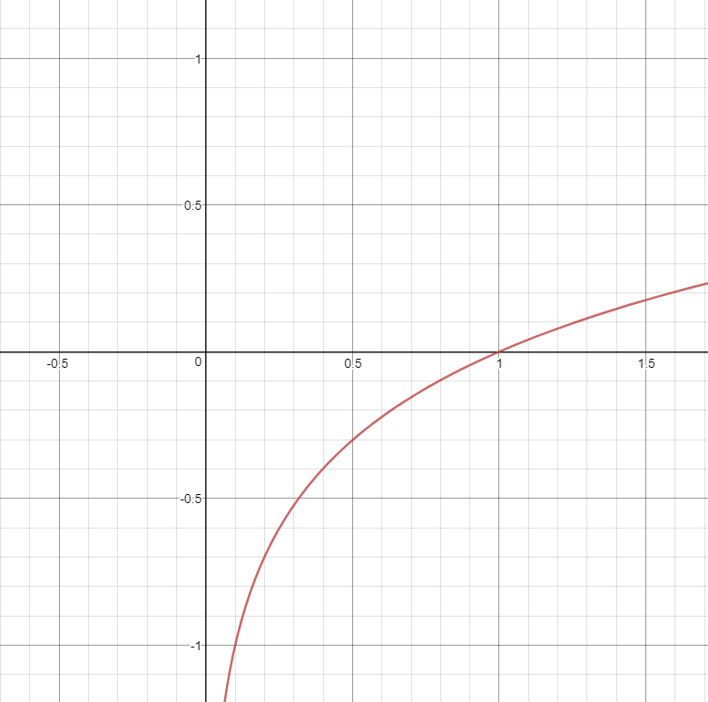

# Abstract

- discriminator는 이미지데이터를 입력받아 진짜인지 가짜인지 출력하기
  위해 학습시킨다.
- generator는 임의의 데이터를 입력받아 이미지데이터를 출력한다. 
- GAN 은 generator 가 생성한 이미지를 discriminator 에 주어 
  discriminator 의 출력이  1 에 가까워지도록 학습한다.
- GAN 이 제대로 학습되었다면 generator 는 진짜에 가까운 이미지데이터를 
  생성할 것이다.
- 다양한 GAN 을 공부해 보자. DCGAN (Deep Convolutional GAN), LSGAN (Least Squares GAN), SGAN
  (Semi-Supervised GAN), ACGAN (Auxiliary Classifier GAN), CycleGAN, StackGAN

# Materials

- [한국어 기계 학습 강좌 @ kaist](https://aailab.kaist.ac.kr/xe2/page_GBex27/)
  - 문일철 교수님의 머신러닝강좌. MLE, MAP, 확률분포등 유용한 내용들이 있음
- [Generative Adversarial Nets @ arxiv](https://arxiv.org/pdf/1406.2661.pdf)
  - Ian J. Goodfellow 논문
- [GAN Tutorial @ youtube](https://www.youtube.com/watch?v=uQT464Ms6y8&index=1&list=RDuQT464Ms6y8)
  - [ppt](https://drive.google.com/file/d/0B377f9tIGAcwdVd1Z3dCX1lBTlE/view)
  - 최윤제님이 pytorch를 이용하여 code를 먼저 직관적으로 만들어보고 [Generative Adversarial Nets @ arxiv](https://arxiv.org/pdf/1406.2661.pdf) 논문을 자세히 설명함
- [1시간만에 GAN(Generative Adversarial Network) 완전 정복하기 @ naver](http://tv.naver.com/v/1947034)
  - [src](https://github.com/yunjey/pytorch-tutorial/blob/master/tutorials/03-advanced/generative_adversarial_network/main.py)
  - [ppt](https://www.slideshare.net/NaverEngineering/1-gangenerative-adversarial-network)
  - 최윤제님의 다른 설명
- [PR-001: Generative adversarial nets by Jaejun Yoo (2017/4/13) @ youtube](https://www.youtube.com/watch?v=L3hz57whyNw)
  - 유재준님의 [Generative Adversarial Nets @ arxiv](https://arxiv.org/pdf/1406.2661.pdf) 설명
- [GAN by Example using Keras on Tensorflow Backend](https://towardsdatascience.com/gan-by-example-using-keras-on-tensorflow-backend-1a6d515a60d0)
  - [src](https://github.com/roatienza/Deep-Learning-Experiments/blob/master/Experiments/Tensorflow/GAN/dcgan_mnist.py)
  - [쌩(?!)초보자의 Python 케라스(Keras) GAN 코드 분석 (draft)](http://leestation.tistory.com/776)
- [Chara Tsukuru GAN: RPG character generator @ github](https://github.com/almchung/chara-tsukuru-gan)
  - RPG 2D 캐릭터 스프라이트를 생성하는 DCGAN
- [StarGAN: Unified Generative Adversarial Networks for Multi-Domain Image-to-Image Translation @ arxiv](https://arxiv.org/abs/1711.09020)
  - 최윤제님 논문
  - [starGAN @ youtube](https://www.youtube.com/watch?v=D80h0MfaspA)
  - [한글설명](http://www.modulabs.co.kr/?module=file&act=procFileDownload&file_srl=20159&sid=16dcd07bb230645a7a9b9271ee6a04ac&module_srl=17958)
  
# Implementation for Intuition

keras 로 간단히 구현해보고 GAN 을 직관적으로 접근해보자.

```
```

# Expectation Function

기대값 `E(X)` 을 어떻게 구하는지 설명한다. 완벽한 세계에서 주사위를 던지는 상황을 생각해 보자. 확률변수 X 와 P(X) 는 다음과 같다.

| X | 1 | 2 | 3 | 4 | 5 | 6 |
|---|---|---|---|---|---|---|
| P(X) | 1/6 | 1/6 | 1/6 | 1/6 | 1/6 | 1/6 |

다음은 확률변수 X 가 Discrete Space 에 속하는 경우와 X 가 continuous Space 에 속할 때의 `E(x)` 이다.


```latex
\begin{align*}
E_{x \sim  p(x)} [X] &= \sum _x p(x) X \\
                     &= \int _x p(x) X dx
\end{align*}
```

확률변수 `X` 가 함수 일수도 있다. 확률변수가 `f(x)` 라고 하면 `E(f(x))` 는 다음과 같다.



```latex
\begin{align*}
E_{x \sim  p(x)} [f(x)] &= \sum _x p(x) f(x) \\
                        &= \int _x p(x) f(x) dx
\end{align*}
```

# Objective Function

다음과 같은 `objective function` 에 대해 `V(D, G)` 를 최소로 만드는 `G` 와 최대로 만드는 `D` 를 찾으면 실제 이미지를 생성하는 `GAN` 을 완성할 수 있다.



```latex
\begin{align*}
\min _{G} \max _{D} V(D, G) = \mathbb{E}_{x \sim p _{data} (x)}[\log D(x)] + \mathbb{E}_{z \sim p _{z} (z)}[\log (1 - D(G(z)))]
\end{align*}
```

`D` 의 관점에서 생각해 보자. `D(x) = 1` 이고 `D(G(z)) = 0` 일 때 `V(G, D)` 는 최대이다. `D(x) = 1` 일 때는 진짜를 진짜로 판별했을 때를 의미하고 `D(G(z)) = 0` 일 때는 가짜를 가짜로 판별했을 때를 의미한다.

`G` 의 관점에서 생각해 보자. `V(D, G)` 의 첫번째 항은 `G` 와 관련없기 때문에 무시해도 된다. 두번째 항을 살펴보자. `D(G(z)) = 1` 일 때 `V(D, G)` 는 최소이다.

즉 다음과 같은 수식을 만족하는 `G` 를 구해야 한다.




```latex
\min _{G} \mathbb{E}_{z \sim p _{z} (z)}[\log (1 - D(G(z)))]
```

`x = D(G(z))` 라고 생각하면 위의 식을 만족하는 `G` 를 찾는 것은 `y = log(1-x)` 그래프에서 최소의 기울기를 갖는 `x` 를  찾는 것과 같다. 이때 `x` 의 범위는 `[0, 1]` 임을 유의하자. `x` 가 0일 때 이미 기울기가 최소이기 때문에 학습이 잘 일어나지 않는다. heuristic 하게 생각해서 최대 기울기 부터 시작하는 그래프를 생각해보자.



그래서 다음수식을 생각해 냈다. 다음의 식을 최대로 하는 `G` 를 찾는 것은 앞서 언급한 수식을 최소로 하는 `G` 를 찾는 것과 같다.



```latex
\max _{G} \mathbb{E}_{z \sim p _{z} (z)}[\log D(G(z))]
```

 실제로 `y = log(x)` 그래프에서 `x` 가 0일 때 최대의 기울기를 갖는다. 학습 초반에 Generator 가 빨리 벋어 나려고 한다???



그럼 이것을 어떻게 구현할 것인가? `sigmoid cross entropy loss` 를 이용하여 다음과 같은 수식을 만들자.


```latex
```

`y = 1` 을 하면 다음과 같다.


```latex
```

결국 `logD(G(z))` 의 기대값을 최대로 하는 `G` 를 찾는 것은 `-logD(G(z))` 의 기대값을 최소로 하는 `G` 를 찾는 것과 같다.

# JSD (Jensson Shannon Divergence)

```
```

# Simple GAN by keras

# DCGAN by keras (Deep Convolution Generative Adversarial Network)

```py
```
