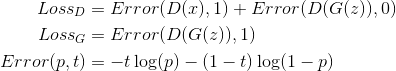

- [Abstract](#abstract)
- [Materials](#materials)
- [Implementation for Intuition](#implementation-for-intuition)
- [Intuition](#intuition)
- [Poor Gradient in Early Training](#poor-gradient-in-early-training)
- [Objective Function](#objective-function)
- [Optimization of Discriminator](#optimization-of-discriminator)
- [Optimization of Generator](#optimization-of-generator)
- [Simple GAN by keras](#simple-gan-by-keras)
- [DCGAN by keras](#dcgan-by-keras)

-----

# Abstract

- discriminator는 이미지데이터를 입력받아 진짜인지 가짜인지 출력하기
  위해 학습시킨다.
- generator는 임의의 데이터를 입력받아 이미지데이터를 출력한다. 
- GAN 은 generator 가 생성한 이미지를 discriminator 에 주어 
  discriminator 의 출력이  1 에 가까워지도록 학습한다.
- GAN 이 제대로 학습되었다면 generator 는 진짜에 가까운 이미지데이터를 
  생성할 것이다.
- 다양한 GAN 을 공부해 보자. DCGAN (Deep Convolutional GAN), LSGAN (Least Squares GAN), SGAN
  (Semi-Supervised GAN), ACGAN (Auxiliary Classifier GAN), CycleGAN, StackGAN

# Materials

- [[GAN]Generative Adversarial Network](https://hyeongminlee.github.io/post/gan001_gan/)
  - GAN 을 잘 설명한 한글 블로그
- [한국어 기계 학습 강좌 @ kaist](https://aailab.kaist.ac.kr/xe2/page_GBex27/)
  - 문일철 교수님의 머신러닝강좌. MLE, MAP, 확률분포등 유용한 내용들이 있음
- [Generative Adversarial Nets @ arxiv](https://arxiv.org/pdf/1406.2661.pdf)
  - Ian J. Goodfellow 논문
- [GAN Tutorial @ youtube](https://www.youtube.com/watch?v=uQT464Ms6y8&index=1&list=RDuQT464Ms6y8)
  - [ppt](https://drive.google.com/file/d/0B377f9tIGAcwdVd1Z3dCX1lBTlE/view)
  - 최윤제님이 pytorch를 이용하여 code를 먼저 직관적으로 만들어보고 [Generative Adversarial Nets @ arxiv](https://arxiv.org/pdf/1406.2661.pdf) 논문을 자세히 설명함
- [1시간만에 GAN(Generative Adversarial Network) 완전 정복하기 @ naver](http://tv.naver.com/v/1947034)
  - [src](https://github.com/yunjey/pytorch-tutorial/blob/master/tutorials/03-advanced/generative_adversarial_network/main.py)
  - [ppt](https://www.slideshare.net/NaverEngineering/1-gangenerative-adversarial-network)
  - 최윤제님의 다른 설명
- [PR-001: Generative adversarial nets by Jaejun Yoo (2017/4/13) @ youtube](https://www.youtube.com/watch?v=L3hz57whyNw)
  - 유재준님의 [Generative Adversarial Nets @ arxiv](https://arxiv.org/pdf/1406.2661.pdf) 설명
- [GAN by Example using Keras on Tensorflow Backend](https://towardsdatascience.com/gan-by-example-using-keras-on-tensorflow-backend-1a6d515a60d0)
  - [src](https://github.com/roatienza/Deep-Learning-Experiments/blob/master/Experiments/Tensorflow/GAN/dcgan_mnist.py)
  - [쌩(?!)초보자의 Python 케라스(Keras) GAN 코드 분석 (draft)](http://leestation.tistory.com/776)
- [Chara Tsukuru GAN: RPG character generator @ github](https://github.com/almchung/chara-tsukuru-gan)
  - RPG 2D 캐릭터 스프라이트를 생성하는 DCGAN
- [StarGAN: Unified Generative Adversarial Networks for Multi-Domain Image-to-Image Translation @ arxiv](https://arxiv.org/abs/1711.09020)
  - 최윤제님 논문
  - [starGAN @ youtube](https://www.youtube.com/watch?v=D80h0MfaspA)
  - [한글설명](http://www.modulabs.co.kr/?module=file&act=procFileDownload&file_srl=20159&sid=16dcd07bb230645a7a9b9271ee6a04ac&module_srl=17958)
  
# Implementation for Intuition

* Discriminator Block

`Discriminator` 는 진짜 이미지의 데이터 `x` 를 입력받아 그것이
진짜 이미지일 확률 `D(x)` 를 출력한다. `D(x)` 는
확률이기 때문에 `[0, 1]` 의 값이다.

```
x -> D -> D(x)
```

* Adversarial Block

`Generator` 는 랜덤값 `z` 를 입력받아 가짜이미지 `G(z)` 를
출력하고 이것을 다시 `Discriminator` 의 입력으로 넘겨준다.
`Discriminator` 는 가짜 이미지 데이터 `G(z)` 를 입력받아
이것이 진짜 이미지일 확률 `D(G(z))` 를 출력한다. `D(G(z))` 는
확률이기 때문에 `[0, 1]` 의 값이다.


```
z -> G -> G(z) -> D -> D(G(z))
```

pytorch 로 구현된 예를 보고 직관적으로 접근해 보자.

[main.py](https://github.com/yunjey/pytorch-tutorial/blob/master/tutorials/03-advanced/generative_adversarial_network/main.py)

```py
...
        # ================================================================== #
        #                      Train the discriminator                       #
        # ================================================================== #

        # Compute BCE_Loss using real images where BCE_Loss(x, y): - y * log(D(x)) - (1-y) * log(1 - D(x))
        # Second term of the loss is always zero since real_labels == 1
        outputs = D(images)
        d_loss_real = criterion(outputs, real_labels)
        real_score = outputs
        
        # Compute BCELoss using fake images
        # First term of the loss is always zero since fake_labels == 0
        z = torch.randn(batch_size, latent_size).to(device)
        fake_images = G(z)
        outputs = D(fake_images)
        d_loss_fake = criterion(outputs, fake_labels)
        fake_score = outputs
        
        # Backprop and optimize
        d_loss = d_loss_real + d_loss_fake
        reset_grad()
        d_loss.backward()
        d_optimizer.step()
        
        # ================================================================== #
        #                        Train the generator                         #
        # ================================================================== #

        # Compute loss with fake images
        z = torch.randn(batch_size, latent_size).to(device)
        fake_images = G(z)
        outputs = D(fake_images)
        
        # We train G to maximize log(D(G(z)) instead of minimizing log(1-D(G(z)))
        # For the reason, see the last paragraph of section 3. https://arxiv.org/pdf/1406.2661.pdf
        g_loss = criterion(outputs, real_labels)
        
        # Backprop and optimize
        reset_grad()
        g_loss.backward()
        g_optimizer.step()
...        
```
# Intuition

다음과 같이 수식들을 정의하자.

```
x : Real Data
z : G 가 입력으로 사용하는 노이즈
G(z) : G 가 노이즈를 입력받아 출력한 Fake Data
D(x) : D 가 Real Data 를 입력받아 출력한 값 [0, 1]
D(G(z)) : D 가 Fake Data 를 입력받아 출력한 값 [0, 1]
Error(a, b) : a 와 b 사이 차이. 작으면 작을 수록 a 와 b 는 유사하다는 의미이다.
```



```latex
\begin{align*}
Loss_{D}    &= Error(D(x), 1) + Error(D(G(z)), 0) \\
Loss_{G}    &= Error(D(G(z)), 1) \\
Error(p, t) &= -t \log(p) - (1 - t) \log(1 - p)
\end{align*}
```

`D` 는 Real Data 를 입력받으면 `1` 을 출력하고 Fake Data 를 입력 받으면 `0` 을 출력하도록 하자. `Loss_{D}` 을 최소화 시키면 `D` 를 최적화할 수 있다.

`G` 는 Fake Data 를 입력받으면 `D` 가 `1` 을 출력하도록 하자. `Loss_{G}` 을 최소화 시키면 `G` 를 최적화 할 수 있다.

`Error()` 는 Cross-Entropy Error 를 이용하자.

결국 `D Loss` 와 `G Loss` 를 다음과 같이 정리할 수 있고 두 Loss 함수들을 최소화 하는 방향으로 `D, G` 를 학습시키면 GAN 을 구현할 수 있다.


```latex
\begin{align*}
Loss_{D}    &= - \log (D(x)) - \log (1 - D(G(z))) \\
Loss_{G}    &= - \log (D(G(z))) \\
\end{align*}
```

# Poor Gradient in Early Training

학습의 초기에 늪에 빠져 제대로 학습이 진행되지 않는 상황을 말한다. 
`w` 가 작은 값부터 시작한다면 gradient decent algorithm 을 적용할 때 작은 값을
탈출하기가 어렵기 때문에 큰 값부터 시작하도록 수식을 조정한다.

예를 들어 GAN 의 경우 objective function 은 다음과 같다.


```latex
\begin{align*}
\min_{G} \max_{D} \{ \log(D(x)) + \log(1 - D(G(z))) \}
\end{align*}
```

`y = log(1-x)` 보다는 `y = log(x)` 가 poor gradient in early training 을
극복하기 좋다. 따라서 `G` 를 학습할 때는 앞서 언급한 `Loss_{G}` 를
이용한다.


# Objective Function


```latex
\begin{align*}
\min_{G} \max_{D} \{ \log(D(x)) + \log(1 - D(G(z))) \}
\end{align*}
```

# Optimization of Discriminator

# Optimization of Generator

# Simple GAN by keras

```py
```

# DCGAN by keras 

```py
```
