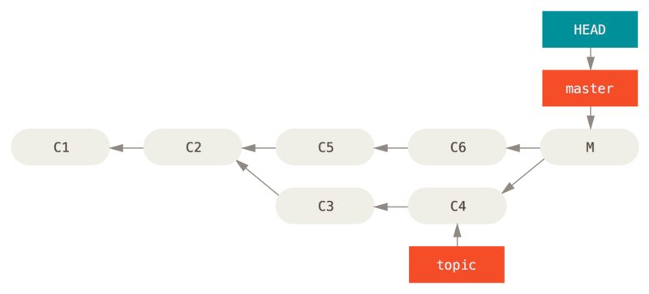

- [Materials](#materials)
- [Git Overview](#git-overview)
- [Git 의 기초](#git-%ec%9d%98-%ea%b8%b0%ec%b4%88)
  - [Git 브랜치](#git-%eb%b8%8c%eb%9e%9c%ec%b9%98)
- [Git 도구](#git-%eb%8f%84%ea%b5%ac)
  - [분산환경에서의 Git](#%eb%b6%84%ec%82%b0%ed%99%98%ea%b2%bd%ec%97%90%ec%84%9c%ec%9d%98-git)
  - [리비전 조회하기](#%eb%a6%ac%eb%b9%84%ec%a0%84-%ec%a1%b0%ed%9a%8c%ed%95%98%ea%b8%b0)
  - [대화형 명령](#%eb%8c%80%ed%99%94%ed%98%95-%eb%aa%85%eb%a0%b9)
  - [Stashing과 Cleaning](#stashing%ea%b3%bc-cleaning)
  - [내 작업에 서명하기](#%eb%82%b4-%ec%9e%91%ec%97%85%ec%97%90-%ec%84%9c%eb%aa%85%ed%95%98%ea%b8%b0)
  - [검색](#%ea%b2%80%ec%83%89)
  - [히스토리 단장하기](#%ed%9e%88%ec%8a%a4%ed%86%a0%eb%a6%ac-%eb%8b%a8%ec%9e%a5%ed%95%98%ea%b8%b0)
  - [**Reset 명확히 알고 가기**](#reset-%eb%aa%85%ed%99%95%ed%9e%88-%ec%95%8c%ea%b3%a0-%ea%b0%80%ea%b8%b0)
  - [고급 Merge](#%ea%b3%a0%ea%b8%89-merge)
  - [Rerere](#rerere)
  - [Git으로 버그 찾기](#git%ec%9c%bc%eb%a1%9c-%eb%b2%84%ea%b7%b8-%ec%b0%be%ea%b8%b0)
  - [서브모듈](#%ec%84%9c%eb%b8%8c%eb%aa%a8%eb%93%88)
  - [Bundle](#bundle)
  - [Replace](#replace)
  - [Credential 저장소](#credential-%ec%a0%80%ec%9e%a5%ec%86%8c)
- [Git맞춤](#git%eb%a7%9e%ec%b6%a4)
  - [Git 설정하기](#git-%ec%84%a4%ec%a0%95%ed%95%98%ea%b8%b0)
  - [Git Attributes](#git-attributes)
  - [Git Hooks](#git-hooks)
  - [정책 구현하기](#%ec%a0%95%ec%b1%85-%ea%b5%ac%ed%98%84%ed%95%98%ea%b8%b0)
- [Git과 여타 버전 관리 시스템](#git%ea%b3%bc-%ec%97%ac%ed%83%80-%eb%b2%84%ec%a0%84-%ea%b4%80%eb%a6%ac-%ec%8b%9c%ec%8a%a4%ed%85%9c)
  - [Git: 범용 Client](#git-%eb%b2%94%ec%9a%a9-client)
  - [Git으로 옮기기](#git%ec%9c%bc%eb%a1%9c-%ec%98%ae%ea%b8%b0%ea%b8%b0)
- [Git의 내부](#git%ec%9d%98-%eb%82%b4%eb%b6%80)
  - [Plumbing 명령과 Porcelain 명령](#plumbing-%eb%aa%85%eb%a0%b9%ea%b3%bc-porcelain-%eb%aa%85%eb%a0%b9)
  - [Git 개체](#git-%ea%b0%9c%ec%b2%b4)
  - [Git Refs](#git-refs)
  - [Packfile](#packfile)
  - [Refspec](#refspec)
  - [데이터 전송 프로토콜](#%eb%8d%b0%ec%9d%b4%ed%84%b0-%ec%a0%84%ec%86%a1-%ed%94%84%eb%a1%9c%ed%86%a0%ec%bd%9c)
  - [운영 및 데이터 복구](#%ec%9a%b4%ec%98%81-%eb%b0%8f-%eb%8d%b0%ec%9d%b4%ed%84%b0-%eb%b3%b5%ea%b5%ac)
  - [환경변수](#%ed%99%98%ea%b2%bd%eb%b3%80%ec%88%98)
- [Git Tips](#git-tips)
  - [use cat instead of pager](#use-cat-instead-of-pager)
  - [git diff output](#git-diff-output)
  - [git diff](#git-diff)
  - [git blame](#git-blame)

----

# Materials

* [progit](https://git-scm.com/book/ko/v2)
  * 킹왕짱 메뉴얼

# Git Overview

git 은 `working directory, Index(staging area), local repository, remote repository` 와 같이 4 가지 영역을 관리한다.


# Git 브랜치

## merge vs rebase


master branch 에 experiment branch 를 합해야 하는 상황이다. merge 혹은 rebase 방법을 사용할 수 있다. 


merge 는 master, experiment 의 마지막 커밋 (C3, C4) 와 공통조상 (C2) 를 사용하는 3-way merge 로 새로운 커밋을 만들어 합하는 방법이다.

```bash
git checkout master
git merge experiment
```


rebase 는 experiment 의 마지막 커밋 (C4) 를 master 의 마지막 커밋 (C3) 에 적용하고 master 를 fast-forward 시키는 방법이다.

```bash
git checkout master
git rebase experiment
```

rebase 는 history 가 선형이기 때문에 merge 에 비해 더욱 깔끔하다.

master, server, client branch 가 다음과 같이 존재한다.


 master 에 client 의 C8, C9 만 rebase 해보자. 이때 server branch 와 공통 커밋 C3 는 제외해야 한다.

```bash
$ git rebase --onto master server client
```


이제 master 에서 client 를 fast-forward 해 보자.

```bash
$ git checkout master
$ git merge client
```


master 에서 server 를 rebase 해 보자.

```bash
$ git rebase master server
```


master 를 fast-forward 하자.

```bash
$ git checkout master
$ git merge server
```

master 에 client, server 가 모두 합쳐졌다. client, server branch 는 더이상 필요 없으니 삭제하자.

```bash
$ git branch -d client
$ git branch -d server
```


# Git 도구

## 분산환경에서의 Git

## 리비전 조회하기

```bash
## short hash
$ git show 1c002dd4b536e7479fe34593e72e6c6c1819e53b
$ git show 1c002dd4b536e7479f
$ git show 1c002d

## 짧고 중복되지 않는 해시 값
git log --abbrev-commit --pretty=oneline
# ca82a6d changed the version number
# 085bb3b removed unnecessary test code
# a11bef0 first commit

## 브랜치로 가리키기
# Git은 자동으로 브랜치와 HEAD가 지난 몇 달 동안에 가리켰었던 커밋을 모두 
# 기록하는데 이 로그를 “Reflog” 라고 부른다.
$ git show ca82a6dff817ec66f44342007202690a93763949
$ git show topic1
$ git rev-parse topic1
# ca82a6dff817ec66f44342007202690a93763949

## RefLog로 가리키기
$ git reflog
# 734713b HEAD@{0}: commit: fixed refs handling, added gc auto, updated
# d921970 HEAD@{1}: merge phedders/rdocs: Merge made by the 'recursive' strategy.
# 1c002dd HEAD@{2}: commit: added some blame and merge stuff
# 1c36188 HEAD@{3}: rebase -i (squash): updating HEAD
# 95df984 HEAD@{4}: commit: # This is a combination of two commits.
# 1c36188 HEAD@{5}: rebase -i (squash): updating HEAD
# 7e05da5 HEAD@{6}: rebase -i (pick): updating HEAD

#  HEAD가 5번 전에 가리켰던 것
$ git show HEAD@{5}

# 어제 날짜의 master 브랜치
$ git show master@{yesterday}

# git log -g 명령을 사용하면 git reflog 결과를 git log 명령과 같은 형태로 볼 수 있다.
$ git log -g master
# commit 734713bc047d87bf7eac9674765ae793478c50d3
# Reflog: master@{0} (Scott Chacon <schacon@gmail.com>)
# Reflog message: commit: fixed refs handling, added gc auto, updated
# Author: Scott Chacon <schacon@gmail.com>
# Date:   Fri Jan 2 18:32:33 2009 -0800

#     fixed refs handling, added gc auto, updated tests

# commit d921970aadf03b3cf0e71becdaab3147ba71cdef
# Reflog: master@{1} (Scott Chacon <schacon@gmail.com>)
# Reflog message: merge phedders/rdocs: Merge made by recursive.
# Author: Scott Chacon <schacon@gmail.com>
# Date:   Thu Dec 11 15:08:43 2008 -0800

#     Merge commit 'phedders/rdocs'

## 계통 관계로 가리키기

# 이름 끝에 ^ (캐럿) 기호를 붙이면 Git은 해당 커밋의 부모를 찾는다.
$ git log --pretty=format:'%h %s' --graph
# * 734713b fixed refs handling, added gc auto, updated tests
# *   d921970 Merge commit 'phedders/rdocs'
# |\
# | * 35cfb2b Some rdoc changes
# * | 1c002dd added some blame and merge stuff
# |/
# * 1c36188 ignore *.gem
# * 9b29157 add open3_detach to gemspec file list

$ git show HEAD^
# commit d921970aadf03b3cf0e71becdaab3147ba71cdef
# Merge: 1c002dd... 35cfb2b...
# Author: Scott Chacon <schacon@gmail.com>
# Date:   Thu Dec 11 15:08:43 2008 -0800

#     Merge commit 'phedders/rdocs'

# Windows 에서는 ^^ "*^" 을 사용한다.
$ git show HEAD^     # will NOT work on Windows
$ git show HEAD^^    # OK
$ git show "HEAD^"   # OK

# d921970^2 는 “d921970의 두 번째 부모” 를 의미한다. 
$ git show d921970^
# commit 1c002dd4b536e7479fe34593e72e6c6c1819e53b
# Author: Scott Chacon <schacon@gmail.com>
# Date:   Thu Dec 11 14:58:32 2008 -0800
#
#     added some blame and merge stuff

$ git show d921970^2
# commit 35cfb2b795a55793d7cc56a6cc2060b4bb732548
# Author: Paul Hedderly <paul+git@mjr.org>
# Date:   Wed Dec 10 22:22:03 2008 +0000
#
#     Some rdoc changes

# HEAD~2 는 명령을 실행할 시점의 “첫 번째 부모의 첫 번째 부모” , 즉 “조부모” 를 가리킨다. 
$ git show HEAD~3
# commit 1c3618887afb5fbcbea25b7c013f4e2114448b8d
# Author: Tom Preston-Werner <tom@mojombo.com>
# Date:   Fri Nov 7 13:47:59 2008 -0500
#
#     ignore *.gem

# HEAD~2 와 HEAD^^^ 는 같다.
$ git show HEAD^^^
# commit 1c3618887afb5fbcbea25b7c013f4e2114448b8d
# Author: Tom Preston-Werner <tom@mojombo.com>
# Date:   Fri Nov 7 13:47:59 2008 -0500
#
#     ignore *.gem

### 범위로 커밋 가리키기

# A <- B <- E <- F -< master
#       \
#        <- C <- D -< experiment

## Double Dot
# experiment 브랜치의 커밋들 중에서 아직 master 브랜치에 Merge 
# 하지 않은 것들만 보고 싶으면 master..experiment 라고 사용한다. 
# 이 표현은 “master에는 없지만, experiment에는 있는 커밋” 을 의미

$ git log master..experiment
# C
# D

$ git log experiment..master
# F
# E

# origin 저장소의 master 브랜치에는 없고 현재 Checkout 중인 브랜치에만 있는 커밋
$ git log origin/master..HEAD

## 세 개 이상의 Refs

# ^ 이나 --not 옵션 뒤에 브랜치 이름은 그 브랜치에 없는 커밋
# 아래는 모두 같은 표현이다.
$ git log refA..refB
$ git log ^refA refB
$ git log refB --not refA

# 세개 이상의 브랜치에 적용
$ git log refA refB ^refC
$ git log refA refB --not refC

## Triple Dot
# Triple Dot은 양쪽에 있는 두 Refs 사이에서 공통으로 가지는 것을 제외하고 서로 다른 커밋
$ git log master...experiment
# F
# E
# D
# C

$ git log --left-right master...experiment
# < F
# < E
# > D
# > C
```

## 대화형 명령

```bash
# 대화형 모드 진입
$ git add -i
#            staged     unstaged path
#   1:    unchanged        +0/-1 TODO
#   2:    unchanged        +1/-1 index.html
#   3:    unchanged        +5/-1 lib/simplegit.rb

# *** Commands ***
#   1: status     2: update      3: revert     4: add untracked
#   5: patch      6: diff        7: quit       8: help
What now>

# Staging Area에 파일 추가하고 추가 취소하기
What now> 2
#            staged     unstaged path
#   1:    unchanged        +0/-1 TODO
#   2:    unchanged        +1/-1 index.html
#   3:    unchanged        +5/-1 lib/simplegit.rb
Update>> 1,2
#            staged     unstaged path
# * 1:    unchanged        +0/-1 TODO
# * 2:    unchanged        +1/-1 index.html
#   3:    unchanged        +5/-1 lib/simplegit.rb
Update>> [enter]
# updated 2 paths

# *** Commands ***
#   1: status     2: update      3: revert     4: add untracked
#   5: patch      6: diff        7: quit       8: help
What now> 1
#            staged     unstaged path
#   1:        +0/-1      nothing TODO
#   2:        +1/-1      nothing index.html
#   3:    unchanged        +5/-1 lib/simplegit.rb
# *** Commands ***
#   1: status     2: update      3: revert     4: add untracked
#   5: patch      6: diff        7: quit       8: help
What now> 3
#            staged     unstaged path
#   1:        +0/-1      nothing TODO
#   2:        +1/-1      nothing index.html
#   3:    unchanged        +5/-1 lib/simplegit.rb
Revert>> 1
#            staged     unstaged path
# * 1:        +0/-1      nothing TODO
#   2:        +1/-1      nothing index.html
#   3:    unchanged        +5/-1 lib/simplegit.rb
Revert>> [enter]
# *** Commands ***
#   1: status     2: update      3: revert     4: add untracked
#   5: patch      6: diff        7: quit       8: help
What now> 1
#            staged     unstaged path
#   1:    unchanged        +0/-1 TODO
#   2:        +1/-1      nothing index.html
#   3:    unchanged        +5/-1 lib/simplegit.rb
# *** Commands ***
#   1: status     2: update      3: revert     4: add untracked
#   5: patch      6: diff        7: quit       8: help
What now> 6
#            staged     unstaged path
#   1:        +1/-1      nothing index.html
Review diff>> 1
# diff --git a/index.html b/index.html
# index 4d07108..4335f49 100644
# --- a/index.html
# +++ b/index.html
# @@ -16,7 +16,7 @@ Date Finder

#  <p id="out">...</p>

# -<div id="footer">contact : support@github.com</div>
# +<div id="footer">contact : email.support@github.com</div>

#  <script type="text/javascript">

## 파일의 일부분만 Staging Area에 추가하기

# *** Commands ***
#   1: status     2: update      3: revert     4: add untracked
#   5: patch      6: diff        7: quit       8: help
What now> 5
# diff --git a/lib/simplegit.rb b/lib/simplegit.rb
# index dd5ecc4..57399e0 100644
# --- a/lib/simplegit.rb
# +++ b/lib/simplegit.rb
# @@ -22,7 +22,7 @@ class SimpleGit
#    end

#    def log(treeish = 'master')
# -    command("git log -n 25 #{treeish}")
# +    command("git log -n 30 #{treeish}")
#    end

#    def blame(path)
Stage this hunk [y,n,a,d,/,j,J,g,e,?]? ?
# y - stage this hunk
# n - do not stage this hunk
# a - stage this and all the remaining hunks in the file
# d - do not stage this hunk nor any of the remaining hunks in the file
# g - select a hunk to go to
# / - search for a hunk matching the given regex
# j - leave this hunk undecided, see next undecided hunk
# J - leave this hunk undecided, see next hunk
# k - leave this hunk undecided, see previous undecided hunk
# K - leave this hunk undecided, see previous hunk
# s - split the current hunk into smaller hunks
# e - manually edit the current hunk
# ? - print help
What now> 1
#            staged     unstaged path
#   1:    unchanged        +0/-1 TODO
#   2:        +1/-1      nothing index.html
#   3:        +1/-1        +4/-0 lib/simplegit.rb
```

## Stashing과 Cleaning

```bash
# stashing 은 하던 것을 commit 하지 않고 잠시 보관해두는 것이다.
# 여러 세트를 보관할 수 있고 다시 복원할 수 있다.

## 하던 일을 stash 하기
$ git status
# Changes to be committed:
#   (use "git reset HEAD <file>..." to unstage)
#
#   modified:   index.html
#
# Changes not staged for commit:
#   (use "git add <file>..." to update what will be committed)
#   (use "git checkout -- <file>..." to discard changes in working directory)
#
#   modified:   lib/simplegit.rb

# stack 에 새로운 stash 가 생성된다.
$ git stash
# Saved working directory and index state \
#   "WIP on master: 049d078 added the index file"
# HEAD is now at 049d078 added the index file
# (To restore them type "git stash apply")

# working directory 는 깨끗해 졌다.
$ git status
# On branch master
# nothing to commit, working directory clean

# stash 를 확인하자.
$ git stash list
# stash@{0}: WIP on master: 049d078 added the index file
# stash@{1}: WIP on master: c264051 Revert "added file_size"
# stash@{2}: WIP on master: 21d80a5 added number to log

# 이제 stash 를 working directory 에 적용해 보자.
$ git stash apply
# On branch master
# Changes not staged for commit:
#   (use "git add <file>..." to update what will be committed)
#   (use "git checkout -- <file>..." to discard changes in working directory)
#
#   modified:   index.html
#   modified:   lib/simplegit.rb
#
# no changes added to commit (use "git add" and/or "git commit -a")

# --index 를 추가하여 staged 상태까지 적용해보자.
$ git stash apply --index
# On branch master
# Changes to be committed:
#   (use "git reset HEAD <file>..." to unstage)
#
#   modified:   index.html
#
# Changes not staged for commit:
#   (use "git add <file>..." to update what will be committed)
#   (use "git checkout -- <file>..." to discard changes in working directory)
#
#   modified:   lib/simplegit.rb

# 적용한 stash 는 버리자.
$ git stash list
# stash@{0}: WIP on master: 049d078 added the index file
# stash@{1}: WIP on master: c264051 Revert "added file_size"
# stash@{2}: WIP on master: 21d80a5 added number to log
$ git stash drop stash@{0}
# Dropped stash@{0} (364e91f3f268f0900bc3ee613f9f733e82aaed43)

## Stash 를 만드는 새로운 방법
$ git status -s
# M  index.html
#  M lib/simplegit.rb

# 이미 staging area 에 있는 파일은 stash 하지 말자.
$ git stash --keep-index
# Saved working directory and index state WIP on master: 1b65b17 added the index file
# HEAD is now at 1b65b17 added the index file
$ git status -s
# M  index.html

# --include-untracked, -u 를 추가하여 untracked files 도 stash 해보자.
$ git status -s
# M  index.html
#  M lib/simplegit.rb
# ?? new-file.txt

$ git stash -u
# Saved working directory and index state WIP on master: 1b65b17 added the index file
# HEAD is now at 1b65b17 added the index file

$ git status -s

# --patch 를 추가하여 interactive 하게 처리해 보자.
$ git stash --patch
# diff --git a/lib/simplegit.rb b/lib/simplegit.rb
# index 66d332e..8bb5674 100644
# --- a/lib/simplegit.rb
# +++ b/lib/simplegit.rb
# @@ -16,6 +16,10 @@ class SimpleGit
#          return `#{git_cmd} 2>&1`.chomp
#        end
#      end
# +
# +    def show(treeish = 'master')
# +      command("git show #{treeish}")
# +    end

#  end
#  test
Stash this hunk [y,n,q,a,d,/,e,?]? y

# Saved working directory and index state WIP on master: 1b65b17 added the index file

## Stash 를 적용한 브랜치 만들기

# branch 를 만들고 stash 를 복원해 준다.
$ git stash branch testchanges
# M index.html
# M lib/simplegit.rb
# Switched to a new branch 'testchanges'
# On branch testchanges
# Changes to be committed:
#   (use "git reset HEAD <file>..." to unstage)

#   modified:   index.html

# Changes not staged for commit:
#   (use "git add <file>..." to update what will be committed)
#   (use "git checkout -- <file>..." to discard changes in working directory)

#   modified:   lib/simplegit.rb

# Dropped refs/stash@{0} (29d385a81d163dfd45a452a2ce816487a6b8b014)

## 워킹 디렉토리 청소하기
# git clean 은 untracked files 를 모두 지운다.

# -n 을 추가하여 가상으로 실행해 보자.
$ git clean -d -n
# Would remove test.o
# Would remove tmp/

# .gitignore 에 등록된 파일은 지우지 않는다. -X 를 추가하여
# .gitignore 에 등록된 파일도 지우자.
$ git status -s
#  M lib/simplegit.rb
# ?? build.TMP
# ?? tmp/

$ git clean -n -d
# Would remove build.TMP
# Would remove tmp/

$ git clean -n -d -x
# Would remove build.TMP
# Would remove test.o
# Would remove tmp/

# -i 를 추가하여 interactive 하게 실행해보자.
$ git clean -x -i
# Would remove the following items:
#   build.TMP  test.o
# *** Commands ***
#     1: clean                2: filter by pattern    3: select by numbers    4: ask each             5: quit
#     6: help
What now>
```

## 내 작업에 서명하기

```bash
## GPG 소개

# 설치된 개인키의 목록을 확인
$ gpg --list-keys
# /Users/schacon/.gnupg/pubring.gpg
# ---------------------------------
# pub   2048R/0A46826A 2014-06-04
# uid                  Scott Chacon (Git signing key) <schacon@gmail.com>
# sub   2048R/874529A9 2014-06-04

# 키를 만들자
$ gpg --gen-key

# 개인키가 이미 있다면 설정하자
$ git config --global user.signingkey 0A46826A

## 태그 서명하기
# -a 대신 -s 를 쓰자
$ git tag -s v1.5 -m 'my signed 1.5 tag'

# You need a passphrase to unlock the secret key for
# user: "Ben Straub <ben@straub.cc>"
# 2048-bit RSA key, ID 800430EB, created 2014-05-04

# tag 에 gpg 서명이 첨부되어 있다.
$ git show v1.5
# tag v1.5
# Tagger: Ben Straub <ben@straub.cc>
# Date:   Sat May 3 20:29:41 2014 -0700

# my signed 1.5 tag
# -----BEGIN PGP SIGNATURE-----
# Version: GnuPG v1

# iQEcBAABAgAGBQJTZbQlAAoJEF0+sviABDDrZbQH/09PfE51KPVPlanr6q1v4/Ut
# LQxfojUWiLQdg2ESJItkcuweYg+kc3HCyFejeDIBw9dpXt00rY26p05qrpnG+85b
# hM1/PswpPLuBSr+oCIDj5GMC2r2iEKsfv2fJbNW8iWAXVLoWZRF8B0MfqX/YTMbm
# ecorc4iXzQu7tupRihslbNkfvfciMnSDeSvzCpWAHl7h8Wj6hhqePmLm9lAYqnKp
# 8S5B/1SSQuEAjRZgI4IexpZoeKGVDptPHxLLS38fozsyi0QyDyzEgJxcJQVMXxVi
# RUysgqjcpT8+iQM1PblGfHR4XAhuOqN5Fx06PSaFZhqvWFezJ28/CLyX5q+oIVk=
# =EFTF
# -----END PGP SIGNATURE-----

# commit ca82a6dff817ec66f44342007202690a93763949
# Author: Scott Chacon <schacon@gee-mail.com>
# Date:   Mon Mar 17 21:52:11 2008 -0700

#     changed the version number

## tag 확인하기. 확인 작업을 하려면 서명한 사람의 GPG 공개키를 키 관리 시스템에 등록해두어야 한다.
$ git tag -v v1.4.2.1
# object 883653babd8ee7ea23e6a5c392bb739348b1eb61
# type commit
# tag v1.4.2.1
# tagger Junio C Hamano <junkio@cox.net> 1158138501 -0700

# GIT 1.4.2.1

# Minor fixes since 1.4.2, including git-mv and git-http with alternates.
# gpg: Signature made Wed Sep 13 02:08:25 2006 PDT using DSA key ID F3119B9A
# gpg: Good signature from "Junio C Hamano <junkio@cox.net>"
# gpg:                 aka "[jpeg image of size 1513]"
# Primary key fingerprint: 3565 2A26 2040 E066 C9A7  4A7D C0C6 D9A4 F311 9B9A

# 서명한 사람의 공개키가 없으면 다음과 같은 에러 메시지를 출력한다.
# gpg: Signature made Wed Sep 13 02:08:25 2006 PDT using DSA key ID F3119B9A
# gpg: Can't check signature: public key not found
# error: could not verify the tag 'v1.4.2.1'

## 커밋에 서명하기

# -S 를 추가하여 commit 에 서명해보자.
$ git commit -a -S -m 'signed commit'

# You need a passphrase to unlock the secret key for
# user: "Scott Chacon (Git signing key) <schacon@gmail.com>"
# 2048-bit RSA key, ID 0A46826A, created 2014-06-04

# [master 5c3386c] signed commit
#  4 files changed, 4 insertions(+), 24 deletions(-)
#  rewrite Rakefile (100%)
#  create mode 100644 lib/git.rb

# --show-signature 를 추가하여 서명을 확인 하자.
$ git log --show-signature -1
# commit 5c3386cf54bba0a33a32da706aa52bc0155503c2
# gpg: Signature made Wed Jun  4 19:49:17 2014 PDT using RSA key ID 0A46826A
# gpg: Good signature from "Scott Chacon (Git signing key) <schacon@gmail.com>"
# Author: Scott Chacon <schacon@gmail.com>
# Date:   Wed Jun 4 19:49:17 2014 -0700

#     signed commit

# git log 로 출력한 로그에서 커밋에 대한 서명 정보를 알려면 %G? 포맷을 이용한다.
$ git log --pretty="format:%h %G? %aN  %s"

# 5c3386c G Scott Chacon  signed commit
# ca82a6d N Scott Chacon  changed the version number
# 085bb3b N Scott Chacon  removed unnecessary test code
# a11bef0 N Scott Chacon  first commit

# --verify-signatures 를 추가하여 Merge 할 커밋 중 서명하지 않았거나 
# 신뢰할 수 없는 사람이 서명한 커밋이 있으면 Merge 되지 않는다.
$ git merge --verify-signatures non-verify
# fatal: Commit ab06180 does not have a GPG signature.

# Merge 할 커밋 전부가 신뢰할 수 있는 사람에 의해 서명된 커밋이면 
# 모든 서명을 출력하고 Merge를 수행한다.
$ git merge --verify-signatures signed-branch
# Commit 13ad65e has a good GPG signature by Scott Chacon (Git signing key) <schacon@gmail.com>
# Updating 5c3386c..13ad65e
# Fast-forward
#  README | 2 ++
#  1 file changed, 2 insertions(+)

# -S 를 추가하여 merge commit 을 서명해 보자.
$ git merge --verify-signatures -S  signed-branch
# Commit 13ad65e has a good GPG signature by Scott Chacon (Git signing key) <schacon@gmail.com>

# You need a passphrase to unlock the secret key for
# user: "Scott Chacon (Git signing key) <schacon@gmail.com>"
# 2048-bit RSA key, ID 0A46826A, created 2014-06-04

# Merge made by the 'recursive' strategy.
#  README | 2 ++
#  1 file changed, 2 insertions(+)

```

## 검색

```bash
## Git Grep

# -n or --line-number 르 ㄹ추가하여 라인 번호도 출력한다.
$ git grep -n gmtime_r
# compat/gmtime.c:3:#undef gmtime_r
# compat/gmtime.c:8:      return git_gmtime_r(timep, &result);
# compat/gmtime.c:11:struct tm *git_gmtime_r(const time_t *timep, struct tm *result)
# compat/gmtime.c:16:     ret = gmtime_r(timep, result);
# compat/mingw.c:826:struct tm *gmtime_r(const time_t *timep, struct tm *result)
# compat/mingw.h:206:struct tm *gmtime_r(const time_t *timep, struct tm *result);
# date.c:482:             if (gmtime_r(&now, &now_tm))
# date.c:545:             if (gmtime_r(&time, tm)) {
# date.c:758:             /* gmtime_r() in match_digit() may have clobbered it */
# git-compat-util.h:1138:struct tm *git_gmtime_r(const time_t *, struct tm *);
# git-compat-util.h:1140:#define gmtime_r git_gmtime_r

# -c, --count 를 추가하여 몇개 찾았는지 표시해 보자.
$ git grep --count gmtime_r
# compat/gmtime.c:4
# compat/mingw.c:1
# compat/mingw.h:1
# date.c:3
# git-compat-util.h:2

# -p or --show-function 을 추가하여 매칭되는 라인이 있는 함수나 메서드를 찾아보자.
$ git grep -p gmtime_r *.c
# date.c=static int match_multi_number(timestamp_t num, char c, const char *date,
# date.c:         if (gmtime_r(&now, &now_tm))
# date.c=static int match_digit(const char *date, struct tm *tm, int *offset, int *tm_gmt)
# date.c:         if (gmtime_r(&time, tm)) {
# date.c=int parse_date_basic(const char *date, timestamp_t *timestamp, int *offset)
# date.c:         /* gmtime_r() in match_digit() may have clobbered it */

# --and 를 추가하여 logical and 를 해보자.
$ git grep --break --heading \
    -n -e '#define' --and \( -e LINK -e BUF_MAX \) v1.8.0
# v1.8.0:builtin/index-pack.c
# 62:#define FLAG_LINK (1u<<20)

# v1.8.0:cache.h
# 73:#define S_IFGITLINK  0160000
# 74:#define S_ISGITLINK(m)       (((m) & S_IFMT) == S_IFGITLINK)

# v1.8.0:environment.c
# 54:#define OBJECT_CREATION_MODE OBJECT_CREATION_USES_HARDLINKS

# v1.8.0:strbuf.c
# 326:#define STRBUF_MAXLINK (2*PATH_MAX)

# v1.8.0:symlinks.c
# 53:#define FL_SYMLINK  (1 << 2)

# v1.8.0:zlib.c
# 30:/* #define ZLIB_BUF_MAX ((uInt)-1) */
# 31:#define ZLIB_BUF_MAX ((uInt) 1024 * 1024 * 1024) /* 1GB */

## Git 로그 검색

# -S 를 추가하여 log 에서 검색해보자.
$ git log -S ZLIB_BUF_MAX --oneline
# e01503b zlib: allow feeding more than 4GB in one go
# ef49a7a zlib: zlib can only process 4GB at a time

## 라인 로그 검색
$ git log -L :git_deflate_bound:zlib.c
# commit ef49a7a0126d64359c974b4b3b71d7ad42ee3bca
# Author: Junio C Hamano <gitster@pobox.com>
# Date:   Fri Jun 10 11:52:15 2011 -0700

#     zlib: zlib can only process 4GB at a time

# diff --git a/zlib.c b/zlib.c
# --- a/zlib.c
# +++ b/zlib.c
# @@ -85,5 +130,5 @@
# -unsigned long git_deflate_bound(z_streamp strm, unsigned long size)
# +unsigned long git_deflate_bound(git_zstream *strm, unsigned long size)
#  {
# -       return deflateBound(strm, size);
# +       return deflateBound(&strm->z, size);
#  }


# commit 225a6f1068f71723a910e8565db4e252b3ca21fa
# Author: Junio C Hamano <gitster@pobox.com>
# Date:   Fri Jun 10 11:18:17 2011 -0700

#     zlib: wrap deflateBound() too

# diff --git a/zlib.c b/zlib.c
# --- a/zlib.c
# +++ b/zlib.c
# @@ -81,0 +85,5 @@
# +unsigned long git_deflate_bound(z_streamp strm, unsigned long size)
# +{
# +       return deflateBound(strm, size);
# +}
# +
```

## 히스토리 단장하기

```bash
## 마지막 커밋을 수정하기

# 마지막 commit 메시지만 수정
# changes not staged 는 commit 되지 않는다.
$ git commit --amend

# changes not staged 와 함께 마지막 메시지를 수정
# SHA-1 값이 바뀐다. 물론 git reflog 로 메지만 바뀐 
# commit 을 추적할 수 있다.
$ git add .
$ git commit --amend

# commit 메시지 편집없이 마지막 commit 수정
$ git commit --amend --no-edit

## 커밋 메시지를 여러 개 수정하기

# 마지막 3 개의 메시지를 interactive 하게 수정
$ git rebase -i HEAD~3

pick f7f3f6d changed my name a bit
pick 310154e updated README formatting and added blame
pick a5f4a0d added cat-file

# Rebase 710f0f8..a5f4a0d onto 710f0f8
#
# Commands:
#  p, pick = use commit
#  r, reword = use commit, but edit the commit message
#  e, edit = use commit, but stop for amending
#  s, squash = use commit, but meld into previous commit
#  f, fixup = like "squash", but discard this commit's log message
#  x, exec = run command (the rest of the line) using shell
#
# These lines can be re-ordered; they are executed from top to bottom.
#
# If you remove a line here THAT COMMIT WILL BE LOST.
#
# However, if you remove everything, the rebase will be aborted.
#
# Note that empty commits are commented out

# 위의 명령은 log 와 순서가 반대이다.
$ git log --pretty=format:"%h %s" HEAD~3..HEAD
# a5f4a0d added cat-file
# 310154e updated README formatting and added blame
# f7f3f6d changed my name a bit

## 커밋 순서 바꾸기???
## 커밋 순서 바꾸기

# commit message 를 아래와 같이 바꾸어 보자.
$ git rebase -i HEAD~3
# pick f7f3f6d changed my name a bit
# pick 310154e updated README formatting and added blame
# pick a5f4a0d added cat-file

## 커밋 합치기

#
# Commands:
#  p, pick = use commit
#  r, reword = use commit, but edit the commit message
#  e, edit = use commit, but stop for amending
#  s, squash = use commit, but meld into previous commit
#  f, fixup = like "squash", but discard this commit's log message
#  x, exec = run command (the rest of the line) using shell
#
# These lines can be re-ordered; they are executed from top to bottom.
#
# If you remove a line here THAT COMMIT WILL BE LOST.
#
# However, if you remove everything, the rebase will be aborted.
#
# Note that empty commits are commented out

# pick 을 squash 로 고치면 3 개의 커밋을 합칠 수 있다.
$ git rebase -i HEAD~3
# pick f7f3f6d changed my name a bit
# squash 310154e updated README formatting and added blame
# squash a5f4a0d added cat-file

# # This is a combination of 3 commits.
# # The first commit's message is:
# changed my name a bit
#
# # This is the 2nd commit message:
#
# updated README formatting and added blame
#
# # This is the 3rd commit message:
#
# added cat-file

## 커밋 분리하기???

# “updated README formatting and added blame” 을 
# “updated README formatting” 과 “added blame” 으로 분리
$ git rebase -i HEAD~3
# pick f7f3f6d changed my name a bit
# edit 310154e updated README formatting and added blame
# pick a5f4a0d added cat-file

$ git reset HEAD^
$ git add README
$ git commit -m 'updated README formatting'
$ git add lib/simplegit.rb
$ git commit -m 'added blame'
$ git rebase --continue

$ git log -4 --pretty=format:"%h %s"
1c002dd added cat-file
9b29157 added blame
35cfb2b updated README formatting
f3cc40e changed my name a bit

### filter-branch는 포크레인

## 모든 커밋에서 파일을 제거하기

# history 에서 passwords.txt 제거
# --tree-filter 를 추가하여 argument 를 실행하고 다시 커밋
$ git filter-branch --tree-filter 'rm -f passwords.txt' HEAD
# Rewrite 6b9b3cf04e7c5686a9cb838c3f36a8cb6a0fc2bd (21/21)
# Ref 'refs/heads/master' was rewritten

# 백업파일을 커밋했다면 제거하자.
$ git filter-branch --tree-filter 'rm -f *~' HEAD

## 하위 디렉토리를 루트 디렉토리로 만들기

# SVN 에서 임포트하면 trunk, tags, branch 디렉토리가 포함된다.
# 모든 커밋에 대해 trunk 디렉토리를 루트디렉토리로 바꾸자
$ git filter-branch --subdirectory-filter trunk HEAD
# Rewrite 856f0bf61e41a27326cdae8f09fe708d679f596f (12/12)
# Ref 'refs/heads/master' was rewritten

## 모든 커밋의 이메일 주소를 수정
$ git filter-branch --commit-filter '
        if [ "$GIT_AUTHOR_EMAIL" = "schacon@localhost" ];
        then
                GIT_AUTHOR_NAME="Scott Chacon";
                GIT_AUTHOR_EMAIL="schacon@example.com";
                git commit-tree "$@";
        else
                git commit-tree "$@";
        fi' HEAD
```

## **Reset 명확히 알고 가기**

reset 을 정확히 이해하기 위해 각 단계별로 설명한다.


* 1 단계: HEAD 이동 (--soft)
  * HEAD가 master 브랜치를 가리키고 있다면 HEAD, master 를 이동한다.


* 2 단계: Index 업데이트 (--mixed)
  * Index를 현재 HEAD가 가리키는 스냅샷으로 업데이트
  * 가리키는 대상을 가장 최근의 커밋 으로 되돌리는 것은 같다. 
  * 그리고 Staging Area 를 비우기까지 한다. 
  * git commit, git add 까지 되돌린다.


* 3 단계: 워킹 디렉토리 업데이트 (--hard)
  * 워킹 디렉토리까지 업데이트


다음은 reset, checkout 의 summary 이다.

|              | HEAD | Index | Workdir | Workdir Safe? |
|--------------|------|-------|---------|---------------|
| **Commit Level** | | | | |
| `reset --soft [commit]` | REF | NO | NO | YES |
| `reset [commit]` | REF | YES | NO | YES |
| `reset --hard [commit]` | REF | YES | YES | **NO** |
| `checkout [commit]` | HARD | YES | YES | YES |
| **File Level** | | | | |
| `reset [commit] <paths>` | NO | YES | NO | YES |
| `checkout [commit]` | NO | YES | YES | **NO** |

```bash
## 세 개의 트리

# git 은 다음과 같은 세가지 트리를 관리한다.
# HEAD: 마지막 커밋 스냅샵, 다음 커밋의 부모 커밋
# Index: 다음에 커밋할 스냅샷
# 워킹디렉토리: 샌드박스

## HEAD
$ git cat-file -p HEAD
# tree cfda3bf379e4f8dba8717dee55aab78aef7f4daf
# author Scott Chacon  1301511835 -0700
# committer Scott Chacon  1301511835 -0700
#
# initial commit

$ git ls-tree -r HEAD
# 100644 blob a906cb2a4a904a152...   README
# 100644 blob 8f94139338f9404f2...   Rakefile
# 040000 tree 99f1a6d12cb4b6f19...   lib

## Index
$ git ls-files -s
# 100644 a906cb2a4a904a152e80877d4088654daad0c859 0	README
# 100644 8f94139338f9404f26296befa88755fc2598c289 0	Rakefile
# 100644 47c6340d6459e05787f644c2447d2595f5d3a54b 0	lib/simplegit.rb

## 워킹 디렉토리

$ tree
# .
# ├── README
# ├── Rakefile
# └── lib
#     └── simplegit.rb

# 1 directory, 3 files

## 경로를 주고 Reset 하기

# git reset --mixed HEAD file.txt 와 같다.
# HEAD 를 옮기고 file.txt 만 Index 에 복사한다.
$ git reset file.txt 

# “`HEAD에서 파일을 가져오는” 것이 아니라 그 커밋에서 파일을 가져온다.
$ git reset eb43bf file.txt

## 합치기(Squash)

# https://git-scm.com/book/ko/v2/Git-%EB%8F%84%EA%B5%AC-Reset-%EB%AA%85%ED%99%95%ED%9E%88-%EC%95%8C%EA%B3%A0-%EA%B0%80%EA%B8%B0
$ git reset --soft HEAD~2

### Checkout

## 경로없음???

## 경로있음???
```

## 고급 Merge

```bash

## Merge 충돌

# merge 하기 전에 working dir 를 stash 에 push 하거나
# branch 에 commit 하는 것이 좋다.
# 그렇지 않으면 모두 잃어버릴 수 있다.

# 이것은 예제로 사용할 hello.rb 파일이다.
# #! /usr/bin/env ruby
#
# def hello
#   puts 'hello world'
# end
#
# hello()

# whitespace branch 를 만들고 이동한다.
$ git checkout -b whitespace
# Switched to a new branch 'whitespace'

$ unix2dos hello.rb
# unix2dos: converting file hello.rb to DOS format ...
$ git commit -am 'converted hello.rb to DOS'
# [whitespace 3270f76] converted hello.rb to DOS
#  1 file changed, 7 insertions(+), 7 deletions(-)

$ vim hello.rb
$ git diff -b
# diff --git a/hello.rb b/hello.rb
# index ac51efd..e85207e 100755
# --- a/hello.rb
# +++ b/hello.rb
# @@ -1,7 +1,7 @@
#  #! /usr/bin/env ruby
#
#  def hello
# -  puts 'hello world'
# +  puts 'hello mundo'^M
#  end
#
#  hello()

$ git commit -am 'hello mundo change'
# [whitespace 6d338d2] hello mundo change
#  1 file changed, 1 insertion(+), 1 deletion(-)

# 이제 master branch 로 이동한다.
$ git checkout master
# Switched to branch 'master'

$ vim hello.rb
$ git diff
# diff --git a/hello.rb b/hello.rb
# index ac51efd..36c06c8 100755
# --- a/hello.rb
# +++ b/hello.rb
# @@ -1,5 +1,6 @@
#  #! /usr/bin/env ruby
#
# +# prints out a greeting
#  def hello
#    puts 'hello world'
#  end

$ git commit -am 'document the function'
# [master bec6336] document the function
#  1 file changed, 1 insertion(+)

# master branch 에서 white space branch 를 merge 하면
# 충돌이 발생한다.
$ git merge whitespace
# Auto-merging hello.rb
# CONFLICT (content): Merge conflict in hello.rb
# Automatic merge failed; fix conflicts and then commit the result.

## Merge 취소하기
$ git status -sb
# ## master
# UU hello.rb

# merge 하기 전으로 되돌린다.
$ git merge --abort

$ git status -sb
# ## master

# merge 를 처음부터 다시하고 싶다. 저장하지 않는 것은 사라진다.
$ git reset --hard HEAD 

## 공백 무시하기
# 공백이 충돌의 전부라면 merge 를 취소하고 -Xignore-all-space 혹은 # -Xignore-space-change 를 추가하여 공백을 부시하고 merge 하자.
# -Xignore-all-space 는 모든 공백을 무시한다.
# -Xignore-space-change 는 여러공백을 하나로 취급한다.
# 스페이스를 탭으로 혹은 탭을 스페이스로 바꾸었을 때 유용하다
$ git merge -Xignore-space-change whitespace
Auto-merging hello.rb
Merge made by the 'recursive' strategy.
 hello.rb | 2 +-
 1 file changed, 1 insertion(+), 1 deletion(-)

## 수동으로 Merge 하기

# 충돌이 발생하면 index 에 3 가지 파일이 존재한다.
# Stage 1는 공통 조상 파일, Stage 2는 현재 개발자의 버전에 해당하는 파일, Stage 3은 MERGE_HEAD 가 가리키는 커밋의 파일이다.
# git show 를 이용해서 각 버전의 파일을 꺼낼 수 있다.
$ git show :1:hello.rb > hello.common.rb
$ git show :2:hello.rb > hello.ours.rb
$ git show :3:hello.rb > hello.theirs.rb
# ls-files -u 를 이용해서 Git blob 의 SHA-1 을 얻어오자.
# :1:hello.rb 는 Blob SHA-1 의 줄임말이다.
$ git ls-files -u
# 100755 ac51efdc3df4f4fd328d1a02ad05331d8e2c9111 1	hello.rb
# 100755 36c06c8752c78d2aff89571132f3bf7841a7b5c3 2	hello.rb
# 100755 e85207e04dfdd5eb0a1e9febbc67fd837c44a1cd 3	hello.rb

# 이제 working dir 에 3 가지 파일을 가져왔다. git merge-file 을
# 이용하여 merge 해보자.
$ dos2unix hello.theirs.rb
# dos2unix: converting file hello.theirs.rb to Unix format ...

$ git merge-file -p \
    hello.ours.rb hello.common.rb hello.theirs.rb > hello.rb

$ git diff -b
# diff --cc hello.rb
# index 36c06c8,e85207e..0000000
# --- a/hello.rb
# +++ b/hello.rb
# @@@ -1,8 -1,7 +1,8 @@@
#   #! /usr/bin/env ruby
#
#  +# prints out a greeting
#   def hello
# -   puts 'hello world'
# +   puts 'hello mundo'
#   end
#
#   hello()

# merge 후의 결과를 merge 하기 전의 브랜치와 비교
$ git diff --ours
# * Unmerged path hello.rb
# diff --git a/hello.rb b/hello.rb
# index 36c06c8..44d0a25 100755
# --- a/hello.rb
# +++ b/hello.rb
# @@ -2,7 +2,7 @@
#
#  # prints out a greeting
#  def hello
# -  puts 'hello world'
# +  puts 'hello mundo'
#  end
#
#  hello()

# merge 할 파일을 가져온 쪽과 비교. -b 를 이용하여 공백을 빼고 비교한다.
$ git diff --theirs -b
# * Unmerged path hello.rb
# diff --git a/hello.rb b/hello.rb
# index e85207e..44d0a25 100755
# --- a/hello.rb
# +++ b/hello.rb
# @@ -1,5 +1,6 @@
#  #! /usr/bin/env ruby
#
# +# prints out a greeting
#  def hello
#    puts 'hello mundo'
#  end

# 양쪽 모두와 비교
# -b 를 추가하여 공백은 무시하자.
$ git diff --base -b
# * Unmerged path hello.rb
# diff --git a/hello.rb b/hello.rb
# index ac51efd..44d0a25 100755
# --- a/hello.rb
# +++ b/hello.rb
# @@ -1,7 +1,8 @@
#  #! /usr/bin/env ruby
#
# +# prints out a greeting
#  def hello
# -  puts 'hello world'
# +  puts 'hello mundo'
#  end
#
#  hello()

# merge 를 완료했으니 필요없는 파일을 제거하자.
$ git clean -f
# Removing hello.common.rb
# Removing hello.ours.rb
# Removing hello.theirs.rb

## 충돌 파일 Checkout

# 이번에 서로다른 3개의 commit 을 갖는 branch 두 개가 있다.
$ git log --graph --oneline --decorate --all
# * f1270f7 (HEAD, master) update README
# * 9af9d3b add a README
# * 694971d update phrase to hola world
# | * e3eb223 (mundo) add more tests
# | * 7cff591 add testing script
# | * c3ffff1 changed text to hello mundo
# |/
# * b7dcc89 initial hello world code

# 충돌이 발생한다.
$ git merge mundo
# Auto-merging hello.rb
# CONFLICT (content): Merge conflict in hello.rb
# Automatic merge failed; fix conflicts and then commit the result.

# 다음은 hello.rb 의 충돌 내용이다.
# #! /usr/bin/env ruby
#
# def hello
# <<<<<<< HEAD
#   puts 'hola world'
# =======
#   puts 'hello mundo'
# >>>>>>> mundo
# end
#
# hello()

# --conflict 옵션에는 diff3 나 merge 를 넘길 수 있고 merge 가 기본 값이다. diff3 를 사용하면 “ours” 나 “theirs” 말고도 “base” 버전의 내용까지 제공한다.
$ git checkout --conflict=diff3 hello.rb
# #! /usr/bin/env ruby
#
# def hello
# <<<<<<< ours
#   puts 'hola world'
# ||||||| base
#   puts 'hello world'
# =======
#   puts 'hello mundo'
# >>>>>>> theirs
# end
#
# hello()

# 다음과 같이 global config 를 수정할 수도 있다.
$ git config --global merge.conflictstyle diff3

## Merge 로그

# Triple Dot 을 이용하여 양쪽 branch 의 모든 commit 을 얻어오자.
$ git log --oneline --left-right HEAD...MERGE_HEAD
# < f1270f7 update README
# < 9af9d3b add a README
# < 694971d update phrase to hola world
# > e3eb223 add more tests
# > 7cff591 add testing script
# > c3ffff1 changed text to hello mundo

# --merge 를 이용하여 충돌이 발생한 파일이 속한 커밋만 얻어오자.
$ git log --oneline --left-right --merge
# < 694971d update phrase to hola world
# > c3ffff1 changed text to hello mundo

## Combined Diff 형식

# merge 하다가 충돌이 났을 때 git diff 를 실행해보자.
# 이런 형식을 combined diff 라고 한다.
# 각 라인은 두개의 컬럼으로 구분할 수 있다.
# 첫번째 컬럼은 ours branch 와 working dir 의 차이
# 두번째 컬럼은 theirs branch 와 working dir 의 차이
$ git diff
# diff --cc hello.rb
# index 0399cd5,59727f0..0000000
# --- a/hello.rb
# +++ b/hello.rb
# @@@ -1,7 -1,7 +1,11 @@@
#   #! /usr/bin/env ruby
#
#   def hello
# ++<<<<<<< HEAD
#  +  puts 'hola world'
# ++=======
# +   puts 'hello mundo'
# ++>>>>>>> mundo
#   end
#
#   hello()

# 충돌을 해결하고 git diff 실행하자.
# merge 후에 무엇이 바뀌었는지 확인
$ vim hello.rb
$ git diff
# diff --cc hello.rb
# index 0399cd5,59727f0..0000000
# --- a/hello.rb
# +++ b/hello.rb
# @@@ -1,7 -1,7 +1,7 @@@
#   #! /usr/bin/env ruby
#
#   def hello
# -   puts 'hola world'
#  -  puts 'hello mundo'
# ++  puts 'hola mundo'
#   end
#
#   hello()

# merge 후에 무엇이 바뀌었는지 확인하기 위해
# git log -p 를 사용할 수도 있다.
$ git log --cc -p -1
# commit 14f41939956d80b9e17bb8721354c33f8d5b5a79
# Merge: f1270f7 e3eb223
# Author: Scott Chacon <schacon@gmail.com>
# Date:   Fri Sep 19 18:14:49 2014 +0200
#
#     Merge branch 'mundo'
#
#     Conflicts:
#         hello.rb
#
# diff --cc hello.rb
# index 0399cd5,59727f0..e1d0799
# --- a/hello.rb
# +++ b/hello.rb
# @@@ -1,7 -1,7 +1,7 @@@
#   #! /usr/bin/env ruby
#
#   def hello
# -   puts 'hola world'
#  -  puts 'hello mundo'
# ++  puts 'hola mundo'
#   end
#
#   hello()
```

merge 를 되돌리는 방법은 refs 수정, 커밋 되돌리기 등이 있다. 다음과 같이 master 에서 topic 을 merge 했다.



`reset --hard` 을 이용하여 C6 로 이동하자. `reset --hard` 는 아래의 세 단계로 수행한다.

* HEAD 의 브랜치를 지정한 위치로 옮긴다. 이 경우엔 master 브랜치를 Merge 커밋(C6) 이전으로 되돌린다.
* Index 를 HEAD 의 내용으로 바꾼다.
* 워킹 디렉토리를 Index 의 내용으로 바꾼다.

```bash
git reset --hard HEAD~
```


다음은 모든 변경사항을 취소하는 새로운 커밋을 만드는 방법이다. -m 1 옵션은 부모가 보호되어야 하는 mainline 을 나타낸다. HEAD 로 Merge를 했을 때(git merge topic1) Merge 커밋은 두 개의 부모 커밋을 가진다. 첫 번째 부모 커밋은 HEAD (C6)이고 두 번째 부모 커밋은 Merge 대상 브랜치(C4)이다. 두 번째 부모 커밋(C4)에서 받아온 모든 변경사항을 되돌리고 첫 번째 부모(C6)로부터 받아온 변경사항은 남겨두고자 하는 상황이다.

```bash
$ git revert -m 1 HEAD
[master b1d8379] Revert "Merge branch 'topic'"
```


`^M` 은 C6 와 내용이 같다. topic 을 master 에 다시 merge 하면 소용없다.

```bash
$ git merge topic
Already up-to-date.
```


되돌렸던 merge 커밋을 다시 되돌린다. 이후에 추가한 내용을 새 merge 커밋으로 만드는 것이 좋다.

```bash
$ git revert ^M
[master 09f0126] Revert "Revert "Merge branch 'topic'""
$ git merge topic
```


```bash
### 다른 방식의 Merge

## Our/Their 선택하기

# 다시 hello.rg 로 돌아가서 충돌을 재현하자.
$ git merge mundo
# Auto-merging hello.rb
# CONFLICT (content): Merge conflict in hello.rb
# Resolved 'hello.rb' using previous resolution.
# Automatic merge failed; fix conflicts and then commit the result.

# -Xours 혹은 -Xtheirs 를 추가하여 충돌을 해결하자.
$ git merge -Xours mundo
# Auto-merging hello.rb
# Merge made by the 'recursive' strategy.
#  hello.rb | 2 +-
#  test.sh  | 2 ++
#  2 files changed, 3 insertions(+), 1 deletion(-)
#  create mode 100644 test.sh

# ???
$ git merge -s ours mundo
# Merge made by the 'ours' strategy.
$ git diff HEAD HEAD~

## 서브트리 Merge

# 다른 프로젝트를 내 프로젝트의 subtree 로 추가하자.
$ git remote add rack_remote https://github.com/rack/rack
$ git fetch rack_remote --no-tags
# warning: no common commits
# remote: Counting objects: 3184, done.
# remote: Compressing objects: 100% (1465/1465), done.
# remote: Total 3184 (delta 1952), reused 2770 (delta 1675)
# Receiving objects: 100% (3184/3184), 677.42 KiB | 4 KiB/s, done.
# Resolving deltas: 100% (1952/1952), done.
# From https://github.com/rack/rack
#  * [new branch]      build      -> rack_remote/build
#  * [new branch]      master     -> rack_remote/master
#  * [new branch]      rack-0.4   -> rack_remote/rack-0.4
#  * [new branch]      rack-0.9   -> rack_remote/rack-0.9
$ git checkout -b rack_branch rack_remote/master
# Branch rack_branch set up to track remote branch refs/remotes/rack_remote/master.
# Switched to a new branch "rack_branch"

# 두 프로젝트가 한 저장소에 있는 것처럼 보인다.
$ ls
# AUTHORS         KNOWN-ISSUES   Rakefile      contrib         lib
# COPYING         README         bin           example         test
$ git checkout master
# Switched to branch "master"
$ ls
# README

# rack_branch 를 master 의 하위 디렉토리로 만들어 보자.
$ git read-tree --prefix=rack/ -u rack_branch

# remote rack_branch 에서 변경된 내용을 적용하고 다시 
# master 로 merge 한다.
$ git checkout rack_branch
$ git pull
$ git checkout master
$ git merge --squash -s recursive -Xsubtree=rack rack_branch
# Squash commit -- not updating HEAD
# Automatic merge went well; stopped before committing as requested

# rack 하위 디렉토리와 rack_branch 의 차이
$ git diff-tree -p rack_branch

# rack 하위 디렉토리와 rack 프로젝트의 remote repo 의 master 의 차이 비교
$ git diff-tree -p rack_remote/master
```

## Rerere

rerere 는 "reuse recorded resolution" 이다. [7.9 Git 도구 - Rerere](https://git-scm.com/book/ko/v2/Git-%EB%8F%84%EA%B5%AC-Rerere) 의 그림을 참고해서 이해하자.

```bash
# rerere 를 활성화 하자.
$ git config --global rerere.enabled true

# 다음은 예로 사용할 hello.rb 이다.
# #! /usr/bin/env ruby
#
# def hello
#   puts 'hello world'
# end

# 충돌 발생
# rerere 기능 때문에 몇 가지 정보를 더 출력
$ git merge i18n-world
# Auto-merging hello.rb
# CONFLICT (content): Merge conflict in hello.rb
# Recorded preimage for 'hello.rb'
# Automatic merge failed; fix conflicts and then commit the result.

# 충돌난 파일 확인
$ git rerere status
# hello.rb

$ git rerere diff
# --- a/hello.rb
# +++ b/hello.rb
# @@ -1,11 +1,11 @@
#  #! /usr/bin/env ruby
#
#  def hello
# -<<<<<<<
# -  puts 'hello mundo'
# -=======
# +<<<<<<< HEAD
#    puts 'hola world'
# ->>>>>>>
# +=======
# +  puts 'hello mundo'
# +>>>>>>> i18n-world
#  end

# rerere 기능은 아니지만 ls-files -u 를 사용하여 이전/현재/대상
# 버전의 hash 를 확인
$ git ls-files -u
# 100644 39804c942a9c1f2c03dc7c5ebcd7f3e3a6b97519 1	hello.rb
# 100644 a440db6e8d1fd76ad438a49025a9ad9ce746f581 2	hello.rb
# 100644 54336ba847c3758ab604876419607e9443848474 3	hello.rb

# 충돌 해결후 rerere 가 기록할 내용 확인 
$ git rerere diff
# --- a/hello.rb
# +++ b/hello.rb
# @@ -1,11 +1,7 @@
#  #! /usr/bin/env ruby
#
#  def hello
# -<<<<<<<
# -  puts 'hello mundo'
# -=======
# -  puts 'hola world'
# ->>>>>>>
# +  puts 'hola mundo'
#  end

# 이제 commit 한다.
$ git add hello.rb
$ git commit
# Recorded resolution for 'hello.rb'.
# [master 68e16e5] Merge branch 'i18n'

# 이제 merge 를 되돌리고 rebase 해서 master 에 쌓아보자.
$ git reset --hard HEAD^
# HEAD is now at ad63f15 i18n the hello
$ git checkout i18n-world
# Switched to branch 'i18n-world'
$ git rebase master
# First, rewinding head to replay your work on top of it...
# Applying: i18n one word
# Using index info to reconstruct a base tree...
# Falling back to patching base and 3-way merge...
# Auto-merging hello.rb
# CONFLICT (content): Merge conflict in hello.rb
# Resolved 'hello.rb' using previous resolution.
# Failed to merge in the changes.
# Patch failed at 0001 i18n one word

# 다음은 rerere 로 merge 된 hello.rb 이다.
# #! /usr/bin/env ruby

# def hello
#   puts 'hola mundo'
# end

# 자동으로 충돌이 해결되었다.
$ git diff
# diff --cc hello.rb
# index a440db6,54336ba..0000000
# --- a/hello.rb
# +++ b/hello.rb
# @@@ -1,7 -1,7 +1,7 @@@
#   #! /usr/bin/env ruby

#   def hello
# -   puts 'hola world'
#  -  puts 'hello mundo'
# ++  puts 'hola mundo'
#   end

# 충돌이 발생한 시점의 상태로 파일 내용을 되돌리자.
$ git checkout --conflict=merge hello.rb
# $ cat hello.rb
# #! /usr/bin/env ruby
#
# def hello
# <<<<<<< ours
#   puts 'hola world'
# =======
#   puts 'hello mundo'
# >>>>>>> theirs
# end

# 총돌이 발생한 코드를 자동으로 다시 해결
$ git rerere
# Resolved 'hello.rb' using previous resolution.
# $ cat hello.rb
# #! /usr/bin/env ruby

# def hello
#   puts 'hola mundo'
# end

# 이제 rebase 한다.
$ git add hello.rb
$ git rebase --continue
# Applying: i18n one word

# 여러 번 Merge 하거나, Merge 커밋을 쌓지 않으면서도 토픽 브랜치를
# master 브랜치의 최신 내용으로 유지하거나, Rebase를 자주 한다면
# rerere 가 도움이 된다.
```

## Git으로 버그 찾기

```bash
# 파일 어노테이션(Blame)

$ git blame -L 69,82 Makefile
# b8b0618cf6fab (Cheng Renquan  2009-05-26 16:03:07 +0800 69) ifeq ("$(origin V)", "command line")
# b8b0618cf6fab (Cheng Renquan  2009-05-26 16:03:07 +0800 70)   KBUILD_VERBOSE = $(V)
# ^1da177e4c3f4 (Linus Torvalds 2005-04-16 15:20:36 -0700 71) endif
# ^1da177e4c3f4 (Linus Torvalds 2005-04-16 15:20:36 -0700 72) ifndef KBUILD_VERBOSE
# ^1da177e4c3f4 (Linus Torvalds 2005-04-16 15:20:36 -0700 73)   KBUILD_VERBOSE = 0
# ^1da177e4c3f4 (Linus Torvalds 2005-04-16 15:20:36 -0700 74) endif
# ^1da177e4c3f4 (Linus Torvalds 2005-04-16 15:20:36 -0700 75)
# 066b7ed955808 (Michal Marek   2014-07-04 14:29:30 +0200 76) ifeq ($(KBUILD_VERBOSE),1)
# 066b7ed955808 (Michal Marek   2014-07-04 14:29:30 +0200 77)   quiet =
# 066b7ed955808 (Michal Marek   2014-07-04 14:29:30 +0200 78)   Q =
# 066b7ed955808 (Michal Marek   2014-07-04 14:29:30 +0200 79) else
# 066b7ed955808 (Michal Marek   2014-07-04 14:29:30 +0200 80)   quiet=quiet_
# 066b7ed955808 (Michal Marek   2014-07-04 14:29:30 +0200 81)   Q = @
# 066b7ed955808 (Michal Marek   2014-07-04 14:29:30 +0200 82) endif

# -C 를 추가하여 GITServerHandler.m 을 여러 개의 파일로 리팩토링한 것을 찾아내자
$ git blame -C -L 141,153 GITPackUpload.m
# f344f58d GITServerHandler.m (Scott 2009-01-04 141)
# f344f58d GITServerHandler.m (Scott 2009-01-04 142) - (void) gatherObjectShasFromC
# f344f58d GITServerHandler.m (Scott 2009-01-04 143) {
# 70befddd GITServerHandler.m (Scott 2009-03-22 144)         //NSLog(@"GATHER COMMI
# ad11ac80 GITPackUpload.m    (Scott 2009-03-24 145)
# ad11ac80 GITPackUpload.m    (Scott 2009-03-24 146)         NSString *parentSha;
# ad11ac80 GITPackUpload.m    (Scott 2009-03-24 147)         GITCommit *commit = [g
# ad11ac80 GITPackUpload.m    (Scott 2009-03-24 148)
# ad11ac80 GITPackUpload.m    (Scott 2009-03-24 149)         //NSLog(@"GATHER COMMI
# ad11ac80 GITPackUpload.m    (Scott 2009-03-24 150)
# 56ef2caf GITServerHandler.m (Scott 2009-01-05 151)         if(commit) {
# 56ef2caf GITServerHandler.m (Scott 2009-01-05 152)                 [refDict setOb
# 56ef2caf GITServerHandler.m (Scott 2009-01-05 153)

## 이진 탐색

$ git bisect start
$ git bisect bad
$ git bisect good v1.0
# Bisecting: 6 revisions left to test after this
# [ecb6e1bc347ccecc5f9350d878ce677feb13d3b2] error handling on repo

$ git bisect good
# Bisecting: 3 revisions left to test after this
# [b047b02ea83310a70fd603dc8cd7a6cd13d15c04] secure this thing

# 발견했다. 표시하자.
$ git bisect bad
# Bisecting: 1 revisions left to test after this
# [f71ce38690acf49c1f3c9bea38e09d82a5ce6014] drop exceptions table

# $ 
git bisect good
# b047b02ea83310a70fd603dc8cd7a6cd13d15c04 is first bad commit
# commit b047b02ea83310a70fd603dc8cd7a6cd13d15c04
# Author: PJ Hyett <pjhyett@example.com>
# Date:   Tue Jan 27 14:48:32 2009 -0800
#
#     secure this thing
#
# :040000 040000 40ee3e7821b895e52c1695092db9bdc4c61d1730
# f24d3c6ebcfc639b1a3814550e62d60b8e68a8e4 M  config

# 찾았으니 HEAD 를 돌려놓자.
$ git bisect reset

# 프로젝트가 정상적으로 수행되면 0을 반환하고 문제가 있으면 1을 반환하는 스크립트를 만든다
$ git bisect start HEAD v1.0
$ git bisect run test-error.sh
```

## 서브모듈

```bash

## 서브모듈 시작하기

# 서브모듈 "DbConnect" 를 추가하자.
$ git submodule add https://github.com/chaconinc/DbConnector
# Cloning into 'DbConnector'...
# remote: Counting objects: 11, done.
# remote: Compressing objects: 100% (10/10), done.
# remote: Total 11 (delta 0), reused 11 (delta 0)
# Unpacking objects: 100% (11/11), done.
# Checking connectivity... done.

# .gitmodules 파일이 생성.
$ git status
# On branch master
# Your branch is up-to-date with 'origin/master'.
#
# Changes to be committed:
#   (use "git reset HEAD <file>..." to unstage)
#
#     new file:   .gitmodules
#     new file:   DbConnector

# 다음은 .gitmodules 파일의 내용이다.
# [submodule "DbConnector"]
#     path = DbConnector
#     url = https://github.com/chaconinc/DbConnector

# submodule 을 통째로 특별한 commit 으로 취급하낟.
$ git diff --cached DbConnector
# diff --git a/DbConnector b/DbConnector
# new file mode 160000
# index 0000000..c3f01dc
# --- /dev/null
# +++ b/DbConnector
# @@ -0,0 +1 @@
# +Subproject commit c3f01dc8862123d317dd46284b05b6892c7b29bc

# --submodule 을 추가하여 더 자세히 살펴보자.
$ git diff --cached --submodule
# diff --git a/.gitmodules b/.gitmodules
# new file mode 100644
# index 0000000..71fc376
# --- /dev/null
# +++ b/.gitmodules
# @@ -0,0 +1,3 @@
# +[submodule "DbConnector"]
# +       path = DbConnector
# +       url = https://github.com/chaconinc/DbConnector
# Submodule DbConnector 0000000...c3f01dc (new submodule)

# commit 하자.
# mode 160000 는 특별하다.
$ git commit -am 'added DbConnector module'
# [master fb9093c] added DbConnector module
#  2 files changed, 4 insertions(+)
#  create mode 100644 .gitmodules
#  create mode 160000 DbConnector

# push 하자.
$ git push origin master

## 서브모듈 포함한 프로젝트 Clone

# 서브모듈이 비어 있다.
$ git clone https://github.com/chaconinc/MainProject
# Cloning into 'MainProject'...
# remote: Counting objects: 14, done.
# remote: Compressing objects: 100% (13/13), done.
# remote: Total 14 (delta 1), reused 13 (delta 0)
# Unpacking objects: 100% (14/14), done.
# Checking connectivity... done.
$ cd MainProject
$ ls -la
# total 16
# drwxr-xr-x   9 schacon  staff  306 Sep 17 15:21 .
# drwxr-xr-x   7 schacon  staff  238 Sep 17 15:21 ..
# drwxr-xr-x  13 schacon  staff  442 Sep 17 15:21 .git
# -rw-r--r--   1 schacon  staff   92 Sep 17 15:21 .gitmodules
# drwxr-xr-x   2 schacon  staff   68 Sep 17 15:21 DbConnector
# -rw-r--r--   1 schacon  staff  756 Sep 17 15:21 Makefile
# drwxr-xr-x   3 schacon  staff  102 Sep 17 15:21 includes
# drwxr-xr-x   4 schacon  staff  136 Sep 17 15:21 scripts
# drwxr-xr-x   4 schacon  staff  136 Sep 17 15:21 src
$ cd DbConnector/
$ ls

# submodule init 을 추가하여 submodule 을 clone 하자.
$ git submodule init
# Submodule 'DbConnector' (https://github.com/chaconinc/DbConnector) registered for path 'DbConnector'
$ git submodule update
# Cloning into 'DbConnector'...
# remote: Counting objects: 11, done.
# remote: Compressing objects: 100% (10/10), done.
# remote: Total 11 (delta 0), reused 11 (delta 0)
# Unpacking objects: 100% (11/11), done.
# Checking connectivity... done.
# Submodule path 'DbConnector': checked out 'c3f01dc8862123d317dd46284b05b6892c7b29bc'

# --recurse-submodules 를 추가하면 간단히 submodule 을 포함하여
# clone 할 수 있다.
$ git clone --recurse-submodules https://github.com/chaconinc/MainProject
# Cloning into 'MainProject'...
# remote: Counting objects: 14, done.
# remote: Compressing objects: 100% (13/13), done.
# remote: Total 14 (delta 1), reused 13 (delta 0)
# Unpacking objects: 100% (14/14), done.
# Checking connectivity... done.
# Submodule 'DbConnector' (https://github.com/chaconinc/DbConnector) registered for path 'DbConnector'
# Cloning into 'DbConnector'...
# remote: Counting objects: 11, done.
# remote: Compressing objects: 100% (10/10), done.
# remote: Total 11 (delta 0), reused 11 (delta 0)
# Unpacking objects: 100% (11/11), done.
# Checking connectivity... done.
# Submodule path 'DbConnector': checked out 'c3f01dc8862123d317dd46284b05b6892c7b29bc'

### 서브모듈 포함한 프로젝트 작업

## 서브모듈 업데이트하기

# submodule 을 수정하지 않는 경우
# 단순히 submodule 을 fetch 하고 merge 한다.
$ git fetch
# From https://github.com/chaconinc/DbConnector
#    c3f01dc..d0354fc  master     -> origin/master
$ git merge origin/master
# Updating c3f01dc..d0354fc
# Fast-forward
#  scripts/connect.sh | 1 +
#  src/db.c           | 1 +
#  2 files changed, 2 insertions(+)

# git log 할 때 --submodule 를 사용하지 않고 submodule 의 로그를
# 보고 싶다면 diff.submodule 를 설정한다.
$ git config --global diff.submodule log
$ git diff
# Submodule DbConnector c3f01dc..d0354fc:
#   > more efficient db routine
#   > better connection routine

# 보다 간단히 submodule 을 최신화 하자.
$ git submodule update --remote DbConnector
# remote: Counting objects: 4, done.
# remote: Compressing objects: 100% (2/2), done.
# remote: Total 4 (delta 2), reused 4 (delta 2)
# Unpacking objects: 100% (4/4), done.
# From https://github.com/chaconinc/DbConnector
#    3f19983..d0354fc  master     -> origin/master
# Submodule path 'DbConnector': checked out 'd0354fc054692d3906c85c3af05ddce39a1c0644'

$ git config -f .gitmodules submodule.DbConnector.branch stable

$ git submodule update --remote
# remote: Counting objects: 4, done.
# remote: Compressing objects: 100% (2/2), done.
# remote: Total 4 (delta 2), reused 4 (delta 2)
# Unpacking objects: 100% (4/4), done.
# From https://github.com/chaconinc/DbConnector
#    27cf5d3..c87d55d  stable -> origin/stable
# Submodule path 'DbConnector': checked out 'c87d55d4c6d4b05ee34fbc8cb6f7bf4585ae6687'

$ git status
# On branch master
# Your branch is up-to-date with 'origin/master'.
#
# Changes not staged for commit:
#   (use "git add <file>..." to update what will be committed)
#   (use "git checkout -- <file>..." to discard changes in working directory)
#
#   modified:   .gitmodules
#   modified:   DbConnector (new commits)
#
# no changes added to commit (use "git add" and/or "git commit -a")

$ git config status.submodulesummary 1

$ git status
# On branch master
# Your branch is up-to-date with 'origin/master'.
#
# Changes not staged for commit:
#   (use "git add <file>..." to update what will be committed)
#   (use "git checkout -- <file>..." to discard changes in working directory)
#
#     modified:   .gitmodules
#     modified:   DbConnector (new commits)
#
# Submodules changed but not updated:
#
# * DbConnector c3f01dc...c87d55d (4):
#   > catch non-null terminated lines

$ git diff
# diff --git a/.gitmodules b/.gitmodules
# index 6fc0b3d..fd1cc29 100644
# --- a/.gitmodules
# +++ b/.gitmodules
# @@ -1,3 +1,4 @@
#  [submodule "DbConnector"]
#         path = DbConnector
#         url = https://github.com/chaconinc/DbConnector
# +       branch = stable
#  Submodule DbConnector c3f01dc..c87d55d:
#   > catch non-null terminated lines
#   > more robust error handling
#   > more efficient db routine
#   > better connection routine

$ git log -p --submodule
# commit 0a24cfc121a8a3c118e0105ae4ae4c00281cf7ae
# Author: Scott Chacon <schacon@gmail.com>
# Date:   Wed Sep 17 16:37:02 2014 +0200

#     updating DbConnector for bug fixes

# diff --git a/.gitmodules b/.gitmodules
# index 6fc0b3d..fd1cc29 100644
# --- a/.gitmodules
# +++ b/.gitmodules
# @@ -1,3 +1,4 @@
#  [submodule "DbConnector"]
#         path = DbConnector
#         url = https://github.com/chaconinc/DbConnector
# +       branch = stable
# Submodule DbConnector c3f01dc..c87d55d:
#   > catch non-null terminated lines
#   > more robust error handling
#   > more efficient db routine
#   > better connection routine

## 서브모듈 관리하기

# 서브모듈을 수정해보자. 서브모듈 디렉토리로 가서 브랜치를
# Checkout 하자.
$ git checkout stable
# Switched to branch 'stable'

# 서브모듈을 머지하자.
$ git submodule update --remote --merge
# remote: Counting objects: 4, done.
# remote: Compressing objects: 100% (2/2), done.
# remote: Total 4 (delta 2), reused 4 (delta 2)
# Unpacking objects: 100% (4/4), done.
# From https://github.com/chaconinc/DbConnector
#    c87d55d..92c7337  stable     -> origin/stable
# Updating c87d55d..92c7337
# Fast-forward
#  src/main.c | 1 +
#  1 file changed, 1 insertion(+)
# Submodule path 'DbConnector': merged in '92c7337b30ef9e0893e758dac2459d07362ab5ea'

# 이제 다른 사람이 DbConnector 서브모듈을 수정하고
# 우리가 DbConnector 를 수정했다.
$ cd DbConnector/
$ vim src/db.c
$ git commit -am 'unicode support'
# [stable f906e16] unicode support
#  1 file changed, 1 insertion(+)

$ git submodule update --remote --rebase
# First, rewinding head to replay your work on top of it...
# Applying: unicode support
# Submodule path 'DbConnector': rebased into '5d60ef9bbebf5a0c1c1050f242ceeb54ad58da94'

# --rebase 옵션이나 --merge 옵션을 지정하지 않으면 Git은 로컬 
# 변경사항을 무시하고 서버로부터 받은 해당 서브모듈의 버전으로 
# Reset을 하고 Detached HEAD 상태로 만든다.
$ git submodule update --remote
# Submodule path 'DbConnector': checked out '5d60ef9bbebf5a0c1c1050f242ceeb54ad58da94'

$ git submodule update --remote
# remote: Counting objects: 4, done.
# remote: Compressing objects: 100% (3/3), done.
# remote: Total 4 (delta 0), reused 4 (delta 0)
# Unpacking objects: 100% (4/4), done.
# From https://github.com/chaconinc/DbConnector
#    5d60ef9..c75e92a  stable     -> origin/stable
# error: Your local changes to the following files would be overwritten by checkout:
#     scripts/setup.sh
# Please, commit your changes or stash them before you can switch branches.
# Aborting
# Unable to checkout 'c75e92a2b3855c9e5b66f915308390d9db204aca' in submodule path 'DbConnector'

# 충돌이 발생하면 서브모듈 디렉토리로 가서 충돌을 해결한다.
$ git submodule update --remote --merge
# Auto-merging scripts/setup.sh
# CONFLICT (content): Merge conflict in scripts/setup.sh
# Recorded preimage for 'scripts/setup.sh'
# Automatic merge failed; fix conflicts and then commit the result.
# Unable to merge 'c75e92a2b3855c9e5b66f915308390d9db204aca' in submodule path 'DbConnector'

## 서브모듈 수정 사항 공유하기

# 서브모듈의 변경사항은 우리의 local repo 에만 있다.
# 이 상태에서 main repo 를 push 하면 안된다.
$ git diff
# Submodule DbConnector c87d55d..82d2ad3:
#   > Merge from origin/stable
#   > updated setup script
#   > unicode support
#   > remove unnecessary method
#   > add new option for conn pooling

# push 되지 않은 submodule 이 있는지 검사한다.
$ git push --recurse-submodules=check
# The following submodule paths contain changes that can
# not be found on any remote:
#   DbConnector
#
# Please try
#
#     git push --recurse-submodules=on-demand
#
# or cd to the path and use
#
#     git push
#
# to push them to a remote.

# push.recurseSubmodules 를 설정할 수도 있다.
$ git config push.recurseSubmodules check

# git 이 대신 push 를 하게 할 수도 있다.
$ git push --recurse-submodules=on-demand
# Pushing submodule 'DbConnector'
# Counting objects: 9, done.
# Delta compression using up to 8 threads.
# Compressing objects: 100% (8/8), done.
# Writing objects: 100% (9/9), 917 bytes | 0 bytes/s, done.
# Total 9 (delta 3), reused 0 (delta 0)
# To https://github.com/chaconinc/DbConnector
#    c75e92a..82d2ad3  stable -> stable
# Counting objects: 2, done.
# Delta compression using up to 8 threads.
# Compressing objects: 100% (2/2), done.
# Writing objects: 100% (2/2), 266 bytes | 0 bytes/s, done.
# Total 2 (delta 1), reused 0 (delta 0)
# To https://github.com/chaconinc/MainProject
#    3d6d338..9a377d1  master -> master


## 서브모듈 Merge 하기

$ git pull
# remote: Counting objects: 2, done.
# remote: Compressing objects: 100% (1/1), done.
# remote: Total 2 (delta 1), reused 2 (delta 1)
# Unpacking objects: 100% (2/2), done.
# From https://github.com/chaconinc/MainProject
#    9a377d1..eb974f8  master     -> origin/master
# Fetching submodule DbConnector
# warning: Failed to merge submodule DbConnector (merge following commits not found)
# Auto-merging DbConnector
# CONFLICT (submodule): Merge conflict in DbConnector
# Automatic merge failed; fix conflicts and then commit the result.

### 서브모듈 팁 ???
## 서브모듈 Foreach 여행???
## 유용한 Alias???
## 서브모듈 사용할 때 주의할 점들???
```

## Bundle

네트워크가 불통일 때 push 할 내용을 binary 로 만드는 방법이다. usb 에 담아서 전달할 수 있다.

```bash
# 두개의 커밋이 있다.
$ git log
# commit 9a466c572fe88b195efd356c3f2bbeccdb504102
# Author: Scott Chacon <schacon@gmail.com>
# Date:   Wed Mar 10 07:34:10 2010 -0800
#
#     second commit
#
# commit b1ec3248f39900d2a406049d762aa68e9641be25
# Author: Scott Chacon <schacon@gmail.com>
# Date:   Wed Mar 10 07:34:01 2010 -0800
#
#     first commit

# bundle 을 만들자.
$ git bundle create repo.bundle HEAD master
# Counting objects: 6, done.
# Delta compression using up to 2 threads.
# Compressing objects: 100% (2/2), done.
# Writing objects: 100% (6/6), 441 bytes, done.
# Total 6 (delta 0), reused 0 (delta 0)

# 이제 usb 로 전달받은 bundle 을 clone 하자.
$ git clone repo.bundle repo
# Cloning into 'repo'...
# ...
$ cd repo
$ git log --oneline
# 9a466c5 second commit
# b1ec324 first commit

# 3 개의 commit 을 추가해서 usb 를 통해 옮겨 보자.
$ git log --oneline
# 71b84da last commit - second repo
# c99cf5b fourth commit - second repo
# 7011d3d third commit - second repo
# 9a466c5 second commit
# b1ec324 first commit

# origin/master 에는 없고 master 에만 있는 commit 을 출력해본다.
$ git log --oneline master ^origin/master
# 71b84da last commit - second repo
# c99cf5b fourth commit - second repo
# 7011d3d third commit - second repo

# bundle 의 대상을 정한다.
$ git bundle create commits.bundle master ^9a466c5
# Counting objects: 11, done.
# Delta compression using up to 2 threads.
# Compressing objects: 100% (3/3), done.
# Writing objects: 100% (9/9), 775 bytes, done.
# Total 9 (delta 0), reused 0 (delta 0)

# 동료가 usb 를 전달받으면 검증해본다.
$ git bundle verify ../commits.bundle
# The bundle contains 1 ref
# 71b84daaf49abed142a373b6e5c59a22dc6560dc refs/heads/master
# The bundle requires these 1 ref
# 9a466c572fe88b195efd356c3f2bbeccdb504102 second commit
# ../commits.bundle is okay

$ git bundle verify ../commits-bad.bundle
# error: Repository lacks these prerequisite commits:
# error: 7011d3d8fc200abe0ad561c011c3852a4b7bbe95 third commit - second repo

$ git bundle list-heads ../commits.bundle
# 71b84daaf49abed142a373b6e5c59a22dc6560dc refs/heads/master

$ git fetch ../commits.bundle master:other-master
# From ../commits.bundle
#  * [new branch]      master     -> other-master

$ git log --oneline --decorate --graph --all
# * 8255d41 (HEAD, master) third commit - first repo
# | * 71b84da (other-master) last commit - second repo
# | * c99cf5b fourth commit - second repo
# | * 7011d3d third commit - second repo
# |/
# * 9a466c5 second commit
# * b1ec324 first commit
```

## Replace

```bash
```

## Credential 저장소

```bash
```

# Git맞춤

## Git 설정하기
## Git Attributes
## Git Hooks
## 정책 구현하기

# Git과 여타 버전 관리 시스템
## Git: 범용 Client
## Git으로 옮기기

# Git의 내부
## Plumbing 명령과 Porcelain 명령
## Git 개체
## Git Refs
## Packfile
## Refspec
## 데이터 전송 프로토콜
## 운영 및 데이터 복구
## 환경변수

# Git Tips

## use cat instead of pager

pager 를 less 로 설정하면 `git diff` 의 출력을 페이지 단위로 확인이 가능하다. 그러나 `q` 를 선택하면 출력내용이 사라진다.
pager 를 cat 로 설정하면 `git diff` 의 출력은 사라지지 않는다.

```bash
git config --global core.pager cat
git config --global core.pager less
```

## git diff output

* [diff output formats](https://www.slideshare.net/OhgyunAhn/diff-output-formats)

----

diff 는 normal format, context format, unified format 과 같이 다양한 출력형식을 가지고 있다. `git diff` 의 출력형식은 unified format 이다.

```
--- 원파일 수정시각
+++ 새파일 수정시각
@@ -원파일범위 +새파일범위 @@
[변경 키워드] 파일의 라인
```

## git diff

```bash
# diff between working directory and index
git diff

# diff between index and repository
git diff --cached

# diff with local branches
git diff <branch name> <branch name>

# diff between local branch and remote branch
git diff <branch name> <origin/branch name>

# diff with commits
git diff <commit id> <commit id>

# ???
git diff <a>..<b>
```

## git blame

파일별 수정이력을 확인할 수 있다.

```bash
git blame a.py
```