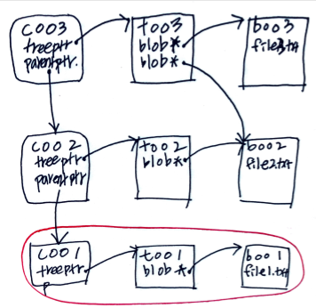

# Materials

* [10.2 Git의 내부 - Git 개체 @ progit](https://git-scm.com/book/ko/v2/Git%EC%9D%98-%EB%82%B4%EB%B6%80-Git-%EA%B0%9C%EC%B2%B4)
* [Gerrit을 이용한 코드 리뷰 시스템 - Gerrit과 Git @ naverD2](https://d2.naver.com/helloworld/1859580)

# Deleting branches

Git is a contents addressable file system. Structures of Git objects (commit, tree, blob). The red box means a snapshot.



The blob object saves the brand new version of a file not difference. So several blob objects of same file can be huge size. But Git provide packing to pack old objects and save just differences of blob bojects. After `$ git gc` Git will make files `./git/info/refs, ./git/objects/pack/*`

Recent commit objects can't be packed. So snapshos become huge even if they are useless. Finally, It's very important to delete old branches.

This is a command line which deletes all branches except master.

```bash
$ git branch | grep -v "master" | xargs git branch -D 
```

Even though you deleted branches you can restore using `$ git reflog`

```bash
$ git reflog
$ git branch feature/oldbranch xxxxxx
```

# Git LFS

[Git LFS @ TIL](/git#git-lfs)

# Git Cancel

* [[Git] git add 취소하기, git commit 취소하기, git push 취소하기](https://gmlwjd9405.github.io/2018/05/25/git-add-cancle.html)

## Cancel git add

```bash
$ git add *
$ git status
$ git reset HEAD a.txt
$ git status
```

## Cancel git commit

```bash
$ git log

# 0. cancel commit, files in commit will be remained staged
$ git reset --soft HEAD^

# 1. cancel commit, files in commit will be remained unstaged
#    mixed is default option of reset
$ git reset --mixed HEAD^
#    This is same with above
$ git reset HEAD^
#    cancel last 2 commits
$ git reset HEAD~2

# 2. cancel commit, files in commit will be deleted
$ git reset --hard HEAD^

# Update commit message
$ git commit --amend

# [WARN] Cancel everything and return to last commit 
$ get reset --hard HEAD
```

This is options of reset

| option | index | working dir |
|---|---|----|
| `-soft` | index 보존(add한 상태, staged 상태) | 워킹 디렉터리의 파일 보존. 즉 모두 보존. |
| `-mixed` |  index 취소(add하기 전 상태, unstaged 상태) | 워킹 디렉터리의 파일 보존 (기본 옵션) |
| `-hard` |  index 취소(add하기 전 상태, unstaged 상태) | 워킹 디렉터리의 파일 삭제. 즉 모두 취소. |

## Cancel git push

This is very dangerous. I think delete origin branch and push it again is better.

```bash
$ git reset HEAD^
$ git reflog or $ git log -g
$ git reset HEAD@{number} or $ git reset <commit-id>
$ git commit -m "Born again"
$ git push origin <branch-name> -f or $ git push origin +<branch-name>
$ git push origin +master
```

## Delete untracked files

```bash
# Delete files not dirs
$ git clean -f
# Delete files, dirs
$ git clean -f -d
# Delete files, dirs, ignored files
$ git clean -f -d -x
# Dry run
$ git clean -n -f -d -x
```


