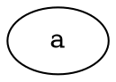

# Materials

* [10.2 Git의 내부 - Git 개체 @ progit](https://git-scm.com/book/ko/v2/Git%EC%9D%98-%EB%82%B4%EB%B6%80-Git-%EA%B0%9C%EC%B2%B4)
* [Gerrit을 이용한 코드 리뷰 시스템 - Gerrit과 Git @ naverD2](https://d2.naver.com/helloworld/1859580)

# Deleting branches

Structures of Git objects (commit, tree, blob).



Git can pack old objects automatically.

```bash
$ git gc
```

Recent commit objects can't be packed. So they became huge even if they are useless. Finally, You have to delete branched

# Git LFS

[Git LFS @ TIL](/git#git-lfs)

# Recovering with reflog

```bash
$ git reflog
$ git branch feature/oldbranch xxxxxx
```
