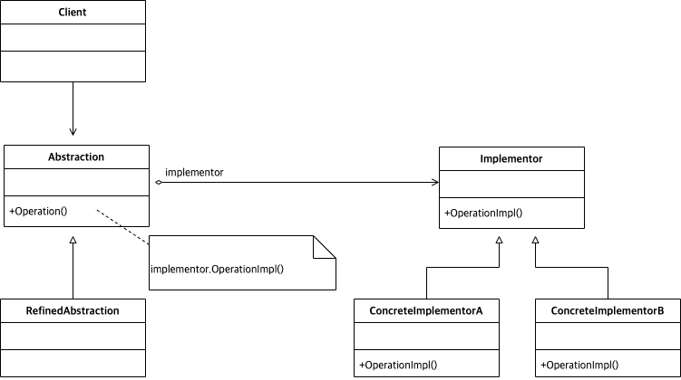

# Abstract

구현과 추상을 분리한다.

# Materials

* [Bridge @ dofactory](https://www.dofactory.com/net/bridge-design-pattern)

# UML Class Diagram

# Examples

* [Bridge in C++](/cpp/cpp_gof_designpattern.md#bridge )
* [Bridge in Java](/java/java_gof_designpattern.md#bridge )
* [Bridge in Kotlin](/kotlin/kotlin_gof_design_pattern.md#bridge )
* [Bridge in Python](/python/python_gof_designpattern.md#bridge )
* [Bridge in Go](/go/go_gof_design_pattern.md#bridge )
* [Bridge in Swift](/swift/swift_gof_designpattern.md#bridge )
