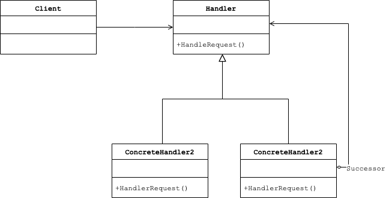

# Abstract

형제 클래스에게 임무를 전달한다.

# Materials

* [Chain of Resp. @ dofactory](https://www.dofactory.com/net/chain-of-resp-design-pattern)

# UML Class Diagram

# Examples

* [Chain Of Resp. in C++](/cpp/cpp_gof_designpattern.md#chain-of-resp)
* [Chain Of Resp. in Java](/java/java_gof_designpattern.md#chain-of-resp)
* [Chain Of Resp. in Kotlin](/kotlin/kotlin_gof_design_pattern.md#chain-of-resp)
* [Chain Of Resp. in Python](/python/python_gof_designpattern.md#chain-of-resp)
* [Chain Of Resp. in Go](/go/go_gof_design_pattern.md#chain-of-resp)
* [Chain Of Resp. in Swift](/swift/swift_gof_designpattern.md#chain-of-resp)
