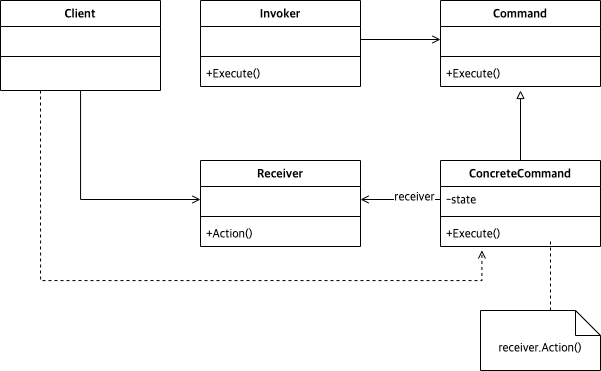

# Abstract

명령을 추상화 한다.

# Materials

* [Command @ dofactory](https://www.dofactory.com/net/command-design-pattern)

# UML Class Diagram

# Examples

* [Command in C++](/cpp/cpp_gof_designpattern.md#command)
* [Command in Java](/java/java_gof_designpattern.md#command)
* [Command in Kotlin](/kotlin/kotlin_gof_design_pattern.md#command)
* [Command in Python](/python/python_gof_designpattern.md#command)
* [Command in Go](/go/go_gof_design_pattern.md#command)
* [Command in Swift](/swift/swift_gof_designpattern.md#command)
