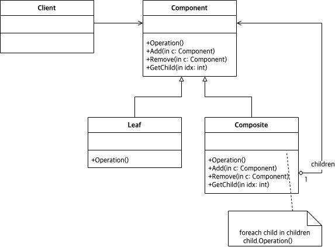

# Abstract

트리형태의 자료구조를 표현한다.

# Materials

* [Composite @ dofactory](https://www.dofactory.com/net/composite-design-pattern)

# Concept Class Diagram

# Examples

* [Composite in C++](/cpp/cpp_gof_designpattern.md#composite )
* [Composite in Java](/java/java_gof_designpattern.md#composite )
* [Composite in Kotlin](/kotlin/kotlin_gof_design_pattern.md#composite )
* [Composite in Python](/python/python_gof_designpattern.md#composite )
* [Composite in Go](/go/go_gof_design_pattern.md#composite )
* [Composite in Swift](/swift/swift_gof_designpattern.md#composite )
