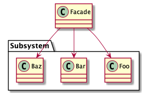

# Abstract

복잡한 기능을 단순한 인터페이스로 추상화한다.

# Materials

* [Facade @ dofactory](https://www.dofactory.com/net/facade-design-pattern)

# UML Class Diagram

# Examples

* [Facade in C++](/cpp/cpp_gof_designpattern.md#facade)
* [Facade in Java](/java/java_gof_designpattern.md#facade)
* [Facade in Kotlin](/kotlin/kotlin_gof_design_pattern.md#facade)
* [Facade in Python](/python/python_gof_designpattern.md#facade)
* [Facade in Go](/go/go_gof_design_pattern.md#facade)
* [Facade in Swift](/swift/swift_gof_designpattern.md#facade)
