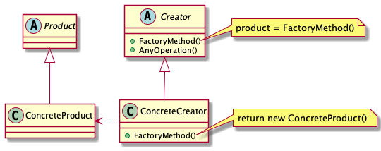

# Abstract

* 생성방법을 추상화한다. 동일한 분류의 오브젝트 생성방법을 추상화하여 타겟 인스턴스를 생성한다. 예를 들어 부품 인터페이스를 상속받는 키보드, 마우스 클래스의 생성방법을 추상화한다.

# Materials

* [Factory Method | dofactory](https://www.dofactory.com/net/factory-method-design-pattern)
* [Factory Method | ractoring.guru](https://refactoring.guru/design-patterns/factory-method)

# UML Class Diagram

# Examples

* [Factory Method in C++](/cpp/cpp_gof_designpattern.md#factory-method )
* [Factory Method in Java](/java/java_gof_designpattern.md#factory-method )
* [Factory Method in Kotlin](/kotlin/kotlin_gof_design_pattern.md#factory-method )
* [Factory Method in Python](/python/python_gof_designpattern.md#factory-method )
* [Factory Method in Go](/go/go_gof_design_pattern.md#factory-method )
* [Factory Method in Swift](/swift/swift_gof_designpattern.md#factory-method )
