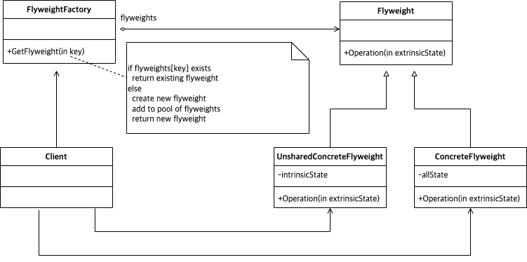

# Abstract

인스턴스 공유를 추상화한다.

# Materials

* [Flyweight @ dofactory](https://www.dofactory.com/net/flyweight-design-pattern)

# UML Class Diagram

# Examples

* [Flyweight in C++](/cpp/cpp_gof_designpattern.md#flyweight)
* [Flyweight in Java](/java/java_gof_designpattern.md#flyweight)
* [Flyweight in Kotlin](/kotlin/kotlin_gof_design_pattern.md#flyweight)
* [Flyweight in Python](/python/python_gof_designpattern.md#flyweight)
* [Flyweight in Go](/go/go_gof_design_pattern.md#flyweight)
* [Flyweight in Swift](/swift/swift_gof_designpattern.md#flyweight)
