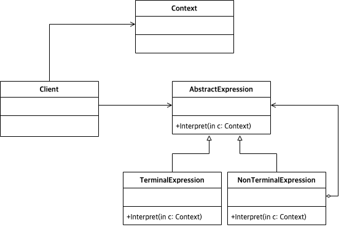

# Abstract

* 해석을 추상화 한다.
* A way to include language elements in a program

# Materials

* [Interpreter @ dofactory](https://www.dofactory.com/net/interpreter-design-pattern)

# UML Class Diagram

# Examples

* [Interpreter in C++](/cpp/cpp_gof_designpattern.md#interpreter)
* [Interpreter in Java](/java/java_gof_designpattern.md#interpreter)
* [Interpreter in Kotlin](/kotlin/kotlin_gof_design_pattern.md#interpreter)
* [Interpreter in Python](/python/python_gof_designpattern.md#interpreter)
* [Interpreter in Go](/go/go_gof_design_pattern.md#interpreter)
* [Interpreter in Swift](/swift/swift_gof_designpattern.md#interpreter)
