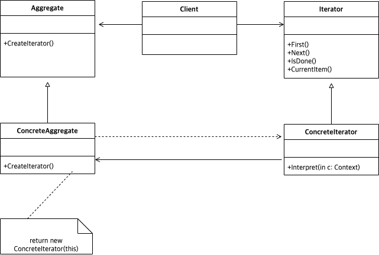

# Abstract

* 반복접근을 추상화 한다. (`hasNext(), next()`)
* Sequentially access the elements of a collection

# Materials

* [Iterator @ dofactory](https://www.dofactory.com/net/iterator-design-pattern)

# UML Class Diagram

# Examples

* [Iterator in C++](/cpp/cpp_gof_designpattern.md#Iterator)
* [Iterator in Java](/java/java_gof_designpattern.md#Iterator)
* [Iterator in Kotlin](/kotlin/kotlin_gof_design_pattern.md#Iterator)
* [Iterator in Python](/python/python_gof_designpattern.md#Iterator)
* [Iterator in Go](/go/go_gof_design_pattern.md#Iterator)
* [Iterator in Swift](/swift/swift_gof_designpattern.md#Iterator)
