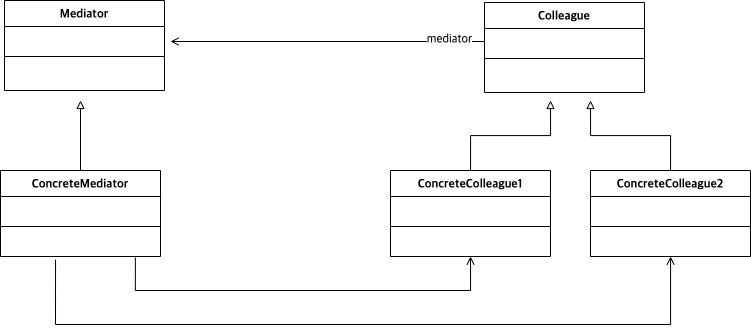

# Abstract

* 인스턴스 멤버들의 중재를 추상화 한다.
* Defines simplified communication between classes
  
# Materials

* [Mediator @ dofactory](https://www.dofactory.com/net/mediator-design-pattern)

# UML Class Diagram

# Examples

* [Mediator in C++](/cpp/cpp_gof_designpattern.md#mediator)
* [Mediator in Java](/java/java_gof_designpattern.md#mediator)
* [Mediator in Kotlin](/kotlin/kotlin_gof_design_pattern.md#mediator)
* [Mediator in Python](/python/python_gof_designpattern.md#mediator)
* [Mediator in Go](/go/go_gof_design_pattern.md#mediator)
* [Mediator in Swift](/swift/swift_gof_designpattern.md#mediator)
