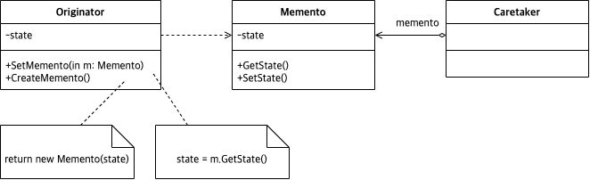

# Abstract

- Capture and restore an object's internal state
- 저장하기 불러오기를 추상화 한다.
  
# Materials

* [Memento @ dofactory](https://www.dofactory.com/net/memento-design-pattern)

# Concept Class Diagram

# Examples

* [Memento in C++](/cpp/cpp_gof_designpattern.md#memento)
* [Memento in Java](/java/java_gof_designpattern.md#memento)
* [Memento in Kotlin](/kotlin/kotlin_gof_design_pattern.md#memento)
* [Memento in Python](/python/python_gof_designpattern.md#memento)
* [Memento in Go](/go/go_gof_design_pattern.md#memento)
* [Memento in Swift](/swift/swift_gof_designpattern.md#memento)
