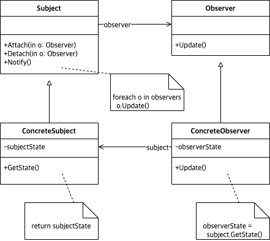

# Abstract

- A way of notifying change to a number of classes
- 이벤트가 발생하면 구경꾼들에게 알려준다.
- Listener pattern 이라고도 한다.
  
# Materials

* [Observer @ dofactory](https://www.dofactory.com/net/observer-design-pattern)

# UML Class Diagram

# Examples

* [Observer in C++](/cpp/cpp_gof_designpattern.md#observer)
* [Observer in Java](/java/java_gof_designpattern.md#observer)
* [Observer in Kotlin](/kotlin/kotlin_gof_design_pattern.md#observer)
* [Observer in Python](/python/python_gof_designpattern.md#observer)
* [Observer in Go](/go/go_gof_design_pattern.md#observer)
* [Observer in Swift](/swift/swift_gof_designpattern.md#observer)
