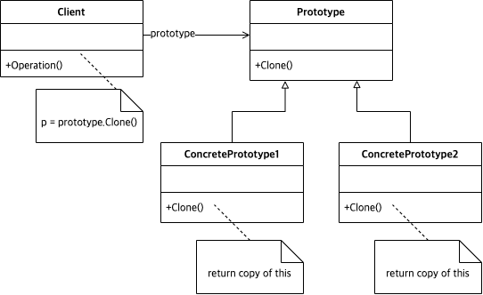

# Abstract

복제를 통해 타겟 오브젝트 인스턴스를 생성한다.

# Materials

* [Prototype @ dofactory](https://www.dofactory.com/net/prototype-design-pattern)

# UML Class Diagram

# Examples

* [Prototype in C++](/cpp/cpp_gof_designpattern.md#prototype )
* [Prototype in Java](/java/java_gof_designpattern.md#prototype )
* [Prototype in Kotlin](/kotlin/kotlin_gof_design_pattern.md#prototype )
* [Prototype in Python](/python/python_gof_designpattern.md#prototype )
* [Prototype in Go](/go/go_gof_design_pattern.md#prototype )
* [Prototype in Swift](/swift/swift_gof_designpattern.md#prototype )
