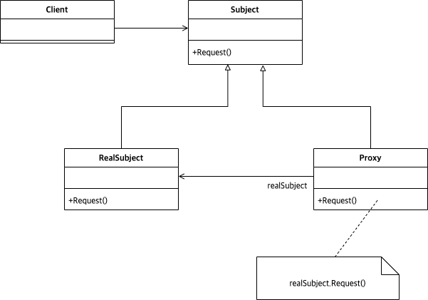

# Abstract

* 노출되지 않은 형제 클래스에 접근할 수 있도록 한다.
* 형제 클래스에 접근한다는 점이 Adapter 와 다르다.

# Materials

* [Proxy @ dofactory](https://www.dofactory.com/net/proxy-design-pattern)

# UML Class Diagram

# Examples

* [Proxy in C++](/cpp/cpp_gof_designpattern.md#proxy)
* [Proxy in Java](/java/java_gof_designpattern.md#proxy)
* [Proxy in Kotlin](/kotlin/kotlin_gof_design_pattern.md#proxy)
* [Proxy in Python](/python/python_gof_designpattern.md#proxy)
* [Proxy in Go](/go/go_gof_design_pattern.md#proxy)
* [Proxy in Swift](/swift/swift_gof_designpattern.md#proxy)
