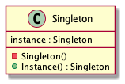

# Abstract

하나의 타겟 오브젝트 인스턴스만 생성한다.

# Materials

* [Singleton @ dofactory](https://www.dofactory.com/net/singleton-design-pattern)

# UML Class Diagram

# Examples

* [Singleton in C++](/cpp/cpp_gof_designpattern.md#singleton )
* [Singleton in Java](/java/java_gof_designpattern.md#singleton )
* [Singleton in Kotlin](/kotlin/kotlin_gof_design_pattern.md#singleton )
* [Singleton in Python](/python/python_gof_designpattern.md#singleton )
* [Singleton in Go](/go/go_gof_design_pattern.md#singleton )
* [Singleton in Swift](/swift/swift_gof_designpattern.md#singleton )
