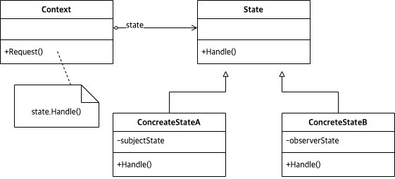

# Abstract

- Alter an object's behavior when its state changes
- 변화할 수 있는 상태를 추상화 한다.
  
# Materials

* [State @ dofactory](https://www.dofactory.com/net/state-design-pattern)

# UML Class Diagram

# Examples

* [State in C++](/cpp/cpp_gof_designpattern.md#state)
* [State in Java](/java/java_gof_designpattern.md#state)
* [State in Kotlin](/kotlin/kotlin_gof_design_pattern.md#state)
* [State in Python](/python/python_gof_designpattern.md#state)
* [State in Go](/go/go_gof_design_pattern.md#state)
* [State in Swift](/swift/swift_gof_designpattern.md#state)
