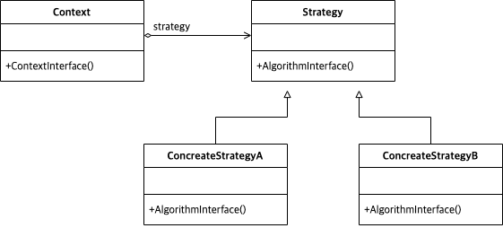
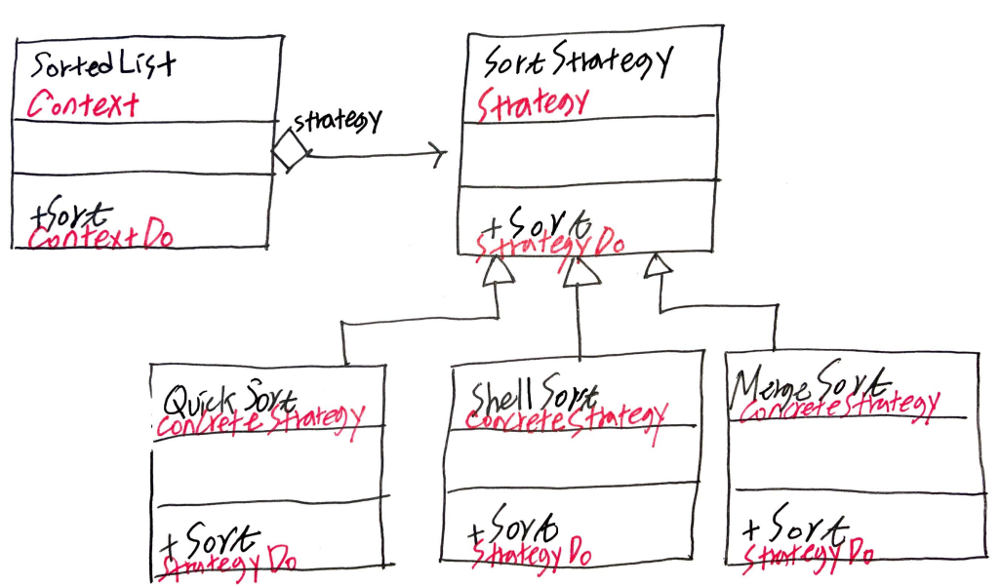

# Abstract

- Encapsulates an algorithm inside a class
- 인스턴스 교체를 통해 전략을 수정할 수 있다.
  
# Materials

* [Strategy @ dofactory](https://www.dofactory.com/net/strategy-design-pattern)

# UML Class Diagram

# Examples

* [Strategy in kotlin](/kotlin/kotlin_design_pattern/strategy.md)
* [Strategy in go](/golang/go_design_pattern/strategy.md)
