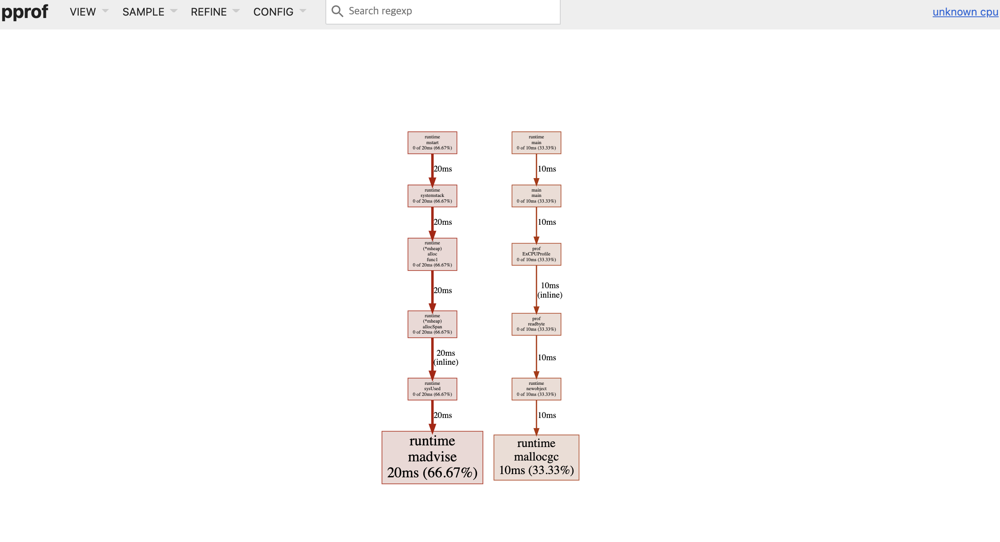

- [Abstract](#abstract)
- [Materials](#materials)
- [Basic](#basic)
  - [CPU profile](#cpu-profile)
  - [MEM profile](#mem-profile)
  - [Trace profile](#trace-profile)

----

# Abstract

pprof 사용법을 정리한다.

# Materials

* [High Performance Go Workshop](https://dave.cheney.net/high-performance-go-workshop/dotgo-paris.html)
  * [video](https://www.youtube.com/watch?v=nok0aYiGiYA)
  * [src](https://github.com/davecheney/high-performance-go-workshop)
  * [번역](https://ziwon.github.io/post/high-performance-go-workshop/)

# Basic

## CPU profile

다음과 같이 go code 를 추가한다.

```go
import (
	"github.com/pkg/profile"
)

defer profile.Start(profile.CPUProfile).Stop()
```

실행후 종료하면 CPU profile file 이 생성된다. 브라우저에서 확인한다.

```bash
$ go build ./cmd/main

$ time ./main
2022/01/05 23:15:48 profile: cpu profiling enabled, /var/folders/k9/0lf8g4rd1n12dtdr505cm8780000gp/T/profile157125688/cpu.pprof
"moby.txt": 181275 words
2022/01/05 23:15:48 profile: cpu profiling disabled, /var/folders/k9/0lf8g4rd1n12dtdr505cm8780000gp/T/profile157125688/cpu.pprof
./main  0.04s user 0.01s system 7% cpu 0.665 total

$ go tool pprof -http=:8080 /var/folders/k9/0lf8g4rd1n12dtdr505cm8780000gp/T/profile157125688/cpu.pprof
```



다음은 pprof prompt 에서 확인하는 방법이다.

```bash
$ go tool pprof /var/folders/k9/0lf8g4rd1n12dtdr505cm8780000gp/T/profile157125688/cpu.pprof
Type: cpu
Time: Jan 5, 2022 at 11:15pm (KST)
Duration: 203.29ms, Total samples = 30ms (14.76%)
Entering interactive mode (type "help" for commands, "o" for options)
(pprof) top
Showing nodes accounting for 30ms, 100% of 30ms total
Showing top 10 nodes out of 12
      flat  flat%   sum%        cum   cum%
      20ms 66.67% 66.67%       20ms 66.67%  runtime.madvise
      10ms 33.33%   100%       10ms 33.33%  runtime.mallocgc
         0     0%   100%       10ms 33.33%  github.com/iamslash/go-ex/go-ex-basic/prof.ExCPUProfile
         0     0%   100%       10ms 33.33%  github.com/iamslash/go-ex/go-ex-basic/prof.readbyte (inline)
         0     0%   100%       10ms 33.33%  main.main
         0     0%   100%       20ms 66.67%  runtime.(*mheap).alloc.func1
         0     0%   100%       20ms 66.67%  runtime.(*mheap).allocSpan
         0     0%   100%       10ms 33.33%  runtime.main
         0     0%   100%       20ms 66.67%  runtime.mstart
         0     0%   100%       10ms 33.33%  runtime.newobject
```

## MEM profile

다음과 같이 go code 를 추가한다.

```go
defer profile.Start(profile.MEMProfile).Stop()
//defer profile.Start(profile.MemProfile, profile.MemProfileRate(1)).Stop()
```

실행후 종료하면 MEM profile file 이 생성된다. 브라우저 및 콘솔에서 확인한다.

```bash
$ go build ./cmd/main
$ time ./main
$ go tool pprof -http=:8080 /var/folders/k9/0lf8g4rd1n12dtdr505cm8780000gp/T/profile157125688/cpu.pprof
$ go tool pprof /var/folders/k9/0lf8g4rd1n12dtdr505cm8780000gp/T/profile157125688/cpu.pprof
```

## Trace profile

Trace profile 을 통해 goroutine, heap, thread 의 추이를 확인할 수 있다. 또한
core utilization 도 확인할 수 있다. 

다음과 같이 go code 를 추가한다.

```go
defer profile.Start(profile.TraceProfile).Stop()
```

실행후 종료하면 MEM profile file 이 생성된다. 브라우저 에서 확인한다. 반드시 chrome browser 를 사용해야함.

```bash
$ go build ./cmd/main
$ time ./main
$ go tool trace /var/folders/k9/0lf8g4rd1n12dtdr505cm8780000gp/T/profile584343541/trace.out
```
