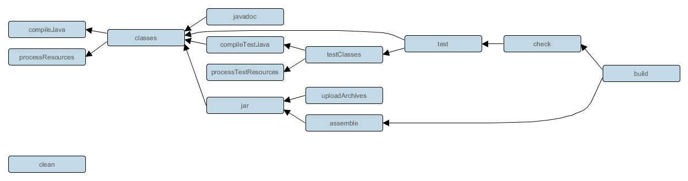
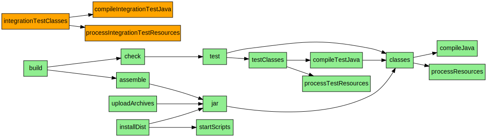
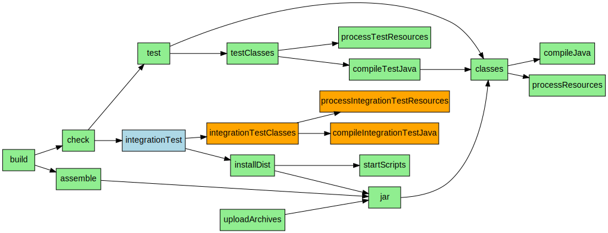
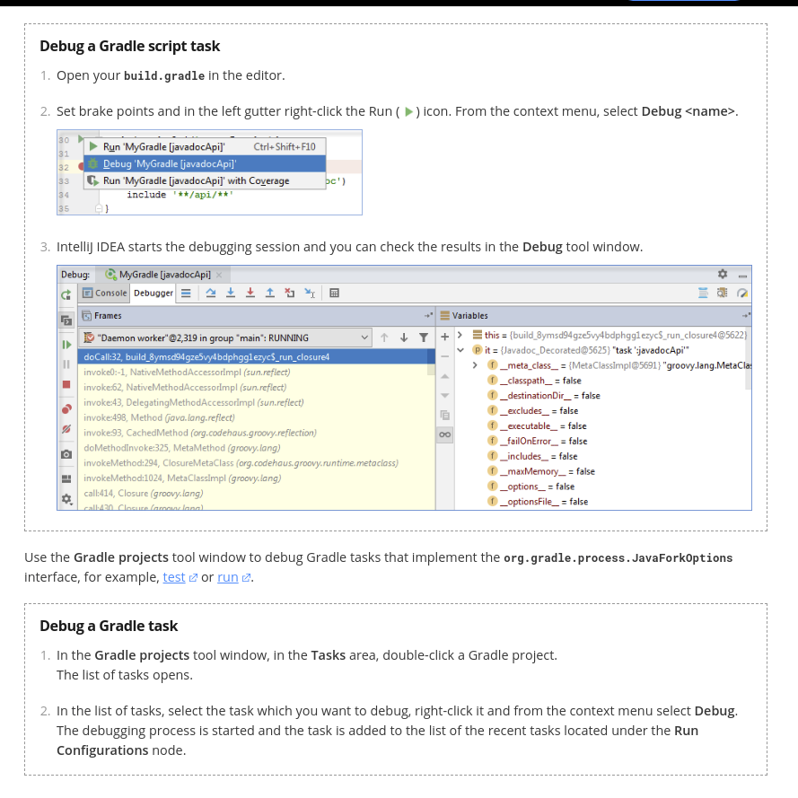

- [Abstract](#abstract)
- [Materials](#materials)
- [Basic](#basic)
- [Advanced](#advanced)
  - [`compile` vs `implementation`](#compile-vs-implementation)
  - [`implementation` vs `api`](#implementation-vs-api)
  - [How to debug gradle](#how-to-debug-gradle)
  - [Multiple projects](#multiple-projects)
  - [Using plugins](#using-plugins)
  - [How to make a custom gradle plugin](#how-to-make-a-custom-gradle-plugin)

----

# Abstract

Gradle 은 task runner 이다. Gradle 은 maven 보다 성능이 좋다. 먼저 [Groovy DSL](/groovy/README.md) 을 학습하여 closure, delegate 개념을 이해해야 한다.

# Materials
 
* [Gradle Dependency 분리하기](https://medium.com/@jsuch2362/gradle-dependency-%EB%B6%84%EB%A6%AC%ED%95%98%EA%B8%B0-eb0c7c794b9c)
  * 하나의 build.gradle 을 refactoring 하는 tutorial 
  * [src](https://github.com/ZeroBrain/DataBind-MVVM-Sample)
* [Gradle for Android and Java @ udacity](https://classroom.udacity.com/courses/ud867) 
  * Great materials
  * [src](https://github.com/udacity/ud867)
* [Command-Line Interface @ Gradle](https://docs.gradle.org/current/userguide/command_line_interface.html)
* [gradle DSL reference @ Gradle](https://docs.gradle.org/current/dsl/)
* [Creating New Gradle Builds @ Gradle](https://guides.gradle.org/creating-new-gradle-builds/)
* [Writing Build Scripts](https://docs.gradle.org/current/userguide/writing_build_scripts.html)
* [Project](https://docs.gradle.org/current/dsl/org.gradle.api.Project.html)

# Basic

* [2. Gradle의 기본 구조 살펴보기](https://gmind.tistory.com/entry/Gradle%EC%9D%98-%EA%B8%B0%EB%B3%B8-%EA%B8%B0%EB%8A%A5-%EB%A7%9B%EB%B3%B4%EA%B8%B0?category=655027)

```console
$ gradle version
$ cd my-app

# Generates gradlew, gradlew.bat, .gradle, gradle
# Those are for system Gradle is not installed on. 
# Those should be tracked by SCM.
$ gradle wrapper
$ tree -a .
.
├── .gradle
│   ├── 6.1.1
│   │   ├── executionHistory
│   │   │   ├── executionHistory.bin
│   │   │   └── executionHistory.lock
│   │   ├── fileChanges
│   │   │   └── last-build.bin
│   │   ├── fileHashes
│   │   │   ├── fileHashes.bin
│   │   │   └── fileHashes.lock
│   │   ├── gc.properties
│   │   └── vcsMetadata-1
│   ├── buildOutputCleanup
│   │   ├── buildOutputCleanup.lock
│   │   ├── cache.properties
│   │   └── outputFiles.bin
│   ├── checksums
│   │   └── checksums.lock
│   └── vcs-1
│       └── gc.properties
├── gradle
│   └── wrapper
│       ├── gradle-wrapper.jar
│       └── gradle-wrapper.properties
├── gradlew
└── gradlew.bat

# Generates build.gradle, settings.gradle, etc... interactively.
$ gradle init

Select type of project to generate:
  1: basic
  2: application
  3: library
  4: Gradle plugin
Enter selection (default: basic) [1..4] 2

Select implementation language:
  1: C++
  2: Groovy
  3: Java
  4: Kotlin
  5: Swift
Enter selection (default: Java) [1..5] 3

Select build script DSL:
  1: Groovy
  2: Kotlin
Enter selection (default: Groovy) [1..2] 1

Select test framework:
  1: JUnit 4
  2: TestNG
  3: Spock
  4: JUnit Jupiter
Enter selection (default: JUnit 4) [1..4] 4

Project name (default: my-app):
Source package (default: my.app):

> Task :init
Get more help with your project: https://docs.gradle.org/6.1.1/userguide/tutorial_java_projects.html

BUILD SUCCESSFUL in 30s
2 actionable tasks: 1 executed, 1 up-to-date

$ tree -a .
.
├── .gitattributes
├── .gitignore
├── .gradle
│   ├── 6.1.1
│   │   ├── executionHistory
│   │   │   ├── executionHistory.bin
│   │   │   └── executionHistory.lock
│   │   ├── fileChanges
│   │   │   └── last-build.bin
│   │   ├── fileHashes
│   │   │   ├── fileHashes.bin
│   │   │   └── fileHashes.lock
│   │   ├── gc.properties
│   │   └── vcsMetadata-1
│   ├── buildOutputCleanup
│   │   ├── buildOutputCleanup.lock
│   │   ├── cache.properties
│   │   └── outputFiles.bin
│   ├── checksums
│   │   └── checksums.lock
│   └── vcs-1
│       └── gc.properties
├── build.gradle
├── gradle
│   └── wrapper
│       ├── gradle-wrapper.jar
│       └── gradle-wrapper.properties
├── gradlew
├── gradlew.bat
├── settings.gradle
└── src
    ├── main
    │   ├── java
    │   │   └── my
    │   │       └── app
    │   │           └── App.java
    │   └── resources
    └── test
        ├── java
        │   └── my
        │       └── app
        │           └── AppTest.java
        └── resources
```

다음은 생성된 `settings.gralde` 이다. 

```groovy
rootProject.name = 'my-app'
```

include 를 사용하여 sub-project 를 설정할 수 있다.

```groovy
rootProject.name = 'my-app'
include 'backend'
include 'frontend'
```

다음은 생성된 `build.gradle` 이다. 

```groovy
plugins {
    // Apply the java plugin to add support for Java
    id 'java'

    // Apply the application plugin to add support for building a CLI application.
    id 'application'
}

repositories {
    // Use jcenter for resolving dependencies.
    // You can declare any Maven/Ivy/file repository here.
    jcenter()
}

dependencies {
    // This dependency is used by the application.
    implementation 'com.google.guava:guava:28.1-jre'

    // Use JUnit Jupiter API for testing.
    testImplementation 'org.junit.jupiter:junit-jupiter-api:5.5.2'

    // Use JUnit Jupiter Engine for testing.
    testRuntimeOnly 'org.junit.jupiter:junit-jupiter-engine:5.5.2'
}

application {
    // Define the main class for the application.
    mainClassName = 'my.app.App'
}

test {
    // Use junit platform for unit tests
    useJUnitPlatform()
}
```

java, application plugin 을 사용하면 다음과 같은 task graph 가 생성된다.



다음과 같이 `gradle build` 를 실행하면 수행되는 task 들을 알 수 있다.

```bash
$ gradle build -i

Initialized native services in: /Users/davidsun/.gradle/native
The client will now receive all logging from the daemon (pid: 89198). The daemon log file: /Users/davidsun/.gradle/daemon/6.1.1/daemon-89198.out.log
Starting 8th build in daemon [uptime: 2 mins 42.693 secs, performance: 99%, non-heap usage: 15% of 268.4 MB]
Using 16 worker leases.
Starting Build
Settings evaluated using settings file '/Users/davidsun/my/gradle/my-app/settings.gradle'.
Projects loaded. Root project using build file '/Users/davidsun/my/gradle/my-app/build.gradle'.
Included projects: [root project 'my-app']

> Configure project :
Evaluating root project 'my-app' using build file '/Users/davidsun/my/gradle/my-app/build.gradle'.
All projects evaluated.
Selected primary task 'build' from project :
Tasks to be executed: [task ':compileJava', task ':processResources', task ':classes', task ':jar', task ':startScripts', task ':distTar', task ':distZip', task ':assemble', task ':compileTestJava', task ':processTestResources', task ':testClasses', task ':test', task ':check', task ':build']
:compileJava (Thread[Execution worker for ':',5,main]) started.

...

BUILD SUCCESSFUL in 602ms
7 actionable tasks: 7 up-to-date
```

다음과 같이 새로운 task 를 기존의 task graph 에 삽입할 수 있다. 

* [Gradle-workshop](http://azquelt.github.io/gradle-workshop/)





```groovy
task integrationTest(type: Test) {
	dependsOn integrationTestClasses
	dependsOn installDist

	testClassesDir = sourceSets.integrationTest.output.classesDir
	classpath = sourceSets.integrationTest.runtimeClasspath
}
```

gradle deamon 은 gradle task 수행 속도를 빠르게 도와 준다. `gradle --stop` 은 gradle daemon 을 멈춘다.

`println` 은 `System.out.println` 의 shortcut 이다. groovy 에서 ][closure](/groovy/README.md#closure) 는 anonymous block of code 를 말한다. 다음은 `closure` 의 예이다.

```groovy
task groovy {}

def foo = "One million dollars"
def myClosure = {
    println "Hello from a closure"
    println "The value of foo is $foo"
}

myClosure()
def bar = myClosure
def baz = bar
baz()
```

`closure` 의 delegate 을 특정 instance 로 assign 하면 `closure` 의 variables, methods 들은 `closure.delegate` 의 variables, methods 와 같다.

```groovy
class GroovyGreeter {
    String greeting = "Default greeting"
    def printGreeting() { println "Greeting: $greeting" }
}
def myGroovyGreeter = new GroovyGreeter()

myGroovyGreeter.printGreeting()
myGroovyGreeter.greeting = "My custom greeting"
myGroovyGreeter.printGreeting()

def greetingClosure = {
  greeting = "Setting the greeting from a closure"
  printGreeting()
}

// greetingClosure() // This doesn't work, because `greeting` isn't defined
greetingClosure.delegate = myGroovyGreeter
greetingClosure() // This works as `greeting` is a property of the delegate
```

`-b` option 은 특정 build file 을 실행한다.

```bash
$ gradle -b a.gradle HelloWorld
```

closure 가 delgate 을 가질 수 있는 것 처럼 build.gradle 은 project 가 곧 delegate 이다. [Project](https://docs.gradle.org/current/dsl/org.gradle.api.Project.html)

```groovy
// project 의 task method
project.task("myTask1")
// This is same with above
task("myTask2")
// We can leave off the parentheses.
task "myTask3"
```

다음은 task object 의 description method 를 호출하고 group 을 assign 하고 doLast 를 호출하는 예이다. doLast 에 closure 를 parameter 로 넘겨줬다. [Tasks](https://docs.gradle.org/current/dsl/org.gradle.api.Task.html)

```groovy
task myTask7 {
    description("Description") // Function call works
    //description "Description" // This is identical to the line above
    group = "Some group" // Assignment also works
    doLast { // We can also omit the parentheses, because Groovy syntax
        println "Here's the action"
    }
}
```

또한 다음과 같이 task object 의 properties 를 argument 로 assign 할 수도 있다.

```groovy
task myTask8(description: "Another description") {
    doLast {
        println "Doing something"
    }
}
```

task 들은 `dependsOn`, `finalizedBy`, `mustRunAfter` 를 통해서 의존관계를 형성할 수 있다.

```groovy

task putOnSocks {
    doLast {
        println "Putting on Socks."
    }
}

task putOnShoes {
    dependsOn "putOnSocks"
    doLast {
        println "Putting on Shoes."
    }
}
```

"`$ gradle tasks`" 는 putOnSocks 를 보여주지는 않는다. 그러나 "`$ gradle tasks --all`" 을 통해 볼 수 있다.

```groovy

task eatBreakfast {
    finalizedBy "brushYourTeeth"
    doLast{
        println "Om nom nom breakfast!"
    }
}

task brushYourTeeth {
    doLast {
        println "Brushie Brushie Brushie."
    }
}
```

`gradle putOnFragrance takeShower` 를 실행하면 `takeShower` task 를 실행하고 `putOnFragrance` task 를 실행한다.

```grooyv
task takeShower {
    doLast {
        println "Taking a shower."
    }
}

task putOnFragrance {
    shouldRunAfter "takeShower"
    doLast{
        println "Smellin' fresh!"
    }
}
```

다음은 file copy task 의 예이다.

```groovy
task copyImages(type: Copy) {
    from 'images'
    into 'build'
}
```

include function 을 사용하여 복사 대상을 handle 할 수 있다.

```groovy
task copyJpegs(type: Copy) {
    from 'images'
    include '*.jpg'
    into 'build'
}
```

또한 multi source copy 도 가능하다.

```groovy
task copyImageFolders(type: Copy) {
    from('images') {
        include '*.jpg'
        into 'jpeg'
    }

    from('images') {
        include '*.gif'
        into 'gif'
    }

    into 'build'
}
```

다음은 `images/` 를 `build/images.zip` 으로 압축하는 예이다.

```groovy
task zipImages(type: Zip) {
    baseName = 'images'
    destinationDir = file('build')
    from 'images'
}
```

다음은 `images/*.jpg,*.gif` 를 압축한다.

```groovy

task zipImageFolders(type: Zip) {
    baseName = 'images'
    destinationDir = file('build')

    from('images') {
        include '*.jpg'
        into 'jpeg'
    }

    from('images') {
        include '*.gif'
        into 'gif'
    }
}
```

이제 `build/` 를 지우는 예이다.

```groovy
task deleteBuild(type: Delete) {
    delete 'build'
}
```

property value 를 전달하는 방법은 `gradle.poperties, command line, ext properties` 와 같이 3 가지가 존재한다. 

* 다음은 `gradle.properties, build.gradle` 의 예이다.

  ```groovy
  greeting = "Hello from a properties file"
  ```

  ```groovy
  task printGreeting {
    doLast {
      println greeting
    }
  }
  ```

* 다음은 command line 으로 properties 를 전달하는 예이다.

  ```bash
  $ gradle -Pgreeting="Hello from the command line" printGreeting
  $ gradle -Pgreeting="Hello from the command line" pG
  ```

* 다음은 `project.ext` property 에 closure 를 assign 하여 전달하는 예이다.

  ```groovy
  ext {
    greeting = "Hello from inside the build script"
  }
  ```

`class` 를 정의하여 task type 으로 사용할 수 있다.

```groovy
class MyTask extends DefaultTask {}
```

`HelloTask` 를 정의하여 task type 으로 사용해 보자. 새로운 class 는 DefaultTask 를 extends 하고 `@TaskAction` 을 사용한 function 을 정의해야 한다.  

```groovy
class HelloTask extends DefaultTask {
    @TaskAction
    void doAction() {
        println 'Hello World'
    }
}

task hello(type: HelloTask)
```

`task class` 에 property 도 사용할 수도 있다.

```groovy
class HelloNameTask extends DefaultTask {
    String firstName

    @TaskAction
    void doAction() {
        println "Hello, $firstName"
    }
}

task helloName(type: HelloNameTask) {
    firstName = 'Jeremy'
}
```

다음과 같이 logger 를 사용하여 logging 해보자. `gradle -b a.gradle --info hello`

```groovy
task hello(type: HelloTask)

class HelloTask extends DefaultTask {
    @TaskAction
    void doAction() {
        logger.info 'Start HelloTask Action'
        logger.lifecycle 'Hello World'
        logger.info 'End HelloTask Action'
    }
}
```

logger.debug 를 사용하려면 `gradle --debug HelloTask` 와 같이 `--debug` option 을 사용해야 한다.

```groovy
logger.debug "Catch me if you can"
```

`build.gradle` 에 다음과 같이 java plugin 을 사용하면 `assemble, build, check, clean` 등등의 task 들이 생겨난다. `$ gradle tasks --all` 을 실행하여 확인할 수 있다.

```groovy
apply plugin: "java"
```

그렇다면 gradle 은 어떻게 java application 을 실행하는 걸까? 다음과 같은 JavaExec type 의 task 가 이미 선언되어 있기 때문에 가능하다.

```groovy

task execute(type: JavaExec) {
    main = "com.udacity.gradle.Person"
    // We'll talk about this shortly
    classpath = sourceSets.main.runtimeClasspath
}
```

다음은 java plugin 을 사용했을 때 source 디렉토리를 추가하고 jar 를 생성할 때 attribute 를 추가하는 예이다.

```groovy
apply plugin: 'java' // 1. Apply the Java plugin to the project

sourceSets {
    main {
        java {
            srcDir 'java' // 3. Add 'java' directory as a source directory
        }
    }
}

jar {
    manifest {
        attributes 'Implementation-Version': '1.0' // 2. Add manifest attribute
    }
}
```

다음과 같이 repositories code block 을 이용하여 특정 directory 를 library dependency 로 설정할 수 있다.

```groovy
repositories {
    flatDir {
        dirs 'libs'
    }
```
}

또한 maven central, mave local, jcenter 와 같은 remote repositories 를 설정할 수도 있다.

```groovy
repositories {
    mavenCentral()
    mavenLocal()
    jcenter()
}
```

다음과 같이 remote repository 를 credential 과 함께 설정할 수도 있다.

```groovy
repositories {
    ivy {
        url 'https://repo.foo.org/ivy'
        credentials {
            username 'user'
            password 'secret'
        }
    }
}
```

다음은 java plugin 을 사용했을 때 library dependency 를 `group:name:version` 형식으로 설정한 예이다.

```groovy
dependencies {
    compile 'com.google.guava:guava:18.0'
}
```

또한 다음과 같이 key value 형태로 설정할 수도 있다.

```groovy
dependencies {
    compile group: 'com.google.guava', name: 'guava', version: '18.0'
}
```

다음은 local jar 를 library dependency 설정한 예이다.

```groovy
dependencies {
    compile files('libs/foo.jar', 'libs/bar.jar')
}
```

다음과 같이 FileTree 를 사용하여 directory 의 file 들을 libary dependency 설정할 수도 있다.

```groovy
dependencies {
    compile fileTree(dir: 'libs', include: '*.jar')
}
```

다음과 같이 java plugin 을 이용하여 `dependency {}` 을 설정했다고 해보자. `$ gradle dependencies` 를 실행하면 dependency graph 를 확인할 수 있다.

```groovy
apply plugin: 'java'

repositories {
    mavenCentral()
}

dependencies {
    compile 'org.springframework:spring-core:4.1.1.RELEASE'
}
```

만약 특정한 configuration 과 함께 dependency 를 확인하고 싶다면 `$ gradle dependencies --configuration runtime` 를 실행한다.

만약 특정한 library 의 version conflict 를 알고 싶다면 `$ gradle dependencyInsight --dependency commons-logging` 를 실행하여 확인한다. 예를 들어 다음과 같은 경우 `commons-logging` 은 `1.2` 로 선언되어 있기 때문에 `commons-logging` 을 `1.2` 로 업데이트 한다. 그러나 `spring-core` 는 `1.1.3` 과 match 이다. 이때 `$ gradle dependencyInsight --dependency commons-logging` 를 실행하여 conflict 를 확인할 수 있다.

```groovy
apply plugin: 'java'

repositories {
    mavenCentral()
}

dependencies {
    compile 'org.springframework:spring-core:4.1.1.RELEASE'
    compile 'commons-logging:commons-logging:1.2'
}
```

dependency 들은 configuration 으로 grouping 된다. `compile, testCompile` 등을 configuration 이라고 한다.

```groovy
apply plugin: 'java'

repositories {
    mavenCentral()
}

dependencies {
    compile 'commons-logging:commons-logging:1.1.3'
    testCompile 'junit:junit:4.12'
}
```

하나의 configuration 은 다른 configuration 을 extends 할 수 있다. 예를 들어 `testCompile` configuration 은 `compile` configuration 을 확장한 것이다. 또한 `configurations {}` 를 이용하여 custom configuration 을 만들 수 있다. `$ gradle dependencies` 를 실행하여 custom configuration 을 확인할 수 있다.

```groovy
configurations {
    custom
}

dependencies {
    custom 'com.google.guava:guava:18.0'
}
```

configuration 은 file collection 이다. 다음과 같이 file 들의 모음을 이용하여 copy 를 손쉽게 실행할 수 있다.

```groovy
task copyDependencies(type: Copy) {
    from configurations.custom
    into 'build/libs'
}
```

java plugin 을 사용했을 때 test 를 하는 것은 간단하다. `$ gradle test` 를 실행하면 된다. 그리고 test repost 는 `$ open build/reports/tests/index.html` 를 실행하여 확인할 수 있다. 다음은 `junit` 을 test framework depdency library 로 설정한 예이다.

```groovy
apply plugin: 'java'

repositories {
    mavenCentral()
}

dependencies {
    testCompile 'junit:junit:4.12'
}
```

gradle wrapper 는 특정 gradle version 을 지원하기 위해 필요하다. repository 를 clone 하고 처음으로 `$ ./gradlew tasks` 를 실행하면 해당 version 의 gradle 을 download 한다. 또한 `build.gradle` 의 wrapper task 에 gradle wrapper version 을 설정할 수도 있다.

```groovy
wrapper {
    gradleVersion = '2.2'
}
```

`$ ./gradlew --version` 를 실행하면 gradle wrapper version 을 알 수 있다. 이것은 `./gradle/wrapper/gradle-wrapper.properties` 에 저장된다. 이것을 수정하면 gradle wrapper version 을 변경할 수 있다.

# Advanced 

## `compile` vs `implementation`

* [What's the difference between implementation and compile in Gradle? @ stackoverflow](https://stackoverflow.com/questions/44493378/whats-the-difference-between-implementation-and-compile-in-gradle)

다음의 것들은 각각 변경되었다.

| previous             | now                         |
| -------------------- | --------------------------- |
| `compile`            | `implementation`            |
| `testCompile`        | `testImplementation`        |
| `debugCompile`       | `debugImplementation`       |
| `androidTestCompile` | `androidTestImplementation` |

## `implementation` vs `api`

다음과 같이 라이브러리의 의존성이 설정되어 있다고 해보자.

```
A(implementation) -> B -> C -> D
```

만약 `A` library 의 코드가 수정되어 rebuild 된다면 `implementation` 의 경우는 `A, B` 만 rebuild 된다. 그러나 `api` 의 경우는 `A, B, C, D` 모두 rebuild 된다.

또한 `A` library 에서 `B` 를 `api` 로 dependency 설정하는 경우 `A` 를 사용하는 host application 에서 `B` library 를 이용할 수 있다. [참고](https://stackoverflow.com/questions/44413952/gradle-implementation-vs-api-configuration/44419574#44419574)

예를 들어 다음과 같이 `InternalLibrary` library 와 `MyLibrary` library 가 있다고 하자. `MyLibrary` 는
`InternalLibrary` 를 사용한다.

```java
    // 'InternalLibrary' module
    public class InternalLibrary {
        public static String giveMeAString(){
            return "hello";
        }
    }
```

```java
    // 'MyLibrary' module
    public class MyLibrary {
        public String myString(){
            return InternalLibrary.giveMeAString();
        }
    }
```

그리고 `MyLibrary` library 의 build.gradle 이 다음과 같다.

```gradle
dependencies {
    api project(':InternalLibrary')
}
```

그리고 host application 의 build.gradle 은 다음과 같다.

```gradle
dependencies {
    implementation project(':MyLibrary')
}
```

이제 host application 에서 `InternalLibrary` 를 다음과 같이 사용할 수 있다.

```java
// Access 'MyLibrary' (granted)
MyLibrary myLib = new MyLibrary();
System.out.println(myLib.myString());

// Can ALSO access the internal library too (and you shouldn't)
System.out.println(InternalLibrary.giveMeAString());
```

그러나 `MyLibrary` 의 build.gradle 을 다음과 같이 수정하면 host application 에서 
`InternalLibrary` 를 사용할 수 없다.

```gradle
dependencies {
    implementation project(':InternalLibrary')
}
```

## How to debug gradle

* [How to debug a Gradle build.gradle file (in a debugger, with breakpoints)?
](https://stackoverflow.com/questions/28437636/how-to-debug-a-gradle-build-gradle-file-in-a-debugger-with-breakpoints)



## Multiple projects

* [Gradle 에서 Multi 프로젝트 만들기](https://yookeun.github.io/java/2017/10/07/gradle-multi/)


## Using plugins

* [Using Gradle Plugins](https://docs.gradle.org/current/userguide/plugins.html)

----

plugin 의 종류는 script plugin, binary plugin 과 같이 2 가지가 있다. 

보통 plugin 은 resolve, apply 2 단계로 적용된다. 

script plugin 의 경우 다음과 같이 특정 script plugin 을 download (resolve) 하고 현재 project 에 apply (apply) 한다.

```gradle
apply from: 'http://iamslash.com/foo.gradle'
```

```gradle
buildscript {
	ext {
		gradleUrl="http://gradle.iamslash.com/foo.gradle"
	}
	apply from: gradleUrl, to: it
```

binary plugin 은 다음과 같이 사용한다. [gradle plugins portal](https://plugins.gradle.org/) 에서 public plugins 의 `id` 를 알 수 있다.

```gradle
plugins {
  id "io.reconquest.gradle-android-eclipse" version "1.1"
}
```

## How to make a custom gradle plugin

* [Developing Custom Gradle Plugins](https://docs.gradle.org/current/userguide/custom_plugins.html)

----

This is a `build.gradle` with basic plugin.

```gradle
class GreetingPlugin implements Plugin<Project> {
    void apply(Project project) {
        project.task('hello') {
            doLast {
                println 'Hello from the GreetingPlugin'
            }
        }
    }
}

// Apply the plugin
apply plugin: GreetingPlugin
```

Let's run it.

```console
$ gradle -q hello
```
