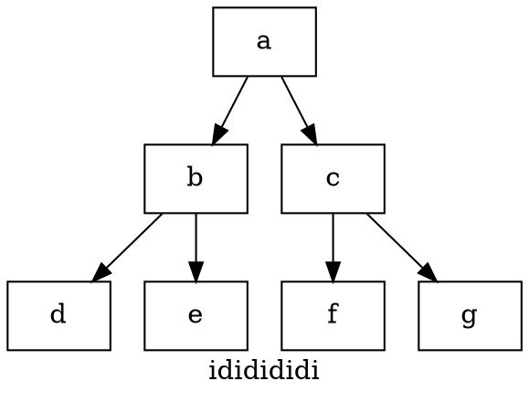

# Materials

* [Graphviz 소개](https://narusas.github.io/2019/01/25/Graphviz.html)

# Syntax

```
graph        :        [ strict ] (graph | digraph) [ ID ] '{' stmt_list '}'
stmt_list        :        [ stmt [ ';' ] stmt_list ]
stmt        :        node_stmt
|        edge_stmt
|        attr_stmt
|        ID '=' ID
|        subgraph
attr_stmt        :        (graph | node | edge) attr_list
attr_list        :        '[' [ a_list ] ']' [ attr_list ]
a_list        :        ID '=' ID [ (';' | ',') ] [ a_list ]
edge_stmt        :        (node_id | subgraph) edgeRHS [ attr_list ]
edgeRHS        :        edgeop (node_id | subgraph) [ edgeRHS ]
node_stmt        :        node_id [ attr_list ]
node_id        :        ID [ port ]
port        :        ':' ID [ ':' compass_pt ]
|        ':' compass_pt
subgraph        :        [ subgraph [ ID ] ] '{' stmt_list '}'
compass_pt        :        (n | ne | e | se | s | sw | w | nw | c | _)
```

* [lits of color](https://graphviz.gitlab.io/_pages/doc/info/colors.html)
* [attributes](https://graphviz.gitlab.io/_pages/doc/info/attrs.html)
* [shapes](https://graphviz.gitlab.io/_pages/doc/info/shapes.html#polygon)
* [Arrow Shapes](https://graphviz.gitlab.io/_pages/doc/info/arrows.html)

# Basic

