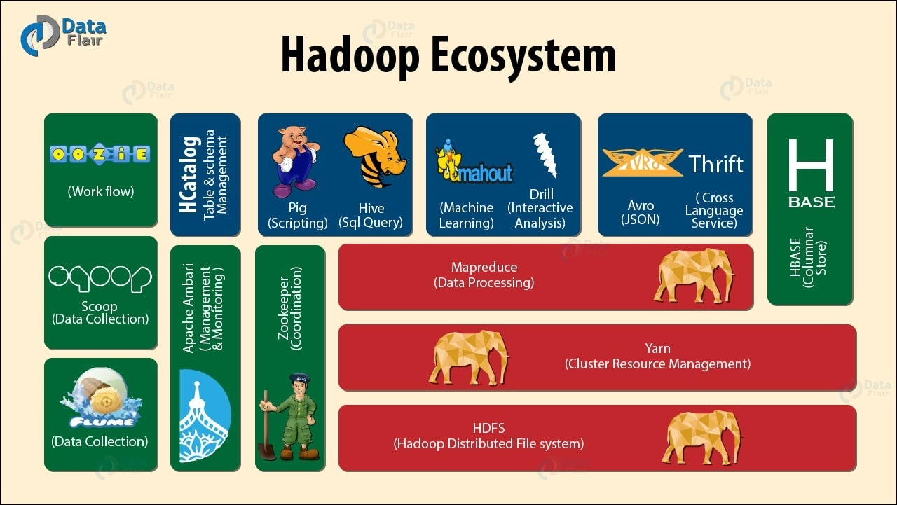

# Abstract

대용량 데이터를 분산 처리할 수 있는 자바 기반의 오픈 소스 프레임워크이다. 구글이 논문으로 발표한 GFS(Google File System) 과 맵리듀스(MapReduce) 를 2005 년 더그커팅이 제작한 구현체이다.

# Materials

* [Intro to Hadoop and MapReduce @ udacity](https://classroom.udacity.com/courses/ud617)
  * [src](https://github.com/ShanLu1984/Hadoop-and-MapReduce)
* [하둡(Hadoop) 소개 및 기본 구성요소 설명 @ opentutorials](https://opentutorials.org/module/2926/17055)
* [하둡 에코시스템(Hadoop-Ecosystem)이란?](https://over153cm.tistory.com/entry/%ED%95%98%EB%91%A1-%EC%97%90%EC%BD%94%EC%8B%9C%EC%8A%A4%ED%85%9CHadoopEcosystem%EC%9D%B4%EB%9E%80)

# Hadoop Echosystem



## YARN (Yet Another Resource Nagotiator) ##

하둡 2.0 부터 제공되는 리소스 관리 플랫폼.

# Basic Usages

## Install with docker

* [Docker 로 hadoop Cluster 구축하기](https://zesow.github.io/docker-%EB%A1%9C-hadoop-cluster-%EA%B5%AC%EC%B6%95%ED%95%98%EA%B8%B0/)

<br/>

```bash
# pull docker image
docker pull kmubigdata/ubuntu-hadoop

# setup network
docker network create --subnet 10.0.2.0/24 hadoop-cluster

# run master
docker run -dit --name yarn-master --network hadoop-cluster -p 19121:8088 --ip 10.0.2.2 --add-host=master:10.0.2.2 --add-host=slave1:10.0.2.3 --add-host=slave2:10.0.2.4 --add-host=slave3:10.0.2.5 --add-host=slave4:10.0.2.6 --add-host=slave5:10.0.2.7 --add-host=slave6:10.0.2.8 --add-host=slave7:10.0.2.9 --add-host=slave8:10.0.2.10 --add-host=slave9:10.0.2.11 --add-host=slave10:10.0.2.12 --add-host=slave11:10.0.2.13 --add-host=slave12:10.0.2.14 --add-host=slave13:10.0.2.15 --add-host=slave14:10.0.2.16 --add-host=slave15:10.0.2.17 --add-host=slave16:10.0.2.18 --add-host=slave17:10.0.2.19 --add-host=slave18:10.0.2.20 --add-host=slave19:10.0.2.21 --add-host=slave20:10.0.2.22 kmubigdata/ubuntu-hadoop /bin/bash

# run slaves
docker run -dit --name yarn-slave1 --network hadoop-cluster --ip 10.0.2.3 --add-host=master:10.0.2.2 --add-host=slave1:10.0.2.3 --add-host=slave2:10.0.2.4 --add-host=slave3:10.0.2.5 --add-host=slave4:10.0.2.6 --add-host=slave5:10.0.2.7 --add-host=slave6:10.0.2.8 --add-host=slave7:10.0.2.9 --add-host=slave8:10.0.2.10 --add-host=slave9:10.0.2.11 --add-host=slave10:10.0.2.12 --add-host=slave11:10.0.2.13 --add-host=slave12:10.0.2.14 --add-host=slave13:10.0.2.15 --add-host=slave14:10.0.2.16 --add-host=slave15:10.0.2.17 --add-host=slave16:10.0.2.18 --add-host=slave17:10.0.2.19 --add-host=slave18:10.0.2.20 --add-host=slave19:10.0.2.21 --add-host=slave20:10.0.2.22 kmubigdata/ubuntu-hadoop /bin/bash

# run on master and open HTTP://localhost:19121
docker exec -it yarn-master /bin/bash
cd /usr/local/hadoop/sbin/
./start-all.sh
```

Windows 10 에서 잘 된다.

## Commands

* [[hadoop] 하둡 명령어, 자주 사용하는 커맨드(hadoop command)](https://118k.tistory.com/200)

<br/>

```bash
# put file
hadoop fs -put yarn-daemon.sh /yarn-daemon.sh

# cat file
hadoop fs -cat /yarn-daemon.sh

# count dir, file, filesize
hadoop fs -count /

# copy file
hadoop fs -cp /yarn-daemon.sh /a.sh

# disk free space
# Filesystem                 Size   Used    Available  Use%
# hdfs://master:9000  62725787648  53248  55533641728    0%
hadoop fs -df /

# disk used space
hadoop fs -du /

# folder used space
hadoop fs -dus /

# download a file
hadoop fs -get /a.sh a.sh

# ls
hadoop fs -ls /

# mkdir
hadoop fs -mkdir /A

# mkdir dir with parents
hadoop fs -mkdir -p

# rm
hadoop fs -rm /a.sh

# rmdir
hadoop fs -rmr /A

# set replication value
hadoop fs -setrep [value] [source path]

# convert evrything with text and download
hadoop fs -text [source path]

# merge everything under remote path and copy to local path
hadoop fs -getmerge hdfs:// /tmp/a.txt
```
