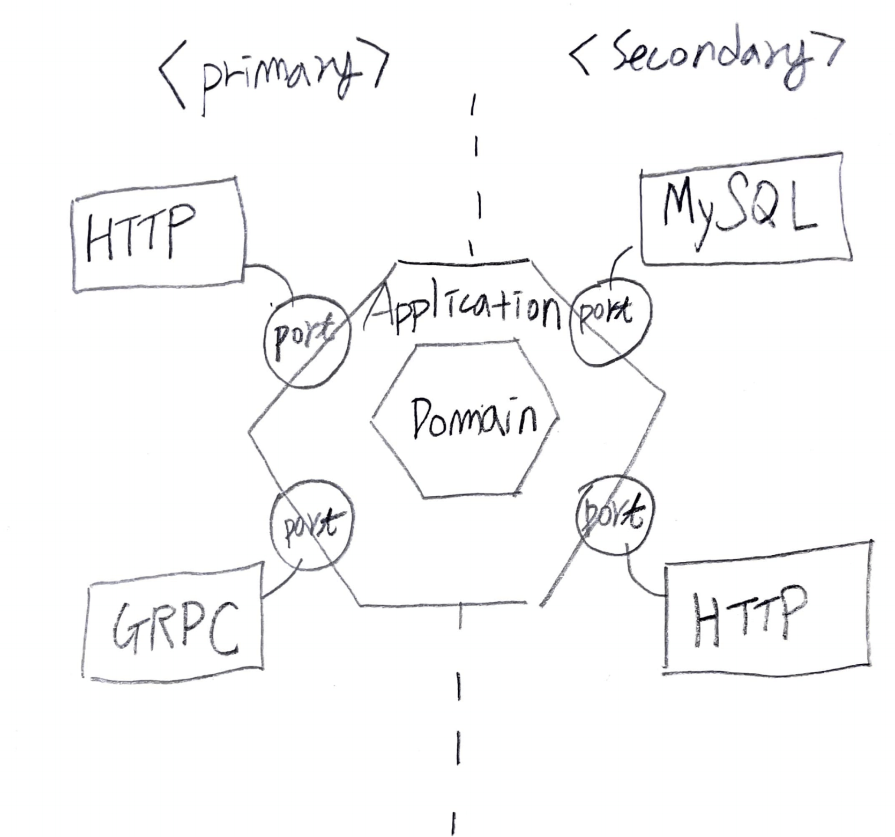

- [Abstract](#abstract)
- [Materials](#materials)
- [Basics](#basics)
  - [Hexagonal Archiecture Over View](#hexagonal-archiecture-over-view)
  - [Primary Port, Adapter Example](#primary-port-adapter-example)
  - [Secondary Port, Adapter Example](#secondary-port-adapter-example)
  - [Directory Structures](#directory-structures)

----

# Abstract

Hexagonal Architecture 는 [Alistair Cockburn](https://en.wikipedia.org/wiki/Alistair_Cockburn) 에 의해 발명되었다. 그것은 Layer 들의 의존성과 User Interface 에 Business Logic 이 섞이는 것을 해결해 준다. 

또한 Hexagonal Architecture 는 Ports and Adapters Architecture 라고 불리기도 한다. Port 는 Interface 를 의미하고 Adapter 는 Design Pattern 의 Adapter 와 같다.

Hexagonal 이라는 용어 때문에 6 가지 Port 를 써야할 거 같지만 그렇지 않다. 6 이라는 숫자보다는 충분한 Port 의 개수를 의미한다고 하는 것이 맞다.

# Materials

* [Get Your Hands Dirty on Clean Architecture](https://leanpub.com/get-your-hands-dirty-on-clean-architecture)
  * Getting started with Hexaganal Architecture 
  * [src](https://github.com/thombergs/buckpal)
  * [Hexagonal Architecture with Java and Spring](https://reflectoring.io/spring-hexagonal/)
* [지속 가능한 소프트웨어 설계 패턴: 포트와 어댑터 아키텍처 적용하기 @ line](https://engineering.linecorp.com/ko/blog/port-and-adapter-architecture/?fbclid=IwAR2GLZMhXkX4Weri0qHQaLkwhlaBEJgFZ0yEQ5ilQO_cDJgvb2AP4TCqRu0)
* [DDD, Hexagonal, Onion, Clean, CQRS, … How I put it all together](https://herbertograca.com/2017/11/16/explicit-architecture-01-ddd-hexagonal-onion-clean-cqrs-how-i-put-it-all-together/)

# Basics

## Hexagonal Archiecture Over View

다음은 Hexagonal Architecture 를 나타낸 그림이다. Secondary Port 는 Domain Layer 에 걸쳐있는게 더 맞을 것 같다.



네모는 **Adapter** 이고 동그라미는 **Port** 를 의미한다. **Port** 는 Interface 이다. **Adapter** 는 주로 class 이다.

Application Layer 를 기준으로 왼쪽의 Port, Adapter 를 Primary Port, Primary Adapter 라고 한다. Primary Adapter 에서 Primary Port 를 호출한다. 즉, 실행의 흐름은 `Primary Adapter -> Primary Port` 이다.

예를 들어 `@Controller` class 에서 Interface 를 호출한다. 그리고 Interface 를 implement 한 Application Layer 의 `@Service` class 가 호출된다.

현재 Primary Adapter 가 HTTP 를 이용해서 Primary Port 를 호출한다고 해보자. 그러나 HTTP 를 GRPC 로 변환해야 한다면 어떻게 해야 할까? GRPC Adapter 를 하나 만들어 해결할 수 있다. Port 가 Application Layer 를 보호해 준다.

Application Layer 를 기준으로 오른쪽의 Port, Adapter 를 Secondary Port, Secondary Adapter 라고 한다. Secondary Port 를 Secondary Adapter 가 구현한다. 즉, 실행의 흐름은 `Secondary Port -> Secondary Adapter` 이다.

예를 들어 `@Repository` 가 부착된 Interface 를 호출한다. Spring Data JPA 는 그것을 implement 하는 Class 를 미리만들어 둔다. 그리고 그 Adapter Class 가 호출된다.

현재 Secondary Adapter 가 MySQL 를 접근하고 있다고 해보자. 그러나 MySQL 을 Redis 로 변환해야 한다면 어떻게 해야할까? MySQL Adapter 대신 Redis Adapter 를 하나 만들어 해결할 수 있다. Spring Data JPA 가 대신해 줄 것이다. 역시 Domain Layer 와 Infrastracture 가 분리되어 있기 때문에 Domain Layer 를 보호할 수 있다.

## Primary Port, Adapter Example

다음은 Primary Port, Adapter 의 예이다. `OrderApiController` 가 Adapter 이고 
`OrderFacade` 가 Port 이다. 

`OrderFacadeImpl` 는 Port 를 implement 한 것이다. 그리고 `NotificationService` 를
호출하고 있다. `NotificationService` 는 Secondary Port 이다. 

HTTP 대신 GRPC 를 사용한다고 해보자. GRPC 를 지원하는 `OrderApiController` 를 새로 만들면 된다. Application Layer 를 보호할 수 있다.

```java
// com/iamslash/order/interfaces/order/OrderApiController.java
@Slf4j
@RestController
@RequiredArgsConstructor
@RequestMapping("/api/v1/orders")
public class OrderApiController {
    private final OrderFacade orderFacade;
    private final OrderDtoMapper orderDtoMapper;

    @PostMapping("/payment-order")
    public CommonResponse paymentOrder(@RequestBody @Valid OrderDto.PaymentRequest paymentRequest) {
        var paymentCommand = orderDtoMapper.of(paymentRequest);
        orderFacade.paymentOrder(paymentCommand);
        return CommonResponse.success("OK");
    }
}

// com/iamslash/order/application/order/OrderFacade.java
public interface OrderFacade {
    void paymentOrder(OrderCommand.PaymentRequest paymentRequest);
}

// com/iamslash/order/application/order/OrderFacadeImpl.java
@Slf4j
@Service
@RequiredArgsConstructor
public class OrderFacadeImpl : implements OrderFacade {
    private final OrderService orderService;
    private final NotificationService notificationService;

    @Override
    public void paymentOrder(OrderCommand.PaymentRequest paymentRequest) {
        orderService.paymentOrder(paymentRequest);
        notificationService.sendSms(null, null);
    }
}
```

## Secondary Port, Adapter Example

다음은 Secondary Port, Adapter 의 예이다. `NotificationService` 가 Port 이고 `NotificationExecutor` 가 adapter 이다. 

SMS 를 보내는 방식이 변경되었다면 `NotifactionExecutor` 를 새로 만들면 된다. Domain Layer 를 보호할 수 있다.

```java
// com/iamslash/order/domain/notification/NotificationService.java
public interface NotificationService {
    void sendSms(String phoneNo, String description);
}

// com/iamslash/order/infrastructure/NotificationExecutor.java
@Slf4j
@Component
public class NotificationExecutor implements NotificationService {

    @Override
    public void sendSms(String phoneNo, String description) {
        log.info("sendSms");
    }
}
```

## Directory Structures

[Example Implementation of a Hexagonal Architecture | github](https://github.com/thombergs/buckpal) 의 구조가 맘에든다.

```bash
└── src
    ├── main
    │   ├── java
    │   │   └── io
    │   │       └── reflectoring
    │   │           └── buckpal
    │   │               ├── account
    │   │               │   ├── adapter
    │   │               │   │   ├── in
    │   │               │   │   │   └── web
    │   │               │   │   └── out
    │   │               │   │       └── persistence
    │   │               │   ├── application
    │   │               │   │   ├── port
    │   │               │   │   │   ├── in
    │   │               │   │   │   └── out
    │   │               │   │   └── service
    │   │               │   └── domain
    │   │               └── common
```
