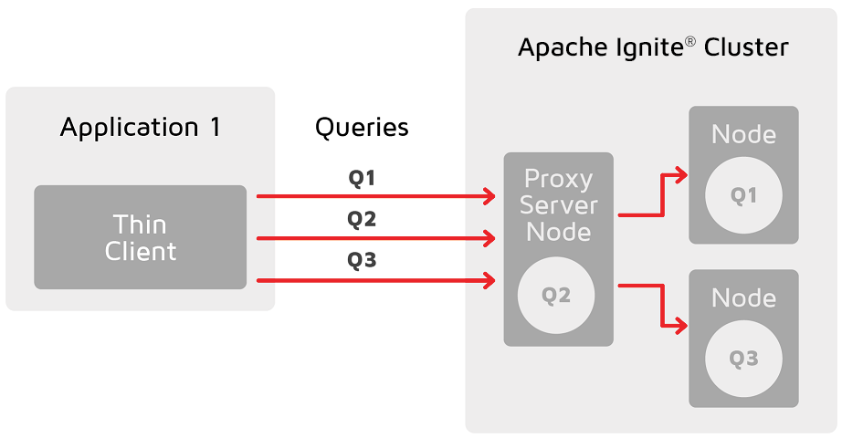

- [Abstract](#abstract)
- [Materials](#materials)
- [Basic](#basic)
  - [IgniteConfiguration](#igniteconfiguration)
  - [Run](#run)
  - [Use Cases](#use-cases)
  - [Data Modeling](#data-modeling)
  - [Cache Configuration](#cache-configuration)
  - [Data Partitioning](#data-partitioning)
  - [Distributed Joins](#distributed-joins)
  - [Affinity Colocation](#affinity-colocation)
  - [Ignite vs Redis](#ignite-vs-redis)
  - [Data Rebalancing](#data-rebalancing)
  - [Baseline Topology](#baseline-topology)
  - [Partition Awareness](#partition-awareness)
  - [Atomicity Modes](#atomicity-modes)
  - [Concurrent Modes and Isolation Levels](#concurrent-modes-and-isolation-levels)
  - [Performing Transactions](#performing-transactions)
  - [Read Consistency](#read-consistency)
  - [Ignite Persistence](#ignite-persistence)

-----

# Abstract

Apache Ignite 에 대해 정리한다.

# Materials

* [Learn Apache Ignite Through Coding Examples @ youtube](https://www.youtube.com/watch?v=uRdSKhFqeaU)
  * [src](https://github.com/GridGain-Demos/ignite-learning-by-examples)

# Basic

## IgniteConfiguration

* [Class IgniteConfiguration](https://ignite.apache.org/releases/latest/javadoc/org/apache/ignite/configuration/IgniteConfiguration.html)

설정이 너무 많다.

## Run

다음과 같은 방법으로 Ignite, GridGain Control Center 를 실행한다.

* [Learning Apache Ignite Through Examples | github](https://github.com/GridGain-Demos/ignite-learning-by-examples) 를 clone 한다.
* Download [Apache Ignite 2.8.1 or later](https://ignite.apache.org/download.cgi)
  * Binary Releases 를 다운받는다.
* Download [GridGain Control Center agent](https://www.gridgain.com/tryfree#controlcenteragent) and put it into the Ignite libs folder.
  * GridGain Control Center agent 의 압축을 풀고 `bin, libs` 디렉토리를 `apache-ignite-2.12.0-bin/` 에 복사한다.

```bash
# Start a 2-nodes cluster 
# using `{root_of_this_project}/complete/cfg/ignite-config.xml`.
#
# Run node 1 on terminal 1
$ ./ignite.sh ~/my/java/ignite-learning-by-examples/complete/cfg/ignite-config.xml
# Run node 2 on terminal 2
$ ./ignite.sh ~/my/java/ignite-learning-by-examples/complete/cfg/ignite-config.xml
# stdout 의 log 를 살펴보자. Control Center 의 link 를 클릭하여 
# Control Center 에 접속한다. Cluter 를 Activate 한다.

# Run sql client
$ ./sqlline.sh --verbose=true -u jdbc:ignite:thin://127.0.0.1/

# Restore sql script
sqlline> !run ~/my/java/ignite-learning-by-examples/complete/scripts/ignite_world.sql
sqlline> SELECT * FROM COUNTRY LIMIT 100;
```

## Use Cases

다음과 같은 용도로 Ignite 를 사용한다.

* In-Memory Cache
* In-Memory Data Grid
* In-Memory Database
* Key-Value Store
* High-Performance Computing
* Digital Integration Hub
* Spark Acceleration
* Hadoop Acceleration

## Data Modeling

> [Data Modeling](https://ignite.apache.org/docs/latest/data-modeling/data-modeling)

Physical level 에서 Data Entry (either **cache entry** or **table row**) 는
binary object 형태로 저장된다. 여러 Data Entry 가 모여있는 Data Set 은 다시 여러
Partition 으로 나눠진다. 각 Partition 은 여러 Node 들로 분산되어 배치된다. 또한
각 Partition 은 Replication Factor 만큼 복제된다. [Kafka](/kafka/README.md) 와 똑같다.

Logical level 에서 Data Set 은 **Key-Value Cache** 혹은 **SQL Tables** 로 표현된다.
표현만 다를 뿐이지 Physical level 에서 같다. 아래와 같이 Country Table 은 key 가 CODE 이고
나머지 값들이 value 인 **Key-Value Cache** 와 같다.


## Cache Configuration

> * [Cache Configuration](https://ignite.apache.org/docs/latest/configuring-caches/configuration-overview#configuration-example)

다음과 같은 값들을 설정할 수 있다.

| Parameter | Description | Default Value |
|--|--|--|
| `name` | cache name | |
| `cacheMode` | `PARTITIONED, REPLICATED` | `PARTITIONED` |
| `writeSynchronizationMode` | sync 의 정도. `FULL_SYNC, FULL_ASYNC, PRIMARY_SYNC` | `PRIMARY_SYNC` |
| `rebalanceMode` | rebalance 의 정도. `SYNC, ASYNC, NONE` | `ASYNC` |
| `backups` | The number of backup partitions for the cache. | 0 |
| `partitionLossPolicy` | ??? | `IGNORE` |
| `readFromBackup` | 읽기를 Backup Partition 에서 할 것인가? | `true` |
| `queryPrallelism` | The number of threads in a single node to process a SQL query executed on the cache. | `1` |

아래는 xml 예제이다.

```xml
<bean class="org.apache.ignite.configuration.IgniteConfiguration">
    <property name="cacheConfiguration">
        <bean class="org.apache.ignite.configuration.CacheConfiguration">
            <property name="name" value="myCache"/>
            <property name="cacheMode" value="PARTITIONED"/>
            <property name="backups" value="2"/>
            <property name="rebalanceMode" value="SYNC"/>
            <property name="writeSynchronizationMode" value="FULL_SYNC"/>
            <property name="partitionLossPolicy" value="READ_ONLY_SAFE"/>
            <!-- Other parameters -->
        </bean>
    </property>
</bean>
```

## Data Partitioning

> * [Data Partitioning](https://ignite.apache.org/docs/latest/data-modeling/data-partitioning)
> * [Data Distribution in Apache Ignite](https://www.gridgain.com/resources/blog/data-distribution-in-apache-ignite)
>   * [pdf](https://go.gridgain.com/rs/491-TWR-806/images/2019-03-12-AI-meetup-Affinity.pdf)

Ignite 는 다음과 같은 Cache Mode 를 제공한다.

* `PARTITIONED`: Data Sets 을 Partition 으로 나누어서 Node 들에게 분배한다.
  Update Operation 이 많은 경우 유용하다.
  * Cache Configuration 을 수정하여 Backup Partition 의 개수를 설정할 수 있다.
* `REPLICATED`: 모든 node 에 하나의 Primary Parition 과 Backup Partition 들이
  배치된다. Availability 는 좋지만 Performance 가 좋지 않다. Read Operation 이
  80% 정도이면 유용하다.

## Distributed Joins

> [Distributed Joins](https://ignite.apache.org/docs/latest/SQL/distributed-joins)

Distributed Joins 는 **Colocated Joins** 와 **Non-colocated Joins** 와 같이 2 가지가 있다.

If the tables are joined on the partitioning column (affinity key), the join is called a **colocated join**. Otherwise, it is called a **non-colocated join**.

affinity key 를 설정해 두면 가까운 Data Entry 들은 같은 Partition 으로 배치된다.

**Colocated Joins**

Client 는 Ignite Cluster Node 들에게 Query 를 보낸다. 각 Node 는 Query 를
실행하고 결과를 Client 에게 돌려준다. Client 는 결과를 모은다.


**Non-colocated Joins**

Client 는 Ignite Cluster Node 들에게 Query 를 보낸다. 각 Node 는 broad-cast,
uni-cast 를 통해서 missing data 를 주고 받는다. 각 Node 는 결과를 Client 에게
돌려준다. Client 는 결과를 모은다.


## Affinity Colocation

서로 다른 Table 의 record 라도 affinity 설정을 해 놓으면 같은 partition 에 배치된다.

## Ignite vs Redis

> [GridGain In-Memory Computing Platform Feature Comparison: Redis](https://go.gridgain.com/rs/491-TWR-806/images/GridGain-Feature-Comparison-Redis-Final.pdf)

Ignite 를 Primary DB 로 사용했을 때 Redis 와 비교하여 장단점을 정리해 본다.

**pros**

* Cache Layer, Main DB 가 하나로 합쳐져 있다. Simplification.
  * `Redis (Cache Layer) + cassanra (Primary DB)` 는 복잡도가 높다.
* Native Persistency 를 지원한다. 그러나 Performance 가 떨어진다. Durability.
  * Redis Enterprise 역시 Durability 를 지원한다고 함.
* SQL-99 를 지원한다.
* Cache (Table) 별로 Atomicity Modes, Concurrent Modes, Isolation Level 에 따라
  Transaction 을 지원한다.

**cons**

* Ignite 는 Memory 를 주로 사용한다. 비싸다. Write operation 이 많다면 [cassandra](/cassandra/README.md) 혹은 [scylla](/scylla/README.md) 가 비용면에서 유리하다.
* 서비스가 Eventual Consistency 라면 굳이 Ignite 를 사용할 이유가 없다. 역시 [cassandra](/cassandra/README.md) 혹은 [scylla](/scylla/README.md) 가 비용면에서 유리하다.

## Data Rebalancing

> [Data Rebalancing](https://ignite.apache.org/docs/latest/data-rebalancing)

Ignite Cluster 에 새로운 Node 가 참여하거나 기존의 Node 가 빠져나갔을 때 Partition 이 재배치 되는 것을 말한다.

## Baseline Topology

> [Baseline Topology](https://ignite.apache.org/docs/latest/clustering/baseline-topology)

Baseline Topology 가 바뀌면 Data Rebalancing 이 일어난다. 

유지보수를 위해 Node 가 잠깐 빠져나갔다가 다시 들어온다면 Baseline Toplogy 를 바꾸지 말자.

## Partition Awareness

> [Partition Awareness](https://ignite.apache.org/docs/latest/thin-clients/getting-started-with-thin-clients#partition-awareness)

Partition Awareness 가 없는 Thin Client 는 모든 Query 를 하나의 Proxy Node 를 통해 보낸다. 병목현상이 있다.



Partition Areness 가 있는 Thin Client 는 모든 Query 를 Partition 이 배치된 Node 들에게 나눠 보낸다. 병목현상이 없다.


## Atomicity Modes

> [Atomicity Modes](https://ignite.apache.org/docs/latest/configuring-caches/atomicity-modes)

기본적으로 Ignite 는 하나의 record 에 대해 Atomic Operation 을 제공한다. 또한
[Atomicity Modes](https://ignite.apache.org/docs/latest/configuring-caches/atomicity-modes)
를 `Transactional` 로 설정하면 ACID-compliant transaction 을 사용할 수 있다.

[Atomicity Modes](https://ignite.apache.org/docs/latest/configuring-caches/atomicity-modes) 의 종류는 다음과 같다.

* `ATOMIC`: record 하나의 `atoicity (all or nothing)` 을 보장한다. 만약
  `putAll(), removeAll()` 이 실패한다면 `CachePartialUpdateException` 이
  발생한다. 그리고 실패한 key 들의 리스트가 Exception 에 포함된다.
* `TRANSACTIONAL`: `Key-Value transaction` 에 대해서 `ACID-compliant transactions`
  을 지원한다. `SQL transaction` 은 아니다.
* `TRANSACTIONAL_SNAPSHOT`: `key-value transactions, SQL transactions` 에 대해
  `multiversion concurrency control (MVCC)` 를 지원한다. 그러나 `2.12` 부터
  Deprecated 되었다.  

## Concurrent Modes and Isolation Levels

> [Concurrency Modes and Isolation Levels](https://ignite.apache.org/docs/latest/key-value-api/transactions#concurrency-modes-and-isolation-levels)

Ignite 는 다음과 같은 Concurrent Modes 를 제공한다.

* `OPTIMISTIC`
* `PESSIMISTIC`

또한 다음과 같은 Isolation Levels 을 제공한다.

* `READ_COMMITTED`
* `REPEATABLE_READ`
* `SERIALIZABLE`
  
## Performing Transactions

> [Performing Transactions](https://ignite.apache.org/docs/latest/key-value-api/transactions)

Ignite 는 [Atomicity Modes](https://ignite.apache.org/docs/latest/configuring-caches/atomicity-modes)
 가 `Transactional` 이면 `Concurrent Modes` 와 `Isolation Levels` 의 조합에 따라
 다양한 방법의 Transaction 을 제공한다.

* `PESSIMISTIC`
  * `READ_COMMITTED`: Data is read without a lock and is never cached in the
    transaction itself.
  * `REPEATABLE_READ`: Entry lock is acquired and data is fetched from the
    primary node on the first read or write access and stored in the local
    transactional map.
  * `SERIALIZABLE`: same as `REPEATABLE_READ`.
* `OPTIMISTIC`
  * `READ_COMMITTED`: Changes that should be applied to the cache are collected
    on the originating node and applied upon the transaction commit.
  * `REPEATABLE_READ`: similar with `READ_COMMITTED`. 
  * `SERIALIZABLE`: 첫번째 읽을 때 저장한다. 이것을 변경해 보자. 첫번째 읽었을
    때와 같다면 성공이다. 다르다면 `TransactionOptimisticException` 을 던지고
    roll-back 한다. Client 는 다시시도 할 것이다.

제대로 이해하지 못했다. code 를 보아야할 것 같다.

## Read Consistency

Full Read Consistency 를 위해서는 Read Lock 이 필요하다. `PESSIMISTIC`
concurrent mode 에서는 `PESSIMISTIC REPEATABLE_READ` 혹은 `PESSIMISTIC
SERIALIZABLE` 로 가능하다.

`OPTIMISTIC` concurrent mode 에서는 `OPTIMISTIC SERIALIZABLE` 으로 Full Read
Consistency 를 구현할 수 있다. `TransactionOptimisticException` 이 발생하면 다시
시도한다. 

## Ignite Persistence

* [Ignite Persistence](https://ignite.apache.org/docs/latest/persistence/native-persistence)

Ignite 는 Native Persistence 를 제공한다. 즉, 모든 Data 를 Disk 에 쓸 수 있다.
메모리는 RAM 의 capacity 만큼 Data 를 로딩한다. 

예를 들어 100 개의 Data
가 있다고 하자. RAM 의 capacity 는 20 이다. 그렇다면 Disk 에는 100 개가 저장되고
RAM 에는 20 개가 저장된다.

다음과 같이 활성화 한다.

```xml
<bean class="org.apache.ignite.configuration.IgniteConfiguration">
    <property name="dataStorageConfiguration">
        <bean class="org.apache.ignite.configuration.DataStorageConfiguration">
            <property name="defaultDataRegionConfiguration">
                <bean class="org.apache.ignite.configuration.DataRegionConfiguration">
                    <property name="persistenceEnabled" value="true"/>
                </bean>
            </property>
        </bean>
    </property>
</bean>
```

> [Write-Ahead Log](https://ignite.apache.org/docs/latest/persistence/native-persistence#write-ahead-log)

Write-Ahead Log (WAL) 은 일종의 commit-log 이다. write, delete operation 들을
로깅한다. RAM 의 page 가 update 되면 Partition 에 바로 기록되지 않고 일단 WAL 에 추가된다.
