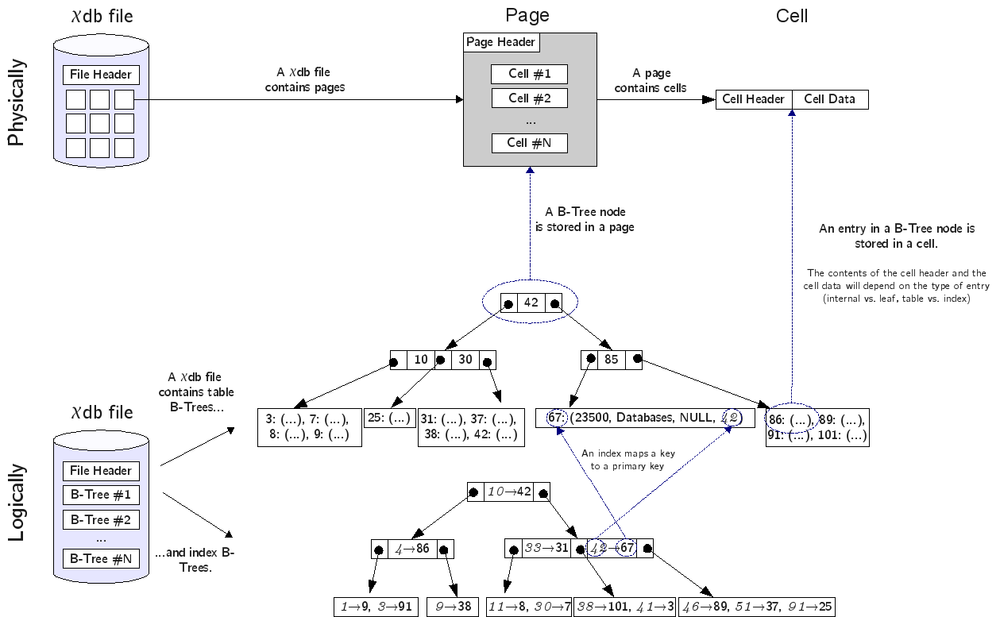
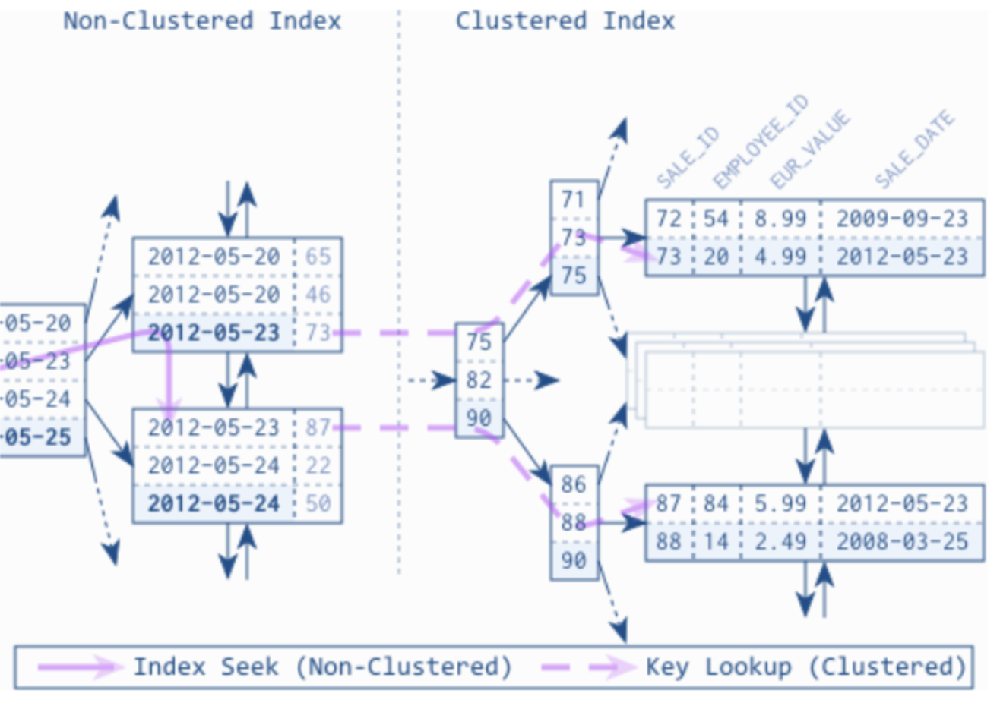

- [Abstract](#abstract)
- [Materials](#materials)
- [Fundamentals](#fundamentals)
  - [Index](#index)
  - [Pages](#pages)
  - [Clustered Index vs Non-clustered Index](#clustered-index-vs-non-clustered-index)
- [Index Access Principles](#index-access-principles)
  - [Principle 1: Fast Lookup](#principle-1-fast-lookup)
  - [Principle 2: Scan in One Direction](#principle-2-scan-in-one-direction)
  - [Principle 3: From Left To Right](#principle-3-from-left-to-right)
  - [Principle 4: Scan On Range Conditions](#principle-4-scan-on-range-conditions)
- [Index Supported Operations](#index-supported-operations)
  - [Inequality (!=)](#inequality-)
  - [Nullable Values (IS NULL and IS NOT NULL)](#nullable-values-is-null-and-is-not-null)
  - [Pattern Matching (LIKE)](#pattern-matching-like)
  - [Sorting Values (ORDER BY)](#sorting-values-order-by)
  - [Aggregating Values (DISTINCT and GROUP BY)](#aggregating-values-distinct-and-group-by)
  - [Joins](#joins)
  - [Subqueries](#subqueries)
  - [Data Manipulation (UPDATE and DELETE)](#data-manipulation-update-and-delete)
- [Why isn't Database Using My Index?](#why-isnt-database-using-my-index)
  - [The Index Can’t Be Used](#the-index-cant-be-used)
  - [No Index Will Be the Fastest](#no-index-will-be-the-fastest)
  - [Another index is faster](#another-index-is-faster)
- [Pitfalls and Tips](#pitfalls-and-tips)
  - [Indexes on Functions](#indexes-on-functions)
  - [Boolean Flags](#boolean-flags)
  - [Transforming Range Conditions](#transforming-range-conditions)
  - [Leading Wildcard Search](#leading-wildcard-search)
  - [Type Juggling](#type-juggling)
  - [Index-Only Queries](#index-only-queries)
  - [Filtering and Sorting With Joins](#filtering-and-sorting-with-joins)
  - [Exceeding the Maximum Index Size](#exceeding-the-maximum-index-size)
  - [JSON Objects and Arrays](#json-objects-and-arrays)
  - [Unique Indexes and Null](#unique-indexes-and-null)
  - [Location-Based Searching With Bounding-Boxes](#location-based-searching-with-bounding-boxes)

----

# Abstract

Database index. Hands on with [MySQL](/mysql/README.md).

# Materials

[Indexing Beyond the Basics](https://sqlfordevs.com/ebooks/indexing)

# Fundamentals

## Index

> * [SQL Unplugged 2013] 쉽고 재미있는 인덱스 이야기/ 씨퀄로 이장래](https://www.youtube.com/watch?v=TRfVeco4wZM)
> * [RDB index 정리](https://hyungjoon6876.github.io/jlog/2018/07/18/rdb-indexing.html)
> * [The chidb File Format](http://chi.cs.uchicago.edu/chidb/fileformat.html)

----



위의 그림을 잘 살펴보자. xdb file 은 여러개의 page 로 구성되어 있다. 하나의 page
는 하나의 BTreeNode 를 저장한다. 하나의 BTreeNode 는 하나 이상의 record 를
저장한다. 또한 하나의 page 는 여러개의 cell 로 이루어져 있다. cell 은 record 에
대응된다. 

Courses 테이블은 schema 가 `CREATE TABLE Courses(Id INTEGER PRIMARY KEY, Name TEXT, Instructor INTEGER, Dept INTEGER)` 라고 해보자. primary key 인 id 를 hashing 한 값을 key 로 BTree 를 제작한다. 당연히 Id 를 조건으로 검색하면 빠르다. 

예를 들어 위 그림에서 id 를 hashing 한 값 `86` 을 검색하기 위해 BTree 를
`42->85->86` 순으로 검색에 성공했다.

그러나 Dept 를 조건으로 검색하면 느리다. Dept 의 인덱스를 제작한다. 즉, Dept 의
hashing 값을 key 로 B+Tree 를 제작한다. 당연히 Dept 를 조건으로 검색하면
빨라진다.

예를 들어 Dept 를 hashing 한 값 `42` 를 검색하기 위해 B+Tree 를 `10->42` 순으로
검색에 성공했다. `42` 는 primary key 인 ID 를 hashing 한 값 `67` 를 소유한 cell
을 가리키고 있다.

## Pages

* [How does SQLite work? Part 2: btrees! (or: disk seeks are slow don't do them!)](https://jvns.ca/blog/2014/10/02/how-does-sqlite-work-part-2-btrees/)
  * sqlite 의 database file 이 왜 pages 로 구성되어 있는지 설명한다.

----

database file 은 물리적으로 여러개의 pages 로 구성되야 한다.

CPU 는 disk 에서 데이터를 읽어들여 memory 로 로드해야 한다. 이때 데이터의 크기는 내가 찾고자 하는
것에 가까운 최소의 크기여야 한다. 내가 찾고자하는 데이터는 16 Byte 인데 1 MB 를 메모리에 로드하는 것은
낭비이다. 

그리고 filesystem 의 block size 는 4 KB 이다. 따라서 한번에 1 MB 를 메모리에서 읽는 것은 불가능하다.
여러번에 걸쳐 disk access 를 해야 한다. I/O 낭비가 발생한다.

따라서 데이터를 page 에 저장하고 그것의 크기는 block size 보다는 작고 
너무 작지 않게 설정하여 L1, L2 Cache hit 가 이루어 지도록 해야 한다.

참고로 chidb, sqlite 는 page 의 size 가 `1K` 이다.

## Clustered Index vs Non-clustered Index

> * [Difference between Clustered and Non-clustered index](https://www.geeksforgeeks.org/difference-between-clustered-and-non-clustered-index/)
> * [[MySQL] 인덱스구조 : 클러스터링인덱스/넌 클러스터링인덱스](https://pearlluck.tistory.com/m/54)

----



**Clustered Index** 는 Leaf Node 에 모든 Attribute Values 가 있다. SELECT 할 때
한번에 읽어 온다. 반면에 **Non-Clustered Index** 는 Leaf Node 가 **Clustered
Index** 의 주소를 갖는다. 다시한번 **Clustered Index** 를 찾아갈 필요가 있다. 추가적인 I/O 가 필요하다.

Index of `Roll_no is` is a **Clustered Index**.

```sql
create table Student
( Roll_No int primary key, 
Name varchar(50), 
Gender varchar(30), 
Mob_No bigint );

insert into Student
values (4, 'ankita', 'female', 9876543210 );

insert into Student 
values (3, 'anita', 'female', 9675432890 );

insert into Student 
values (5, 'mahima', 'female', 8976453201 ); 
```

There is no additional index data for `Roll_no`.

| Roll_No | Name | 	Gender | 	Mob_No |
|---|---|---|---|
| 3 | 	anita |	female	| 9675432890 |
| 4 |	ankita	| female |	9876543210 |
| 5 |	mahima |	female |	8976453201 |

Index of `Name` is a **Non-Clustered Index**.

```sql
create table Student
( Roll_No int primary key, 
Name varchar(50), 
Gender varchar(30), 
Mob_No bigint );

insert into Student 
values (4, 'afzal', 'male', 9876543210 );

insert into Student 
values (3, 'sudhir', 'male', 9675432890 );

insert into Student 
values (5, 'zoya', 'female', 8976453201 );

create nonclustered index NIX_FTE_Name
on Student (Name ASC); 
```

There is additional index data for `Name`. This needs record lookup.

| Name |	Row address |
|---|----|
| Afzal |	3452 |
| Sudhir |	5643 |
| zoya |	9876 |

일반적으로 테이블에 여러 개의 non-clustered index가 있을 때, clustered index를
auto-increment로 생성하는 것이 좋습니다. 그 이유는 다음과 같습니다.

* 인덱스 크기: auto-increment를 사용하여 생성한 clustered index는 숫자로 이루어져
있어 인덱스 크기가 작습니다. 이는 I/O 효율과 디스크 공간 절약에 도움이 됩니다.
* 삽입 성능: auto-increment 기반의 인덱스는 새 데이터가 인덱스 페이지 끝에
추가되기 때문에 페이지 분할 및 재구성이 최소화됩니다. 이로 인해 인덱스 생성과
유지에 관련된 오버헤드가 줄어들어 삽입 성능이 좋아집니다.
* 단순성: auto-increment로 생성된 clustered index는 단일 컬럼에 기반하기 때문에
인덱스 관리가 비교적 쉽습니다.


# Index Access Principles

## Principle 1: Fast Lookup

## Principle 2: Scan in One Direction

## Principle 3: From Left To Right

## Principle 4: Scan On Range Conditions

# Index Supported Operations

## Inequality (!=)

## Nullable Values (IS NULL and IS NOT NULL)

## Pattern Matching (LIKE)

## Sorting Values (ORDER BY)

## Aggregating Values (DISTINCT and GROUP BY)

## Joins

## Subqueries

## Data Manipulation (UPDATE and DELETE)

# Why isn't Database Using My Index?

## The Index Can’t Be Used

## No Index Will Be the Fastest

## Another index is faster

# Pitfalls and Tips

## Indexes on Functions

**Functional Indexes**

```sql
CREATE TABLE contacts (
    id bigint PRIMARY KEY AUTO_INCREMENT,
    birthday datetime NOT NULL
);
INSERT INTO contacts(birthday) VALUES (NOW());
INSERT INTO contacts(birthday) VALUES (NOW());
INSERT INTO contacts(birthday) VALUES (NOW());

-- Full scan
EXPLAIN SELECT * FROM contacts;
+----+-------------+----------+------------+------+---------------+------+---------+------+------+----------+-------+
| id | select_type | table    | partitions | type | possible_keys | key  | key_len | ref  | rows | filtered | Extra |
+----+-------------+----------+------------+------+---------------+------+---------+------+------+----------+-------+
|  1 | SIMPLE      | contacts | NULL       | ALL  | NULL          | NULL | NULL    | NULL |    3 |   100.00 | NULL  |
+----+-------------+----------+------------+------+---------------+------+---------+------+------+----------+-------+

-- Index scan
EXPLAIN SELECT * FROM contacts WHERE id = 1;
+----+-------------+----------+------------+-------+---------------+---------+---------+-------+------+----------+-------+
| id | select_type | table    | partitions | type  | possible_keys | key     | key_len | ref   | rows | filtered | Extra |
+----+-------------+----------+------------+-------+---------------+---------+---------+-------+------+----------+-------+
|  1 | SIMPLE      | contacts | NULL       | const | PRIMARY       | PRIMARY | 8       | const |    1 |   100.00 | NULL  |
+----+-------------+----------+------------+-------+---------------+---------+---------+-------+------+----------+-------+

-- Full scan
EXPLAIN SELECT * FROM contacts WHERE month(birthday) = 5;
+----+-------------+----------+------------+------+---------------+------+---------+------+------+----------+-------------+
| id | select_type | table    | partitions | type | possible_keys | key  | key_len | ref  | rows | filtered | Extra       |
+----+-------------+----------+------------+------+---------------+------+---------+------+------+----------+-------------+
|  1 | SIMPLE      | contacts | NULL       | ALL  | NULL          | NULL | NULL    | NULL |    3 |   100.00 | Using where |
+----+-------------+----------+------------+------+---------------+------+---------+------+------+----------+-------------+

-- Index scan
CREATE INDEX idx_contacts_birthmonth ON contacts ((month(birthday)));
EXPLAIN SELECT * FROM contacts WHERE month(birthday) = 5;
+----+-------------+----------+------------+------+-------------------------+-------------------------+---------+-------+------+----------+-------+
| id | select_type | table    | partitions | type | possible_keys           | key                     | key_len | ref   | rows | filtered | Extra |
+----+-------------+----------+------------+------+-------------------------+-------------------------+---------+-------+------+----------+-------+
|  1 | SIMPLE      | contacts | NULL       | ref  | idx_contacts_birthmonth | idx_contacts_birthmonth | 5       | const |    1 |   100.00 | NULL  |
+----+-------------+----------+------------+------+-------------------------+-------------------------+---------+-------+------+----------+-------+
```

**Vitual Column Indexes**

```sql
DROP TABLE contacts;
CREATE TABLE contacts (
    id bigint PRIMARY KEY AUTO_INCREMENT,
    birthday datetime NOT NULL,
    birthday_month TINYINT AS (month(birthday)) VIRTUAL NOT NULL,
    INDEX idx_contacts_birthmonth (birthday_month)
);
DESC contacts;
+----------------+----------+------+-----+---------+-------------------+
| Field          | Type     | Null | Key | Default | Extra             |
+----------------+----------+------+-----+---------+-------------------+
| id             | bigint   | NO   | PRI | NULL    | auto_increment    |
| birthday       | datetime | NO   |     | NULL    |                   |
| birthday_month | tinyint  | NO   | MUL | NULL    | VIRTUAL GENERATED |
+----------------+----------+------+-----+---------+-------------------+
INSERT INTO contacts(birthday) VALUES (NOW());
INSERT INTO contacts(birthday) VALUES (NOW());
INSERT INTO contacts(birthday) VALUES (NOW());

-- Index scan
EXPLAIN SELECT * FROM contacts WHERE month(birthday) = 5;
+----+-------------+----------+------------+------+-------------------------+-------------------------+---------+-------+------+----------+-------+
| id | select_type | table    | partitions | type | possible_keys           | key                     | key_len | ref   | rows | filtered | Extra |
+----+-------------+----------+------------+------+-------------------------+-------------------------+---------+-------+------+----------+-------+
|  1 | SIMPLE      | contacts | NULL       | ref  | idx_contacts_birthmonth | idx_contacts_birthmonth | 1       | const |    1 |   100.00 | NULL  |
+----+-------------+----------+------------+------+-------------------------+-------------------------+---------+-------+------+----------+-------+

-- Index scan
EXPLAIN SELECT * FROM contacts WHERE birthday_month = 5;
+----+-------------+----------+------------+------+-------------------------+-------------------------+---------+-------+------+----------+-------+
| id | select_type | table    | partitions | type | possible_keys           | key                     | key_len | ref   | rows | filtered | Extra |
+----+-------------+----------+------------+------+-------------------------+-------------------------+---------+-------+------+----------+-------+
|  1 | SIMPLE      | contacts | NULL       | ref  | idx_contacts_birthmonth | idx_contacts_birthmonth | 1       | const |    1 |   100.00 | NULL  |
+----+-------------+----------+------------+------+-------------------------+-------------------------+---------+-------+------+----------+-------+
```

## Boolean Flags

Boolean flags are not suitable for indexing in MySQL for several reasons:

* **Low cardinality**: Boolean flags have very low cardinality because they can
  only have two possible values: true or false (1 or 0). Indexes are typically
  more effective when the indexed column has a high number of distinct values. In
  the case of a Boolean flag, the index would end up pointing to many records with
  the same value, which decreases the index's efficiency and selectivity.
* **Poor query optimization**: Since Boolean flags have low cardinality, it
  makes it difficult for the query optimizer to make efficient execution plans.
  The optimizer may not choose to use an index on a Boolean flag due to its low
  selectivity, and even when it does, the full table scan might be faster than
  using the index, which defeats the purpose of having an index in the first
  place.
* **Larger index size**: Indexing a Boolean flag can increase the size of the
  index and add extra storage and maintenance overhead. Since the index may not
  be utilized effectively, the additional cost and complexity may not be
  worthwhile.
* **Limited performance improvement**: Using an index on a Boolean flag may not
  significantly improve query performance in scenarios where the distribution of
  values is highly skewed. For example, if 95% of records have the flag set to
  true and the query filters on the false value, the index may not provide
  substantial performance gains compared to a full table scan.

In conclusion, Boolean flags are not suitable for indexing in MySQL primarily
due to their low cardinality and limited effectiveness in query optimization. It
is generally more beneficial to index columns with higher cardinality and use
other query optimization techniques to improve performance for Boolean flag
columns.

## Transforming Range Conditions

Remove range conditions such as `WHERE stars > 1000` for better performance. You
might fetch unnecessary rows in the middle of fetching with the index because of
range conditions.

For solving range condition problems **virtual columns**, **functional indexes**
are good solutions.

**Index of (stars, language)**

```sql
CREATE TABLE trends (
    id bigint PRIMARY KEY AUTO_INCREMENT,
    language VARCHAR(128) NOT NULL,
    stars INT NOT NULL,
    sponsors INT NOT NULL
);
show index from trends;
+--------+------------+----------+--------------+-------------+-----------+-------------+----------+--------+------+------------+---------+---------------+---------+------------+
| Table  | Non_unique | Key_name | Seq_in_index | Column_name | Collation | Cardinality | Sub_part | Packed | Null | Index_type | Comment | Index_comment | Visible | Expression |
+--------+------------+----------+--------------+-------------+-----------+-------------+----------+--------+------+------------+---------+---------------+---------+------------+
| trends |          0 | PRIMARY  |            1 | id          | A         |           2 |     NULL |   NULL |      | BTREE      |         |               | YES     | NULL       |
+--------+------------+----------+--------------+-------------+-----------+-------------+----------+--------+------+------------+---------+---------------+---------+------------+

INSERT INTO trends(language, stars, sponsors) VALUES('TypeScript', 20, 10);
INSERT INTO trends(language, stars, sponsors) VALUES('TypeScript', 21, 11);
INSERT INTO trends(language, stars, sponsors) VALUES('Python', 22, 12);
INSERT INTO trends(language, stars, sponsors) VALUES('Python', 23, 13);
INSERT INTO trends(language, stars, sponsors) VALUES('Java', 24, 14);
INSERT INTO trends(language, stars, sponsors) VALUES('Java', 25, 15);
CREATE INDEX idx_stars_language ON trends (stars, language);
+--------+------------+--------------------+--------------+-------------+-----------+-------------+----------+--------+------+------------+---------+---------------+---------+------------+
| Table  | Non_unique | Key_name           | Seq_in_index | Column_name | Collation | Cardinality | Sub_part | Packed | Null | Index_type | Comment | Index_comment | Visible | Expression |
+--------+------------+--------------------+--------------+-------------+-----------+-------------+----------+--------+------+------------+---------+---------------+---------+------------+
| trends |          0 | PRIMARY            |            1 | id          | A         |           2 |     NULL |   NULL |      | BTREE      |         |               | YES     | NULL       |
| trends |          1 | idx_stars_language |            1 | stars       | A         |           6 |     NULL |   NULL |      | BTREE      |         |               | YES     | NULL       |
| trends |          1 | idx_stars_language |            2 | language    | A         |           6 |     NULL |   NULL |      | BTREE      |         |               | YES     | NULL       |
+--------+------------+--------------------+--------------+-------------+-----------+-------------+----------+--------+------+------------+---------+---------------+---------+------------+


-- Full scan
explain select * from trends where language = 'TypeScript';
+----+-------------+--------+------------+------+---------------+------+---------+------+------+----------+-------------+
| id | select_type | table  | partitions | type | possible_keys | key  | key_len | ref  | rows | filtered | Extra       |
+----+-------------+--------+------------+------+---------------+------+---------+------+------+----------+-------------+
|  1 | SIMPLE      | trends | NULL       | ALL  | NULL          | NULL | NULL    | NULL |    6 |    16.67 | Using where |
+----+-------------+--------+------------+------+---------------+------+---------+------+------+----------+-------------+

-- Index scan
explain select * from trends where stars > 20;
+----+-------------+--------+------------+-------+--------------------+--------------------+---------+------+------+----------+-----------------------+
| id | select_type | table  | partitions | type  | possible_keys      | key                | key_len | ref  | rows | filtered | Extra                 |
+----+-------------+--------+------------+-------+--------------------+--------------------+---------+------+------+----------+-----------------------+
|  1 | SIMPLE      | trends | NULL       | range | idx_stars_language | idx_stars_language | 4       | NULL |    5 |   100.00 | Using index condition |
+----+-------------+--------+------------+-------+--------------------+--------------------+---------+------+------+----------+-----------------------+

-- Index scan
explain select * from trends where language = 'TypeScript' AND stars > 20;
+----+-------------+--------+------------+-------+--------------------+--------------------+---------+------+------+----------+-----------------------+
| id | select_type | table  | partitions | type  | possible_keys      | key                | key_len | ref  | rows | filtered | Extra                 |
+----+-------------+--------+------------+-------+--------------------+--------------------+---------+------+------+----------+-----------------------+
|  1 | SIMPLE      | trends | NULL       | range | idx_stars_language | idx_stars_language | 4       | NULL |    5 |    16.67 | Using index condition |
+----+-------------+--------+------------+-------+--------------------+--------------------+---------+------+------+----------+-----------------------+

-- Index scan
explain select * from trends where stars > 20 AND language = 'TypeScript';
+----+-------------+--------+------------+-------+--------------------+--------------------+---------+------+------+----------+-----------------------+
| id | select_type | table  | partitions | type  | possible_keys      | key                | key_len | ref  | rows | filtered | Extra                 |
+----+-------------+--------+------------+-------+--------------------+--------------------+---------+------+------+----------+-----------------------+
|  1 | SIMPLE      | trends | NULL       | range | idx_stars_language | idx_stars_language | 4       | NULL |    5 |    16.67 | Using index condition |
+----+-------------+--------+------------+-------+--------------------+--------------------+---------+------+------+----------+-----------------------+

-- Index scan
explain analyze select * from trends where stars > 20 AND language = 'TypeScript';
-> Index range scan on trends using idx_stars_language over (20 < stars), with index condition: 
     ((trends.`language` = 'TypeScript') and (trends.stars > 20))  
       (cost=2.51 rows=5) (actual time=0.0513..0.0618 rows=1 loops=1)

-- Index scan (Query optimizer worked)
explain analyze select * from trends where language = 'TypeScript' AND stars > 20;
-> Index range scan on trends using idx_stars_language over (20 < stars), with index condition: 
     ((trends.`language` = 'TypeScript') and (trends.stars > 20))  
       (cost=2.51 rows=5) (actual time=0.0511..0.0675 rows=1 loops=1)
```

**Index of (language, stars)**

```sql
CREATE INDEX idx_language_stars ON trends (language, stars);

show index from trends;
+--------+------------+--------------------+--------------+-------------+-----------+-------------+----------+--------+------+------------+---------+---------------+---------+------------+
| Table  | Non_unique | Key_name           | Seq_in_index | Column_name | Collation | Cardinality | Sub_part | Packed | Null | Index_type | Comment | Index_comment | Visible | Expression |
+--------+------------+--------------------+--------------+-------------+-----------+-------------+----------+--------+------+------------+---------+---------------+---------+------------+
| trends |          0 | PRIMARY            |            1 | id          | A         |           2 |     NULL |   NULL |      | BTREE      |         |               | YES     | NULL       |
| trends |          1 | idx_stars_language |            1 | stars       | A         |           6 |     NULL |   NULL |      | BTREE      |         |               | YES     | NULL       |
| trends |          1 | idx_stars_language |            2 | language    | A         |           6 |     NULL |   NULL |      | BTREE      |         |               | YES     | NULL       |
| trends |          1 | idx_language_stars |            1 | language    | A         |           3 |     NULL |   NULL |      | BTREE      |         |               | YES     | NULL       |
| trends |          1 | idx_language_stars |            2 | stars       | A         |           6 |     NULL |   NULL |      | BTREE      |         |               | YES     | NULL       |
+--------+------------+--------------------+--------------+-------------+-----------+-------------+----------+--------+------+------------+---------+---------------+---------+------------+

-- Index scan
explain select * from trends where language = 'TypeScript';
+----+-------------+--------+------------+------+--------------------+--------------------+---------+-------+------+----------+-------+
| id | select_type | table  | partitions | type | possible_keys      | key                | key_len | ref   | rows | filtered | Extra |
+----+-------------+--------+------------+------+--------------------+--------------------+---------+-------+------+----------+-------+
|  1 | SIMPLE      | trends | NULL       | ref  | idx_language_stars | idx_language_stars | 514     | const |    2 |   100.00 | NULL  |
+----+-------------+--------+------------+------+--------------------+--------------------+---------+-------+------+----------+-------+
```

**Index of (language, stars, sponsors)**

```sql
CREATE INDEX idx_language_stars_sponsors ON trends (language, stars, sponsors);

show index from trends;
+--------+------------+-----------------------------+--------------+-------------+-----------+-------------+----------+--------+------+------------+---------+---------------+---------+------------+
| Table  | Non_unique | Key_name                    | Seq_in_index | Column_name | Collation | Cardinality | Sub_part | Packed | Null | Index_type | Comment | Index_comment | Visible | Expression |
+--------+------------+-----------------------------+--------------+-------------+-----------+-------------+----------+--------+------+------------+---------+---------------+---------+------------+
| trends |          0 | PRIMARY                     |            1 | id          | A         |           2 |     NULL |   NULL |      | BTREE      |         |               | YES     | NULL       |
| trends |          1 | idx_stars_language          |            1 | stars       | A         |           6 |     NULL |   NULL |      | BTREE      |         |               | YES     | NULL       |
| trends |          1 | idx_stars_language          |            2 | language    | A         |           6 |     NULL |   NULL |      | BTREE      |         |               | YES     | NULL       |
| trends |          1 | idx_language_stars          |            1 | language    | A         |           3 |     NULL |   NULL |      | BTREE      |         |               | YES     | NULL       |
| trends |          1 | idx_language_stars          |            2 | stars       | A         |           6 |     NULL |   NULL |      | BTREE      |         |               | YES     | NULL       |
| trends |          1 | idx_language_stars_sponsors |            1 | language    | A         |           3 |     NULL |   NULL |      | BTREE      |         |               | YES     | NULL       |
| trends |          1 | idx_language_stars_sponsors |            2 | stars       | A         |           6 |     NULL |   NULL |      | BTREE      |         |               | YES     | NULL       |
| trends |          1 | idx_language_stars_sponsors |            3 | sponsors    | A         |           6 |     NULL |   NULL |      | BTREE      |         |               | YES     | NULL       |
+--------+------------+-----------------------------+--------------+-------------+-----------+-------------+----------+--------+------+------------+---------+---------------+---------+------------+

-- Index scan
explain select * from trends where language = 'TypeScript';
+----+-------------+--------+------------+------+------------------------------------------------+-----------------------------+---------+-------+------+----------+-------------+
| id | select_type | table  | partitions | type | possible_keys                                  | key                         | key_len | ref   | rows | filtered | Extra       |
+----+-------------+--------+------------+------+------------------------------------------------+-----------------------------+---------+-------+------+----------+-------------+
|  1 | SIMPLE      | trends | NULL       | ref  | idx_language_stars,idx_language_stars_sponsors | idx_language_stars_sponsors | 514     | const |    2 |   100.00 | Using index |
+----+-------------+--------+------------+------+------------------------------------------------+-----------------------------+---------+-------+------+----------+-------------+

-- Index scan
explain select * from trends where language = 'TypeScript' ORDER BY sponsors ASC;
+----+-------------+--------+------------+------+------------------------------------------------+-----------------------------+---------+-------+------+----------+-----------------------------+
| id | select_type | table  | partitions | type | possible_keys                                  | key                         | key_len | ref   | rows | filtered | Extra                       |
+----+-------------+--------+------------+------+------------------------------------------------+-----------------------------+---------+-------+------+----------+-----------------------------+
|  1 | SIMPLE      | trends | NULL       | ref  | idx_language_stars,idx_language_stars_sponsors | idx_language_stars_sponsors | 514     | const |    2 |   100.00 | Using index; Using filesort |
+----+-------------+--------+------------+------+------------------------------------------------+-----------------------------+---------+-------+------+----------+-----------------------------+
```

**Virtual Columns (No need for range conditions)**

Index of (language, popular, sponsors) is better than range conditions. But
[PostgreSQL](/postgresql/README.md) doesn't support this.

```sql
CREATE TABLE trends (
    id bigint PRIMARY KEY AUTO_INCREMENT,
    language VARCHAR(128) NOT NULL,
    stars INT NOT NULL,
    popular TINYINT AS(IF(stars > 20, 1, 0)) VIRTUAL NOT NULL,
    sponsors INT NOT NULL
);
CREATE INDEX idx_language_popular_sponsors on trends(language, popular, sponsors);
SHOW INDEX from trends
+--------+------------+-------------------------------+--------------+-------------+-----------+-------------+----------+--------+------+------------+---------+---------------+---------+------------+
| Table  | Non_unique | Key_name                      | Seq_in_index | Column_name | Collation | Cardinality | Sub_part | Packed | Null | Index_type | Comment | Index_comment | Visible | Expression |
+--------+------------+-------------------------------+--------------+-------------+-----------+-------------+----------+--------+------+------------+---------+---------------+---------+------------+
| trends |          0 | PRIMARY                       |            1 | id          | A         |           0 |     NULL |   NULL |      | BTREE      |         |               | YES     | NULL       |
| trends |          1 | idx_language_popular_sponsors |            1 | language    | A         |           0 |     NULL |   NULL |      | BTREE      |         |               | YES     | NULL       |
| trends |          1 | idx_language_popular_sponsors |            2 | popular     | A         |           0 |     NULL |   NULL |      | BTREE      |         |               | YES     | NULL       |
| trends |          1 | idx_language_popular_sponsors |            3 | sponsors    | A         |           0 |     NULL |   NULL |      | BTREE      |         |               | YES     | NULL       |
+--------+------------+-------------------------------+--------------+-------------+-----------+-------------+----------+--------+------+------------+---------+---------------+---------+------------+

INSERT INTO trends(language, stars, sponsors) VALUES('TypeScript', 20, 10);
INSERT INTO trends(language, stars, sponsors) VALUES('TypeScript', 21, 11);
INSERT INTO trends(language, stars, sponsors) VALUES('Python', 22, 12);
INSERT INTO trends(language, stars, sponsors) VALUES('Python', 23, 13);
INSERT INTO trends(language, stars, sponsors) VALUES('Java', 24, 14);
INSERT INTO trends(language, stars, sponsors) VALUES('Java', 25, 15);

explain analyze select * from trends where language = 'TypeScript' AND popular = 1 ORDER BY sponsors ASC;
-> Index lookup on trends using idx_language_popular_sponsors (language='TypeScript', popular=1)  
     (cost=0.35 rows=1) (actual time=0.0563..0.0614 rows=1 loops=1)
```

**Function Indexes (No need for range conditions)**

```sql
CREATE TABLE trends (
    id bigint PRIMARY KEY AUTO_INCREMENT,
    language VARCHAR(128) NOT NULL,
    stars INT NOT NULL,
    sponsors INT NOT NULL
);
INSERT INTO trends(language, stars, sponsors) VALUES('TypeScript', 20, 10);
INSERT INTO trends(language, stars, sponsors) VALUES('TypeScript', 21, 11);
INSERT INTO trends(language, stars, sponsors) VALUES('Python', 22, 12);
INSERT INTO trends(language, stars, sponsors) VALUES('Python', 23, 13);
INSERT INTO trends(language, stars, sponsors) VALUES('Java', 24, 14);
INSERT INTO trends(language, stars, sponsors) VALUES('Java', 25, 15);
CREATE INDEX idx_language_popular_sponsors ON trends (language, (IF(stars > 20, 1, 0)), sponsors);

explain analyze 
select * 
  from trends 
 where language = 'TypeScript' AND 
       IF(stars > 20, 1, 0) = 1 
 ORDER BY sponsors ASC;
-> Index lookup on trends using idx_language_popular_sponsors (language='TypeScript', if((stars > 20),1,0)=1)   
     (cost=0.35 rows=1) (actual time=0.0497..0.0507 rows=1 loops=1)
```

## Leading Wildcard Search

Wildcard condition is converted to range condition. For example, `WHERE name
LIKE 'Tob%s'` is converted to `WHEREname >= 'Tob' AND name < 'Toc`. 

Remove leading wildcard for better performance. `WHERE name LIKE '%obs'` can
lead to poor performance When a leading wildcard is used, the database engine
cannot utilize the index efficiently since it has to search for all possible
combinations of characters preceding the search term (e.g., `{%Iobs, Aobs, Bobs,..., zobs, ...}` ). This results in a full table scan, which can be slow for
large tables.

But [PostgreSQL](/postgresql/README.md) supports indexing of wildcard any position.

```sql
CREATE EXTENSION IF NOT EXISTS pg_trgm;
CREATE INDEX trgm_idx ON contacts USING GIN (name gin_trgm_ops);
```

## Type Juggling

When we query `int` attributes for `varchar` column index, **full scan**
happens. But when we query `string` attributes for `int` column index, 
**index scan** happens.

The index `idx_orders` is not used for 
`EXPLAIN SELECT * FROM orders WHERE payment_id = '57013925718'`. 
Because `EXPLAIN SELECT * FROM orders WHERE payment_id = '57013925718'`
is changed to `SELECT * FROM orders WHERE CAST(payment_id AS UNSIGNED) = 57013925718`. 

```sql
CREATE TABLE orders (
    id bigint PRIMARY KEY AUTO_INCREMENT,
    payment_id VARCHAR(255) NOT NULL
);
INSERT INTO orders(payment_id) VALUES (`57013925718`);
INSERT INTO orders(payment_id) VALUES (`57013925728`);
INSERT INTO orders(payment_id) VALUES (`57013925738`);
CREATE INDEX idx_orders ON orders (payment_id);

-- Index scan
EXPLAIN SELECT * FROM orders WHERE payment_id = '57013925718';
+----+-------------+--------+------------+------+---------------+------------+---------+-------+------+----------+-------------+
| id | select_type | table  | partitions | type | possible_keys | key        | key_len | ref   | rows | filtered | Extra       |
+----+-------------+--------+------------+------+---------------+------------+---------+-------+------+----------+-------------+
|  1 | SIMPLE      | orders | NULL       | ref  | idx_orders    | idx_orders | 1022    | const |    1 |   100.00 | Using index |
+----+-------------+--------+------------+------+---------------+------------+---------+-------+------+----------+-------------+

-- Full scan
EXPLAIN SELECT * FROM orders WHERE payment_id = 57013925718;
+----+-------------+--------+------------+-------+---------------+------------+---------+------+------+----------+--------------------------+
| id | select_type | table  | partitions | type  | possible_keys | key        | key_len | ref  | rows | filtered | Extra                    |
+----+-------------+--------+------------+-------+---------------+------------+---------+------+------+----------+--------------------------+
|  1 | SIMPLE      | orders | NULL       | index | idx_orders    | idx_orders | 1022    | NULL |    3 |    33.33 | Using where; Using index |
+----+-------------+--------+------------+-------+---------------+------------+---------+------+------+----------+--------------------------+
```

The opposite case works.

```sql
CREATE TABLE orders (
    id bigint PRIMARY KEY AUTO_INCREMENT,
    payment_id bigint NOT NULL
);
INSERT INTO orders(payment_id) VALUES (57013925718);
INSERT INTO orders(payment_id) VALUES (57013925728);
INSERT INTO orders(payment_id) VALUES (57013925738);
CREATE INDEX idx_orders ON orders (payment_id);

-- Index Scan
EXPLAIN SELECT * FROM orders WHERE payment_id = '57013925718';
+----+-------------+--------+------------+------+---------------+------------+---------+-------+------+----------+--------------------------+
| id | select_type | table  | partitions | type | possible_keys | key        | key_len | ref   | rows | filtered | Extra                    |
+----+-------------+--------+------------+------+---------------+------------+---------+-------+------+----------+--------------------------+
|  1 | SIMPLE      | orders | NULL       | ref  | idx_orders    | idx_orders | 8       | const |    1 |   100.00 | Using where; Using index |
+----+-------------+--------+------------+------+---------------+------------+---------+-------+------+----------+--------------------------+

-- Index Scan
EXPLAIN SELECT * FROM orders WHERE payment_id = 57013925718;
+----+-------------+--------+------------+------+---------------+------------+---------+-------+------+----------+-------------+
| id | select_type | table  | partitions | type | possible_keys | key        | key_len | ref   | rows | filtered | Extra       |
+----+-------------+--------+------------+------+---------------+------------+---------+-------+------+----------+-------------+
|  1 | SIMPLE      | orders | NULL       | ref  | idx_orders    | idx_orders | 8       | const |    1 |   100.00 | Using index |
+----+-------------+--------+------------+------+---------------+------------+---------+-------+------+----------+-------------+
```

## Index-Only Queries

## Filtering and Sorting With Joins

## Exceeding the Maximum Index Size

## JSON Objects and Arrays

## Unique Indexes and Null

## Location-Based Searching With Bounding-Boxes
