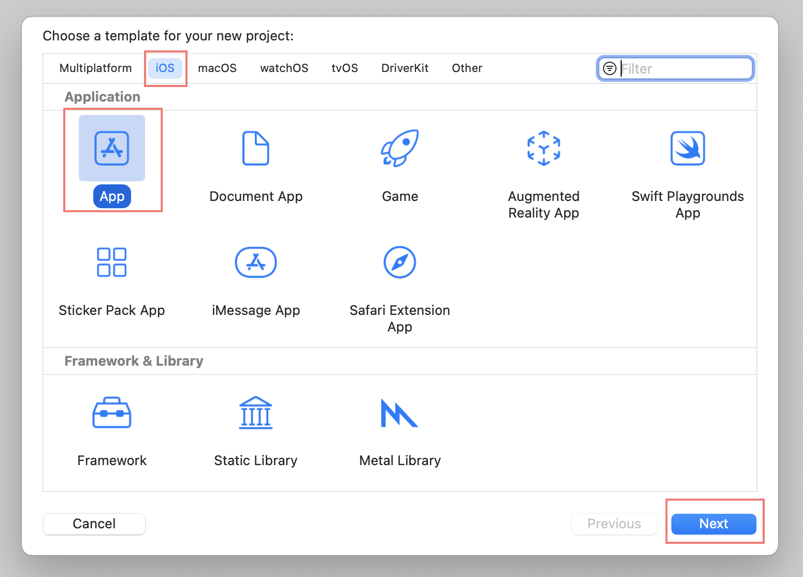
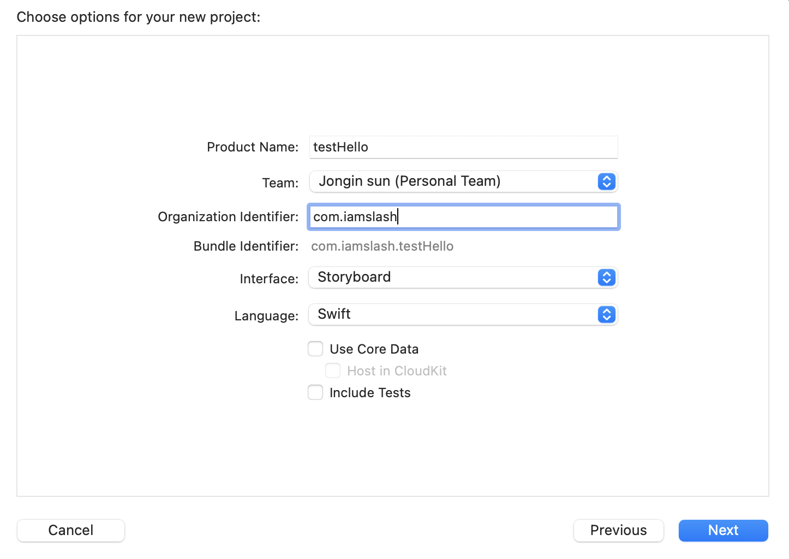
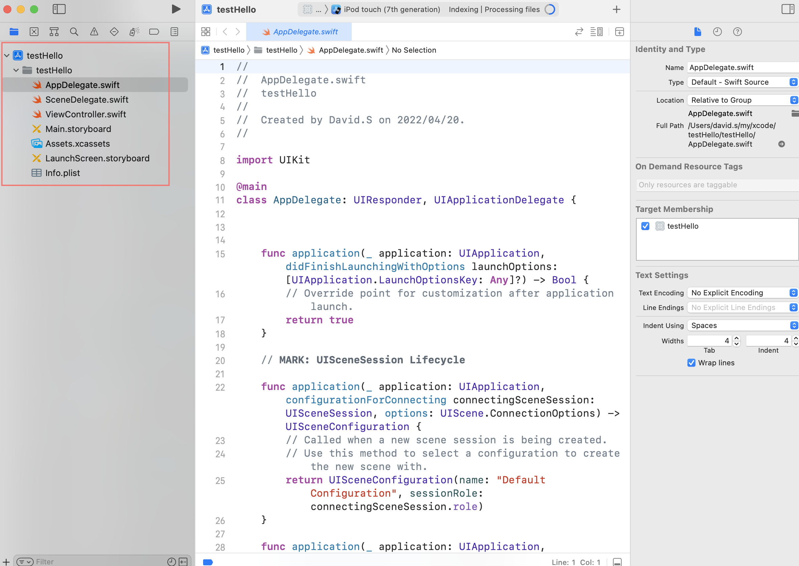
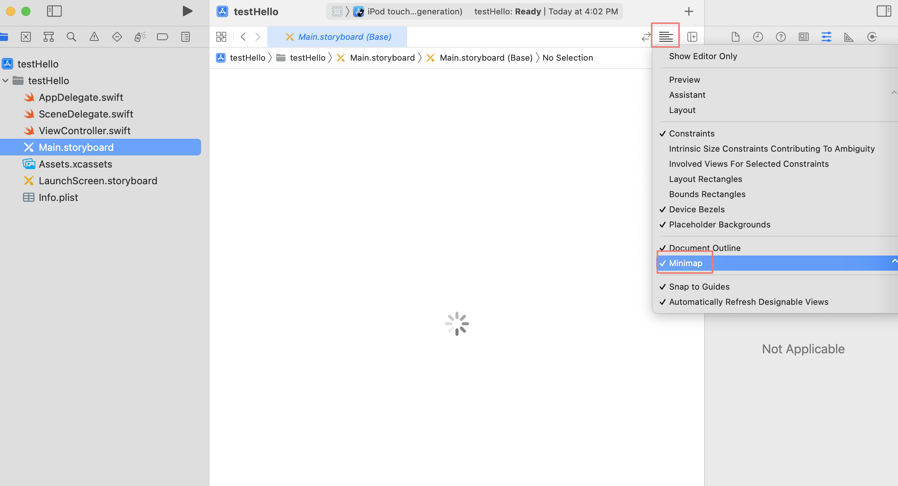
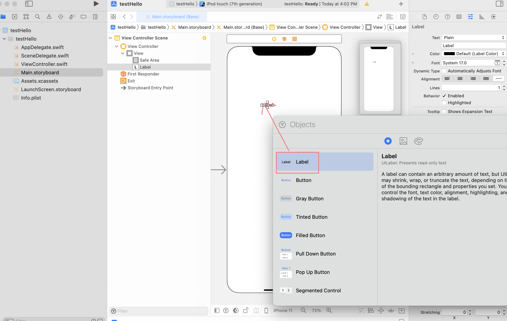
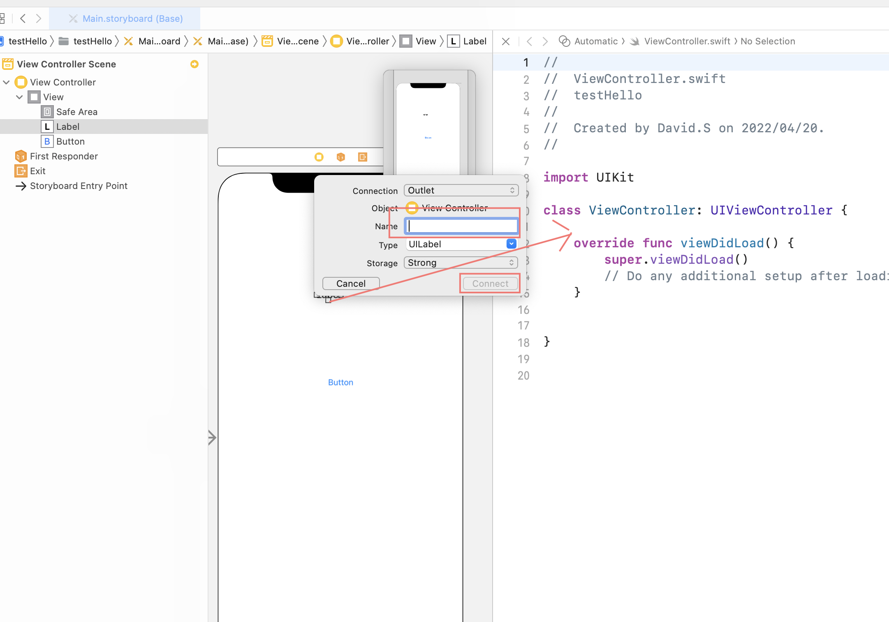
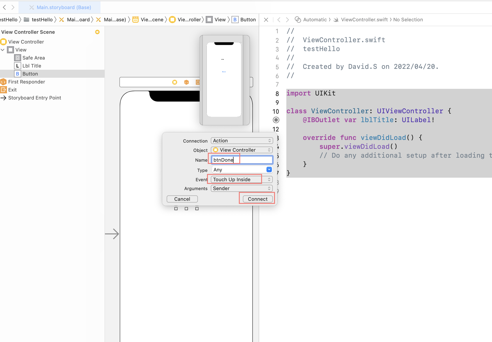

# Abstract

Swift, Xcode 로 간단한 iOS Application 을 만들어 본다.

# Create Project

[Xcode](/xcode) 를 실행한다.



Project options 를 채운다.



생성된 파일들은 다음과 같다.

```
.
└── testHello
    ├── testHello
    │   ├── AppDelegate.swift
    │   ├── Assets.xcassets
    │   │   ├── AccentColor.colorset
    │   │   │   └── Contents.json
    │   │   ├── AppIcon.appiconset
    │   │   │   └── Contents.json
    │   │   └── Contents.json
    │   ├── Base.lproj
    │   │   ├── LaunchScreen.storyboard
    │   │   └── Main.storyboard
    │   ├── Info.plist
    │   ├── SceneDelegate.swift
    │   └── ViewController.swift
    └── testHello.xcodeproj
        ├── project.pbxproj
        ├── project.xcworkspace
        │   ├── contents.xcworkspacedata
        │   ├── xcshareddata
        │   │   └── IDEWorkspaceChecks.plist
        │   └── xcuserdata
        │       └── david.s.xcuserdatad
        │           └── UserInterfaceState.xcuserstate
        └── xcuserdata
            └── david.s.xcuserdatad
                └── xcschemes
                    └── xcschememanagement.plist
```



주요 파일의 특징은 다음과 같다.

| File | Description|
|--|--|
| `AppDelegate.swift` | manages application life cycle |
| `SceneDelegate.swift` | manages scene (UI) life cycle |
| `ViewController.swift` | manages storyboard interaction |
| `Main.storyboard` | main storyboard |
| `Assets.xcassets` | icons |
| `LaunchScreen.storyboard` | launch screen storyboard |
| `Info.plist` | project metadata |

주요 단축키는 다음과 같다. 

| Short Cut | Description |
|--|--|
| `^ ⌥ ⌘ Enter` | Assistant View on storyboard |
| `⇧ ⌘ L` | Library Window |
| `⌘ B` | Build |
| `⌘ R` | Run |

# StoryBoard

미니맵이 거슬리면 끄자.



`⇧ ⌘ L` 를 누르고 Library Window 를 띄운다. Widget 를 Drag & Drop 하여 배치한다.



# Add IBOutlet, IBAction

`^ ⌥ ⌘ Enter` 를 누르고 Assistant View 를 연다. `ViewController.swift` 를 불러올
것이다. story board 의 Label 를 `^` 와 함께 선택한다. 그리고 Assistant View 로
Drag & Drop 한다. 



`@IBoutlet variable` 이 `ViewController.swift` 에 추가된다.

```swift
import UIKit

class ViewController: UIViewController {
    @IBOutlet var lblTitle: UILabel!
    
    override func viewDidLoad() {
        super.viewDidLoad()
        // Do any additional setup after loading the view.
    }
}

```

story board 의 button 을 `^` 과 함게 선택한다. 그리고 Assistant View 로
Drag & Drop 한다.



`@IBAction function` 이 `ViewController.swift` 에 추가된다.

```swift
import UIKit

class ViewController: UIViewController {
    @IBOutlet var lblTitle: UILabel!
    
    override func viewDidLoad() {
        super.viewDidLoad()
        // Do any additional setup after loading the view.
    }
    
    @IBAction func btnDone(_ sender: Any) {
    }
}
```

# Implement IBAction

다음과 같이 `btnDone()` 을 구현한다.

```swift
import UIKit

class ViewController: UIViewController {
    @IBOutlet var lblTitle: UILabel!
    
    override func viewDidLoad() {
        super.viewDidLoad()
        // Do any additional setup after loading the view.
    }
    
    @IBAction func btnDone(_ sender: Any) {
        lblTitle = "Hello World";
    }
}
```

# Build and Run iOS Simulator

`⌘ R` 을 선택하여 Build and Run 하자.
