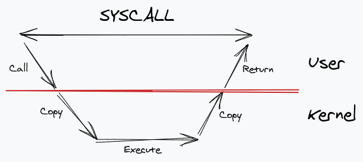
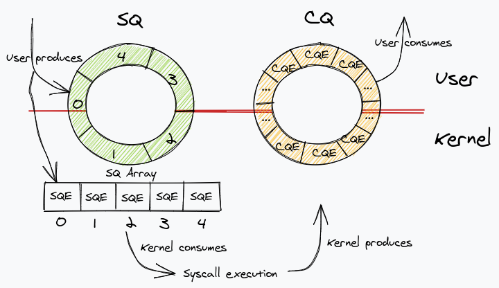

# Abstract

io_uring 을 정리한다.

# Materials

* [Getting Hands on with io_uring using Go](https://developers.mattermost.com/blog/hands-on-iouring-go/)
* [io_uring | wikipedia](https://en.wikipedia.org/wiki/Io_uring)

# Basic

## Concept

> * [Getting Hands on with io_uring using Go](https://developers.mattermost.com/blog/hands-on-iouring-go/)

storage device asynchronous I/O 를 위해 만들어진 Linux Kernal System call 이다. Linux Kernel 5.1 부터 지원한다. 참고로 [epoll](/epoll/README.md) 은 network interface 의 asynchronous I/O 를 위해 만들어졌다. async_io 가 filesystem asynchronous I/O 를 위해 만들어지긴 하였으나 더욱 최적화할 필요가 있었다고 한다. (copy operation between user space and kernel space???)

ring buffer 2 개를 이용해서 user space buffer 와 kernel space buffer 사이에 발생하는 복사 동작을 줄여서 I/O 를 최적화 했다. 

[dragonfly](https://github.com/dragonflydb/dragonfly) 는 [Redis](/redis/README.md) 같은 in-memory store application 이다. io_uring 을 사용해서 [Redis](/redis/README.md) 보다 25 배 빠르다고 한다. [Dragonflydb – A modern replacement for Redis and Memcached (github.com/dragonflydb) | hackernews](https://news.ycombinator.com/item?id=31560547) 에서 원작자가 답변을 달아주고 있다.

다음은 syscall 을 실행했을 때 user space buffer 와 kernel space buffer 사이에 copy operation 을 표현한 것이다.

io_uring 은 SQ, CQ 와 같이 두개의 ring buffer 를 사용하여 user space buffer 와 kernel space buffer 사이의 copy operation 을 제거했다.

SQ (Submission Queue) 는 user space 에서 producing 하고 kernel space 에서 consuming 한다.

CA (Completion Queue) 는 kernel space 에서 producing 하고 user space 에서 consuming 한다.
